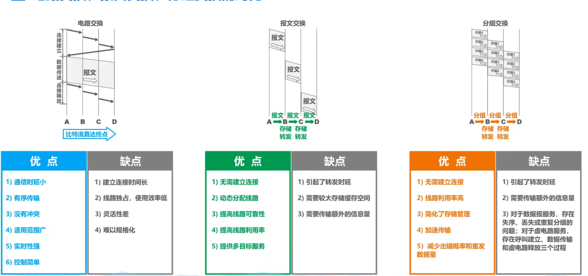

# 计算机网络

## 1.计算机网络模型

七层模型、四层模型和五层模型

由于TCP/IP协议没有提供网络接口层实现，因此五层协议对网络接口层进行了更详细的分类

| OSI七层模型 | TCP/IP体系结构       | 五层协议的体系结构 |
| ----------- | -------------------- | ------------------ |
| 应用层      | 应用层(各种应用层    | 应用层             |
| 表示层      | 协议如TELENT、HTTP、 |                    |
| 会话层      | FTP、SMTP、DNS)      |                    |
| 传输层      | 传输层(TCP或UDP)     | 传输层             |
| 网络层      | 网际层IP             | 网络层             |
| 数据链路层  | 网络接口层           | 数据链路层         |
| 物理层      |                      | 物理层             |

## 2. 因特网概述

### 网络、互联网、因特网

网络是由若干结点Node和连接这些结点的链路Link组成

多个网络可以通过路由器互连起来，构成互联网，互联网是网络的网络

### 发展阶段

单个网络ARPANET

- 1969 ARPANET
- 1983 TCPI/IP 称为标准协议

三层结构的因特网

- 1985 NSFNET
- 1990 ARPANET关闭

多层次的ISP

- 1993 NSFNET逐渐被若干个商用因特网主干网替代，ISP运营
- 1994 万维网www
- 1995 NSFNET停止运作

用户通过因特网服务提供者ISP接入网络

我国ISP 电信、联通、移动

基于ISP的三层结构因特网

国际性、区域性、本地范围

一个用户能够接入互联网就是一个ISP，可以供他人连接

#### 交换

电路交换

- 建立连接 分配通信资源
- 通话  一直占用通信资源
- 释放连接

分组交换

发送方发送分组和构造分组

路由器缓存分组和转发分组

接收方接收分组和还原报文

将信息根据首部信息分组转发

报文交换

