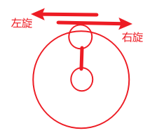
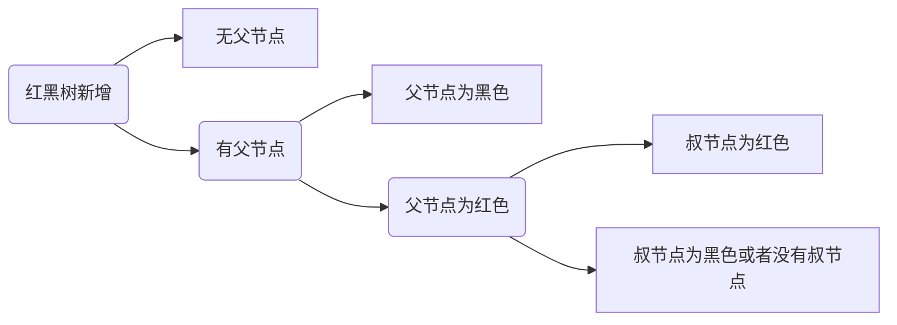

# 数据结构和算法


## 数据结构

### 红黑树

#### 1. 红黑树的定义与性质

> 红黑树是一种含有红黑节点并能自平衡的二叉查找树

满足以下5个性质：

1. 每个节点非红即黑(要么红色，要么黑色)

   - ```java
     //基本结构
     public class RedBlack{
         private boolean color;
         private RedBlack left;
         private RedBlack right;
         private int value;
     }
     ```

2. 根节点是黑色

3. 每个叶子节点(NIL)是黑色

   - NIL可以理解为value为null，叶子节点是虚节点，为了满足性质5

4. 每个红色节点的两个子节点一定都是黑色

5. 任意一节点到每个叶结点的路径都包含数量相同的黑节点，黑色完美平衡

   - 是非完美平衡二叉查找树，是完美黑色平衡二叉查找树

> 红黑树是二叉查找树

树和子树满足以下约束：

1. 左节点小于根节点
2. 右节点大于父节点

#### 2. 红黑树的平衡性

> 红黑树自平衡单独最小单元
>
> 红黑树的自平衡每次只考虑CPGU三代即可，其余部分无需考虑

- G - Grandfather
- P - Parents
- U - Uncle
- B - Brothor
- R - Root
- C - Current 当前新增节点

每次新增默认的都是加入红色节点，与性质5有关

#### 3. 红黑树自平衡的原子操作

> 红黑树的自平衡操作包括：**变色**、**旋转**，其中旋转分为左旋(逆时针)和右旋(顺时针)，旋转有圆心和方向

> 旋转节点围绕子节点旋转，子节点为圆心



基于最短旋转路径来确定方向旋转，

#### 4. CRUD

##### 1. R 查找

##### 2. C 插入

> 红黑树新增



1. C = root
   - 新增当前节点C默认为红色
   - 修改C当前节点颜色为黑色
2. C.parent = black
   - 新增节点C，颜色为红色
3. C.parent = red & C.uncle = red
   - 新增当前节点C为红色
   - P父节点变为黑色
   - U叔节点变为黑色
   - G祖父节点变为红色
   - 如果祖父节点变红导致不满足红黑树性质，将祖父节点作为新增节点C，递归继续上述步骤
4. C.parent = red & (C.uncle = black || C.uncle is Nil)
   - CPG 三点一线
     - 以P父节点为圆心，旋转G祖父节点
     - 变色P父节点，G祖父节点
   - CPG三角关系
     - 以C当前新增节点为圆心、旋转P点
     - 按照情况CPG三点一线处理


## 数据结构

> 数据结构包括线性结构和非线性结构

1. 线性结构
   - 一对一
   - 数组、队列、链表、栈等
2. 非线性结构
   - 一对多 
   - 二维数组，多维数组，广义表，树结构，图结构

## 稀疏数组和队列

### sparsearray 稀疏数组

当一个数组中大部分元素为0，或者为同一个值的数组时，可以使用稀疏数组来保存该数组

处理方法：

1. 记录数组一共有几行几列，有多少个不同的值
2. 把具有不同值的元素的行列及值记录在一个小规模数组中，从而缩小程序规模

|      | 行     | 列     | 值           |
| ---- | ------ | ------ | ------------ |
| [0]  | 多少行 | 多少列 | 多少有效数值 |
| [1]  | 所在行 | 所在列 | 具体数值     |
| ...  | ...    | ...    | ...          |

应用场景：

1. 记录棋盘


