Hadoop

## 课程基础

javase + maven +idea +linux基本命令

## 1. 概述

### 大数据的概念

​	大数据是指无法在一定时间范围内用常规软件工具进行捕获、管理和处理的数据集合，是需要新处理模式才能具有更强的决策力、洞察发现和流程优化能力的海量、高增长率和多样化的信息资产

​	大数据主要解决海量数据的采集、存储和分析计算问题

​	按顺序给出数据存储单位 bit、Byte、KB、MB、GB、**TB**、**PB**、**EB**、ZB、YB、BB、NB、DB

​	1Byte = 8bit 1K = 1024Byte 1MB=1024K 1G =1024M

### 大数据的特点(4V)

#### Volume 大量

​	截至目前，人类所生产的所有印刷材料的数据量是200PB，而历史上全人类总共说过的话数据量大约是5EB，当前，典型个人计算机硬盘的容量为TB量级，而一些大企业的数据量已经解决EB量级

#### Velocity 高速

​	这是大数据区分于传统数据挖掘最显著特征，根据IDC的数字宇宙的报告，预计到2025年，全球数据使用量将达到163ZB，在海量的数据面前，处理数据的效率非常重要。

#### Variety 多样

​	数据的类型分为结构化数据和非结构化数据，相对于以数据库/文本为主的结构化数据，非结构化数据越来越多，包括网络日志、音频、视频、图片、地理位置信息等，这些多类型的数据对数据的处理能力提出了更高的要求

#### Value 低价值密度

​	价值密度的高低与数据总量的大小成反比，从海量的数据中对有效数据进行提取

### 大数据的应用场景

1. 短视频，视频推荐

2. 电商广告推荐，推荐用户喜欢的商品

3. 零售，分析用户消费习惯 ，判断用户购买商品的关联性

4. 物流仓储
5. 保险，海量数据挖掘，风险预测
6. 金融，多维度体现用户特征，防范欺诈
7. 房产，精准投资和营销
8. 人工智能 5G 物联网 虚拟与现实

### 大数据的发展前景

1. 十九大 推动互联网 互联网 人工智能 实体经济深度融合
2. 2020 34万亿 新基建
3. 下一个风口 2020 5G设备 每秒钟10G的数据
4. 人才紧缺，竞争压力小

### 大数据部门间业务流程分析

产品人员提需求

数据部门搭建数据平台、分析数据指标

数据可视化

### 大数据部门内组织结构

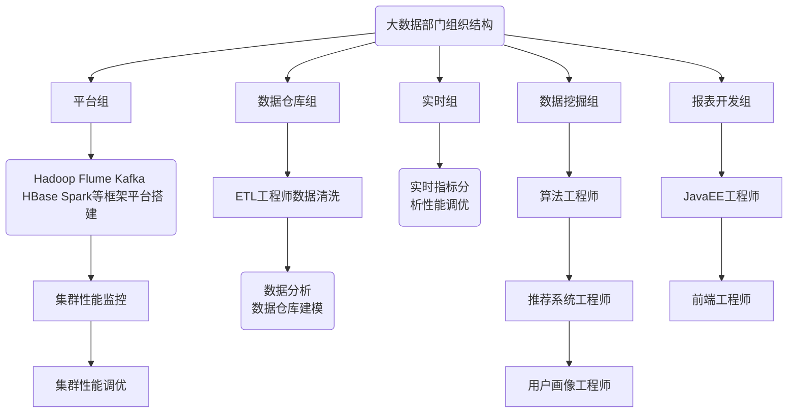
```mermaid
flowchart TB
id(大数据部门组织结构) 
id --> 平台组 --> id2(Hadoop Flume Kafka \n HBase Spark等框架平台搭建) --> 集群性能监控 --> 集群性能调优 
id --> 数据仓库组 --> ETL工程师数据清洗 --> id3(数据分析\n数据仓库建模)
id --> 实时组 --> id4(实时指标分\n析性能调优)
id --> 数据挖掘组 --> 算法工程师 --> 推荐系统工程师 --> 用户画像工程师
id --> 报表开发组 --> JavaEE工程师 --> 前端工程师
```

## 2. Hadoop入门

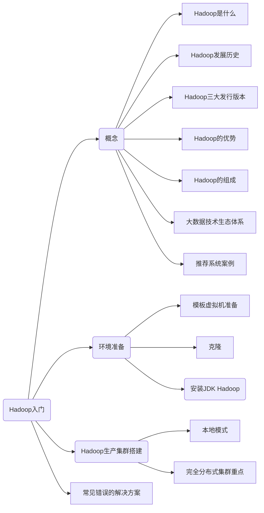
```mermaid
flowchart LR
id(Hadoop入门) --> id11(概念)
	id11 --> Hadoop是什么
	id11 --> Hadoop发展历史
	id11 --> Hadoop三大发行版本
	id11 --> Hadoop的优势
	id11 --> Hadoop的组成
	id11 --> 大数据技术生态体系
	id11 --> 推荐系统案例
id --> id12(环境准备)
	id12 --> 模板虚拟机准备
	id12 --> 克隆
	id12 --> id121(安装JDK Hadoop)
id --> id13(Hadoop生产集群搭建)
	id13 --> 本地模式
	id13 --> 完全分布式集群重点
id --> 常见错误的解决方案
```

### 1. 概念

#### Hadoop是什么

1. Hadoop是一个由Apache基金会所开发的**分布式系统基础架构**

2. 主要解决海量数据的存储和海量数据的分析计算问题

3. 广义上来说Hadoop通常指一个更广泛的概念Hadoop生态圈


Hive干掉Pig

#### Hadoop发展历史

1. Hadoop创始人Doug Cutting，为了实现与Google类似的全文搜索功能，在Lucene框架基础上进行优化升级，查询引擎和索引引擎

2. 2001年底Lucene称为Apache基金会的一个子项目

3. 对于海量数据的场景，Lucene框架面对与Google同样的困难，存储海量数据困难，检索海量数据速度慢

4. 学习和模仿Google解决这些问题的防范：微型版Nutch

5. Google在大数据方面的三篇论文
   - **GFS --> HDFS**
   - **Map-Reduce --> MR**
   - **BigTable --> HBase**
6. 2003-2004年，Google公开了部分GFS和MapReduce思想的细节，以此为基础Foug Cutting等人用了2年业余时间实现了DFS和MapReduce机制，使Nutch性能飙升
7. 2005年Hadoop作为Lucene的子项目Nutch的一部分正式引入Apache基金会
8. 2006年3月份，Map-Reduce和Nutch Distributed File System(NDFS)分别被纳入到Hadoop项目中，Hadoop正式诞生，标志着大数据时代到来

#### Hadoop三大发行版本

Apache、Cloudera、Hortonworks

Apache版本最原始最基础版本，入门 2006

Cloudera内部集成了很多大数据框架，对应产品CDH

Hortonworks文档较好，对应产品HDP 2011

Hortonworks现在已经被Cloudera公司收购，推出新的品牌CDP

##### Apache Hadoop

http://hadoop.apache.org/

https://hadoop.apache.org/releases.html

##### Cloudera Hadoop

https://cn.cloudera.com/products/open-source/apache-hadoop.html

2009年Hadoop创始人Doug Cutting加盟Cloudera公司

CDH为Cloudera的Hadoop发行版，完全开源，节点收费

##### Hortonworks Hadoop

HDP包括了Ambarl，开源安装和管理系统

#### Hadoop优势(4高)

1. 高可靠性
   - Hadoop底层维护多个数据副本，所以即使Hadoop某个计算元素或存储出现故障，也不会导致数据的丢失
2. 高扩展性
   - 在集群间分配任务数据，可方便的扩展数以千计的节点，动态扩容
3. 高效性
   - 在MapReduce的思想下，Hadoop是并行进行的，以加快任务的处理速度
4. 高容错性
   - 能够自动将失败的任务重新分配

#### Hadoop组成(重点)

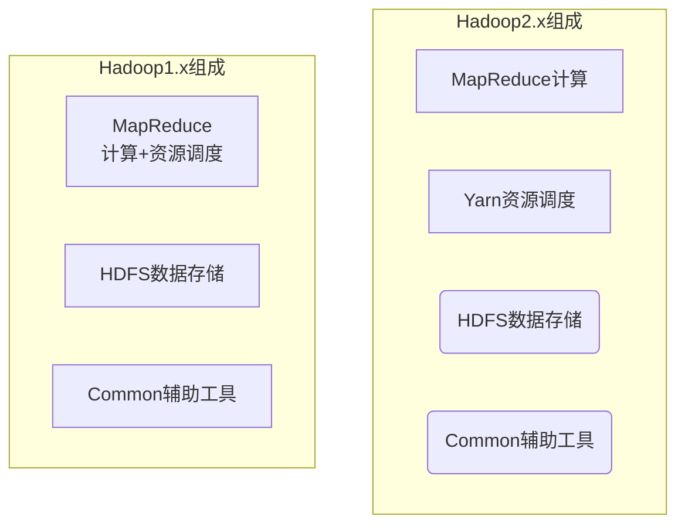
```mermaid
flowchart TB
subgraph Hadoop2.x组成
	MapReduce计算
	Yarn资源调度
	id1(HDFS数据存储)
	id(Common辅助工具)
end
subgraph Hadoop1.x组成
	MapReduce\n计算+资源调度
	HDFS数据存储
	Common辅助工具
end

```

在Hadoop1.x时代，Hadoop中的MapReduce同时处理业务逻辑运算和资源的调度，耦合性较大

**在Hadoop2.0时代，增加了Yarn。Yarn只负责资源的调度，MapReduce只负责运算**。

Hadoop3.x在组成上没有变化

##### HDFS架构概述

Hadoop Distributed File System 简称HDFS，是一个分布式文件系统

NameNode nn

- 存储文件的元数据，如文件名、文件目录结构、文件属性(生成时间、副本数、文件权限)，以及每个文件的块列表和块所在的DataNode等

DataNode dn

- 在本地文件系统存储文件块数据，以及块数据的校验和

Secondary NameNode 2nn

- 每隔一段时间对NameNode元数据备份

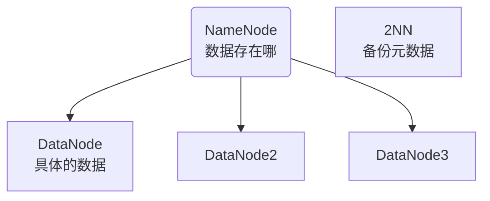
```mermaid
flowchart TB
id(NameNode\n数据存在哪)
	id --> DataNode\n具体的数据
	id --> DataNode2
	id --> DataNode3
2NN\n备份元数据
```


##### YARN架构概述

Yet Another Rsource Negotiator简称YARN，另一种资源协调者，是Hadoop的资源管理器

1. ResourceManager(RM):整个集群资源(内存、CUP等)的管理者
2. NodeManager(NM):单个节点服务器资源的管理者
3. ApplicationMaster(AM):单个任务运行的管理者
4. Container:容器，相当于一台独立的服务器，里面封装了任务运行的资源，如内存、CPU、磁盘、网络等

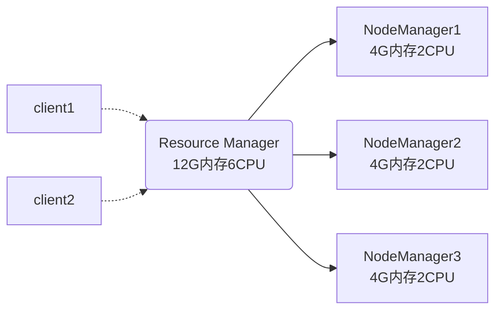
```mermaid
flowchart LR
client1 -.-> id(Resource Manager\n12G内存6CPU)
client2 -.-> id
id --> NodeManager1\n4G内存2CPU
id --> NodeManager2\n4G内存2CPU
id --> NodeManager3\n4G内存2CPU
```

客户端可以有多个

集群上可以运行多个AM，每个容器最少一个CPU，容器可以跨节点

每个NodeManager上可以有多个Container

##### MapReduce架构概述

MapReduce将计算过程分为两个阶段，Map和Reduce

1. Map阶段并行处理输入数据
2. Reduce阶段对Map结果进行汇总

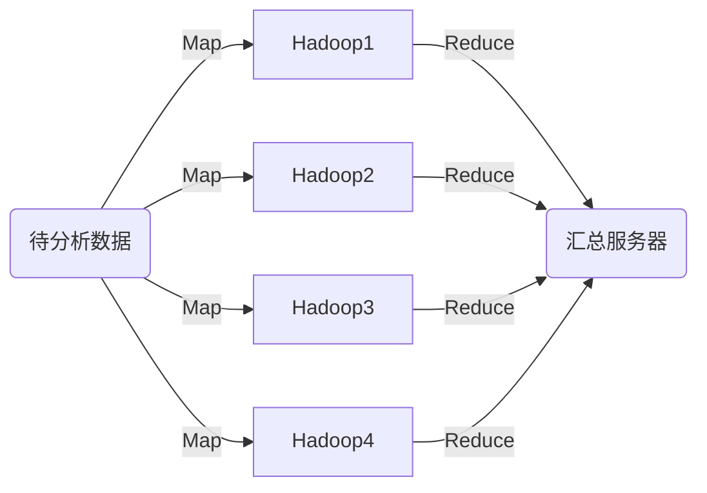
```mermaid
flowchart LR
id(待分析数据)
id --Map-->Hadoop1 --Reduce--> id2(汇总服务器)
id --Map-->Hadoop2 --Reduce--> id2(汇总服务器)
id --Map-->Hadoop3 --Reduce--> id2(汇总服务器)
id --Map-->Hadoop4 --Reduce--> id2(汇总服务器)
```

##### HDFS、YARN、MapReduce三者关系


#### 大数据技术生态体系


1. Sqoop: Sqoop是一款开源的工具，主要用于Hadoop、Hive与传统的数据库MySQL间进行数据的传输，可以将一个关系型数据库(如MySQL、Roacle等)中的数据导入到Hadoop的HDFS中，也可以将HDFS的数据导入到关系型数据库中
2. Flume: Flume是一个高可用的、高可靠的分布式的海量日志采集、聚合和传输的系统，Flume支持在日志系统中定制各类数据发送方，用于收集数据
3. Kafka: Kafka是一种高吞吐量的分布式发布订阅消息系统
4. Spark: Spark是当前最流行的开源大数据内存计算框架，可以基于Hadoop上存储的大数据进行计算
5. FlinkL: Flink是当前最流行的开源大数据内存计算框架，用于实时计算的场景较多
6. Oozie: Oozie是一个管理Hadoop作业(job)的工作流程调度管理系统
7. Hbase: Hbase是一个分布式的、面向列的开源数据库。Hbase不同于一般的关系数据库，它是一个适合于非结构化数据存储的数据库
8. Hive: Hive是基于Hadoop的一个数据仓库工具，可以将结构化数据文件映射为一张数据库表，并提供简单的SQL查询功能，可以将SQL语句转换为MapReduce任务进行运行，其优点是学习成本低，可以通过类SQL语句快速实现简单的MapReduce统计，不必开发专门的MapReduce应用，是否适合数据仓库的统计分析
9. Zookeeper: 它是一个针对大型分布式系统的可靠协调系统，提供的功能包括:配置维护、名字复位、分布式同步、组服务等

#### 推荐系统架构图


### 2. Hadoop运行环境搭建(重点)

#### Hadoop模板搭建

内存4G，硬盘50g，IP，主机名称

后续的Hadoop服务器可以以此为模板进行复制

##### 安装步骤

1. 安装VMWare

2. 安装Centos
   - 配置IP、主机名称
   - 注意虚拟机的内核数不要超过宿主机的内核数
   - IP地址配置 
     - Vmware添加配置192.168.10.0，然后在网络连接方式那里选择NAT网络模式
     - windows以太网，更改适配器选项
       - vmnet1是为host-only方式服务的，vmnet8是为NAT方式服务的。
       - 修改vmnet8 属性 Internet协议版本4，依次为
         - 192.168.10.1
         - 255.255.255.0
         - 192.168.10.2
         - 192.168.10.2
         - 8.8.8.8
     - Centos
       - vim /etc/sysconfig/network-scripts/ifcfg-ens33 最后的设备名根据具体识别的名字选取
       - BOOTPROTO改为statici
       - 添加 
         - IPADDR=192.168.10.100
         - GATEWAY=192.168.10.2
         - DNS1=192.168.10.2
       - vim /etc/hostname
         - 改为 hadoop100
       - vim /etc/hosts
         - 添加ip映射 192.168.10.100 hadoop100
         - 一直到192.168.10.108 hadoop108
     - reboot重启  通过ping命令检测配置是否成功
   
3. 配置ssh访问

   - XSHELL或MobaXterm

4. 配置映射

   - 使Xshell或MobaXterm可以直接通过主机名连接

   - Windows电脑C:\Windows\System32\drivers\etc\hosts添加host映射

   - ```
     192.168.10.100 hadoop100
     192.168.10.101 hadoop101
     192.168.10.102 hadoop102
     192.168.10.103 hadoop103
     192.168.10.104 hadoop104
     192.168.10.105 hadoop105
     192.168.10.106 hadoop106
     192.168.10.107 hadoop107
     192.168.10.108 hadoop108
     ```

   - xshell还需要配置xftp进行文件的上传

5. centos安装epel-release

   - Extra Packages for Enterprise Linux是为红帽系的操作系统提供额外的软件包，适用于RHEL、Centos和Scientific Linux，相当于是一个软件仓库，大多数rmp包在官方的repository中是找不到的
   - yum install -y epel-release
   - 如果linux安装的是最小系统版，还需要安装如下工具，如果是桌面标准版则不需要
     - net-tool工具包集合，包含ifconfig等命令
     - yum install -y net-tools
     - yum install -y vim
   - 关闭防火墙，关闭防火墙开机自启
     - systemctl stop firewalld
     - systemctl disable firewalld.service
     - 在企业开发时，通常单个服务器的防火墙是关闭的，公司整体会对外设置非常安全的防火墙

6. 添加zxk用户，如果已经有了就只需要添加权限

   - useradd zxk
   - passwd zxk
   - vim /etc/sudoers
   - 在%wheel 下面添加
     - zxk ALL=(ALL) NOPASSWD:ALL

7. 创建和删除文件就可以加上sudo

   - ```bash
     [zxk@hadoop100 ~]$ cd /opt/
     [zxk@hadoop100 opt]$ ls
     rh
     [zxk@hadoop100 opt]$ rm -rf rh/
     rm: 无法删除"rh/": 权限不够
     [zxk@hadoop100 opt]$ sudo rm -rf rh/
     [zxk@hadoop100 opt]$ mkdir module
     mkdir: 无法创建目录"module": 权限不够
     [zxk@hadoop100 opt]$ sudo mkdir module
     [zxk@hadoop100 opt]$ sudo mkdir software
     [zxk@hadoop100 opt]$ sudo chown zxk
     chown: "zxk" 后缺少操作数
     Try 'chown --help' for more information.
     #修改权限
     [zxk@hadoop100 opt]$ sudo chown zxk:zxk module
     [zxk@hadoop100 opt]$ sudo chown zxk:zxk module/ software/
     [zxk@hadoop100 opt]$
     
     ```

8. 卸载自带的JDK

   - 虚拟机最小化安装不需要执行这一步
   - su root
   - rpm -qa | grep -i java | xargs -n1 rpm -e --nodeps
     - rpm -qa 查询安装的所有rpm包
     - grep -i 忽略大小写
     - xargs -n1 每次只传递一个参数
     - rpm -e --nodeps 强制卸载软件
   - reboot

#### 克隆虚拟机

Hadoop100 Hadoop102 Hadoop103 Hadoop104 搭建真正的分布式集群

修改IP

- vim /etc/sysconfig/network-scripts/ifcfg-ens33
- IPADDR=192.168.10.102   
- IPADDR=192.168.10.103
- IPADDR=192.168.10.104

主机名 

vim /etc/hostname

- 改为 hadoop102 hadoop103 hadoop104

Hadoop101留作伪分布式，单台服务器的操作使用，这里暂时不克隆，克隆时先关机

注意创建的是完整克隆

对应XSHELL和MobaXterm

@QAZ741

#### 在hadoop安装JDK

1. 卸载现有JDK

2. 用Xshell或MobaXterm将JDK导入到opt目录下的software文件夹下

   - 在Hadoop102安装好JDK后，之后拷贝到Hadoop103和Hadoop104

3. OpenJDK下载地址

   - http://jdk.java.net/java-se-ri/8-MR3
   - https://download.java.net/openjdk/jdk8u41/ri/openjdk-8u41-b04-linux-x64-14_jan_2020.tar.gz

4. Hadoop3下载地址

   - https://hadoop.apache.org/releases.html
   - https://www.apache.org/dyn/closer.cgi/hadoop/common/hadoop-3.3.1/hadoop-3.3.1.tar.gz

5. 将JDK和Hadoop上传到Hadoop102 的/opt/software/下

6. 安装JDK

   ```bash
   [zxk@hadoop102 software]$ tar -zxvf openjdk-8u41-b04-linux-x64-14_jan_2020.tar.gz -C /opt/module/
   [zxk@hadoop102 software]$ cd ..
   [zxk@hadoop102 opt]$ cd module/
   [zxk@hadoop102 module]$ cd java-se-8u41-ri/
   [zxk@hadoop102 java-se-8u41-ri]$ ll
   # 查看里面环境变量的配置可以看到启动时会依次加载/etc/profile.d文件夹下的.sh文件
   # 所以可以直接在此目录下新建对应的sh脚本加载环境变量
   [zxk@hadoop102 java-se-8u41-ri]$ sudo cat /etc/profile
   [zxk@hadoop102 java-se-8u41-ri]$ cd /etc/profile.d/
   [zxk@hadoop102 java-se-8u41-ri]$ ll
   #新建环境配置文件
   [zxk@hadoop102 java-se-8u41-ri]$ sudo vim my_env.sh 
   #内容为 export是全局变量，需要全局生效
   #JAVA_HOME
   export JAVA_HOME=/opt/module/java-se-8u41-ri
   export PATH=$PATH:$JAVA_HOME/bin
   # 重新加载文件
   [zxk@hadoop102 java-se-8u41-ri]$ source /etc/profile
   #输入java查看是否配置成功
   [zxk@hadoop102 profile.d]$ java -version
   openjdk version "1.8.0_41"
   OpenJDK Runtime Environment (build 1.8.0_41-b04)
   OpenJDK 64-Bit Server VM (build 25.40-b25, mixed mode)
   ```

#### 在Hadoop102安装Hadoop

```bash
[zxk@hadoop102 profile.d]$ cd /opt/software/
[zxk@hadoop102 software]$ ll
总用量 761208
-rw-rw-r--. 1 zxk zxk 605187279 10月 22 22:23 hadoop-3.3.1.tar.gz
-rw-rw-r--. 1 zxk zxk 174287938 10月 22 22:23 openjdk-8u41-b04-linux-x64-14_jan_2020.tar.gz
[zxk@hadoop102 software]$ tar -zxvf hadoop-3.3.1.tar.gz -C /opt/module/
[zxk@hadoop102 hadoop-3.3.1]$ pwd
/opt/module/hadoop-3.3.1
[zxk@hadoop102 hadoop-3.3.1]$ sudo vim /etc/profile.d/my_env.sh
# 内容为
#JAVA_HOME
export JAVA_HOME=/opt/module/java-se-8u41-ri
export PATH=$PATH:$JAVA_HOME/bin

#HADOOP_HOME
export HADOOP_HOME=/opt/module/hadoop-3.3.1

export PATH=$PATH:$HADOOP_HOME/bin
export PATH=$PATH:$HADOOP_HOME/sbin
# 刷新文件夹
[zxk@hadoop102 hadoop-3.3.1]$ source /etc/profile
[zxk@hadoop102 hadoop-3.3.1]$ hadoop
```

Hadoop文件夹结构

```bash
drwxr-xr-x. 2 zxk zxk   203 6月  15 13:52 bin
drwxr-xr-x. 3 zxk zxk    20 6月  15 13:15 etc
drwxr-xr-x. 2 zxk zxk   106 6月  15 13:52 include
drwxr-xr-x. 3 zxk zxk    20 6月  15 13:52 lib
drwxr-xr-x. 4 zxk zxk   288 6月  15 13:52 libexec
-rw-rw-r--. 1 zxk zxk 23450 6月  15 13:02 LICENSE-binary
drwxr-xr-x. 2 zxk zxk  4096 6月  15 13:52 licenses-binary
-rw-rw-r--. 1 zxk zxk 15217 6月  15 13:02 LICENSE.txt
-rw-rw-r--. 1 zxk zxk 29473 6月  15 13:02 NOTICE-binary
-rw-rw-r--. 1 zxk zxk  1541 5月  22 00:11 NOTICE.txt
-rw-rw-r--. 1 zxk zxk   175 5月  22 00:11 README.txt
drwxr-xr-x. 3 zxk zxk  4096 6月  15 13:15 sbin
drwxr-xr-x. 4 zxk zxk    31 6月  15 14:18 share
```

- bin和hdfs mapred yarn
- etc 存放相关配置文件hdfs-site.xml  core-site.xml  mapred-site.xml  yarn-site.xml  works
- lib 本地链接库
- sbin start-dfs.sh   start-yarn.sh  
- share 学习资料

### 3. Hadoop运行模式

1. Hadoop官网 http://hadoop.apache.org/
2. Hadoop运行模式包括本地模式、伪分布式模式以及完全分布式模式
   - 本地模式 单机运行 只是用来演示官方案例，生产环境不用
   - 伪分布式模式 也是单机运行，但是具备Hadoop集群的所有功能，一台机器模拟一个分布式的环境，个别公司用来进行测试，生产环境不用
   - 完全分布模式 多台服务器组成分布式环境，生产环境使用
3. 模式存储区别
   - 本地模式 数据存储在linux本地
   - 伪分布式 数据存储在HDFS
   - 完全分布式 数据存储在HDFS 多台服务器工作

#### 本地运行模式(WordCount)

```bash
[zxk@hadoop102 ~]$ cd /opt/module/hadoop-3.3.1/
[zxk@hadoop102 hadoop-3.3.1]$ mkdir wcinput
[zxk@hadoop102 hadoop-3.3.1]$ cd wcinput/
[zxk@hadoop102 wcinput]$ vim word.txt
# 输入
bird
light dark
human boy girl
darker name
# :wq退出
[zxk@hadoop102 wcinput]$ cd ..
[zxk@hadoop102 hadoop-3.3.1]$ hadoop jar share/hadoop/mapreduce/hadoop-mapreduce-examples-3.3.1.jar wordcount wcinput/ wcoutput
[zxk@hadoop102 hadoop-3.3.1]$ cat wcoutput/part-r-00000
bird    1
boy     1
dark    1
darker  1
girl    1
human   1
light   1
name    1
```

#### 完全分布式环境搭建(重点)

##### 过程分析

1. 准备3台客户机(关闭防火墙，静态IP、主机名称配置)
2. 安装JDK
3. 配置环境变量
4. 安装Hadoop
5. 配置环境变量
6. 配置集群
7. 单点启动
8. 配置ssh
9. 启动集群并测试

##### 编写集群分发脚本xsync

1. scp(secure copy)安全拷贝

   - scp定义

     - scp可以实现服务器与服务器之间的数据拷贝

   - 基本语法

     - | scp  | -r   | `$pdir/$fname`        | `$user@$host:$pdir/$fname`      |
       | ---- | ---- | --------------------- | ------------------------------- |
       | 命令 | 递归 | 要拷贝的文件路径/名称 | 目的地用户@主机:目的地路径/名称 |

   - 具体实现

     - 在hadoop102、hadoop103、hadoop104都已经创建好/opt/module、/opt/software两个目录，并且已经将目录的用户和用户组修改为zxk:zxk

     - sudo chown zxk:zxk -R /opt/module

     - 在hadoop102上，将hadoop102中/opt/module/里面的jdk和hadoop目录拷贝到hadoop103和104上

     - ```bash
       # hadoop102拷贝到hadoop103
       [zxk@hadoop102 module]$ pwd
       /opt/module
       [zxk@hadoop102 module]$ scp -r java-se-8u41-ri/ zxk@hadoop103:/opt/module/
       # hadoop103从hadoop102拉取数据
       [zxk@hadoop103 ~]$ cd /opt/module/
       [zxk@hadoop103 module]$ ls
       java-se-8u41-ri
       [zxk@hadoop103 module]$ scp -r zxk@hadoop102:/opt/module/hadoop-3.3.1 ./
       #在hadoop103上把hadoop102上的文件拷贝到hadoop104上
        scp -r zxk@hadoop102:/opt/module/* zxk@hadoop104:/opt/module/
       
       ```

2. rsync远程同步工具

   - rsync主要用于备份和镜像，具有速度快、避免复制相同内容和支持符号链接的优点

   - rsync和scp区别：用rsync做文件的复制要比scp的速度块，rsync只对差异文件做更新。scp是把所有文件都复制过去

   - 基本语法

   - | rsync | -av      | `$pdir/$fname`        | `$user@$host:$pdir/$fname`      |
     | ----- | -------- | --------------------- | ------------------------------- |
     | 命令  | 选项参数 | 要拷贝的文件路径/名称 | 目的地用户@主机:目的地路径/名称 |

   - 选项参数说明

     - -a 归档拷贝
     - -v 显示复制过程

   - 案例实操

   - ```bash
     # 删除hadoop103中的wcinput/ wcoutput/
     [zxk@hadoop103 hadoop-3.3.1]$ pwd
     /opt/module/hadoop-3.3.1
     [zxk@hadoop103 hadoop-3.3.1]$ rm -rf wcinput/ wcoutput/
     # hadoop102同步到hadoop103
     [zxk@hadoop102 module]$ pwd
     /opt/module
     [zxk@hadoop102 module]$ rsync -av hadoop-3.3.1/ zxk@hadoop103:/opt/module/hadoop-3.3.1/
     ```

3. xsync集群分发脚本

   - 需求：循环复制所有文件到节点相同的目录下

   - rsync命令原始拷贝

   - `rsync -av /opt/module zxk@hadoop103:/opt`

   - 期望脚本

   - `xsync 要同步的文件名称`

   - 期望脚本在任何路径都能使用(脚本放在了声明了全局环境变量的路径)

   - ```bash
     [zxk@hadoop102 module]$ echo $PATH
     /usr/local/bin:/usr/bin:/usr/local/sbin:/usr/sbin:/opt/module/java-se-8u41-ri/bin:/opt/module/hadoop-3.3.1/bin:/opt/module/hadoop-3.3.1/sbin:/home/zxk/.local/bin:/home/zxk/bin
     ```

   - 脚本实现

   - 在/home/zxk/bin目录下创建xsync文件

   - ```bash
     cd /home/zxk
     mkdir bin
     cd bin
     vim xsync
     ```

   - 文件内容

   - ```shell
     #!/bin/bash
     
     #1.判断参数个数
     if [ $# -lt 1 ]
     then
             echo Not Enought Arguement!
             exit;
     fi
     
     #2.遍历集群所有机器
     for host in  hadoop102 hadoop103 hadoop104
     do
             echo ===================== $host =================
             # 3. 遍历所有目录,挨个发送
     
             for file in $@
             do
                     #4.判断文件是否存在
                     if [ -e $file ]
                             then
                                     #5.获取父目录
                                     pdir=$(cd -P $(dirname $file); pwd)
                                     #6.获取当前文件的名称
                                     fname=$(basename $file)
                                     ssh $host "mkdir -p $pdir"
                                     rsync -av $pdir/$fname $host:$pdir
                             else
                                     echo $file does not exists!
                     fi
             done
     done
     ```

   - 改变文件权限

   - `[zxk@hadoop102 bin]$ chmod 777 xsync`

   - 分发环境变量

   - `[zxk@hadoop102 ~]$ sudo ./bin/xsync /etc/profile.d/my_env.sh`

   - 输入`source /etc/profile`更新命令

##### ssh免密登录

ssh-key-gen生成密钥对

公钥-私钥

私钥自己保存，公钥发送给对方

执行ssh访问后，会生成ssh文件/home/zxk/.ssh

配置hadoop102免密ssh登录hadoop103，hadoop104

```bash
# 配置hadoop102免密ssh登录hadoop103，hadoop104
[zxk@hadoop102 .ssh]$ pwd
/home/zxk/.ssh
[zxk@hadoop102 .ssh]$ ssh-keygen -t rsa
# 三次回车
[zxk@hadoop102 .ssh]$ ll
总用量 12
-rw-------. 1 zxk zxk 1679 10月 23 16:44 id_rsa
-rw-r--r--. 1 zxk zxk  395 10月 23 16:44 id_rsa.pub
-rw-r--r--. 1 zxk zxk  558 10月 23 16:21 known_hosts
[zxk@hadoop102 .ssh]$ ssh-copy-id hadoop103
[zxk@hadoop102 .ssh]$ ssh hadoop103
Last login: Sat Oct 23 15:32:45 2021 from 192.168.10.1
[zxk@hadoop103 ~]$ exit
登出
Connection to hadoop103 closed.
[zxk@hadoop102 .ssh]$ ssh-copy-id hadoop104
[zxk@hadoop102 .ssh]$ ssh-copy-id hadoop102
[zxk@hadoop102 .ssh]$ ll
总用量 16
-rw-------. 1 zxk zxk  395 10月 23 16:46 authorized_keys
-rw-------. 1 zxk zxk 1679 10月 23 16:44 id_rsa
-rw-r--r--. 1 zxk zxk  395 10月 23 16:44 id_rsa.pub
-rw-r--r--. 1 zxk zxk  558 10月 23 16:21 known_hosts
[zxk@hadoop102 .ssh]$
# 自己用ssh访问自己也需要配置公钥和密钥，authorized_keys里面记录了允许登录的主机
```

配置102 103 104 都可以互相免密登录

```bash
重复上面步骤
```

注意zxk可以无密登录，root还需要配置

配置102 root对103 104 无密登录

```bash
[root@hadoop102 .ssh]# ssh-keygen -t rsa
[root@hadoop102 .ssh]# ssh-copy-id hadoop103
[root@hadoop102 .ssh]# ssh-copy-id hadoop104

```

#### 集群配置

##### 1. 集群部署规划

- NameNode和SecondaryNameNode不要安装在同一台服务器
- ResourceManager也很消耗内存，不要和NameNode、SecondaryNameNode配置在同一台服务器

|      | hadoop102              | hadoop103                        | hadoop104                       |
| ---- | ---------------------- | -------------------------------- | ------------------------------- |
| HDFS | **NameNode**、DataNode | DataNode                         | **SecondaryNameNode**、DataNode |
| YARN | NodeMnanager           | **ResourceManager**、NodeManager | NodeManager                     |

##### 2. 配置文件说明

Hadoop配置文件分为两类：默认配置文件和自定义配置文件，只有用户想修改某一默认配置值时，才需要修改自定义配置文件，更改相应属性值

1. 默认配置文件

   | 要获取的默认文件     | 文件放在Hadoop的jar包中的位置             |
   | -------------------- | ----------------------------------------- |
   | [core-default.xml]   | hadoop-common-3.3.1/core-default.xml      |
   | [hdfs-default.xml]   | hadoop-hdfs-3.3.1/hdfs-default.xml        |
   | [yarn-default.xml]   | hadoop-yarn-3.3.1/yarn-default.xml        |
   | [mapred-default.xml] | hadoop-mapreduce-3.3.1/mapred-default.xml |

2. 自定义配置文件

   core-site.xml、hdfs-site.xml、yarn-site.xml、mapred-site.xml四个配置文件存放在hadoop-3.3.1/etc/hadoop文件夹下

   - 核心配置文件core-site.xml

   - ```xml
     <?xml version="1.0" encoding="UTF-8"?>
     <?xml-stylesheet type="text/xsl" href="configuration.xsl"?>
     <!--
       Licensed under the Apache License, Version 2.0 (the "License");
       you may not use this file except in compliance with the License.
       You may obtain a copy of the License at
     
         http://www.apache.org/licenses/LICENSE-2.0
     
       Unless required by applicable law or agreed to in writing, software
       distributed under the License is distributed on an "AS IS" BASIS,
       WITHOUT WARRANTIES OR CONDITIONS OF ANY KIND, either express or implied.
       See the License for the specific language governing permissions and
       limitations under the License. See accompanying LICENSE file.
     -->
     
     <!-- Put site-specific property overrides in this file. -->
     
     <configuration>
       <!-- 指定NameNode的地址 -->
       <property>
             <name>fs.defaultFS</name>
             <value>hdfs://hadoop102:8020</value>
       </property>
       <!-- 指定hadoop数据的存储目录 -->
       <property>
             <name>hadoop.tmp.dir</name>
             <value>/opt/module/hadoop-3.3.1/data</value>
       </property>
       <!-- 配置HDFS网页登录使用的静态用户为zxk -->
       <property>
             <name>hadoop.http.staticuser.user</name>
             <value>zxk</value>
       </property>
     </configuration>
     ```

   - HDFS配置文件 hdfs-site.xml

   - ```xml
     <?xml version="1.0" encoding="UTF-8"?>
     <?xml-stylesheet type="text/xsl" href="configuration.xsl"?>
     <!--
       Licensed under the Apache License, Version 2.0 (the "License");
       you may not use this file except in compliance with the License.
       You may obtain a copy of the License at
     
         http://www.apache.org/licenses/LICENSE-2.0
     
       Unless required by applicable law or agreed to in writing, software
       distributed under the License is distributed on an "AS IS" BASIS,
       WITHOUT WARRANTIES OR CONDITIONS OF ANY KIND, either express or implied.
       See the License for the specific language governing permissions and
       limitations under the License. See accompanying LICENSE file.
     -->
     
     <!-- Put site-specific property overrides in this file. -->
     
     <configuration>
     
       <!-- nn web端访问地址 -->
       <property>
             <name>dfs.namenode.http-address</name>
             <value>hadoop102:9870</value>
       </property>
       <!-- 2nn web端访问地址 -->
       <property>
             <name>dfs.namenode.secondary.http-address</name>
             <value>hadoop104:9868</value>
       </property>
     
     </configuration>
     ```

   - YARN配置文件 yarn-site.xml

   - ```xml
     <?xml version="1.0"?>
     <!--
       Licensed under the Apache License, Version 2.0 (the "License");
       you may not use this file except in compliance with the License.
       You may obtain a copy of the License at
     
         http://www.apache.org/licenses/LICENSE-2.0
     
       Unless required by applicable law or agreed to in writing, software
       distributed under the License is distributed on an "AS IS" BASIS,
       WITHOUT WARRANTIES OR CONDITIONS OF ANY KIND, either express or implied.
       See the License for the specific language governing permissions and
       limitations under the License. See accompanying LICENSE file.
     -->
     <configuration>
     
     <!-- Site specific YARN configuration properties -->
       <!-- 指定MR走shuffle -->
       <property>
             <name>yarn.nodemanager.aux-services</name>
             <value>mapreduce_shuffle</value>
       </property>
       <!-- 指定ResourceManager的地址 -->
       <property>
             <name>yarn.resourcemanager.hostname</name>
             <value>hadoop103</value>
       </property>
       <!-- 环境变量的继承 -->
       <property>
             <name>yarn.nodemanager.env-whitelist</name>
             <value>JAVA_HOME,COMMON_HOME,HADOOP_HDFS_HOME,HADOOP_CONF_DIR,CLASSPATH_PREPEND_DISTCACHE,HADOOP_YARN_HOME,HADOOP_MAPRED_HOME</value>
       </property>
     
     </configuration>
     ```

   - MapReduce配置文件 mapred-site.xml

   - ```xml
     <?xml version="1.0"?>
     <?xml-stylesheet type="text/xsl" href="configuration.xsl"?>
     <!--
       Licensed under the Apache License, Version 2.0 (the "License");
       you may not use this file except in compliance with the License.
       You may obtain a copy of the License at
     
         http://www.apache.org/licenses/LICENSE-2.0
     
       Unless required by applicable law or agreed to in writing, software
       distributed under the License is distributed on an "AS IS" BASIS,
       WITHOUT WARRANTIES OR CONDITIONS OF ANY KIND, either express or implied.
       See the License for the specific language governing permissions and
       limitations under the License. See accompanying LICENSE file.
     -->
     
     <!-- Put site-specific property overrides in this file. -->
     
     <configuration>
     
       <!-- 指定MapReduce程序运行在Yarn上 -->
       <property>
             <name>mapreduce.framework.name</name>
             <value>yarn</value>
       </property>
     
     </configuration>
     ```

   - 在集群上分发配置好的文件

   - `[zxk@hadoop102 etc]$ xsync hadoop/`

##### 3. 启动集群

1. 配置works

   - ```bash
     [zxk@hadoop102 hadoop]$ vim workers
     # 输入以下内容，注意内容结尾不允许有空格，文件中不允许有空行
     hadoop102
     hadoop103
     hadoop104
     # 同步配置
     [zxk@hadoop102 hadoop]$ xsync workers
     ```

2. 启动集群

   - 如果集群是第一次启动，需要在hadoop102节点格式化NameNode(注意：格式化NameNode，会产生新的集群id，导致NameNode和DataNode的集群id不一致，集群找不到以往数据，如果集群在运行过程中报错，需要重新格式化NameNode的话，一定要先停止namenode和datanode进程，并且要删除所有机器的data和logs目录，然后再进行格式化)

     - ```bash
       # 初始化命令
       [zxk@hadoop102 hadoop]$ hdfs namenode -format
       [zxk@hadoop102 current]$ pwd
       /opt/module/hadoop-3.3.1/data/dfs/name/current
       [zxk@hadoop102 current]$ cat VERSION
       #Sat Oct 23 17:59:52 CST 2021
       namespaceID=1932685138
       clusterID=CID-871c270e-a527-4231-85b5-b7e5c89f8765
       cTime=1634983192570
       storageType=NAME_NODE
       blockpoolID=BP-1678355428-192.168.10.102-1634983192570
       layoutVersion=-66
       # 启动HDFS
       [zxk@hadoop102 hadoop-3.3.1]$ sbin/start-dfs.sh
       #102
       [zxk@hadoop102 hadoop-3.3.1]$ jps
       5744 Jps
       5482 DataNode
       5358 NameNode
       # 103
       [zxk@hadoop103 hadoop]$ jps
       4806 Jps
       4729 DataNode
       #104
       [zxk@hadoop104 .ssh]$ jps
       4613 SecondaryNameNode
       4698 Jps
       4539 DataNode
       ```

     - 访问http://hadoop102:9870/explorer.html#/

     - 在配置了ResourceManager的节点hadoop103启动Yarn

     - ```bash
       [zxk@hadoop103 hadoop-3.3.1]$ pwd
       /opt/module/hadoop-3.3.1
       [zxk@hadoop103 hadoop-3.3.1]$ sbin/start-yarn.sh
       Starting resourcemanager
       Starting nodemanagers
       #103
       [zxk@hadoop103 hadoop-3.3.1]$ jps
       4945 ResourceManager
       5057 NodeManager
       5400 Jps
       4729 DataNode
       # 102
       [zxk@hadoop102 hadoop-3.3.1]$ jps
       5844 NodeManager
       5482 DataNode
       5949 Jps
       5358 NameNode
       # 104
       [zxk@hadoop104 .ssh]$ jps
       4912 Jps
       4613 SecondaryNameNode
       4793 NodeManager
       4539 DataNode
       
       ```

     - web端查看HDFS的NameNode http://hadoop102:9870/explorer.html#/

     - web端查看Yarn的ResourceManager  http://hadoop103:8088/cluster

3. 集群基本测试

   ```bash
   # 上传文件到集群
   # 1. 上传小文件
   [zxk@hadoop102 hadoop-3.3.1]$ hadoop fs -mkdir /wcinput
   # HDFS的NameNode显示变化，多了wcinput
   [zxk@hadoop102 hadoop-3.3.1]$ hadoop fs -put wcinput/word.txt /wcinput
   # 回到HDFS页面可以看到wcinput里面多了word.txt文件
   # 2. 上传大文件
   [zxk@hadoop102 hadoop-3.3.1]$ hadoop fs -put /opt/software/openjdk-8u41-b04-linux-x64-14_jan_2020.tar.gz /
   
   # 查看文件存储位置
   [zxk@hadoop102 subdir0]$ pwd
   /opt/module/hadoop-3.3.1/data/dfs/data/current/BP-1678355428-192.168.10.102-1634983192570/current/finalized/subdir0/subdir0
   [zxk@hadoop102 subdir0]$ ll
   总用量 171548
   -rw-rw-r--. 1 zxk zxk        43 10月 23 18:16 blk_1073741825
   -rw-rw-r--. 1 zxk zxk        11 10月 23 18:16 blk_1073741825_1001.meta
   -rw-rw-r--. 1 zxk zxk 134217728 10月 23 18:22 blk_1073741826
   -rw-rw-r--. 1 zxk zxk   1048583 10月 23 18:22 blk_1073741826_1002.meta
   -rw-rw-r--. 1 zxk zxk  40070210 10月 23 18:22 blk_1073741827
   -rw-rw-r--. 1 zxk zxk    313059 10月 23 18:22 blk_1073741827_1003.meta
   [zxk@hadoop102 subdir0]$ cat blk_1073741825
   bird
   light dark
   human boy girl
   darker name
   # 
   [zxk@hadoop102 subdir0]$ cat blk_1073741826 >> tmp.tar.gz
   [zxk@hadoop102 subdir0]$ cat blk_1073741827 >> tmp.tar.gz
   [zxk@hadoop102 subdir0]$ tar -zxvf tmp.tar.gz
   解压出来的文件就是JDK
   # hadoop102 hadoop103 hadoop104一样
   # hadoop会选择任意三台服务器备份一个数据文件
   # 测试工作运行
   [zxk@hadoop102 hadoop-3.3.1]$ hadoop jar share/hadoop/mapreduce/hadoop-mapreduce-examples-3.3.1.jar wordcount /wcinput /wcoutput
   # 发现yarn创建了相关任务，注意这里的路径必须都是hdfs的路径，不能是本地路径
   ```

4. 如果运行任务后报错

   - Error: Could not find or load main class org.apache.hadoop.mapreduce.v2.app.MRAppMaster

   - ```bash
     [zxk@hadoop102 hadoop-3.3.1]$ vim  /opt/module/hadoop-3.3.1/etc/hadoop/mapred-site.xml
     # 内容为
     # 注意这里calsspath的值为执行hadoop classpath后显示的值
     <configuration>
         <property>
             <name>mapreduce.framework.name</name>
             <value>yarn</value>
         </property>
         <property>
             <name>mapreduce.application.classpath</name>
             <value>/opt/module/hadoop-3.3.1/etc/hadoop:/opt/module/hadoop-3.3.1/share/hadoop/common/lib/*:/opt/module/hadoop-3.3.1/share/hadoop/common/*:/opt/module/hadoop-3.3.1/share/hadoop/hdfs:/opt/module/hadoop-3.3.1/share/hadoop/hdfs/lib/*:/opt/module/hadoop-3.3.1/share/hadoop/hdfs/*:/opt/module/hadoop-3.3.1/share/hadoop/mapreduce/*:/opt/module/hadoop-3.3.1/share/hadoop/yarn:/opt/module/hadoop-3.3.1/share/hadoop/yarn/lib/*:/opt/module/hadoop-3.3.1/share/hadoop/yarn/*</value>
         </property>
         <property>
           <name>yarn.app.mapreduce.am.env</name>
           <value>HADOOP_MAPRED_HOME=${HADOOP_HOME}</value>
         </property>
         <property>
           <name>mapreduce.map.env</name>
           <value>HADOOP_MAPRED_HOME=${HADOOP_HOME}</value>
         </property>
         <property>
           <name>mapreduce.reduce.env</name>
           <value>HADOOP_MAPRED_HOME=${HADOOP_HOME}</value>
         </property>
     </configuration>
     
     [zxk@hadoop102 hadoop-3.3.1]$ xsync  /opt/module/hadoop-3.3.1/etc/hadoop/mapred-site.xml
     #在hadoop103上重启yarn
     [zxk@hadoop103 hadoop-3.3.1]$ sbin/stop-yarn.sh
     Stopping resourcemanager
     [zxk@hadoop103 hadoop-3.3.1]$ sbin/start-yarn.sh
     
     ```

##### 4. 集群崩溃处理

比如3个节点

删除所有data和log文件夹，重新format并启动集群

##### 5. 配置历史服务器

yarn里面history选项

为了查看程序的历史运行情况，需要配置一下历史服务器，具体配置步骤如下

1. 配置mapred-site.xml

   ```
   [zxk@hadoop102 hadoop]$ pwd
   /opt/module/hadoop-3.3.1/etc/hadoop
   [zxk@hadoop102 hadoop]$ vim mapred-site.xml
   # 添加的内容为
       <!-- 历史服务器地址 -->
       <property>
         <name>mapreduce.jobhistory.address</name>
         <value>hadoop102:10020</value>
       </property>
       <!-- 历史服务器web端地址 -->
       <property>
         <name>mapreduce.jobhistory.webapp.address</name>
         <value>hadoop102:19888</value>
       </property>
       # 分发
   [zxk@hadoop102 hadoop]$ xsync mapred-site.xml
   # 重启yarn  hadoop103
   [zxk@hadoop103 hadoop-3.3.1]$ sbin/stop-yarn.sh
   [zxk@hadoop103 hadoop-3.3.1]$ sbin/start-yarn.sh
   # 启动历史服务器 hadoop102
   [zxk@hadoop102 hadoop-3.3.1]$ bin/mapred --daemon start historyserver
   [zxk@hadoop102 hadoop-3.3.1]$ jps
   9713 Jps
   9689 JobHistoryServer
   5482 DataNode
   5358 NameNode
   9247 NodeManager
   # 再次运行就可以查看history了
   ```

##### 6. 配置日志的聚集功能

日志聚集概念：应用运行完成以后，将程序的运行日志信息上传到HDFS系统上

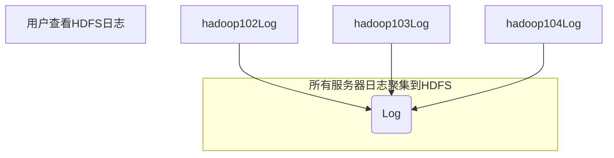
```mermaid
flowchart TB
用户查看HDFS日志
subgraph 所有服务器日志聚集到HDFS
id(Log)
end
hadoop102Log --> id
hadoop103Log --> id
hadoop104Log --> id
```

日志聚集功能的好处：可以方便的查看到程序运行详情，方便开发调试

开启日志聚集功能，需要重新启动NodeManager、ResourceManager和HistoryServer

具体步骤如下

1. 配置yarn-site.xml 添加配置

   ```bash
   [zxk@hadoop102 hadoop]$ pwd
   /opt/module/hadoop-3.3.1/etc/hadoop
   [zxk@hadoop102 hadoop]$ vim yarn-site.xml
   ```

   ```xml
     <!-- 开启日志聚集功能 -->
     <property>
           <name>yarn.log-aggregation-enable</name>
           <value>true</value>
     </property>
     <!-- 设置日志聚集服务器地址 -->
     <property>
           <name>yarn.log.server.url</name>
           <value>http://hadoop102:19888/jobhistory/logs</value>
     </property>
     <!-- 设置日志保留时间为7天 -->
     <property>
           <name>yarn.log-aggregation.retain-seconds</name>
           <value>604800</value>
     </property>
   ```

2. 分发配置

   ```bash
   [zxk@hadoop102 hadoop]$ xsync yarn-site.xml
   ```

3. 关闭NodeManager、ResourceManager和HistoryServer,然后重启

   ```bash
   [zxk@hadoop102 hadoop]$ mapred --daemon stop historyserver
   
   [zxk@hadoop103 hadoop-3.3.1]$ sbin/stop-yarn.sh
   [zxk@hadoop103 hadoop-3.3.1]$ sbin/start-yarn.sh
   
   [zxk@hadoop102 hadoop]$ mapred --daemon start historyserver
   
   ```

4. 再次运行任务，在history的logs下可以看到相关日志

##### 7. 集群启动/停止方式总结

1. 各个模块分开启动/停止

   - 整体启动/停止HDFS

     `start-dfs.sh/stop-dfs.sh`

   - 整体启动/停止YARN

     `start-yarn.sh/stop-yarn.sh`

2. 各个服务组件逐一启动/停止

   - 分别启动/停止HDFS组件

     `hdfs --daemon start/stop namenode/datanode/secondarynamenode`

   - 启动/停止yarn

     `yarn --daemon start/stop resourcemanager/nodemanager`

##### 8. 编写Hadoop集群常用脚本

1. Hadoop集群启停脚本(包含HDFS、Yarn、Historyserver) myhadoop.sh

   ```shell
   #!/bin/bash
   
   if [ $# -lt 1 ]
   then
       echo "No Args Input..."
   fi
   
   case $1 in
   "start")
           echo "=================启动hadoop集群=================="
           echo "------------启动hdfs-----------------"
           ssh hadoop102 "/opt/module/hadoop-3.3.1/sbin/start-dfs.sh"
           echo "------------启动yarn-----------------"
           ssh hadoop103 "/opt/module/hadoop-3.3.1/sbin/start-yarn.sh"
           echo "------------启动historyserver----------------"
           ssh hadoop102 "/opt/module/hadoop-3.3.1/bin/mapred --daemon start historyserver"
   ;;
   "stop")
           echo "===================关闭Hadoop集群=================="
           echo "---------------关闭historyserver------------------"
           ssh hadoop102 "/opt/module/hadoop-3.3.1/bin/mapred --daemon stop historyserver"
           echo "---------------关闭yarn-----------------------"
           ssh hadoop103 "/opt/module/hadoop-3.3.1/sbin/stop-yarn.sh"
           echo "---------------关闭hdfs----------------------"
           ssh hadoop102 "/opt/module/hadoop-3.3.1/sbin/stop-dfs.sh"
   ;;
   *)
           echo "Input Args Error... Please input start or stop"
   ;;
   esac
   ```

   保存后退出，然后赋予脚本执行权限

   `[zxk@hadoop102 bin]$ chmod +x myhadoop.sh`

2. 查看三台服务器Java进程脚本 jpsall

   ```bash
   [zxk@hadoop102 bin]$ pwd
   /home/zxk/bin
   [zxk@hadoop102 bin]$ vim jpsall
   ```

   ```shell
   #!/bin/bash
   
   for host in hadoop102 hadoop103 hadoop104
   do
           echo "==================$host==============="
           ssh $host jps
   done
   ```

   赋予运行权限

   `[zxk@hadoop102 bin]$ chmod 777 jpsall`

   分发

   `[zxk@hadoop102 ~]$ xsync /home/zxk/bin/`

##### 9. 常用端口号说明

| 端口名称                   | Hadoop2.x | Hadoop3.x      |
| -------------------------- | --------- | -------------- |
| NameNode内部通信端口       | 8020/9000 | 8020/9000/9820 |
| NameNode HTTP UI           | 50070     | 9870           |
| MapReduce 查看执行任务端口 | 8088      | 8088           |
| 历史服务器通信端口         | 19888     | 19888          |

常用配置文件

3.x core-site.xml hdfs-site.xml yarn-site.xml mapred-site.xml workers

2.x core-site.xml hdfs-site.xml yarn-site.xml mapred-site.xml slaves

##### 10.集群时间同步(一般不用)

如果服务器在公网环境(能连接外网)，可以不采用集群时间同步，因为服务器会定期和公网时间进行校准

如果服务器在内网环境，必须要配置集群时间同步，否则时间久了，会产生时间偏差，导致集群执行任务时间不同步

需求

把一个集群中的机器作为时间服务器，所有的机器与这台集群时间进行定时的同步，生成环境根据任务对事件的准确程度要求周期同步，测试环境为了尽快看到效果，采用1分钟同步一次

###### 时间服务器配置(必须root用户)

1. 查看所有节点ntpd服务状态和开机自启动状态

   ```bash
   sudo systemctl status ntpd
   sudo systemctl start ntpd
   sudo systemctl is-enabled ntpd
   ```

2. 修改hadoop102的ntp.conf配置文件

   ```bash
   sudo vim /etc/ntp.conf
   ```

   修改1(授权192.168.10.0-192.168.10.255网段上所有的机器都可以从这台机器上查询和同步时间)

   ```bash
   #restrict 192.168.10.0 mask 255.255.255.0 nomodify notrap
   ```

   修改为

   ```bash
   restrict 192.168.10.0 mask 255.255.255.0 nomodify notrap
   ```

   修改2(集群在局域网中，不使用其他互联网上的时间)

   ```bash
   server 0.centos.pool.ntp.org iburst
   server 1.centos.pool.ntp.org iburst
   server 2.centos.pool.ntp.org iburst
   server 3.centos.pool.ntp.org iburst
   ```

   为

   ```bash
   #server 0.centos.pool.ntp.org iburst
   #server 1.centos.pool.ntp.org iburst
   #server 2.centos.pool.ntp.org iburst
   #server 3.centos.pool.ntp.org iburst
   ```

   添加3(当该节点丢失网络连接，怡冉可以采用本地时间作为时间服务器为集群中的其他节点提供时间同步)

   ```bash
   server 127.127.1.0
   fudge 127.127.1.0 stratum 10
   ```

   修改hadoop102的/etc/sysconfig/ntpd文件

   `sudo vim /etc/sysconfig/ntpd`

   增加内容如下(让硬件时间与系统时间一起同步)

   `SYNC_HWCLOCK=yes`

   重新启动ntpd服务

   `sudo systemctl start ntpd`

   设置ntpd服务开启启动

   `sudo systemctl enable ntpd`

3. 其他机器配置，必须root用户

   1 关闭所有节点上的ntp服务和自启动

   ```bash
   sudo systemctl stop ntpd
   sudo systemctl disable ntpd
   sudo systemctl stop ntpd
   sudo systemctl disable ntpd
   ```

   2 在其他机器配置一分钟与时间服务器同步一次

   ```bash
   sudo crontab -e
   ```

   编写定时任务如下

   ```bash
   */1 * * * * /usr/sbin/ntpdate hadoop102
   ```

   3 修改任意机器时间

   ```bash
   sudo date -s "2021-9-11 11:11:11"
   ```

   4 1分钟后查看机器是否与时间服务器同步

   ```bash
   sudo date
   ```


### 4. 常见错误及解决方案

1. 防火墙没关闭、或者没有启动yarn

2. 主机名称配置错误

3. IP地址配置错误

4. ssh没有配置好

5. root用户和zxk两个用户启动集群不统一

6. 配置文件修改不细心

7. 不识别主机名称

8. 不要起hadoop和hadoop000等特殊名称

9. DataNode和NameNode进程同时只能有一个工作问题分析，因为两者集群id不同了

   解决防范是在格式化之前，先删除DataNode里面的信息，默认在/tmp，如果配置了该目录，就去配置的目录下删除数据

10. 执行命令不生效-和--没区分开

11. jps发现进程没有，重新启动集群提示进程开启

    在linux根目录下/tmp目录中存在启动的进程临时文件，将集群相关进程删除掉再重新启动集群

12. jps不生效

    全局变量hadoop.java没有生效，需要source /etc/profile文件

13. 8088端口连不上

    cat /etc/hosts注释掉

    #127.0.0.1 localhost localhost...

14. 网页删除提示没有权限，需要在core-site.xml里面配置默认用户

Block Size是指这个文件最大为这么大，并不是真的占用了这些空间

## 3.HDFS

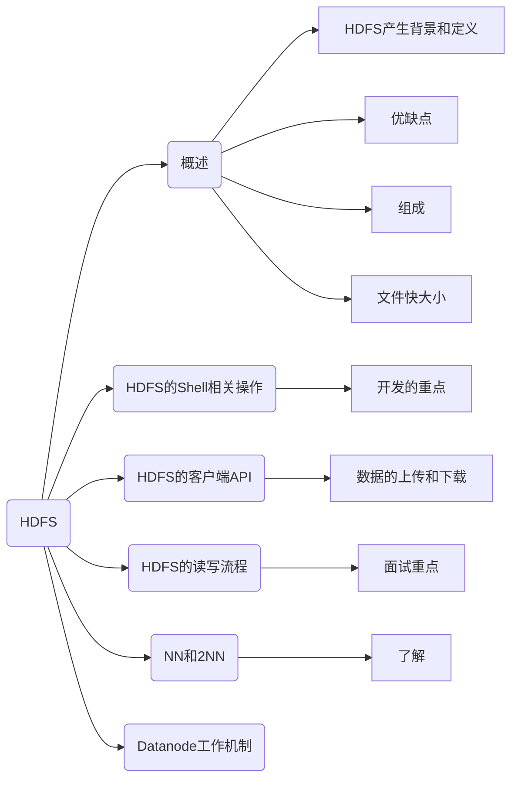
```mermaid
flowchart LR
id(HDFS)
id --> id1(概述)
	id1 --> HDFS产生背景和定义
	id1 --> 优缺点
	id1 --> 组成
	id1 --> 文件快大小
id --> id2(HDFS的Shell相关操作) --> 开发的重点
id --> id3(HDFS的客户端API) --> 数据的上传和下载
id --> id4(HDFS的读写流程) --> 面试重点
id --> id5(NN和2NN) --> 了解
id --> id6(Datanode工作机制)
```


### 1. HDFS概述

#### HDFS产生背景及定义

##### 产生背景

​	随着数据量越来越大，在一个操作系统存不下所有的数据，那么就分配到更多的操作系统管理的磁盘中，但是不方便管理和维护，迫切需要一种系统来管理多台机器上的文件，这就是分布式文件管理系统。HDFS只是**分布式文件管理系统**中的一种

##### 定义

​	**HDFS(Hadoop Distributed File System)，它是一个文件系统**，用于存储文件，通过目录树来定位文件，其次，它是**分布式**的，由很多服务器联合起来实现其功能，集群中的服务器有各自的角色

​	**HDFS的使用场景：适合一次写入，多次读出的场景**。一个文件经过创建、写入和关闭之后就不需要改变

NTFS系统

#### HDFS优缺点

##### HDFS优点

1. 高容错性
   - 数据自动保存多个副本，通过增加副本的形式，提高容错性
   - 某一个副本丢失后，可以自动恢复，比如某台机器的数据丢失，他会从其他的副本把数据保存到其他服务器，确保有三个副本
2. 适合处理大数据
   - 数据规模 能够处理数据规模达到GB、TB、甚至PB级别的数据
   - 文件规模 能够处理百万规模以上的文件数量
3. 可以构建在廉价的机器上，通过多副本机制，提高可靠性

##### HDFS缺点

1. 不适合低延时数据访问，比如毫秒级别的存储数据是做不到的
2. 无法高效的对大量的小文件进行存储
   - 存储大量小文件的话，会占用NameNode大量的内存来存储文件目录和块信息，这样不可取，因为NameNode的内存有限
   - 小文件存储的寻址时间会超过读取时间，违反了HDFS的设计目标
3. 不支持并发写入、文件随机修改
   - 一个文件只能有一个写，不允许多个线程同时写
   - **仅支持数据append(追加)**，不支持文件的随机修改

#### HDFS组成架构

https://hadoop.apache.org/docs/

https://hadoop.apache.org/docs/r3.3.1/


1. NameNode(nn):就是Master，它是一个主管、管理者
   - 管理HDFS的名称空间
   - 配置副本策略
     - 数据有多少副本
   - 管理数据块(Block)映射信息
     - 比如一个文件分成多个块存储，不同的块可能会分布在不同的服务器上
   - 处理客户端读写请求
2. DataNode:就是Slave，NameNode下达命令，DataNode执行实际的操作
   - 存储实际的数据块
   - 执行数据块的读/写操作
3. Client:就是客户端
   - 文件切分。文件上传HDFS的时候，Client将文件切分成一个一个的块，然后进行上传
   - 与NameNode交互，获取文件的位置信息
   - 与DataNode交互，读取或写入数据
   - Client提供一些命令来管理HDFS，比如NameNode的格式化
   - Client可以通过一些命令来访问HDFS，比如对HDFS的增删改查操作
4. Secondary NameNode：并非NameNode的热备份，当NameNode挂掉的时候，它并不能马上替换NameNode并提供服务
   - 辅助NameNode，分担其工作量，比如定期合并Fsimage和Edits，并推送给NameNode
   - 在紧急情况下可以辅助恢复NameNode

#### HDFS文件块大小(重点)

​	HDFS中的文件在物理上是分块存储的(Block)，块的大小可以通过配置参数(dfs.blocksize)来规定，Hadoop2.x/3.x默认大小是128M，1.x版本中是64M

1. 集群中的block
2. 如果寻址时间约为10ms，即查找到目标block的时间为10ms
3. 寻址时间为传输时间的1%时，则为最佳状态，因此传输时间=10ms/0.01=1000ms=1s
4. 而目前磁盘传输速率普遍为100MB/s
5. block大小=1s*100MB/s=100MB

一般机械硬盘为128MB，固态硬盘为256MB

为什么块的大小不能设置太小，也不能设置太大？

1. HDFS块设置太小，会增加寻址时间，程序一直在找块的开始位置
2. 如果块设置的太大，从磁盘传输数据的时间会明显大于定位这个块开始位置所需的时间，导致程序在处理这块数据时，会非常慢

HDFS块大小的设置主要取决于磁盘传输速率

### 2. HDFS的Shell操作(重点)

#### 基本语法

hadoop fs 具体命令 OR hdfs dfs 具体命令

这两个命令是完全相同的

#### 命令大全

```bash
[zxk@hadoop102 ~]$ hadoop fs
Usage: hadoop fs [generic options]
        [-appendToFile <localsrc> ... <dst>]
        [-cat [-ignoreCrc] <src> ...]
        [-checksum [-v] <src> ...]
        [-chgrp [-R] GROUP PATH...]
        [-chmod [-R] <MODE[,MODE]... | OCTALMODE> PATH...]
        [-chown [-R] [OWNER][:[GROUP]] PATH...]
        [-concat <target path> <src path> <src path> ...]
        [-copyFromLocal [-f] [-p] [-l] [-d] [-t <thread count>] <localsrc> ... <dst>]
        [-copyToLocal [-f] [-p] [-ignoreCrc] [-crc] <src> ... <localdst>]
        [-count [-q] [-h] [-v] [-t [<storage type>]] [-u] [-x] [-e] [-s] <path> ...]
        [-cp [-f] [-p | -p[topax]] [-d] <src> ... <dst>]
        [-createSnapshot <snapshotDir> [<snapshotName>]]
        [-deleteSnapshot <snapshotDir> <snapshotName>]
        [-df [-h] [<path> ...]]
        [-du [-s] [-h] [-v] [-x] <path> ...]
        [-expunge [-immediate] [-fs <path>]]
        [-find <path> ... <expression> ...]
        [-get [-f] [-p] [-ignoreCrc] [-crc] <src> ... <localdst>]
        [-getfacl [-R] <path>]
        [-getfattr [-R] {-n name | -d} [-e en] <path>]
        [-getmerge [-nl] [-skip-empty-file] <src> <localdst>]
        [-head <file>]
        [-help [cmd ...]]
        [-ls [-C] [-d] [-h] [-q] [-R] [-t] [-S] [-r] [-u] [-e] [<path> ...]]
        [-mkdir [-p] <path> ...]
        [-moveFromLocal [-f] [-p] [-l] [-d] <localsrc> ... <dst>]
        [-moveToLocal <src> <localdst>]
        [-mv <src> ... <dst>]
        [-put [-f] [-p] [-l] [-d] [-t <thread count>] <localsrc> ... <dst>]
        [-renameSnapshot <snapshotDir> <oldName> <newName>]
        [-rm [-f] [-r|-R] [-skipTrash] [-safely] <src> ...]
        [-rmdir [--ignore-fail-on-non-empty] <dir> ...]
        [-setfacl [-R] [{-b|-k} {-m|-x <acl_spec>} <path>]|[--set <acl_spec> <path>]]
        [-setfattr {-n name [-v value] | -x name} <path>]
        [-setrep [-R] [-w] <rep> <path> ...]
        [-stat [format] <path> ...]
        [-tail [-f] [-s <sleep interval>] <file>]
        [-test -[defswrz] <path>]
        [-text [-ignoreCrc] <src> ...]
        [-touch [-a] [-m] [-t TIMESTAMP (yyyyMMdd:HHmmss) ] [-c] <path> ...]
        [-touchz <path> ...]
        [-truncate [-w] <length> <path> ...]
        [-usage [cmd ...]]

Generic options supported are:
-conf <configuration file>        specify an application configuration file
-D <property=value>               define a value for a given property
-fs <file:///|hdfs://namenode:port> specify default filesystem URL to use, overrides 'fs.defaultFS' property from configurations.
-jt <local|resourcemanager:port>  specify a ResourceManager
-files <file1,...>                specify a comma-separated list of files to be copied to the map reduce cluster
-libjars <jar1,...>               specify a comma-separated list of jar files to be included in the classpath
-archives <archive1,...>          specify a comma-separated list of archives to be unarchived on the compute machines

The general command line syntax is:
command [genericOptions] [commandOptions]
```

#### 常用命令操作

##### 准备

1. 启动hadoop集群

   ```bash
   #102
   start-dfs.sh
   #103
   start-yarn.sh
   也可以用之前配置好的启动脚本
   ```

2. -help 输出这个命令参数的用法

   ```bash
   [zxk@hadoop102 ~]$ hadoop fs -help rm
   -rm [-f] [-r|-R] [-skipTrash] [-safely] <src> ... :
     Delete all files that match the specified file pattern. Equivalent to the Unix
     command "rm <src>"
   
     -f          If the file does not exist, do not display a diagnostic message or
                 modify the exit status to reflect an error.
     -[rR]       Recursively deletes directories.
     -skipTrash  option bypasses trash, if enabled, and immediately deletes <src>.
     -safely     option requires safety confirmation, if enabled, requires
                 confirmation before deleting large directory with more than
                 <hadoop.shell.delete.limit.num.files> files. Delay is expected when
                 walking over large directory recursively to count the number of
                 files to be deleted before the confirmation.
   ```

3. 创建/sanguo文件夹

   ```bash
   [zxk@hadoop102 ~]$ hadoop fs -mkdir /sanguo
   ```

##### 上传

1. -moveFromLocal 从本地**剪切黏贴到**HDFS

   ```bash
   [zxk@hadoop102 hadoop-3.3.1]$ vim shuguo.txt
   # 输入shuguo
   [zxk@hadoop102 hadoop-3.3.1]$ hadoop fs -moveFromLocal ./shuguo.txt /sanguo
   ```

2. -copyFromLocal 从本地文件系统中拷贝文件到HDFS路径去

   ```bash
   [zxk@hadoop102 hadoop-3.3.1]$ vim weiguo.txt
   # 输入weiguo
   [zxk@hadoop102 hadoop-3.3.1]$ hadoop fs -copyFromLocal ./weiguo.txt /sanguo
   ```

3. -put 等同于copyFromLocal,生产环境更习惯用put

   ```bash
   [zxk@hadoop102 hadoop-3.3.1]$ vim wuguo.txt
   #输入wuguo
   [zxk@hadoop102 hadoop-3.3.1]$ hadoop fs -put ./wuguo.txt /sanguo
   ```

4. -appendToFile 追加一个文件到已经存在的文件末尾

   ```bash
   [zxk@hadoop102 hadoop-3.3.1]$ vim liubei.txt
   # 输入liubei
   [zxk@hadoop102 hadoop-3.3.1]$ hadoop fs -appendToFile ./liubei.txt /sanguo/shuguo.txt
   ```

##### 下载(可以修改名字)

1. -copyToLocal 从HDFS拷贝到本地

   ```bash
   [zxk@hadoop102 hadoop-3.3.1]$ hadoop fs -copyToLocal /sanguo/shuguo.txt ./
   ```

2. -get 等同于copyToLocal，生产环境更习惯用get

   ```bash
   [zxk@hadoop102 hadoop-3.3.1]$ hadoop fs -get /sanguo/shuguo.txt ./shuguo2.txt
   ```

##### HDFS直接操作

1. -ls 显示目录信息

   ```bash
   [zxk@hadoop102 hadoop-3.3.1]$ hadoop fs -ls /
   Found 4 items
   -rw-r--r--   3 zxk supergroup  174287938 2021-10-23 18:22 /openjdk-8u41-b04-linux-x64-14_jan_2020.tar.gz
   drwxr-xr-x   - zxk supergroup          0 2021-10-25 21:01 /sanguo
   drwx------   - zxk supergroup          0 2021-10-23 20:31 /tmp
   drwxr-xr-x   - zxk supergroup          0 2021-10-23 18:16 /wcinput
   ```

2. -cat 显示文件内容

   ```bash
   [zxk@hadoop102 hadoop-3.3.1]$ hadoop fs -cat /sanguo/wuguo.txt
   wuguo
   ```

3. -chgrp、-chmod、-chown Linux文件系统中用法一样，修改文件所属权限

   ```bash
   [zxk@hadoop102 hadoop-3.3.1]$ hadoop fs -chown zxk:zxk /sanguo/shuguo.txt
   ```

4. -mkdir 创建路径(文件夹)

   ```bash
   [zxk@hadoop102 hadoop-3.3.1]$ hadoop fs -mkdir /jinguo
   ```

5. -cp 从HDFS的一个路径拷贝到HDFS的另一个路径

   ```bash
   [zxk@hadoop102 hadoop-3.3.1]$ hadoop fs -cp /sanguo/shuguo.txt /jinguo
   ```

6. -mv 在HDFS目录中移动文件

   ```bash
   [zxk@hadoop102 hadoop-3.3.1]$ hadoop fs -mv /sanguo/weiguo.txt /jinguo
   [zxk@hadoop102 hadoop-3.3.1]$ hadoop fs -mv /sanguo/wuguo.txt /jinguo
   ```

7. -tail 显示一个文件的末尾1kb的数据

   ```bash
   [zxk@hadoop102 hadoop-3.3.1]$ hadoop fs -tail /jinguo/shuguo.txt
   shuguo
   liubei
   ```

8. -rm 删除文件或文件夹

   ```bash
   [zxk@hadoop102 hadoop-3.3.1]$ hadoop fs -rm /sanguo/shuguo.txt
   Deleted /sanguo/shuguo.txt
   ```

9. -rm -r 递归删除目录及目录里面的内容

   ```bash
   [zxk@hadoop102 hadoop-3.3.1]$ hadoop fs -rm -r /sanguo
   Deleted /sanguo
   ```

10. -du 统计文件夹的大小信息

    ```bash
    [zxk@hadoop102 hadoop-3.3.1]$ hadoop fs -du -s -h /jinguo
    27  81  /jinguo
    [zxk@hadoop102 hadoop-3.3.1]$ hadoop fs -du -h /jinguo
    14  42  /jinguo/shuguo.txt
    7   21  /jinguo/weiguo.txt
    6   18  /jinguo/wuguo.txt
    ```

    27表示文件大小，81表示27*3个副本，/jinguo表示查看的目录

11. -setrep 设置HDFS中文件的副本数量

    ```bash
    [zxk@hadoop102 hadoop-3.3.1]$ hadoop fs -setrep 10 /jinguo/shuguo.txt
    ```

    这里设置的副本数只是记录在NameNode的元数据中，是否真的会有这么多副本，还得看DataNode的数量，因为目前只有三台设备，最多也就三个副本，只有节点数增加到10台时，副本数才能达到10

### 3. HDFS的API操作

#### 客户端环境准备

可以在hadoop集群内部，使用相关命令操作Hadoop，也可在外部，比如windows上，使用客户端进行相关命令操作

1. windows版客户端对应版本下载

   https://github.com/fallofleaf/winutils

   注意下载后拷贝到非中文目录下

2. 配置HADOOP_HOME环境变量

   此电脑>属性>高级系统设置>高级>环境变量>用户变量里面添加

   HADOOP_HOME，值为bin目录所在的位置，如E:\assist tool\hadoop-3.3.1，然后在Path里面添加%HADOOP_HOME%\bin

3. 双击winutils.exe，不提示错误表示成功

4. IDEA新建Maven工程HdfsClientDemo

   - 导入相应依赖(注意版本一致)

     ```xml
         <dependencies>
             <dependency>
                 <groupId>org.apache.hadoop</groupId>
                 <artifactId>hadoop-client</artifactId>
                 <version>3.3.1</version>
             </dependency>
             <dependency>
                 <groupId>junit</groupId>
                 <artifactId>junit</artifactId>
                 <version>4.13.2</version>
             </dependency>
             <dependency>
                 <groupId>org.slf4j</groupId>
                 <artifactId>slf4j-log4j12</artifactId>
                 <version>1.7.32</version>
             </dependency>
         </dependencies>
     ```

   - 在src/main/resources目录下添加文件log4j.properties

     ```properties
     log4j.rootLogger=INFO,stdout
     log4j.appender.stdout=org.apache.log4j.ConsoleAppender
     log4j.appender.stdout.layout=org.apache.log4j.PatternLayout
     log4j.appender.stdout.layout.ConversionPattern=%d %p [%c] - %m%n
     log4j.appender.logfile=org.apache.log4j.FileAppender
     log4j.appender.logfile.File=target/spring.log
     log4j.appender.logfile.layout=org.apache.log4j.PatternLayout
     log4j.appender.logfile.layout.ConversionPattern=%d %p [%c] - %m%n
     ```

   - 创建包

     com.flywinter.hdfs

   - 创建类HdfsClient

#### API调用

```java
package com.flywinter.hdfs;

/**
 * Created by IntelliJ IDEA
 * User:Zhang Xingkun
 * Date:2021/10/26 17:48
 * Description:
 */


import org.apache.hadoop.conf.Configuration;
import org.apache.hadoop.fs.*;
import org.junit.After;
import org.junit.Before;
import org.junit.Test;

import java.io.IOException;
import java.net.URI;
import java.net.URISyntaxException;
import java.util.Arrays;

/**
 * 常见流程
 * 1. 获取一个客户端对象
 * 2. 执行相关的操作命令
 * 3. 关闭资源
 * HDFS zookeeper
 */
public class HdfsClient {

    private FileSystem fs;

    @Before
    public void init() throws IOException, InterruptedException, URISyntaxException {
        //连接的集群nn地址
        URI uri = new URI("hdfs://hadoop102:8020");
        //创建一个配置文件
        Configuration configuration = new Configuration();
        configuration.set("dfs.replication", "2");
        //1.获取到客户端对象
        String user = "zxk";
        fs = FileSystem.get(uri, configuration, user);

    }

    @After
    public void close() throws IOException {
        //3.关闭资源
        fs.close();
    }

    //创建目录
    @Test
    public void testmkdir() throws IOException {
        //2.创建一个文件夹
        fs.mkdirs(new Path("/xiyou/huaguoshan1"));
        //3.关闭资源
        fs.close();
    }
    //上传
    //注意先在E盘下新建sunwukong.txt文件

    /**
     * 参数优先级 hdfs-default.xml => hdfs-site.xml => 在项目资源目录下的配置文件 => 代码里面的配置优先级
     * 在resources文件夹下添加hdfs-site.xml文件后，再次上传，查看副本数
     * resources文件夹下的优先级较高
     *
     * @throws IOException
     */
    @Test
    public void testPut() throws IOException {
//        boolean delSrc  是否删除原数据
//        boolean overwrite 是否覆盖
//        Path[] srcs 原数据路径
//        Path dst 目的地路径
        fs.copyFromLocalFile(false, true,
                new Path("E:\\sunwukong.txt"),
                new Path("hdfs://hadoop102:8020/xiyou/huaguoshan"));
    }

    //文件下载
    //crc文件，加密进行文件校验，判断文件是否完整
    @Test
    public void testGet() throws IOException {
//        boolean delSrc, 是否删除原文件
//        Path src, 原文件路径HDFS
//        Path dst, 目标地址路径windows
//        boolean useRawLocalFileSystem 是否开启本地校验，true不开启
        fs.copyToLocalFile(false,
                new Path("hdfs://hadoop102:8020/xiyou/huaguoshan"),
                new Path("E:"),
                false);
    }

    //文件删除
    @Test
    public void testRm() throws IOException {
        //要删除的路径  是否递归删除
        //删除文件
//        fs.delete(new Path("/openjdk-8u41-b04-linux-x64-14_jan_2020.tar.gz"),false);
        //删除空目录
        //删除非空目录
        fs.delete(new Path("/jinguo"), true);
    }

    //文件更名和移动
    @Test
    public void testmv() throws IOException {
        //原文件路径  目标文件路径
        //改名
//        fs.rename(new Path("/wcinput/word.txt"),new Path("/wcinput/ss.txt"));
        //移动并改名
//        fs.rename(new Path("/wcinput/ss.txt"),new Path("/ssm.txt"));
        //目录的更名
        fs.rename(new Path("/wcinput"), new Path("/input"));
    }

    //HDFS文件详情查看
    @Test
    public void fileDetail() throws IOException {
        //文件路径 是否递归查看
        RemoteIterator<LocatedFileStatus> listFiles = fs.listFiles(new Path("/"), true);
        //遍历文件
        while (listFiles.hasNext()) {
            LocatedFileStatus next = listFiles.next();
            System.out.println("======" + next.getPath() + "======");
            System.out.println(next.getPermission());
            System.out.println(next.getOwner());
            System.out.println(next.getLen());
            System.out.println(next.getModificationTime());
            System.out.println(next.getReplication());
            System.out.println(next.getBlockSize());
            System.out.println(Arrays.toString(next.getBlockLocations()));
            System.out.println(next.getPath().getName());
        }
    }

    //HDFS文件和文件夹判断
    @Test
    public void testListStatus() throws IOException {
        FileStatus[] fileStatuses = fs.listStatus(new Path("/"));
        for (FileStatus status : fileStatuses) {
            if (status.isFile()) {
                System.out.println("文件："+status.getPath().getName());
            }else {
                System.out.println("目录："+status.getPath().getName());
            }
        }
    }
}
```

### 4. HDFS的读写流程(重点)

#### HDFS写数据流程


1. 客户端通过DistributedFileSystem模块向NameNode请求上传文件，NameNode检查目标文件是否已经存在，父目录是否存在
2. NameNode返回是否可以上传
3. 客户端请求第一个Block上传到哪几个DataNode服务器上
4. NameNode返回3个DataNode节点，分别为dn1、dn2、dn3
5. 客户端通过FSDataOutputStream模块请求dn1上传数据，dn1收到请求会继续调用dn2，然后dn2调用dn3，将这个通信管道建立完成
6. dn1、dn2、dn3逐级应答客户端
7. 客户端开始往dn1上传第一个Blcok(先从磁盘读取数据放到一个本地缓存)，以Packet为单位，dn1收到一个Packet就会传给dn2mdn2传给dn3；dn1每传一个packet都会放入一个应答队列等待应答
8. 当一个Block传输完成之后，客户端再次请求NameNode上传第二个Block的服务器(重复执行3-7)

#### 网络拓扑-节点距离计算

在HDFS写数据的过程中，NameNode会选择距离上传数据近距离的NameNode接收数据

节点距离：两个节点到达最近的共同祖先的距离总和

Distance(d1/r1/n0,d1/r1/n0)=0(同一节点上的进程)

Distance(d1/r1/n1,d1/r1/n2)=2(同一机架上不同节点)

Distance(d1/r2/n1,d1/r3/n2)=4(同一数据中心上不同机架上的节点)

Distance(d1/r2/n1,d2/r4/n1)=6(不同数据中心的节点)

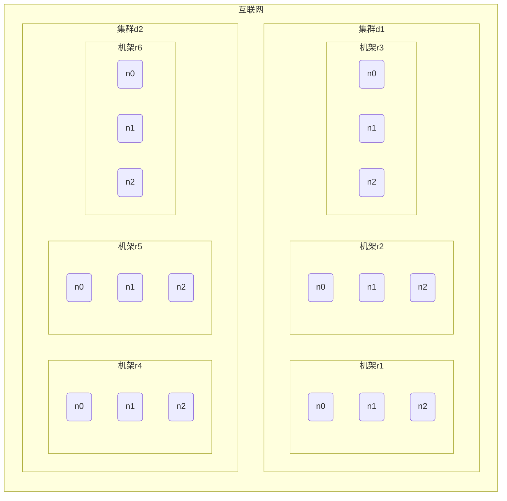
```mermaid
flowchart LR
subgraph 互联网
	subgraph 集群d1
		subgraph 机架r1
			r11(n0)
			r12(n1)
			r13(n2)
		end
		subgraph 机架r2
			r21(n0)
			r22(n1)
			r23(n2)
		end
		subgraph 机架r3
			r31(n0)
			r32(n1)
			r33(n2)
		end
	end
		subgraph 集群d2
			subgraph 机架r4
			r41(n0)
			r42(n1)
			r43(n2)
		end
			subgraph 机架r5
			r51(n0)
			r52(n1)
			r53(n2)
		end
			subgraph 机架r6
			r61(n0)
			r62(n1)
			r63(n2)
		end
	end
end
```

假设有数据中心d1机架r1中的节点n1，该节点可以标识为d1/r1/n1，利用这种标记，给出四种距离描述。


5-9距离为1+1+1=3

#### 机架感知(副本存储节点选择)

##### 官方说明

​	For the common case, when the replication factor is three, HDFS’s placement policy is to put one replica on the local machine if the writer is on a datanode, otherwise on a random datanode in the same rack as that of the writer, another replica on a node in a different (remote) rack, and the last on a different node in the same remote rack. This policy cuts the inter-rack write traffic which generally improves write performance. The chance of rack failure is far less than that of node failure; this policy does not impact data reliability and availability guarantees. However, it does not reduce the aggregate network bandwidth used when reading data since a block is placed in only two unique racks rather than three. With this policy, the replicas of a block do not evenly distribute across the racks. Two replicas are on different nodes of one rack and the remaining replica is on a node of one of the other racks. This policy improves write performance without compromising data reliability or read performance.

##### 具体选择

第一个副本在Client所处的节点上，如果客户端在集群外，随机选一个

第二个副本在另一个机架的随机一个节点

第三个副本在第二个副本所在机架的随机节点

#### HDFS读数据流程


1. 客户端通过Distributed FileSystem向NameNode请求下载文件，NameNode通过查询元数据，找到文件块所在的DataNode地址
2. 挑选一台DataNode(就近原则，然后随机)服务器，请求读取数据
3. DataNode开始传输数据给客户端(从磁盘里面读取数据输入流，以Packet为单位来做校验)
4. 客户端以Packet为单位接收，先在本地缓存，然后写入目标文件

### 5. NameNode和SecondaryNameNode

#### NN和2NN工作机制

NameNode中的元数据是存储在哪里的？

如果存储在NameNode节点的磁盘中，因为经常需要进行随机访问，还有相应客户请求，必然是效率过低。因此，元数据需要存放在内存中。但如果只存在内存中，一旦断电，元数据丢失，整个集群就无法工作了，**因此产生在磁盘中备份元数据的FsImage**

这样又会带来新的问题，当在内存中的元数据更新时，如果同时更新FsImage，就会导致效率过低，但如果不更新，就会发生一致性问题，一旦NameNode节点断电，就会产生数据丢失。因此，引入Edits文件(只进行追加操作，效率很高)。**每当元数据有更新或者添加元数据时，修改内存中的元数据并追加到Edits中**。这样，一旦NameNode节点断电，可以通过FsImage和Edits的合并，合成元数据。


##### 1.第一阶段 NameNode启动

1. 第一次启动NameNode格式化后，创建Fsimage和Edits文件。如果不是第一次启动，直接加载编辑日子和镜像文件到内存
2. 客户端对元数据进行增删改的请求
3. NameNode记录操作日志，更新滚动日志
4. NameNode在内存中对数据进行增删改

##### 2.第二阶段 Secondary NameNode工作

1.  Secondary NameNode询问NameNode是否需要CheckPoint，直接带回NameNode是否检查结果
2. Secondary NameNode请求执行CheckPoint
3. NameNode滚动正在写的Edits日志
4. 将滚动前的编辑日志和镜像文件拷贝到Secondary NameNode
5. Secondary NameNode加载编辑日志和镜像文件到内存，并合并
6. 生成新的镜像文件fsimage.chkpoint
7. 拷贝fsimage.chkpoint到NameNode
8. NameNode将fsimage.chkpoint重新命名成fsimage

#### Fsimage和Edits解析

##### Fsimage和Edits概念

NameNode被格式化之后，将在/opt/module/hadoop-3.3.1/data/dfs/name/current目录中产生如下文件:

```bash
 fsimage_0000000000000000000
 fsimage_0000000000000000000.md5
 seen_txid
 VERSION
```

1. Fsimage文件：HDFS文件系统元数据的一个永久性的检查点，其中包含HDFS文件系统的所有目录和文件inode的序列化信息
2. Edits文件:存放HDFS文件系统所有更新操作的路径，文件系统客户端执行的所有写操作首先会被记录到Edits文件中
3. seen_txid文件保存的是一个数字，就是最后一个edits_的数字
4. 每次NameNode启动的时候都会将Fsimage文件读入内存，加载Edits里面的更新操作，保证内存中的元数据信息是最新的、同步的，可以看成NameNode启动的时候就将Fsimage和Edits文件进行了合并

##### oiv查看Fsimage文件

1. 查看oiv和oev命令

   ```
   oev      apply the offline edits viewer to an edits file
   oiv      apply the offline fsimage viewer to an fsimage
   ```
   
2. 基本语法

   `hdfs oiv -p 文件类型 -i 镜像文件 -o 转换后文件输出路径`

3. 案例实操

   ```bash
   [zxk@hadoop102 current]$ hdfs oiv -p XML -i fsimage_0000000000000000483 -o /opt/software/fsimage.xml
   ```

4. fsimage里面利用树形结构存储文件的层次，每个文件都有ID表示，但是并不存储文件具体的位置，每次集群启动，其他的节点都会主动向NameNode汇报

##### oev查看Edits文件

1. 基本语法 

   `hdfs oev -p 文件类型 -i 编辑日志 -o 转换后文件输出路径`

2. 案例实操

   ```bash
   [zxk@hadoop102 current]$ hdfs oev -p XML -i edits_inprogress_0000000000000000486 -o /opt/software/edit.xml
   ```

3. 里面用xml格式，记录追加操作

4. NameNode每次启动如何确认合并哪些？合并大于fsimage序号的

5. 2NN没有progress也就是最新的信息，如果NameNode挂掉，只使用2NN，那么就会丢失最新的操作信息

#### CheckPoint时间设置

1. 通常情况下，SecondaryNameNode每隔一小时执行一次

   ```xml
   <property>
       <name>dfs.namenode.checkpoint.period</name>
       <value>3600s</value>
   </property>
   ```

2. 一分钟检查一次操作次数，当操作次数达到一百万时，SecondaryNameNode执行一次

   ```xml
   <property>
       <name>dfs.namenode.checkpoint.txns</name>
       <value>1000000</value>
       <decsription>操作动作次数</decsription>
   </property>
   <property>
       <name>dfs.namenode.checkpoint.check.period</name>
       <value>60s</value>
       <decsription >一分钟检查一次操作次数</decsription> 
   </property>
   ```

### 6. DataNode

#### DataNode工作机制


1. 一个数据库在DataNode上以文件形式存储在磁盘上，包括两个文件，一个是数据本身，一个是元数据包括数据块的长度，块数据的校验和，以及时间戳
2. DataNode启动后向NameNode注册，通过后，周期性(1小时)的向NameNode上报所有的块信息
3. 心跳是每3s一次，心跳返回结果带有NameNode给该DataNode的命令如复制块数据到另一台机器，或者删除某个数据块。如果超过10分钟没有收到某个DataNode的心跳，则认为该节点不可用。
4. 集群运行中可以安全加入和退出一些机器.

#### 数据完整性

如果电脑磁盘里存储的数据是控制高铁信号灯的红灯信号1和绿灯信号0，但是存储该数据的磁盘坏了，一直显示是绿灯，是否很危险？同理DataNode节点上的数据损坏了，却没有发现，是否也很危险，如何解决？

以下是DataNode节点保证数据完整性的方法

1. 当DataNode读取Block的时候，它会计算CheckSum
2. 如果计算后的CheckSum，与Block创建时值不一样，说明Block已经损坏
3. Client读取其他DataNode上的Block
4. 常见的校验算法crc(32)、md5(128)、sha1(160)
5. DataNode在其文件创建后周期验证CheckSum


#### 掉线时限参数设置

1. DataNode进程死亡或者网络故障造成DataNode无法与NameNode通信
2. NameNode不会立即把该节点判定为死亡，要经过一段时间，这段时间暂称为超时时长
3. HDFS默认的超时时长为10分钟+30秒
4. 如果定义超时时间为TimeOut，则超时时长计算公式为`TimeOut=2*dfs.namenode.heartbeat.recheck-interval+10*dfs.heartbeat.interval`，而默认的dfs.namenode.heartbeat.recheck-interval大小为5分钟，dfs.heartbeat.interval默认为3s

需要注意的是hdfs-site.xml配置文件中的heartbeat.recheck.interval的单位为毫秒，dfs.heartbeat.interval的单位为秒

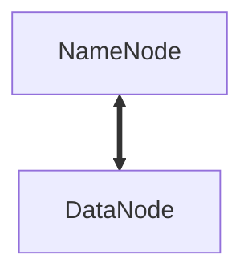
```mermaid
flowchart TB
NameNode <==> DataNode
```


```xml
<property>
    <name>dfs.namenode.heartbeat.recheck-interval</name>
    <value>300000</value>
</property>
<property>
    <name>dfs.heartbeat.interval</name>
    <value>3</value>
</property>
```

### 总结

1. HDFS块大小
   - 磁盘读写速度
2. HDFS shell操作 重点
3. HDFS读写流程 重点

## 4. MapReduce

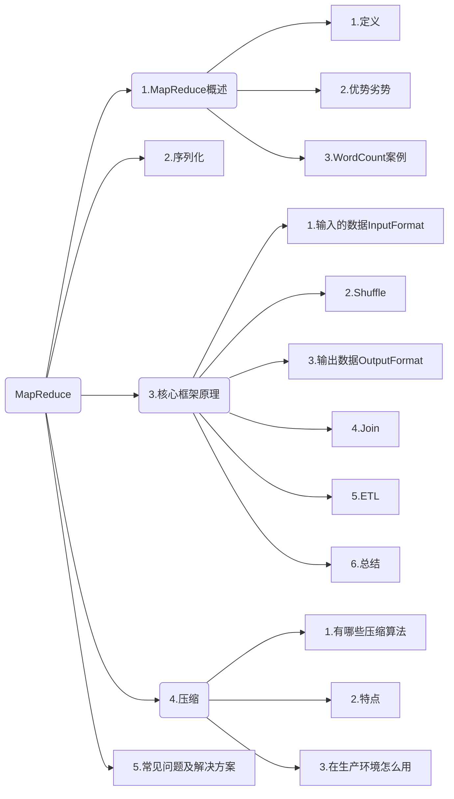
```mermaid
flowchart LR
id(MapReduce)
id --> id1(1.MapReduce概述)
	id1 --> 1.定义
	id1 --> 2.优势劣势
	id1 --> 3.WordCount案例
id --> 2.序列化
id --> id3(3.核心框架原理)
	id3 --> 1.输入的数据InputFormat
	id3 --> 2.Shuffle
	id3 --> 3.输出数据OutputFormat
	id3 --> 4.Join
	id3 --> 5.ETL
	id3 --> 6.总结
id --> id4(4.压缩)
	id4 --> 1.有哪些压缩算法
	id4 --> 2.特点
	id4 --> 3.在生产环境怎么用
id --> 5.常见问题及解决方案
```

### 1. MapReduce概述

#### 1. MapReduce定义

​	MapReduce是一个分布式运算程序的编程框架，是用户开发基于"Hadoop的数据分析应用"的核心框架。

​	MapReduce核心功能是将用户编写的业务逻辑代码和自带默认组件整合成一个完整的分布式运算程序，并发布运行在一个Hadoop集群上。

#### MapReduce优缺点

##### 优点

1. MapReduce易于编程

   它简单的实现一些接口，就可以完成一个分布式程序，这个分布式程序可以分布到

2. 良好的扩展性

   ke以动态增加服务器，解决计算资源不够的问题

3. 高容错性

   任何一台机器挂掉，都可以将任务转移到其他节点

4. 适合海量数据计算(TB/PB)，几千台服务器共同计算

##### 缺点

1. 不擅长实时计算，Mysql
2. 不擅长流式计算 Spark streaming flink
3. 不擅长DAG有向无环图计算 Spark

#### MapReduce核心编程思想

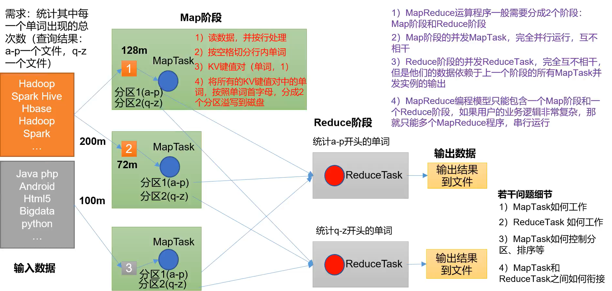

#### MapReduce进程

​	一个完整的MapReduce程序在分布式运行时有三类实例进程

1. MrAppMaster 负责整个程序的过程调度及状态协调
2. MapTask 负责Map阶段的整个数据处理流程
3. ReduceTask 负责Reduce阶段的整个数据处理流程

#### 官方WordCount源码

​	反编译后WordCount案例有Map类、Reduce类和驱动类。且数据的类型是Hadoop自身封装的序列化类型

#### 常用的数据序列化类型

| Java类型 | Hadoop Writable类型 |
| -------- | ------------------- |
| Boolean  | Boolean Writable    |
| Byte     | ByteWritable        |
| Int      | IntWritable         |
| Float    | FloatWritable       |
| Long     | LongWritable        |
| Double   | DoubleWritable      |
| String   | Text                |
| Map      | MapWritable         |
| Array    | ArrayWritable       |
| Null     | NullWritable        |

#### MapReduce编程规范

用户编写的程序分成三个部分：Mapper、Reducer和Driver

##### 1. Mapper阶段

1. 用户自定义的Mapper要继承自己的父类
2. Mapper的输入数据是KV对的形式(KV的类型可以自定义)
3. Mapper中的业务逻辑写在map()方法中
4. Mapper的输出数据是KV对的形式(KV的类型可自定义)
5. map()方法(MapTask进程)对每一个`<K,V>`调用一次

##### 2. Reduce阶段

1. 用户自定义的Reducer要继承自己的父类
2. Reducer的输入数据类型对应Mapper的输出数据类型，也是KV
3. Reducer的业务逻辑写在reduce()方法中
4. ReduceTask进程对每一组相同的k`<k,v>`组调用一次reduce()方法

##### 3. Driver阶段

​	相当于YARN集群的客户端，用于提交我们整个程序到YARN集群，提交的是封装了MapReduce程序相关运行参数的job对象。

#### WrodCount案例实操

##### 本地测试

在给定的文本文件中统计输出每一个单词的总次数

需求

1. 输入数据

   ```
   文件名 hello.txt
   内容
   vue vue
   html html
   css
   java
   hash
   ```

2. 期望输出

   ```
   css 1 
   hash 1
   html 2
   java 1
   vue  2
   ```

需求分析

按照MapReduce编程规范，分别编写Mapper、Recucer、Driver

1. 输入数据
2. Mapper
   - 将MapTask传给我们的内容先转换成String
   - 根据空格将一行切分为单词
   - 将单词输出为`单词,1`
3. Reducer
   - 汇总各个key的个数
   - 输出该key的总次数
4. Driver
   - 获取配置信息，获取job对象实例
   - 制定本程序的jar包所在的本地路径
   - 关联Mapper/Reducer业务类
   - 指定Mapper输出数据的kv类型
   - 指定最终输出的数据的kv类型
   - 指定job的输入原始文件所在目录
   - 指定job的输出结果所在目录
   - 提交作业

环境准备

1. 创建maven工程，MapReducerDemo

2. 在pom.xml文件中添加如下依赖

   ```xml
   <dependencies>
       <dependency>
           <groupId>org.apache.hadoop</groupId>
           <artifactId>hadoop-client</artifactId>
           <version>3.3.1</version>
       </dependency>
       <dependency>
           <groupId>junit</groupId>
           <artifactId>junit</artifactId>
           <version>4.13.2</version>
       </dependency>
       <dependency>
           <groupId>org.slf4j</groupId>
           <artifactId>slf4j-log4j12</artifactId>
           <version>1.7.32</version>
       </dependency>
   </dependencies>
   ```

3. 创建log4j.properties文件，内容为

   ```properties
   log4j.rootLogger=INFO,stdout
   log4j.appender.stdout=org.apache.log4j.ConsoleAppender
   log4j.appender.stdout.layout=org.apache.log4j.PatternLayout
   log4j.appender.stdout.layout.ConversionPattern=%d %p [%c] - %m%n
   log4j.appender.logfile=org.apache.log4j.FileAppender
   log4j.appender.logfile.File=target/spring.log
   log4j.appender.logfile.layout=org.apache.log4j.PatternLayout
   log4j.appender.logfile.layout.ConversionPattern=%d %p [%c] - %m%n
   ```

4. 在com.flywinter.mapreduce.wordcount下创建三个类WordCountMapper、WordCountReducer、WordCountDriver

代码编写

WordCountMapper

```java
/**
 * Created by IntelliJ IDEA
 * User:Zhang Xingkun
 * Date:2021/11/4 21:30
 * Description:
 * KEYIN map阶段输入的key类型  LongWritable 偏移量
 * VALUEIN map阶段输入的value类型 Text
 * KEYOUT map阶段输出的key类型 Text
 * VALUEOU map 阶段输出的value类型 IntWritable
 */

public class WordCountMapper extends Mapper<LongWritable, Text, Text, IntWritable> {
    //之所以提到这里是因为为了减少循环是创建的对象次数
    private Text outK = new Text();
    private IntWritable outV = new IntWritable(1);

    @Override
    protected void map(LongWritable key, Text value, Mapper<LongWritable, Text, Text, IntWritable>.Context context) throws IOException, InterruptedException {
//        1.获取一行
        String line = value.toString();
//        2.切割
        String[] words = line.split(" ");
//        3.循环写出
        for (String word : words) {
            //封装outKey
            outK.set(word);
            context.write(outK, outV);
        }
    }
}
```

WordCountReducer

```java
/**
 * Created by IntelliJ IDEA
 * User:Zhang Xingkun
 * Date:2021/11/4 21:31
 * Description:
 * KEYIN reducer阶段输入的key类型  Text
 * VALUEIN reducer阶段输入的value类型 IntWritable
 * KEYOUT reducer阶段输出的key类型 Text
 * VALUEOU reducer 阶段输出的value类型 IntWritable
 */
public class WordCountReducer extends Reducer<Text, IntWritable, Text, IntWritable> {
    private IntWritable outV = new IntWritable();

    @Override
    protected void reduce(Text key, Iterable<IntWritable> values, Reducer<Text, IntWritable, Text, IntWritable>.Context context) throws IOException, InterruptedException {
        int sum = 0;
        //累加key对应的value
        for (IntWritable value : values) {
            sum += value.get();
        }
        outV.set(sum);
        //写出
        context.write(key, outV);
    }
}
```

WordCountDriver

```java
import org.apache.hadoop.conf.Configuration;
import org.apache.hadoop.fs.Path;
import org.apache.hadoop.io.IntWritable;
import org.apache.hadoop.io.Text;
import org.apache.hadoop.mapreduce.Job;
import org.apache.hadoop.mapreduce.lib.input.FileInputFormat;
import org.apache.hadoop.mapreduce.lib.output.FileOutputFormat;

import java.io.IOException;


/**
 * Created by IntelliJ IDEA
 * User:Zhang Xingkun
 * Date:2021/11/4 21:31
 * Description:
 */
public class WordCountDriver {
    public static void main(String[] args) throws IOException, InterruptedException, ClassNotFoundException {
//        1.获取job
        Configuration conf = new Configuration();
        Job job = Job.getInstance(conf);
//        2.设置jar包路径
        job.setJarByClass(WordCountDriver.class);
//        3.关联mapper和reducer
        job.setMapperClass(WordCountMapper.class);
        job.setReducerClass(WordCountReducer.class);
//        4.设置map输出的kv类型
        job.setMapOutputKeyClass(Text.class);
        job.setMapOutputValueClass(IntWritable.class);
//        5.设置最终输出的kv类型
        job.setOutputKeyClass(Text.class);
        job.setOutputValueClass(IntWritable.class);
//        6.设置输入路径和输出路径
        FileInputFormat.setInputPaths(job,new Path("E:\\learnProject\\hadoopResources\\input1"));
        FileOutputFormat.setOutputPath(job,new Path("E:\\learnProject\\hadoopResources\\output1"));
//        7.提交job
        boolean result = job.waitForCompletion(true);
        System.exit(result?0:1);
    }
}
```

##### 提交到集群测试

添加打包插件

```xml
<build>
        <plugins>
<!--            单纯用这个打包，不会把依赖的jar包打包进去-->
            <plugin>
                <artifactId>maven-compiler-plugin</artifactId>
                <version>3.8.1</version>
                <configuration>
<!--                    注意版本，要和虚拟机安装的Java版本一致-->
                    <source>8</source>
                    <target>8</target>
                </configuration>
            </plugin>
<!--            可以把依赖的jar包打包进去-->
            <plugin>
                <artifactId>maven-assembly-plugin</artifactId>
                <configuration>
                    <descriptorRefs>
                        <descriptorRef>jar-with-dependencies</descriptorRef>
                    </descriptorRefs>
                </configuration>
                <executions>
                    <execution>
                        <id>make-assembly</id>
                        <phase>package</phase>
                        <goals>
                            <goal>single</goal>
                        </goals>
                    </execution>
                </executions>
            </plugin>
        </plugins>
    </build>
```

新建wordcount2包，把wordcount包下的Driver、Mapper、Reducer全部复制一份，注意查看对应的依赖是不是wordcount2包下面的

修改输入和输出路径，让jar包启动的时候可以根据输入的参数选择输入和输出的路径

```java
//        6.设置输入路径和输出路径
        FileInputFormat.setInputPaths(job,new Path(args[0]));
        FileOutputFormat.setOutputPath(job,new Path(args[1]));
```

然后package打包

将打包后的jar包改名为wc.jar，然后上传到hadoop102的/opt/module/hadoop-3.3.1/目录下，启动hadoop集群

将hello.txt上传到hadoop的input目录下

输入driver的类路径 copy reference

`[zxk@hadoop102 hadoop-3.3.1]$ hadoop jar wc.jar com.flywinter.mapreduce.wordcount2.WordCountDriver /input /output`

如果报错

```

Exception in thread "main" java.lang.UnsupportedClassVersionError: com/flywinter/mapreduce/wordcount2/WordCountDriver has been compiled by a more recent version of the Java Runtime (class file version 55.0), this version of the Java Runtime only recognizes class file versions up to 52.0
        at java.lang.ClassLoader.defineClass1(Native Method)
        at java.lang.ClassLoader.defineClass(ClassLoader.java:760)
        at java.security.SecureClassLoader.defineClass(SecureClassLoader.java:142)
        at java.net.URLClassLoader.defineClass(URLClassLoader.java:467)
        at java.net.URLClassLoader.access$100(URLClassLoader.java:73)
        at java.net.URLClassLoader$1.run(URLClassLoader.java:368)
        at java.net.URLClassLoader$1.run(URLClassLoader.java:362)
        at java.security.AccessController.doPrivileged(Native Method)
        at java.net.URLClassLoader.findClass(URLClassLoader.java:361)
        at java.lang.ClassLoader.loadClass(ClassLoader.java:424)
        at java.lang.ClassLoader.loadClass(ClassLoader.java:357)
        at java.lang.Class.forName0(Native Method)
        at java.lang.Class.forName(Class.java:348)
        at org.apache.hadoop.util.RunJar.run(RunJar.java:316)
        at org.apache.hadoop.util.RunJar.main(RunJar.java:236)
```

这是因为java版本不一致导致的

运行成功后就可以在HDFS网页里面看到

### 2. Hadoop序列化

#### 序列化概述

1. 什么是序列化

   序列化就是把内存中的对象，转换成字节序列或其他数据传输协议，以便于存储到磁盘(持久化)和网络传输

   反序列化就是将收到的字节序列或其他数据传输协议，或者说磁盘的持久化数据，转换为内存中的对象

2. 为什么要序列化

   一般来说，活动的对象只生存在内存里，关机断电就没有了，而且活动的对象只能由本地的进程使用，不能被发送到网络上的另外一台计算机，然而序列化可以存储活动的对象，可以将活动的对象发送到远程计算机

3. 为什么不用Java序列化

   Java的序列化是一个重量级序列化框架(Serializable)，一个对象被序列化后，会附带很多的额外信息(各种校验信息，Header，继承体系等)，不方便在网络中高效传输，而hadoop序列化只存储了简单的校验信息

hadoop序列化优点：

1. 存储空间少，只是简单的校验信息
2. 快速：传输速度快
3. 互操作性，可以用不同语言编写序列化

#### 自定义bean对象实现序列化接口(Writable)

​	在企业开发中往往常用的序列化类型不能满足所有需求，比如在Hadoop框架内部传递一个bean对象，那么该对象就需要实现序列化接口

​	具体实现对象序列化有以下七步：

1. 必须实现writable接口

2. 反序列化时，需要反射调用无参构造函数，所以必须有无参构造

   ```java
   public FlowBean(){
   	super();
   }
   ```

3. 重写序列化方法

   ```java
   @Override
   public void write(DataOutput out) throws IOException{
       out.writeLong(upFlow);
       out.writeLong(downFlow);
       out.writeLong(sumFlow);
   }
   ```

4. 重写反序列化方法

   ```java
   @Override
   public void readFields(DataInput in) throws IOException{
   	upFlow = in.readLong();
   	downFlow = in.readLong();
   	sumFlow = in.readLong();
   }
   ```

5. 反序列化的顺序和序列化的顺序完全一致

6. 要想把结果显示在文件中，需要重写.toString()，可以用\t分开，方便后续使用

7. 如果需要将自定义的bean放在key中传输，则还需要实现Comparable接口，因为MapReduce框架中的Shuffle过程要求对key必须能排序

   ```java
   @Override
   public int compareTo(FlowBean o){
       //倒序排列
       return this.sumFlow > o.getSumFlow() ? -1:1;
   }
   ```

#### 序列化案例实操

##### 1.需求

统计每一个手机号耗费的总上行流量、总下行流量、总流量

1. 输入数据phone_data.txt

   ```
   1	13736230513	192.196.100.1 	www.atguigu.com	2481	24681	200
   2	13846544121	192.196.100.2 		264	0	200
   3	13956435636	192.196.100.3 	               	132	1512	200
   4	13966251146	192.168.100.1 		240	0	404
   5	18271575951	192.168.100.2 	www.atguigu.com	1527	2106	200
   6	84188413	192.168.100.3 	www.atguigu.com	4116	1432	200
   7	13590439668	192.168.100.4 		1116	954	200
   8	15910133277	192.168.100.5 	www.hao123.com 	3156	2936	200
   9	13729199489	192.168.100.6 	    	240	0	200
   10	13630577991	192.168.100.7 	www.shouhu.com 	6960	690	200
   11	15043685818	192.168.100.8 	www.baidu.com  	3659	3538	200
   12	15959002129	192.168.100.9 	www.atguigu.com	1938	180	200
   13	13560438638	192.168.100.10	     	918	4398	500
   14	13470253144	192.168.100.11	     	180	180	200
   15	13682846555	192.168.100.12	www.qq.com     	1938	2910	200
   16	13992314666	192.168.100.13	www.gaga.com   	3008	3720	200
   17	13509468723	192.168.100.14	www.qinghua.com	7335	110349	200
   18	18390173782	192.168.100.15	www.sougou.com 	9531	2412	404
   19	13975057813	192.168.100.16	www.baidu.com  	11058	48243	200
   20	13768778790	192.168.100.17	      	120	120	200
   21	13568436656	192.168.100.18	www.alibaba.com	2481	26481	200
   22	13568436656	192.168.100.19	               	1116	954	200
   
   ```

   

2. 输入数据格式

   | 7    | 14756238954 | 120.196.100.99 | 1116     | 954      | 200        |
   | ---- | ----------- | -------------- | -------- | -------- | ---------- |
   | id   | 手机号码    | 网络ip         | 上行流量 | 下行流量 | 网络状态码 |

3. 期望输出数据格式

   | 14756238954 | 1116     | 954      | 2070   |
   | ----------- | -------- | -------- | ------ |
   | 手机号码    | 上行流量 | 下行流量 | 总流量 |

##### 2. 需求分析

Map阶段

1. 读取一行数据，切分字段
2. 抽取手机号、上行流量、下行流量
3. 以手机号为key、bean对象为value输出，即context.write(手机号,bean);
4. bean对象要想能够传输，必须实现序列化接口

Reduce阶段

1. 累加上行流量和下行流量得到总流量

##### 3. 编写MapReduce程序

实体类

```java
/**
 * Created by IntelliJ IDEA
 * User:Zhang Xingkun
 * Date:2021/11/13 12:48
 * Description:
 * 1. 定义类实现writable接口
 * 2. 重写序列化和反序列化方法
 * 3. 重写空参构造
 * 4. toString方法
 */
public class FlowBean implements Writable {
    private long upFlow; //上行流量
    private long downFlow;//下行流量
    private long sumFlow; //总流量

    //空参构造
    public FlowBean() {
    }


    public long getUpFlow() {
        return upFlow;
    }

    public void setUpFlow(long upFlow) {
        this.upFlow = upFlow;
    }

    public long getDownFlow() {
        return downFlow;
    }

    public void setDownFlow(long downFlow) {
        this.downFlow = downFlow;
    }

    public long getSumFlow() {
        return sumFlow;
    }

    public void setSumFlow(long sumFlow) {
        this.sumFlow = sumFlow;
    }

    public void setSumFlow() {
        this.sumFlow = this.upFlow + this.downFlow;
    }

    @Override
    public void write(DataOutput out) throws IOException {
        out.writeLong(upFlow);
        out.writeLong(downFlow);
        out.writeLong(sumFlow);
    }

    @Override
    public void readFields(DataInput in) throws IOException {
        this.upFlow = in.readLong();
        this.downFlow = in.readLong();
        this.sumFlow = in.readLong();
    }

    @Override
    public String toString() {
        return upFlow + "\t" + downFlow + "\t" + sumFlow;
    }
}
```

Mapper

```java
public class FlowMapper extends Mapper<LongWritable, Text, Text, FlowBean> {
    private Text outK = new Text();
    private FlowBean outV = new FlowBean();

    @Override
    protected void map(LongWritable key, Text value, Mapper<LongWritable, Text, Text, FlowBean>.Context context) throws IOException, InterruptedException {
        // 1. 获取一行
        //1    13736230513    192.196.100.1  www.atguigu.com    2481   24681  200
        String line = value.toString();
        // 2. 切割
        String[] split = line.split("\t");
        //3. 抓取想要的数据
        //手机号 上行流量 下行流量
        String phone = split[1];
        String up = split[split.length - 3];
        String down = split[split.length - 2];
        //4.封装
        outK.set(phone);
        outV.setUpFlow(Long.parseLong(up));
        outV.setDownFlow(Long.parseLong(down));
        outV.setSumFlow();
        //5. 写出
        context.write(outK, outV);
    }
}
```

Reducer

```java
public class FlowReducer extends Reducer<Text,FlowBean,Text,FlowBean> {
    private FlowBean outV = new FlowBean();
    @Override
    protected void reduce(Text key, Iterable<FlowBean> values, Reducer<Text, FlowBean, Text, FlowBean>.Context context) throws IOException, InterruptedException {
        //1. 遍历集合累加值
        long totalUp = 0;
        long totalDown = 0;
        for (FlowBean value : values) {
            totalUp +=value.getUpFlow();
            totalDown +=value.getDownFlow();
        }
        //2.封装outK,outV
        outV.setUpFlow(totalUp);
        outV.setDownFlow(totalDown);
        outV.setSumFlow();
        //写出
        context.write(key,outV);
    }
}
```

Driver

```java
public class FlowDriver {
    public static void main(String[] args) throws IOException, InterruptedException, ClassNotFoundException {
        //        1.获取job
        Configuration conf = new Configuration();
        Job job = Job.getInstance(conf);
//        2.设置jar包路径
        job.setJarByClass(FlowDriver.class);
//        3.关联mapper和reducer
        job.setMapperClass(FlowMapper.class);
        job.setReducerClass(FlowReducer.class);
//        4.设置map输出的kv类型
        job.setMapOutputKeyClass(Text.class);
        job.setMapOutputValueClass(FlowBean.class);
//        5.设置最终输出的kv类型
        job.setOutputKeyClass(Text.class);
        job.setOutputValueClass(FlowBean.class);
//        6.设置输入路径和输出路径
        FileInputFormat.setInputPaths(job, new Path("E:\\learnProject\\hadoopResources\\input2"));
        FileOutputFormat.setOutputPath(job, new Path("E:\\learnProject\\hadoopResources\\output2"));
//        7.提交job
        boolean result = job.waitForCompletion(true);
        System.exit(result ? 0 : 1);
    }
}
```

本地运行Driver

### 3. MapReduce框架原理

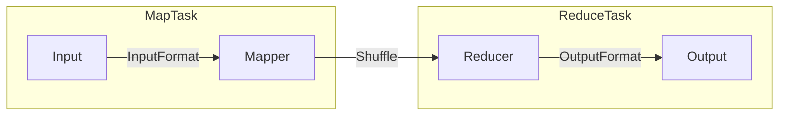
```mermaid
flowchart LR
subgraph MapTask
Input --InputFormat-->Mapper
end
Mapper --Shuffle--> Reducer
subgraph ReduceTask
Reducer --OutputFormat--> Output
end
```


#### InputFormat数据输入

##### 切片与MapTask并行度决定机制

问题引出

​	MapTask的并行度决定Map阶段的任务处理并发度，进而影响到整个Job的处理速度

​	1G的数据，启动8个MapTask，可以提高集群的并发处理能力，那么1K的数据，也启动8个MapTask，会提高集群性能吗？MapTask并行任务是否越多越好，哪些因素影响了MapTask并行度？
MapTask并行度决定机制

​	数据块：Block是HDFS物理上把数据分成很多块，数据块是HDFS存储数据单位

​	数据切片：数据切片只是在逻辑上对输入进行分片，并不会在磁盘上将其切分成片进行存储，数据切片是MapReduce程序计算输入数据的单位，一个切片会对应启动一个MapTask

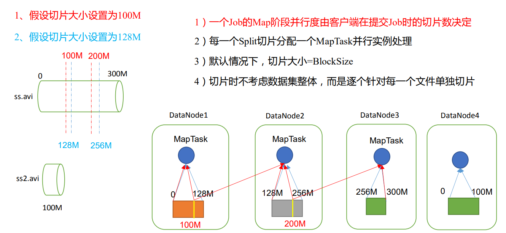


##### Job提交流程源码和切片源码详解

以wordcount为例，在提交job处打断点

提交流程源码解析

xml，jar包，配置信息，这是提交阶段需要提交的东西

```java
waitForCompletion()
submit();
// 1 建立连接
connect();
// 1）创建提交 Job 的代理
new Cluster(getConfiguration());
// （1）判断是本地运行环境还是 yarn 集群运行环境
initialize(jobTrackAddr, conf);
// 2 提交 job
submitter.submitJobInternal(Job.this, cluster)
// 1）创建给集群提交数据的 Stag 路径
Path jobStagingArea = JobSubmissionFiles.getStagingDir(cluster, conf);
// 2）获取 jobid ，并创建 Job 路径
JobID jobId = submitClient.getNewJobID();
// 3）拷贝 jar 包到集群
copyAndConfigureFiles(job, submitJobDir);
rUploader.uploadFiles(job, jobSubmitDir);
// 4）计算切片，生成切片规划文件
writeSplits(job, submitJobDir);
maps = writeNewSplits(job, jobSubmitDir);
input.getSplits(job);
// 5）向 Stag 路径写 XML 配置文件
writeConf(conf, submitJobFile);
conf.writeXml(out);
// 6）提交 Job,返回提交状态
status = submitClient.submitJob(jobId, submitJobDir.toString(),
job.getCredentials());
```

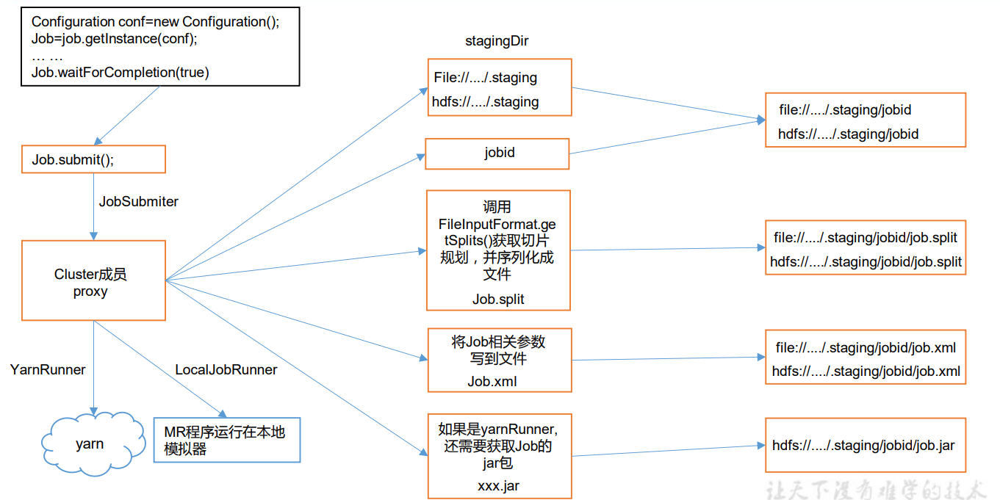

切片流程源码解析 input.getSplits(job)

FileInputFormat切片源码解析

1. 程序先找到数据存储目录

2. 开始遍历处理(规划切片)目录下的每一个文件

3. 遍历第一个文件ss.txt

   a. 获取文件大小fs.sizeOf(ss.txt)

   b. 计算切片大小

   ​	computeSplitSize(Math.max(minSize,Math.min(maxSize,blocksize)))=blocksize=128M

   **c. 默认情况下，切片大小=blocksize**

   d. 开始切，形成第1个切片：ss.txt—0:128M 第2个切片ss.txt—128:256M 第3个切片ss.txt—256M:300M （**每次切片时，都要判断切完剩下的部分是否大于块的1.1倍，不大于1.1倍就划分一块切片**） 

   e. 将切片信息写到一个切片规划文件中 

   f. 整个切片的核心过程在getSplit()方法中完成 

   g. InputSplit只记录了切片的元数据信息，比如起始位置、长度以及所在的节点列表等

4. 提交切片规划文件到YARN上，YARN上的MrAppMaster就可以根据切片规划文件计算开启MapTask个数

##### FileInputFormat切片机制

FileInputFormat切片机制

1. 切片机制

   1. 简单按照文件的内容长度进行切片
   2. 切片大小，默认等于Block大小
   3. 切片时不考虑数据集整体，而是诸葛针对每一个文件单独切片

2. 案例分析

   1. 输入数据有两个文件file1.txt   320M, file2.txt  10M

   2. 经过FileInputFormat的切片机制运算后，形成的切片信息如下

      file1.txt.spilt1 -- 0~128

      file1.txt.spilt2 -- 128~256

      file1.txt.spilt3 -- 256~320

      file2.txt.spilt1 -- 0~10M

FileInputForma切片大小的参数配置

1. 源码中计算切片大小的公式

   Math.max(minSize, Math.min(maxSize, blockSize)); mapreduce.input.fileinputformat.split.minsize=1 默认值为1 mapreduce.input.fileinputformat.split.maxsize= Long.MAXValue 默认值Long.MAXValue 因此，默认情况下，切片大小=blocksize

2. 切片大小配置

   maxsize（切片最大值）：参数如果调得比blockSize小，则会让切片变小，而且就等于配置的这个参数的值。 minsize（切片最小值）：参数调的比blockSize大，则可以让切片变得比blockSize还大

3. 获取切片信息API

   ```java
   // 获取切片的文件名称
   String name = inputSplit.getPath().getName();
   // 根据文件类型获取切片信息
   FileSplit inputSplit = (FileSplit) context.getInputSplit();
   ```

   

##### TextInputFormat

1. FileInputFormat 实现类 

   ​	在运行 MapReduce 程序时，输入的文件格式包括：基于行的日志文件、二进制 格式文件、数据库表等。那么，针对不同的数据类型，MapReduce 是如何读取这些数据的呢？ 

   ​	FileInputFormat 常见的接口实现类包括：TextInputFormat、KeyValueTextInputFormat、 NLineInputFormat、CombineTextInputFormat 和自定义 InputFormat 等。 

2. TextInputFormat 

   ​	TextInputFormat 是默认的 FileInputFormat 实现类。按行读取每条记录。键是存储该行在整个文件中的起始字节偏移量， LongWritable 类型。

   值是这行的内容，不包括任何行终止 符（换行符和回车符），Text 类型

以下是一个示例，比如，一个分片包含了如下 4 条文本记录。 

```
Rich learning form 
Intelligent learning engine 
Learning more convenient 
From the real demand for more close to the enterprise 
```

每条记录表示为以下键/值对： 

```
(0,Rich learning form)
(20,Intelligent learning engine)
(49,Learning more convenient) 
(74,From the real demand for more close to the enterprise)
```

##### CombineTextInputFormat切片机制

​	框架默认的 TextInputFormat 切片机制是对任务按文件规划切片，不管文件多小，都会 是一个单独的切片，都会交给一个 MapTask，这样如果有大量小文件，就会产生大量的 MapTask，处理效率非常低

1. 应用场景：

    CombineTextInputFormat 用于小文件过多的场景，它可以将多个小文件从逻辑上规划到 一个切片中，这样，多个小文件就可以交给一个 MapTask 处理。 

2. 虚拟存储切片最大值设置 

   CombineTextInputFormat.setMaxInputSplitSize(job, 4194304);// 4m 注意：虚拟存储切片最大值设置最好根据实际的小文件大小情况来设置具体的值。 

3. 切片机制 

   生成切片过程包括：虚拟存储过程和切片过程二部分。

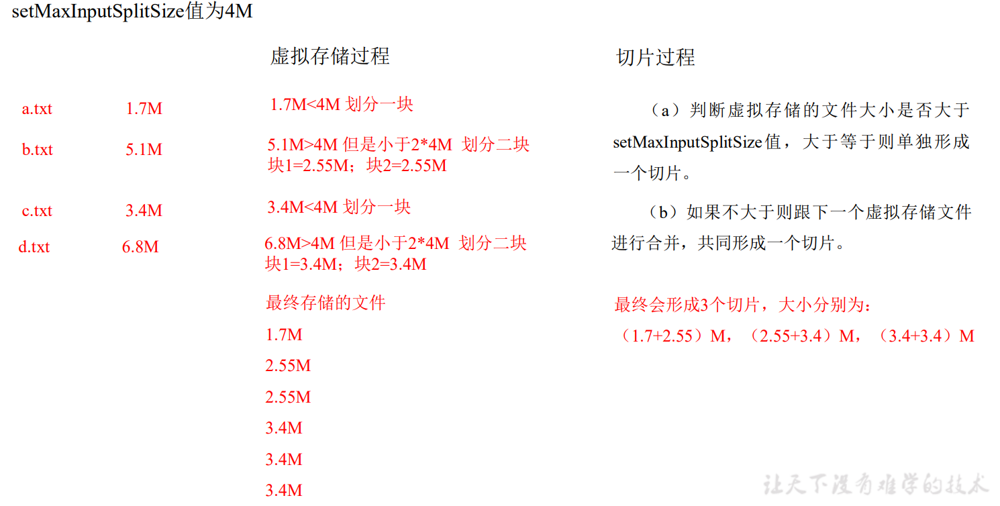

1. 虚拟存储过程： 

   将输入目录下所有文件大小，依次和设置的 setMaxInputSplitSize 值比较，如果不 大于设置的最大值，逻辑上划分一个块。如果输入文件大于设置的最大值且大于两倍， 那么以最大值切割一块；当剩余数据大小超过设置的最大值且不大于最大值 2 倍，此时 将文件均分成 2 个虚拟存储块（防止出现太小切片）。

    例如 setMaxInputSplitSize 值为 4M，输入文件大小为 8.02M，则先逻辑上分成一个 4M。剩余的大小为 4.02M，如果按照 4M 逻辑划分，就会出现 0.02M 的小的虚拟存储 文件，所以将剩余的 4.02M 文件切分成（2.01M 和 2.01M）两个文件。

2. 切片过程： 

   1. 判断虚拟存储的文件大小是否大于 setMaxInputSplitSize 值，大于等于则单独 形成一个切片。 

   2. 如果不大于则跟下一个虚拟存储文件进行合并，共同形成一个切片。 

   3. 测试举例：有 4 个小文件大小分别为 1.7M、5.1M、3.4M 以及 6.8M 这四个小 文件，

      则虚拟存储之后形成 6 个文件块，

      大小分别为： 1.7M，（2.55M、2.55M），3.4M 以及（3.4M、3.4M） 

      最终会形成 3 个切片，大小分别为： （1.7+2.55）M，（2.55+3.4）M，（3.4+3.4）M

案例实操

1. 需求

   jiang 输入的大量小五年间合并成一个切片统一处理

   1. 输入数据，准备四个小我呢见a.txt,b.txt,c.txt,d.txt

   2. 期望

      qiwa能够一个切片处理四个文件

2. 实现过程

   1. 不做任何处理，运行  WordCount 案例程序，观察切片个数为 4。 number of splits:4 

   2. 在 WordcountDriver 中增加如下代码，运行程序，并观察运行的切片个数为 3。 

      1. 驱动类中添加代码如下： 

         ```java
         // 如果不设置 InputFormat，它默认用的是 TextInputFormat.class job.setInputFormatClass(CombineTextInputFormat.class); 
         //虚拟存储切片最大值设置 4m CombineTextInputFormat.setMaxInputSplitSize(job, 4194304); 
         ```

      2. 运行如果为 3 个切片。

          number of splits:3 

   3. 在 WordcountDriver 中增加如下代码，运行程序，并观察运行的切片个数为 1。 

      1. 驱动中添加代码如下：

         ```java
         // 如果不设置 InputFormat，它默认用的是 TextInputFormat.class job.setInputFormatClass(CombineTextInputFormat.class); 
         //虚拟存储切片最大值设置 20m CombineTextInputFormat.setMaxInputSplitSize(job, 20971520);  
         ```

      2. 运行如果为 1 个切片 

         number of splits:1

#### MapReduce工作流程

##### MapReduce详细工作流程1

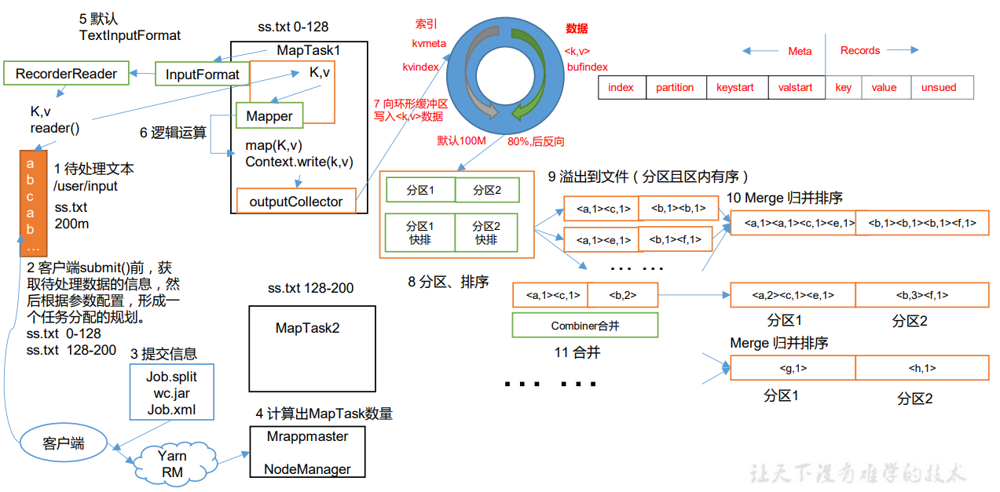

##### MapReduce详细工作流程2

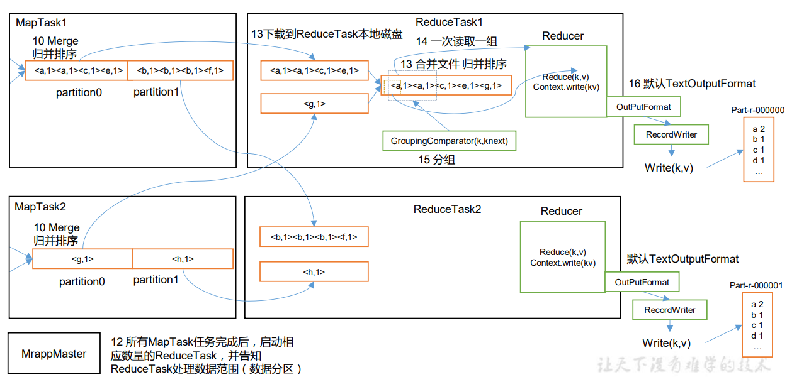

上面的流程是整个 MapReduce 最全工作流程，但是 Shuffle 过程只是从第 7 步开始到第 16 步结束，具体 Shuffle 过程详解，如下： 

1. MapTask 收集我们的 map()方法输出的 kv 对，放到内存缓冲区中 
2. 从内存缓冲区不断溢出本地磁盘文件，可能会溢出多个文件 
3. 多个溢出文件会被合并成大的溢出文件 
4. 在溢出过程及合并的过程中，都要调用 Partitioner 进行分区和针对 key 进行排序 
5. ReduceTask 根据自己的分区号，去各个 MapTask 机器上取相应的结果分区数据 
6. ReduceTask 会抓取到同一个分区的来自不同 MapTask 的结果文件，ReduceTask 会将这些文件再进行合并（归并排序） 
7. 合并成大文件后，Shuffle 的过程也就结束了，后面进入 ReduceTask 的逻辑运算过 程（从文件中取出一个一个的键值对 Group，调用用户自定义的 reduce()方法）

注意：

1. Shuffle 中的缓冲区大小会影响到 MapReduce 程序的执行效率，原则上说，缓冲区 越大，磁盘 io 的次数越少，执行速度就越快。 
2. 缓冲区的大小可以通过参数调整，参数：mapreduce.task.io.sort.mb 默认 100M。

#### Shuffle机制

##### Shuffle机制

Map方法之后，Reduce方法之前的数据处理过程称之为Shuffle

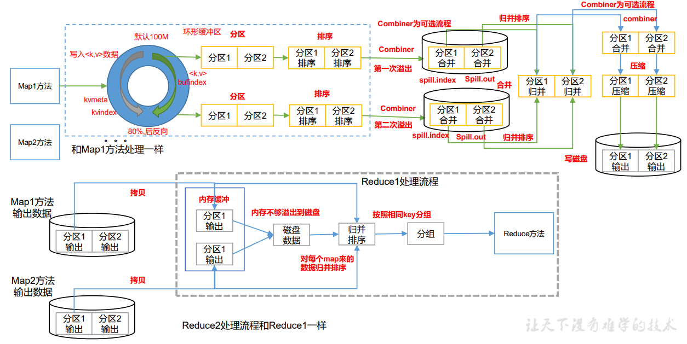

##### Partition分区

1. 问题引出

   要求将统计结果按照条件输出到不同文件中(分区)，比如将统计结果按照手机归属地不同省份输出到不同文件中

2. 默认Partition分区

   ```java
   public class HashPartitioner<K, V> extends Partitioner<K, V> {
   public int getPartition(K key, V value, int numReduceTasks) {
   return (key.hashCode() & Integer.MAX_VALUE) % numReduceTasks;
   }
   }
   ```

   默认分区是根据key的hashCode对ReduceTasks个数取模得到的，用户无法控制哪个key存储到哪个分区

3. 自定义partition步骤

   1. 自定义类继承Partitioner，重写getPartition方法

      ```java
      public class CustomPartitioner extends Partitioner<Text, FlowBean>{
              @Override
              public int getPartition(Text text, FlowBean flowBean, int numPartitions) {
                  //控制分区代码逻辑
                  return position;
              }
          }
      ```

   2. 在job驱动中，设置自定义Partitioner

      ```java
      job.setPartitionerClass(CustomPartitioner.class);
      ```

   3. 自定义Partitioner后，要根据自定义Partitioner的逻辑设置相应数量的ReduceTask

      ```java
      job.setNumReduceTasks(5);
      ```

   4. 分区总结 

      1. 如果ReduceTask的数量> getPartition的结果数，则会多产生几个空的输出文件part-r-000xx
      2. 如果`1<ReduceTask的数量<getPartition的结果数`，则有一部分分区数据无处安放，会Exception
      3. 如果ReduceTask=1，则不管MapTask端输出多少个分区文件，最终结果都交给这一个ReduceTask，最终也就只会产生一个结果文件part-r-0000
      4. 分区号必须从零开始，逐一累加

   5. 案例分析

      例如：假设自定义分区数为5，则

      1. job.setNumReduceTasks(1) 会正常运行，不过会产生一个输出文件
      2. job.setNumReduceTasks(2)会报错
      3. job.setNumReduceTasks(6)大于5，程序会正常运行，会产生空文件

##### 自定义分区案例

1. 需求

   将统计结果按照手机归属地不同省份输出到不同文件中(分区)

   1. 输入数据 phone_data.txt

   2. 期望输出数据

      手机号136、137、138、139开头都分别放到一个独立的4个文件中，其他开头的放到一个文件中

2. 需求分析

   1. 需求：将统计结果按照手机归属地不同省份输出到不同文件中(分区)

   2. | 数据输入    |      |       | 期望数据输出 |
      | ----------- | ---- | ----- | ------------ |
      | 13630577991 | 6960 | 690   | 文件1        |
      | 13736230513 | 2481 | 24681 | 文件2        |
      | 13846544121 | 264  | 0     | 文件3        |
      | 13956435636 | 132  | 1512  | 文件4        |
      | 13560439638 | 918  | 4938  | 文件5        |

   3. 增加一个ProvincePartioner分区

      136 分区0

      137 分区1

      138 分区2

      139 分区3

      其他 分区4

   4. Driver驱动类

      ```java
      //指定自定义数据分区
      job.setPartitionerClass(ProvincePartitioner.class);
      //同时指定相应数量的reduceTask
      job.setNumReduceTasks(5);
      ```
   
3. 在前面案例的基础上，增加一个分区类

   ```java
   public class ProvincePartitioner extends Partitioner<Text, FlowBean> {
       @Override
       public int getPartition(Text text, FlowBean flowBean, int numPartitions) {
           //text是手机号
           String phone = text.toString();
           String prePhone = phone.substring(0, 3);
           int partition;
           switch (prePhone) {
               case "136":
                   partition = 0;
                   break;
               case "137":
                   partition = 1;
                   break;
               case "138":
                   partition = 2;
                   break;
               case "139":
                   partition = 3;
                   break;
               default:
                   partition = 4;
                   break;
           }
           return partition;
       }
   }
   ```

   ```java
   public class FlowDriver {
       public static void main(String[] args) throws IOException, InterruptedException, ClassNotFoundException {
           //        1.获取job
           Configuration conf = new Configuration();
           Job job = Job.getInstance(conf);
   //        2.设置jar包路径
           job.setJarByClass(FlowDriver.class);
   //        3.关联mapper和reducer
           job.setMapperClass(FlowMapper.class);
           job.setReducerClass(FlowReducer.class);
   //        4.设置map输出的kv类型
           job.setMapOutputKeyClass(Text.class);
           job.setMapOutputValueClass(FlowBean.class);
   //        5.设置最终输出的kv类型
           job.setOutputKeyClass(Text.class);
           job.setOutputValueClass(FlowBean.class);
           
           job.setPartitionerClass(ProvincePartitioner.class);
           job.setNumReduceTasks(5);
           
   //        6.设置输入路径和输出路径
           FileInputFormat.setInputPaths(job, new Path("E:\\learnProject\\hadoopResources\\input2"));
           FileOutputFormat.setOutputPath(job, new Path("E:\\learnProject\\hadoopResources\\output3"));
   //        7.提交job
           boolean result = job.waitForCompletion(true);
           System.exit(result ? 0 : 1);
       }
   }
   ```

##### WritableComparable排序

排序概述

排序是MapReduce框架中最重要的操作之一

​	MapTask和ReduceTask均会对数据按照key进行排序，该操作属于Hadoop的默认行为，任何应用程序中的数据均会被排序，而不管逻辑上是否需要

默认排序是按照字典顺序排序，而且实现该排序的方法是快速排序

​	对于MapTask，它会将处理的结果暂时放到环形缓冲区中，当环形缓冲区使用率达到一定阈值后，再对缓冲区中的数据进行一次快速排序，并将这些有序数据溢写到磁盘上，而当数据处理完毕后，它会对磁盘上所有文件进行归并排序。

​	对于ReduceTask，它从每个MapTask上远程拷贝相应的数据文件，如果文件大 小超过一定阈值，则溢写磁盘上，否则存储在内存中。如果磁盘上文件数目达到 一定阈值，则进行一次归并排序以生成一个更大文件；如果内存中文件大小或者 数目超过一定阈值，则进行一次合并后将数据溢写到磁盘上。当所有数据拷贝完 毕后，ReduceTask统一对内存和磁盘上的所有数据进行一次归并排序。

排序分类

1. 部分排序

   MapReduce根据输入记录的键对数据集排序。保证输出的每个文件内部有序

2. 全排序

   最终输出结果只有一个文件，且文件内部有序。实现方式是只设置一个ReduceTask。但该方法在 处理大型文件时效率极低，因为一台机器处理所有文件，完全丧失了MapReduce所提供的并行架构。

3. 辅助排序 GroupingComparator分组

   在Reduce端对key进行分组。应用于：在接收的key为bean对象时，想让一个或几个字段相同（全部 字段比较不相同）的key进入到同一个reduce方法时，可以采用分组排序。

4. 二次排序

   在自定义排序过程中，如果compareTo中的判断条件为两个即为二次排序

自定义排序WritableComparable原理分析

​	bean 对象做为 key 传输，需要实现 WritableComparable 接口重写 compareTo 方法，就可 以实现排序。

```java
@Override
public int compareTo(FlowBean bean) {
int result;
// 按照总流量大小，倒序排列
if (this.sumFlow > bean.getSumFlow()) {
result = -1;
}else if (this.sumFlow < bean.getSumFlow()) {
result = 1;
}else {
result = 0;
}
return result;
}

```

##### WritableComparable 排序案例实操（全排序）

根据之前phone_data序列化产生的结果再次对总流量进行排序

1. 需求

   1. 输入数据

      原始数据phone_data.txt 第一次处理后的数据part-r-00000

   2. 期望输出数据

      13509468723 7335 110349 117684

      13736230513 2481 24681 27162

      13956435636 132 1512 1644

      13846544121 264 0 264

2. 需求分析

   1. 需求

   2. 输入数据

   3. 输出数据

   4. FlowBean实现WritableComparable接口重写CompareTo方法

      ```java
      @Override
      public int compareTo(FlowBean o){
          //倒序排列，按照总流量从大到小
          return this.sumFlow > o.getSumFlow()?-1:1;
      }
      ```

   5. Mapper类

      ```java
      context.write(bean,手机号)
      ```

   6. Reducer类

      ```java
      //循环输出，避免总流量相同情况
      for(Text text: value){
          context.write(text,key);
      }
      ```

3. 代码实现

   FlowBean改为

   ```java
   public class FlowBean implements WritableComparable<FlowBean> {
       private long upFlow; //上行流量
       private long downFlow;//下行流量
       private long sumFlow; //总流量
   
       //空参构造
       public FlowBean() {
       }
   
   
   
       public long getUpFlow() {
           return upFlow;
       }
   
       public void setUpFlow(long upFlow) {
           this.upFlow = upFlow;
       }
   
       public long getDownFlow() {
           return downFlow;
       }
   
       public void setDownFlow(long downFlow) {
           this.downFlow = downFlow;
       }
   
       public long getSumFlow() {
           return sumFlow;
       }
   
       public void setSumFlow(long sumFlow) {
           this.sumFlow = sumFlow;
       }
   
       public void setSumFlow() {
           this.sumFlow = this.upFlow + this.downFlow;
       }
   
       @Override
       public void write(DataOutput out) throws IOException {
           out.writeLong(upFlow);
           out.writeLong(downFlow);
           out.writeLong(sumFlow);
       }
   
       @Override
       public void readFields(DataInput in) throws IOException {
           this.upFlow = in.readLong();
           this.downFlow = in.readLong();
           this.sumFlow = in.readLong();
       }
   
       @Override
       public String toString() {
           return upFlow + "\t" + downFlow + "\t" + sumFlow;
       }
   
       @Override
       public int compareTo(FlowBean o) {
           //总流量的倒序排序
           return Long.compare(o.sumFlow, this.sumFlow);
       }
   }
   ```

   FlowMapper改为

   ```java
   public class FlowMapper extends Mapper<LongWritable, Text, FlowBean, Text> {
       private FlowBean outK = new FlowBean();
       private Text outV = new Text();
       @Override
       protected void map(LongWritable key, Text value, Mapper<LongWritable, Text, FlowBean, Text>.Context context) throws IOException, InterruptedException {
   
           //获取一行
           String line = value.toString();
           //切割
           String[] split = line.split("\t");
           //封装
           outV.set(split[0]);
           outK.setUpFlow(Long.parseLong(split[1]));
           outK.setDownFlow(Long.parseLong(split[2]));
           outK.setSumFlow();
           //写出
           context.write(outK,outV);
       }
   }
   ```

   FlowReducer改为

   ```java
   public class FlowReducer extends Reducer<FlowBean, Text,Text, FlowBean> {
       @Override
       protected void reduce(FlowBean key, Iterable<Text> values, Reducer<FlowBean, Text, Text, FlowBean>.Context context) throws IOException, InterruptedException {
           for (Text value : values) {
               context.write(value,key);
           }
       }
   }
   ```

   FlowDriver修改为

   ```java
   public class FlowDriver {
       public static void main(String[] args) throws IOException, InterruptedException, ClassNotFoundException {
           //        1.获取job
           Configuration conf = new Configuration();
           Job job = Job.getInstance(conf);
   //        2.设置jar包路径
           job.setJarByClass(FlowDriver.class);
   //        3.关联mapper和reducer
           job.setMapperClass(FlowMapper.class);
           job.setReducerClass(FlowReducer.class);
   //        4.设置map输出的kv类型
           job.setMapOutputKeyClass(FlowBean.class);
           job.setMapOutputValueClass(Text.class);
   //        5.设置最终输出的kv类型
           job.setOutputKeyClass(Text.class);
           job.setOutputValueClass(FlowBean.class);
   //        6.设置输入路径和输出路径
           FileInputFormat.setInputPaths(job, new Path("E:\\learnProject\\hadoopResources\\output2"));
           FileOutputFormat.setOutputPath(job, new Path("E:\\learnProject\\hadoopResources\\output5"));
   //        7.提交job
           boolean result = job.waitForCompletion(true);
           System.exit(result ? 0 : 1);
       }
   }
   ```

   注意这里输入的数据是序列化后输出的数据，注意把其他校验文件删除

   二次排序，只需要再把FlowBean的CompareTo方法修改为，即总流量相同，再按照上行流量排序

   ```java
   @Override
   public int compareTo(FlowBean o) {
       //总流量的倒序排序
       if (this.sumFlow > o.sumFlow) {
           return -1;
       }else if (this.sumFlow <o.sumFlow){
           return 1;
       }else {
           //按照上行流量的正序排
           return Long.compare(this.upFlow, o.upFlow);
       }
   }
   ```

##### WritableComparable排序案例实操(区内排序)

1. 需求

   要求每个省份手机号输出的文件按照总流量内部排序

2. 需求分析

   基于前一个需求，增加自定义分区类，分区按照省份手机号设置

   

3. 案例实操

   1. 复制上一个例子代码

   2. 自定义分区类

      ```java
      public class ProvincePartitioner2 extends Partitioner<FlowBean, Text> {
          @Override
          public int getPartition(FlowBean flowBean, Text text, int numPartitions) {
              String phone = text.toString();
              String prePhone = phone.substring(0, 3);
              int partition;
              switch (prePhone) {
                  case "136":
                      partition = 0;
                      break;
                  case "137":
                      partition = 1;
                      break;
                  case "138":
                      partition = 2;
                      break;
                  case "139":
                      partition = 3;
                      break;
                  default:
                      partition = 4;
                      break;
              }
              return partition;
          }
      }
      ```

   3. 修改Driver

      ```java
      public class FlowDriver {
          public static void main(String[] args) throws IOException, InterruptedException, ClassNotFoundException {
              //        1.获取job
              Configuration conf = new Configuration();
              Job job = Job.getInstance(conf);
      //        2.设置jar包路径
              job.setJarByClass(FlowDriver.class);
      //        3.关联mapper和reducer
              job.setMapperClass(FlowMapper.class);
              job.setReducerClass(FlowReducer.class);
      //        4.设置map输出的kv类型
              job.setMapOutputKeyClass(FlowBean.class);
              job.setMapOutputValueClass(Text.class);
      //        5.设置最终输出的kv类型
              job.setOutputKeyClass(Text.class);
              job.setOutputValueClass(FlowBean.class);
      
              job.setPartitionerClass(ProvincePartitioner2.class);
              job.setNumReduceTasks(5);
      //        6.设置输入路径和输出路径
              FileInputFormat.setInputPaths(job, new Path("E:\\learnProject\\hadoopResources\\output2"));
              FileOutputFormat.setOutputPath(job, new Path("E:\\learnProject\\hadoopResources\\output7"));
      //        7.提交job
              boolean result = job.waitForCompletion(true);
              System.exit(result ? 0 : 1);
          }
      }
      ```

##### Combiner合并

Combiner合并

1. Combiner是MR程序中Mapper和Reducer之外的一种组件。

2. Combiner组件的父类就是Reducer。 

3. Combiner和Reducer的区别在于运行的位置 Combiner是在每一个MapTask所在的节点运行; Reducer是接收全局所有Mapper的输出结果；

4. Combiner的意义就是对每一个MapTask的输出进行局部汇总，以减小网络传输量。 

5. Combiner能够应用的前提是不能影响最终的业务逻辑，而且，Combiner的输出kv 应该跟Reducer的输入kv类型要对应起来。

   ```
   Mapper
   3 5 7 ->(3+5+7)/3=5
   2 6 ->(2+6)/2=4
   Reducer
   (3+5+7+2+6)/5=23/5 不等于(5+4)/2=9/2
   ```

6. 自定义Combiner实现步骤

   1. 自定义一个Combiner继承Reducer，重写Reducer方法

      ```java
      public class WordCountCombiner extends Reducer<Text, IntWritable, Text,
      IntWritable> {
       private IntWritable outV = new IntWritable();
       @Override
       protected void reduce(Text key, Iterable<IntWritable> values, Context
      context) throws IOException, InterruptedException {
       int sum = 0;
       for (IntWritable value : values) {
       sum += value.get();
       }
      
       outV.set(sum);
      
       context.write(key,outV);
       }
      }
      ```

   2. 在job驱动类中设置

      ```java
      job.setCombinerClass(WordCountCombiner.class);
      ```

      

Combiner合并案例实操

1. 需求

   统计过程中对每一个MapTask的输出进行局部汇总，以减小网络传输了量即采用Combiner功能

   1. 数据输入 hello.txt
   2. 期望输出数据 期望Combine输入数据多，输出时经过合并，输出数据降低
   3. 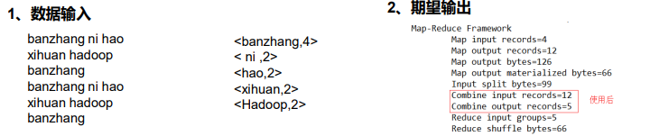

方案一

1. 增加一个WordconutCombiner类继承Reducer
2. 在WordcountCombiner中
   1. 统计单词汇总
   2. 将统计结果输出

方案二

1. 将WordcountReducer作为Combiner在WordcountDriver驱动类中指定
2. job.setCombinerClass(WordcountReducer.call);

方案一

1. 增加一个WordconutCombiner类继承Reducer

   ```java
   public class WordCountCombiner extends Reducer<Text, IntWritable,Text,IntWritable> {
       private IntWritable outV = new IntWritable();
       @Override
       protected void reduce(Text key, Iterable<IntWritable> values, Reducer<Text, IntWritable, Text, IntWritable>.Context context) throws IOException, InterruptedException {
           int sum = 0;
           for (IntWritable value : values) {
               sum+=value.get();
           }
           outV.set(sum);
           context.write(key,outV);
       }
   }
   ```

2. Driver修改为

   ```java
   public class WordCountDriver {
       public static void main(String[] args) throws IOException, InterruptedException, ClassNotFoundException {
   //        1.获取job
           Configuration conf = new Configuration();
           Job job = Job.getInstance(conf);
   //        2.设置jar包路径
           job.setJarByClass(WordCountDriver.class);
   //        3.关联mapper和reducer
           job.setMapperClass(WordCountMapper.class);
           job.setReducerClass(WordCountReducer.class);
   //        4.设置map输出的kv类型
           job.setMapOutputKeyClass(Text.class);
           job.setMapOutputValueClass(IntWritable.class);
   //        5.设置最终输出的kv类型
           job.setOutputKeyClass(Text.class);
           job.setOutputValueClass(IntWritable.class);
   
           //或者直接指定自己的Reducer也是一样的
           job.setCombinerClass(WordCountCombiner.class);
   //        6.设置输入路径和输出路径
           FileInputFormat.setInputPaths(job,new Path("E:\\learnProject\\hadoopResources\\input1"));
           FileOutputFormat.setOutputPath(job,new Path("E:\\learnProject\\hadoopResources\\output8"));
   //        7.提交job
           boolean result = job.waitForCompletion(true);
           System.exit(result?0:1);
       }
   }
   ```

#### OutputFormat数据输出

##### OutputFormat接口实现类

OutputFormat是MapReduce输出的基类，所有实现MapReduce输出都实现了 OutputFormat 接口

默认输出格式TextOutputFormat

自定义OutputFormat

1. 应用场景，比如输出数据到MySql/HBase/Elasticsearch等存储框架中
2. 自定义OutputFormat步骤
   - 自定义一个类继承FileOutputFormat
   - 改写RecordWriter，具体改写输出数据的方法write()

##### 自定义OutputFormat案例实操

1. 需求

   过滤输入的 log 日志，包含 atguigu 的网站输出到 e:/atguigu.log，不包含 atguigu 的网站输出到 e:/other.log。

2. 输入数据

   ```
   http://www.baidu.com
   http://www.google.com
   http://cn.bing.com
   http://www.atguigu.com
   http://www.sohu.com
   http://www.sina.com
   http://www.sin2a.com
   http://www.sin2desa.com
   http://www.sindsafa.com
   ```

3. 输出数据

   ```
   atguigu.log
   http://www.atguigu.com
   other.log
   http://cn.bing.com	http://www.baidu.com	http://www.google.com	http://www.sin2a.com	http://www.sin2desa.com	http://www.sina.com	http://www.sindsafa.com	http://www.sohu.com	
   ```

4. 自定义一个OutputFormat类

   1. 创建一个类LogRecordWriter继承RecordWriter
   2. 创建两个文件的输出流atguiguOut、otherOut
   3. 如果输入数据包含atguigu，输出到atguiguOut流，如果不包含atguigu，输出到otherOut流

5. 驱动类Driver

   要将自定义的输出格式组件设置到job中

   `job.setOutputFormatClass(LogOutputFormat.class);`

实操

LogMapper

```java
public class LogMapper extends Mapper<LongWritable, Text,Text, NullWritable> {
    @Override
    protected void map(LongWritable key, Text value, Mapper<LongWritable, Text, Text, NullWritable>.Context context) throws IOException, InterruptedException {
        //不做任何处理
        context.write(value,NullWritable.get());
    }
}
```

LogReducer

```java
public class LogReducer extends Reducer<Text, NullWritable,Text,NullWritable> {
    @Override
    protected void reduce(Text key, Iterable<NullWritable> values, Reducer<Text, NullWritable, Text, NullWritable>.Context context) throws IOException, InterruptedException {
        for (NullWritable value : values) {
            context.write(key,NullWritable.get());
        }
    }
}
```

LogOutputFormat

```java
public class LogOutputFormat extends FileOutputFormat<Text, NullWritable> {

    @Override
    public RecordWriter<Text, NullWritable> getRecordWriter(TaskAttemptContext job) throws IOException, InterruptedException {
        LogRecordWriter lrw = new LogRecordWriter(job);
        return lrw;
    }
}
```

LogRecordWriter

```java
public class LogRecordWriter extends RecordWriter<Text, NullWritable> {
    private FSDataOutputStream atguiguOut;
    private FSDataOutputStream otherOut;
    public LogRecordWriter(TaskAttemptContext job) {
        //创建两条流
        try {
            FileSystem fs = FileSystem.get(job.getConfiguration());
            atguiguOut = fs.create(new Path("E:\\learnProject\\hadoopResources\\atguigu.log"));
            otherOut = fs.create(new Path("E:\\learnProject\\hadoopResources\\other.log"));
        } catch (IOException e) {
            e.printStackTrace();
        }
    }

    @Override
    public void write(Text key, NullWritable value) throws IOException, InterruptedException {
        //具体写
        String log = key.toString();
        if (log.contains("atguigu")) {
            atguiguOut.writeBytes(log+"\t");
        }else {
            otherOut.writeBytes(log+"\t");
        }
    }

    @Override
    public void close(TaskAttemptContext context) throws IOException, InterruptedException {
        //关闭流
        IOUtils.closeStream(atguiguOut);
        IOUtils.closeStream(otherOut);
    }
}
```

LogDriver

```java
public class LogDriver {
    public static void main(String[] args) throws IOException,
            ClassNotFoundException, InterruptedException {
        Configuration conf = new Configuration();
        Job job = Job.getInstance(conf);
        job.setJarByClass(LogDriver.class);
        job.setMapperClass(LogMapper.class);
        job.setReducerClass(LogReducer.class);
        job.setMapOutputKeyClass(Text.class);
        job.setMapOutputValueClass(NullWritable.class);
        job.setOutputKeyClass(Text.class);
        job.setOutputValueClass(NullWritable.class);
        //设置自定义的 outputformat
        job.setOutputFormatClass(LogOutputFormat.class);
        FileInputFormat.setInputPaths(job, new Path("E:\\learnProject\\hadoopResources\\input3"));
        // 虽 然 我 们 自 定 义 了 outputformat ， 但 是 因 为 我 们 的 outputformat 继承自
//        fileoutputformat
        //而 fileoutputformat 要输出一个_SUCCESS 文件，所以在这还得指定一个输出目录
        FileOutputFormat.setOutputPath(job, new Path("E:\\learnProject\\hadoopResources\\output9"));
        boolean b = job.waitForCompletion(true);
        System.exit(b ? 0 : 1);
    }
}
```

#### MapReduce内核源码解析

##### MapTask工作机制

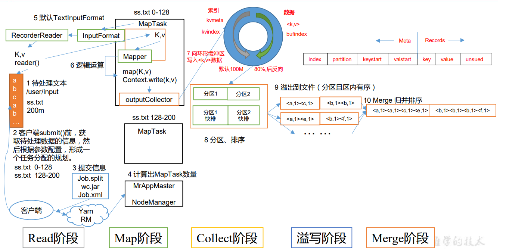

1. Read 阶段：MapTask 通过 InputFormat 获得的 RecordReader，从输入 InputSplit 中 解析出一个个 key/value。 

2. Map 阶段：该节点主要是将解析出的 key/value 交给用户编写 map()函数处理，并 产生一系列新的 key/value。 

3. Collect 收集阶段：在用户编写 map()函数中，当数据处理完成后，一般会调用 OutputCollector.collect()输出结果。在该函数内部，它会将生成的 key/value 分区（调用 Partitioner），并写入一个环形内存缓冲区中。 

4. Spill 阶段：即“溢写”，当环形缓冲区满后，MapReduce 会将数据写到本地磁盘上， 生成一个临时文件。需要注意的是，将数据写入本地磁盘之前，先要对数据进行一次本地排序，并在必要时对数据进行合并、压缩等操作。

   溢写阶段详情：

   1. 利用快速排序算法对缓存区内的数据进行排序，排序方式是，先按照分区编号 Partition 进行排序，然后按照 key 进行排序。这样，经过排序后，数据以分区为单位聚集在 一起，且同一分区内所有数据按照 key 有序。 
   2. 按照分区编号由小到大依次将每个分区中的数据写入任务工作目录下的临时文 件 output/spillN.out（N 表示当前溢写次数）中。如果用户设置了 Combiner，则写入文件之 前，对每个分区中的数据进行一次聚集操作。 
   3. 将分区数据的元信息写到内存索引数据结构 SpillRecord 中，其中每个分区的元 信息包括在临时文件中的偏移量、压缩前数据大小和压缩后数据大小。如果当前内存索引大 小超过 1MB，则将内存索引写到文件 output/spillN.out.index 中

5. Merge 阶段：当所有数据处理完成后，MapTask 对所有临时文件进行一次合并， 以确保最终只会生成一个数据文件


​	当所有数据处理完后，MapTask 会将所有临时文件合并成一个大文件，并保存到文件 output/file.out 中，同时生成相应的索引文件 output/file.out.index。

​	 在进行文件合并过程中，MapTask 以分区为单位进行合并。对于某个分区，它将采用多 轮递归合并的方式。每轮合并 mapreduce.task.io.sort.factor（默认 10）个文件，并将产生的文 件重新加入待合并列表中，对文件排序后，重复以上过程，直到最终得到一个大文件。 

​	让每个 MapTask 最终只生成一个数据文件，可避免同时打开大量文件和同时读取大量 小文件产生的随机读取带来的开销。

##### ReduceTask工作机制

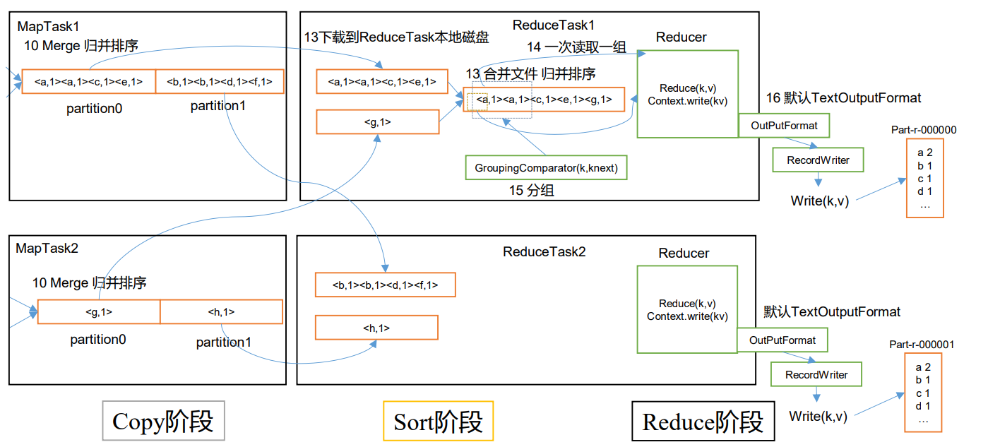

1. Copy 阶段：ReduceTask 从各个 MapTask 上远程拷贝一片数据，并针对某一片数 据，如果其大小超过一定阈值，则写到磁盘上，否则直接放到内存中。 
2. Sort 阶段：在远程拷贝数据的同时，ReduceTask 启动了两个后台线程对内存和磁 盘上的文件进行合并，以防止内存使用过多或磁盘上文件过多。按照 MapReduce 语义，用 户编写 reduce()函数输入数据是按 key 进行聚集的一组数据。为了将 key 相同的数据聚在一 起，Hadoop 采用了基于排序的策略。由于各个 MapTask 已经实现对自己的处理结果进行了 局部排序，因此，ReduceTask 只需对所有数据进行一次归并排序即可。 
3. Reduce 阶段：reduce()函数将计算结果写到 HDFS 上。

##### ReduceTask并行度决定机制

回顾：MapTask 并行度由切片个数决定，切片个数由输入文件和切片规则决定。 

思考：ReduceTask 并行度由谁决定？ 

1. 设置 ReduceTask 并行度（个数） ReduceTask 的并行度同样影响整个 Job 的执行并发度和执行效率，但与 MapTask 的并 发数由切片数决定不同，ReduceTask 数量的决定是可以直接手动设置： 

   // 默认值是 1，手动设置为 4 job.setNumReduceTasks(4);

2. 实验：测试 ReduceTask 多少合适 

   1. 实验环境：1 个 Master 节点，16 个 Slave 节点：CPU:8GHZ，内存: 2G 

   2. 实验结论：

      改变ReduceTask(数据量为1GB)

      MapTask=16

      | ReduceTask | 1    | 5    | 10   | 15   | 16   | 20   | 25   | 30   | 45   | 60   |
      | ---------- | ---- | ---- | ---- | ---- | ---- | ---- | ---- | ---- | ---- | ---- |
      | 总时间     | 892  | 146  | 110  | 92   | 88   | 100  | 128  | 101  | 145  | 104  |

   3. 注意

      1. ReduceTask=0，表示没有Reduce阶段，输出文件个数和Map个数一致。
      2. ReduceTask默认值就是1，所以输出文件个数为一个。 
      3. 如果数据分布不均匀，就有可能在Reduce阶段产生数据倾斜 
      4. ReduceTask数量并不是任意设置，还要考虑业务逻辑需求，有些情况下，需要计算全 局汇总结果，就只能有1个ReduceTask。 
      5. 具体多少个ReduceTask，需要根据集群性能而定。 
      6. 如果分区数不是1，但是ReduceTask为1，是否执行分区过程。答案是：不执行分区过 程。因为在MapTask的源码中，执行分区的前提是先判断ReduceNum个数是否大于1。不大于1 肯定不执行

##### MapTask&ReduceTask源码解析

MapTask 源码解析流程

```
=================== MapTask ===================
context.write(k, NullWritable.get()); //自定义的 map 方法的写出，进入
	output.write(key, value);
		//MapTask727 行，收集方法，进入两次
		collector.collect(key, value,partitioner.getPartition(key, value, partitions));
			HashPartitioner(); //默认分区器
		collect() //MapTask1082 行 map 端所有的 kv 全部写出后会走下面的 close 方法
			close() //MapTask732 行
				collector.flush() // 溢出刷写方法，MapTask735 行，提前打个断点，进入
					sortAndSpill() //溢写排序，MapTask1505 行，进入
						sorter.sort() QuickSort //溢写排序方法，MapTask1625 行，进入
					mergeParts(); //合并文件，MapTask1527 行，进入
				collector.close(); //MapTask739 行,收集器关闭,即将进入 ReduceTask
```

ReduceTask 源码解析流程

```
=================== ReduceTask ===================
if (isMapOrReduce()) //reduceTask324 行，提前打断点
initialize() // reduceTask333 行,进入
init(shuffleContext); // reduceTask375 行,走到这需要先给下面的打断点
 	totalMaps = job.getNumMapTasks(); // ShuffleSchedulerImpl 第 120 行，提前打断点
 	merger = createMergeManager(context); //合并方法，Shuffle 第 80 行
		// MergeManagerImpl 第 232 235 行，提前打断点
		this.inMemoryMerger = createInMemoryMerger(); //内存合并
		this.onDiskMerger = new OnDiskMerger(this); //磁盘合并
rIter = shuffleConsumerPlugin.run();
	eventFetcher.start(); //开始抓取数据，Shuffle 第 107 行，提前打断点
	eventFetcher.shutDown(); //抓取结束，Shuffle 第 141 行，提前打断点
	copyPhase.complete(); //copy 阶段完成，Shuffle 第 151 行
	taskStatus.setPhase(TaskStatus.Phase.SORT); //开始排序阶段，Shuffle 第 152 行
sortPhase.complete(); //排序阶段完成，即将进入 reduce 阶段 reduceTask382 行
reduce(); //reduce 阶段调用的就是我们自定义的 reduce 方法，会被调用多次
cleanup(context); //reduce 完成之前，会最后调用一次 Reducer 里面的 cleanup 方法
```

#### Join应用

##### Reduce Join

​	Map 端的主要工作：为来自不同表或文件的 key/value 对，打标签以区别不同来源的记 录。然后用连接字段作为 key，其余部分和新加的标志作为 value，最后进行输出。 	Reduce 端的主要工作：在 Reduce 端以连接字段作为 key 的分组已经完成，我们只需要 在每一个分组当中将那些来源于不同文件的记录（在 Map 阶段已经打标志）分开，最后进行合并就ok了

##### Reduce Join案例实操

需求order.txt pd.txt将商品信息表中的数据根据商品pid合并到订单数据表中

通过将关联条件作为 Map 输出的 key，将两表满足 Join 条件的数据并携带数据所来源 的文件信息，发往同一个 ReduceTask，在 Reduce 中进行数据的串联

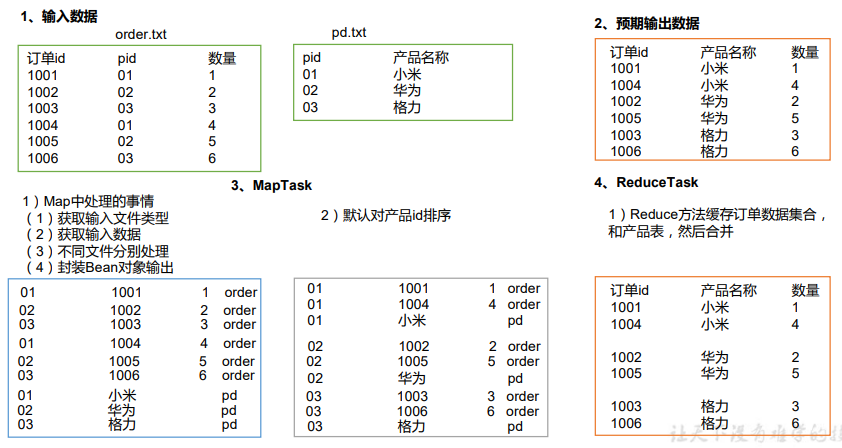

order

```
1001	01	1
1002	02	2
1003	03	3
1004	01	4
1005	02	5
1006	03	6
```

pd

```
01	小米
02	华为
03	格力

```


TableBean

```java
public class TableBean implements Writable {
    private String id; //订单id
    private String pid; //商品id
    private int amount; //商品数量
    private String pname;//商品名称
    private String flag;//标记是什么表 order pd

    public TableBean() {
    }

    public String getId() {
        return id;
    }

    public void setId(String id) {
        this.id = id;
    }

    public String getPid() {
        return pid;
    }

    public void setPid(String pid) {
        this.pid = pid;
    }

    public int getAmount() {
        return amount;
    }

    public void setAmount(int amount) {
        this.amount = amount;
    }

    public String getPname() {
        return pname;
    }

    public void setPname(String pname) {
        this.pname = pname;
    }

    public String getFlag() {
        return flag;
    }

    public void setFlag(String flag) {
        this.flag = flag;
    }

    @Override
    public void write(DataOutput out) throws IOException {
        out.writeUTF(id);
        out.writeUTF(pid);
        out.writeInt(amount);
        out.writeUTF(pname);
        out.writeUTF(flag);
    }

    @Override
    public void readFields(DataInput in) throws IOException {
        this.id = in.readUTF();
        this.pid = in.readUTF();
        this.amount = in.readInt();
        this.pname = in.readUTF();
        this.flag = in.readUTF();
    }

    @Override
    public String toString() {
        return id + "\t" + pname + "\t" + amount;
    }
}
```

TableMapper

```java
public class TableMapper extends Mapper<LongWritable, Text, Text, TableBean> {

    private String fileName;
    private Text outK = new Text();
    private TableBean outV = new TableBean();

    @Override
    protected void setup(Mapper<LongWritable, Text, Text, TableBean>.Context context) throws IOException, InterruptedException {
        //初始化order pd
        FileSplit split = (FileSplit) context.getInputSplit();
        fileName = split.getPath().getName();
    }

    @Override
    protected void map(LongWritable key, Text value, Mapper<LongWritable, Text, Text, TableBean>.Context context) throws IOException, InterruptedException {
        //获取一行
        String line = value.toString();
        //判断是哪个文件的
        if (fileName.contains("order")) {
            //处理的时订单表
            String[] split = line.split("\t");
            //封装k v
            outK.set(split[1]);
            outV.setId(split[0]);
            outV.setPid(split[1]);
            outV.setAmount(Integer.parseInt(split[2]));
            outV.setPname("");
            outV.setFlag("order");
        } else {
            //处理的是商品表
            String[] split = line.split("\t");
            //封装k v
            outK.set(split[0]);
            outV.setId("");
            outV.setPid(split[0]);
            outV.setAmount(0);
            outV.setPname(split[1]);
            outV.setFlag("pd");
        }
        //写出
        context.write(outK, outV);
    }
}
```

RableReducer

```java
public class TableReducer extends Reducer<Text, TableBean, TableBean,
        NullWritable> {
    @Override
    protected void reduce(Text key, Iterable<TableBean> values, Context
            context) throws IOException, InterruptedException {
        ArrayList<TableBean> orderBeans = new ArrayList<>();
        TableBean pdBean = new TableBean();
        for (TableBean value : values) {
            //判断数据来自哪个表
            if ("order".equals(value.getFlag())) { //订单表
                //创建一个临时 TableBean 对象接收 value
                TableBean tmpOrderBean = new TableBean();
                try {
                    BeanUtils.copyProperties(tmpOrderBean, value);
                } catch (IllegalAccessException | InvocationTargetException e) {
                    e.printStackTrace();
                }
                //将临时 TableBean 对象添加到集合 orderBeans
                orderBeans.add(tmpOrderBean);
            } else { //商品表
                try {
                    BeanUtils.copyProperties(pdBean, value);
                } catch (IllegalAccessException | InvocationTargetException e) {
                    e.printStackTrace();
                }
            }
        }
        //遍历集合 orderBeans,替换掉每个 orderBean 的 pid 为 pname,然后写出
        for (TableBean orderBean : orderBeans) {
            orderBean.setPname(pdBean.getPname());
            //写出修改后的 orderBean 对象
            context.write(orderBean, NullWritable.get());
        }
    }
}
```

TableDriver

```java
public class TableDriver {
    public static void main(String[] args) throws IOException, ClassNotFoundException, InterruptedException {
        Job job = Job.getInstance(new Configuration());
        job.setJarByClass(TableDriver.class);
        job.setMapperClass(TableMapper.class);
        job.setReducerClass(TableReducer.class);
        job.setMapOutputKeyClass(Text.class);
        job.setMapOutputValueClass(TableBean.class);
        job.setOutputKeyClass(TableBean.class);
        job.setOutputValueClass(NullWritable.class);
        FileInputFormat.setInputPaths(job, new Path("E:\\learnProject\\hadoopResources\\input4"));
        FileOutputFormat.setOutputPath(job, new Path("E:\\learnProject\\hadoopResources\\output10"));
        boolean b = job.waitForCompletion(true);
        System.exit(b ? 0 : 1);
    }
}
```

缺点：这种方式中，合并的操作是在 Reduce 阶段完成，Reduce 端的处理压力太大，Map 节点的运算负载则很低，资源利用率不高，且在 Reduce 阶段极易产生数据倾斜。

##### Map Join

1. 使用场景 Map Join 适用于一张表十分小、一张表很大的场景。

2. 优点 在 Reduce 端处理过多的表，非常容易产生数据倾斜。怎么办？ 在 Map 端缓存多张表，提前处理业务逻辑，这样增加 Map 端业务，减少 Reduce 端数 据的压力，尽可能的减少数据倾斜。 

3. 具体办法：采用 DistributedCache

   1. 在 Mapper 的 setup 阶段，将文件读取到缓存集合中。 

   2. 在 Driver 驱动类中加载缓存。

      ```
      //缓存普通文件到 Task 运行节点。
      job.addCacheFile(new URI("file:///E:/learnProject/hadoopResources/cache/pd.txt"));
      //如果是集群运行,需要设置 HDFS 路径
      job.addCacheFile(new URI("hdfs://hadoop102:8020/cache/pd.txt"));
      ```

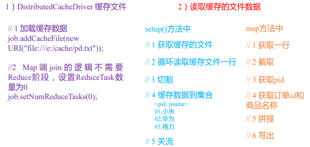

1.先在 MapJoinDriver 驱动类中添加缓存文件

```java
public class MapJoinDriver {
    public static void main(String[] args) throws IOException,
            URISyntaxException, ClassNotFoundException, InterruptedException {
        // 1 获取 job 信息
        Configuration conf = new Configuration();
        Job job = Job.getInstance(conf);
        // 2 设置加载 jar 包路径
        job.setJarByClass(MapJoinDriver.class);
        // 3 关联 mapper
        job.setMapperClass(MapJoinMapper.class);
        // 4 设置 Map 输出 KV 类型
        job.setMapOutputKeyClass(Text.class);
        job.setMapOutputValueClass(NullWritable.class);
        // 5 设置最终输出 KV 类型
        job.setOutputKeyClass(Text.class);
        job.setOutputValueClass(NullWritable.class);
        // 加载缓存数据
        job.addCacheFile(new URI("file:///E:/learnProject/hadoopResources/cache/pd.txt"));
        // Map 端 Join 的逻辑不需要 Reduce 阶段，设置 reduceTask 数量为 0
        job.setNumReduceTasks(0);
        // 6 设置输入输出路径
        FileInputFormat.setInputPaths(job, new Path("E:\\learnProject\\hadoopResources\\input5"));
        FileOutputFormat.setOutputPath(job, new Path("E:\\learnProject\\hadoopResources\\output11"));
        // 7 提交
        boolean b = job.waitForCompletion(true);
        System.exit(b ? 0 : 1);

    }
}
```

2.在 MapJoinMapper 类中的 setup 方法中读取缓存文件

```java
public class MapJoinMapper extends Mapper<LongWritable, Text, Text, NullWritable> {
    private Map<String, String> pdMap = new HashMap<>();
    private Text text = new Text();

    //任务开始前将 pd 数据缓存进 pdMap
    @Override
    protected void setup(Context context) throws IOException,
            InterruptedException {
        //通过缓存文件得到小表数据 pd.txt
        URI[] cacheFiles = context.getCacheFiles();
        Path path = new Path(cacheFiles[0]);
        //获取文件系统对象,并开流
        FileSystem fs = FileSystem.get(context.getConfiguration());
        FSDataInputStream fis = fs.open(path);
        //通过包装流转换为 reader,方便按行读取
        BufferedReader reader = new BufferedReader(new
                InputStreamReader(fis, "UTF-8"));
        //逐行读取，按行处理
        String line;
        while (StringUtils.isNotEmpty(line = reader.readLine())) {
            //切割一行
//01 小米
            String[] split = line.split("\t");
            pdMap.put(split[0], split[1]);
        }
        //关流
        IOUtils.closeStream(reader);
    }

    @Override
    protected void map(LongWritable key, Text value, Context context)
            throws IOException, InterruptedException {
        //读取大表数据
//1001 01 1
        String[] fields = value.toString().split("\t");
        //通过大表每行数据的 pid,去 pdMap 里面取出 pname
        String pname = pdMap.get(fields[1]);
        //将大表每行数据的 pid 替换为 pname
        text.set(fields[0] + "\t" + pname + "\t" + fields[2]);
        //写出
        context.write(text, NullWritable.get());
    }
}
```

#### 数据清洗ETL

“ETL，是英文 Extract-Transform-Load 的缩写，用来描述将数据从来源端经过抽取 （Extract）、转换（Transform）、加载（Load）至目的端的过程。ETL 一词较常用在数据仓 库，但其对象并不限于数据仓库 

在运行核心业务 MapReduce 程序之前，往往要先对数据进行清洗，清理掉不符合用户 要求的数据。清理的过程往往只需要运行 Mapper 程序，不需要运行 Reduce 程序。

##### 需求

去除日志中字段个数小于等于11的日志

输入数据web.log

期望输出数据，每行字段长度都大于11

##### 实现代码

WebLogMapper类

```java
public class WebLogMapper extends Mapper<LongWritable, Text, Text,
        NullWritable> {
    @Override
    protected void map(LongWritable key, Text value, Context context)
            throws IOException, InterruptedException {
// 1 获取 1 行数据
        String line = value.toString();
// 2 解析日志
        boolean result = parseLog(line, context);
// 3 日志不合法退出
        if (!result) {
            return;
        }
// 4 日志合法就直接写出
        context.write(value, NullWritable.get());
    }

    // 2 封装解析日志的方法
    private boolean parseLog(String line, Context context) {
// 1 截取
        String[] fields = line.split(" ");
// 2 日志长度大于 11 的为合法
        if (fields.length > 11) {
            return true;
        } else {
            return false;
        }
    }
}
```

WbLogDriver类

```java
public class WebLogDriver {
    public static void main(String[] args) throws Exception {
// 输入输出路径需要根据自己电脑上实际的输入输出路径设置
        args = new String[]{"E:\\learnProject\\hadoopResources\\input6", "E:\\learnProject\\hadoopResources\\output12"};
// 1 获取 job 信息
        Configuration conf = new Configuration();
        Job job = Job.getInstance(conf);
// 2 加载 jar 包
        job.setJarByClass(LogDriver.class);
// 3 关联 map
        job.setMapperClass(WebLogMapper.class);
// 4 设置最终输出类型
        job.setOutputKeyClass(Text.class);
        job.setOutputValueClass(NullWritable.class);
// 设置 reducetask 个数为 0
        job.setNumReduceTasks(0);
// 5 设置输入和输出路径
        FileInputFormat.setInputPaths(job, new Path(args[0]));
        FileOutputFormat.setOutputPath(job, new Path(args[1]));
// 6 提交
        boolean b = job.waitForCompletion(true);
        System.exit(b ? 0 : 1);
    }
}
```

#### MapReduce开发总结

1. 输入数据接口：InputFormat

   1. 默认使用的实现类是：TextInputFormat
   2. TextInputFormat 的功能逻辑是：一次读一行文本，然后将该行的起始偏移量作为 key，行内容作为 value 返回
   3. CombineTextInputFormat 可以把多个小文件合并成一个切片处理，提高处理效率

2. 逻辑处理接口：Mapper 

   用户根据业务需求实现其中三个方法：map() setup() cleanup ()

3. Partitioner 分区

   1. 有默认实现 HashPartitioner，逻辑是根据 key 的哈希值和 numReduces 来返回一个 分区号；key.hashCode()&Integer.MAXVALUE % numReduces
   2. 如果业务上有特别的需求，可以自定义分区

4. Comparable 排序

   1. 当我们用自定义的对象作为 key 来输出时，就必须要实现 WritableComparable 接 口，重写其中的 compareTo()方法
   2. 部分排序：对最终输出的每一个文件进行内部排序
   3. 全排序：对所有数据进行排序，通常只有一个 Reduce
   4. 二次排序：排序的条件有两个

5. Combiner 合并

   1. Combiner 合并可以提高程序执行效率，减少IO传输。但是使用时必须不能影响原有的业务处理结果

6. 逻辑处理接口：Reducer

   1. 用户根据业务需求实现其中三个方法：reduce() setup() cleanup ()

7. 输出数据接口：OutputFormat

   1. 默认实现类是 TextOutputFormat，功能逻辑是：将每一个 KV 对，向目标文本文件 输出一行
   2. 用户还可以自定义 OutputFormat

### 4. Hadoop数据压缩

#### 概述

##### 压缩的优点和缺点

压缩的优点：以减少磁盘 IO、减少磁盘存储空间。 

压缩的缺点：增加 CPU 开销。

##### 压缩原则

运算密集型的 Job，少用压缩 

IO 密集型的 Job，多用压缩

#### MR支持的压缩编码

压缩算法对比

| 压缩格式 | Hadoop 自带？ | 算法    | 文件扩展 名 | 是否可 切片 | 换成压缩格式后，原来的 程序是否需要修改 |
| -------- | ------------- | ------- | ----------- | ----------- | --------------------------------------- |
| DEFLATE  | 是，直接使用  | DEFLATE | .deflate    | 否          | 和文本处理一样，不需要 修改             |
| Gzip     | 是，直接使用  | DEFLATE | .gz         | 否          | 和文本处理一样，不需要 修改             |
| bzip2    | 是，直接使用  | bzip2   | .bz2        | 是          | 和文本处理一样，不需要 修改             |
| LZO      | 否，需要安装  | LZO     | .lzo        | 是          | 需要建索引，还需要指定 输入格式         |
| Snappy   | 是，直接使用  | Snappy  | .snappy     | 否          | 和文本处理一样，不需要 修改             |

压缩性能比较

| 压缩算法 | 原始文件大小 | 压缩文件大小 | 压缩速度 | 解压速度 |
| -------- | ------------ | ------------ | -------- | -------- |
| gzip     | 8.3GB        | 1.8GB        | 17.5MB/s | 58MB/s   |
| bzip     | 8.3GB        | 1.1GB        | 2.4MB/s  | 9.5MB/s  |
| LZO      | 8.3GB        | 2.9GB        | 49.3MB/s | 74.6MB/s |

http://google.github.io/snappy/

Snappy is a compression/decompression library. It does not aim for maximum compression, or compatibility with any other compression library; instead, it aims for very high speeds and reasonable compression. For instance, compared to the fastest mode of zlib, Snappy is an order of magnitude faster for most inputs, but the resulting compressed files are anywhere from 20% to 100% bigger.On a single core of a Core i7 processor in 64-bit mode, Snappy compresses at about 250 MB/sec or more and decompresses at about 500 MB/sec or more

#### 压缩方式选择

压缩方式选择时重点考虑：压缩/解压缩速度、压缩率（压缩后存储大小）、压缩后是否 可以支持切片

##### Gzip压缩

优点：压缩率比较高；

 缺点：不支持 Split；压缩/解压速度一般；

##### Bzip2压缩

优点：压缩率高；支持 Split； 

缺点：压缩/解压速度慢

##### LZO压缩

优点：压缩/解压速度比较快；支持 Split； 

缺点：压缩率一般；想支持切片需要额外创建索引。

##### Snappy压缩

优点：压缩和解压缩速度快； 

缺点：不支持 Split；压缩率一般

##### 压缩位置选择

压缩可以在 MapReduce 作用的任意阶段启用

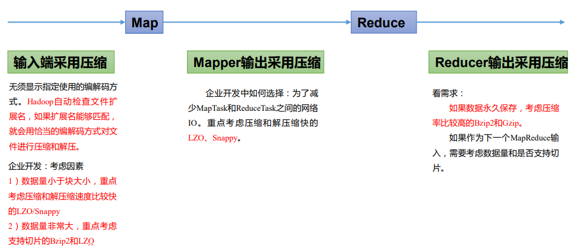

#### 压缩参数配置

为了支持多种压缩/解压缩算法，Hadoop 引入了编码/解码器

| 压缩格式 | 对应的编码/解码器                          |
| -------- | ------------------------------------------ |
| DEFLATE  | org.apache.hadoop.io.compress.DefaultCodec |
| gzip     | org.apache.hadoop.io.compress.GzipCodec    |
| bzip2    | org.apache.hadoop.io.compress.BZip2Codec   |
| LZO      | com.hadoop.compression.lzo.LzopCodec       |
| Snappy   | org.apache.hadoop.io.compress.SnappyCodec  |

要在 Hadoop 中启用压缩，可以配置如下参数

| 参数                                                         | 默认值                                           | 阶段         | 建议                                               |
| ------------------------------------------------------------ | ------------------------------------------------ | ------------ | -------------------------------------------------- |
| io.compression.codecs （在 core-site.xml 中配置）            | 无，这个需要在命令行输入 hadoop checknative 查看 | 输入压缩     | Hadoop 使用文件扩展 名判断是否支持某种 编解码器    |
| mapreduce.map.output.compr ess（在 mapred-site.xml 中 配置） | false                                            | mapper 输出  | 这个参数设为 true 启 用压缩                        |
| mapreduce.map.output.compr ess.codec（在 mapredsite.xml 中配置） | org.apache.hadoop.io.com press.DefaultCodec      | mapper 输出  | 企业多使用 LZO 或 Snappy 编解码器在此 阶段压缩数据 |
| mapreduce.output.fileoutpu tformat.compress（在 mapred-site.xml 中配置） | false                                            | reducer 输出 | 这个参数设为 true 启 用压缩                        |
| mapreduce.output.fileoutpu tformat.compress.codec（在 mapred-site.xml 中配置） | org.apache.hadoop.io.com press.DefaultCodec      | reducer 输出 | 使用标准工具或者编 解码器，如 gzip 和 bzip2        |

#### 实操

即使你的 MapReduce 的输入输出文件都是未压缩的文件，你仍然可以对 Map 任务的中 间结果输出做压缩，因为它要写在硬盘并且通过网络传输到 Reduce 节点，对其压缩可以提 高很多性能，这些工作只要设置两个属性即可

这里Hadoop源码支持BZip2Codec、DefaultCodec

Mapper输出端压缩

初始的wordcount案例Driver添加代码

```java
// 开启 map 端输出压缩
conf.setBoolean("mapreduce.map.output.compress", true);
// 设置 map 端输出压缩方式
conf.setClass("mapreduce.map.output.compress.codec",
BZip2Codec.class,CompressionCodec.class);
```

Reduce输出端采用压缩

```java
// 设置 reduce 端输出压缩开启
FileOutputFormat.setCompressOutput(job, true);
// 设置压缩的方式
 FileOutputFormat.setOutputCompressorClass(job, BZip2Codec.class);
```

## 5. YARN

