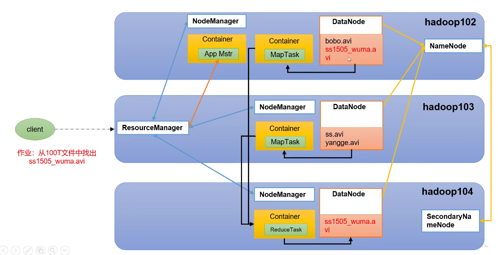

# Hadoop

## 课程基础

javase + maven +idea +linux基本命令

## 1. 概述

### 大数据的概念

​	大数据是指无法在一定时间范围内用常规软件工具进行捕获、管理和处理的数据集合，是需要新处理模式才能具有更强的决策力、洞察发现和流程优化能力的海量、高增长率和多样化的信息资产

​	大数据主要解决海量数据的采集、存储和分析计算问题

​	按顺序给出数据存储单位 bit、Byte、KB、MB、GB、**TB**、**PB**、**EB**、ZB、YB、BB、NB、DB

​	1Byte = 8bit 1K = 1024Byte 1MB=1024K 1G =1024M

### 大数据的特点(4V)

#### Volume 大量

​	截至目前，人类所生产的所有印刷材料的数据量是200PB，而历史上全人类总共说过的话数据量大约是5EB，当前，典型个人计算机硬盘的容量为TB量级，而一些大企业的数据量已经解决EB量级

#### Velocity 高速

​	这是大数据区分于传统数据挖掘最显著特征，根据IDC的数字宇宙的报告，预计到2025年，全球数据使用量将达到163ZB，在海量的数据面前，处理数据的效率非常重要。

#### Variety 多样

​	数据的类型分为结构化数据和非结构化数据，相对于以数据库/文本为主的结构化数据，非结构化数据越来越多，包括网络日志、音频、视频、图片、地理位置信息等，这些多类型的数据对数据的处理能力提出了更高的要求

#### Value 低价值密度

​	价值密度的高低与数据总量的大小成反比，从海量的数据中对有效数据进行提取

### 大数据的应用场景

1. 短视频，视频推荐

2. 电商广告推荐，推荐用户喜欢的商品

3. 零售，分析用户消费习惯 ，判断用户购买商品的关联性

4. 物流仓储
5. 保险，海量数据挖掘，风险预测
6. 金融，多维度体现用户特征，防范欺诈
7. 房产，精准投资和营销
8. 人工智能 5G 物联网 虚拟与现实

### 大数据的发展前景

1. 十九大 推动互联网 互联网 人工智能 实体经济深度融合
2. 2020 34万亿 新基建
3. 下一个风口 2020 5G设备 每秒钟10G的数据
4. 人才紧缺，竞争压力小

### 大数据部门间业务流程分析

产品人员提需求

数据部门搭建数据平台、分析数据指标

数据可视化

### 大数据部门内组织结构


## 2. Hadoop入门


### 1. 概念

#### Hadoop是什么

1. Hadoop是一个由Apache基金会所开发的**分布式系统基础架构**

2. 主要解决海量数据的存储和海量数据的分析计算问题

3. 广义上来说Hadoop通常指一个更广泛的概念Hadoop生态圈


Hive干掉Pig

#### Hadoop发展历史

1. Hadoop创始人Doug Cutting，为了实现与Google类似的全文搜索功能，在Lucene框架基础上进行优化升级，查询引擎和索引引擎

2. 2001年底Lucene称为Apache基金会的一个子项目

3. 对于海量数据的场景，Lucene框架面对与Google同样的困难，存储海量数据困难，检索海量数据速度慢

4. 学习和模仿Google解决这些问题的防范：微型版Nutch

5. Google在大数据方面的三篇论文
   - **GFS --> HDFS**
   - **Map-Reduce --> MR**
   - **BigTable --> HBase**
6. 2003-2004年，Google公开了部分GFS和MapReduce思想的细节，以此为基础Foug Cutting等人用了2年业余时间实现了DFS和MapReduce机制，使Nutch性能飙升
7. 2005年Hadoop作为Lucene的子项目Nutch的一部分正式引入Apache基金会
8. 2006年3月份，Map-Reduce和Nutch Distributed File System(NDFS)分别被纳入到Hadoop项目中，Hadoop正式诞生，标志着大数据时代到来

#### Hadoop三大发行版本

Apache、Cloudera、Hortonworks

Apache版本最原始最基础版本，入门 2006

Cloudera内部集成了很多大数据框架，对应产品CDH

Hortonworks文档较好，对应产品HDP 2011

Hortonworks现在已经被Cloudera公司收购，推出新的品牌CDP

##### Apache Hadoop

http://hadoop.apache.org/

https://hadoop.apache.org/releases.html

##### Cloudera Hadoop

https://cn.cloudera.com/products/open-source/apache-hadoop.html

2009年Hadoop创始人Doug Cutting加盟Cloudera公司

CDH为Cloudera的Hadoop发行版，完全开源，节点收费

##### Hortonworks Hadoop

HDP包括了Ambarl，开源安装和管理系统

#### Hadoop优势(4高)

1. 高可靠性
   - Hadoop底层维护多个数据副本，所以即使Hadoop某个计算元素或存储出现故障，也不会导致数据的丢失
2. 高扩展性
   - 在集群间分配任务数据，可方便的扩展数以千计的节点，动态扩容
3. 高效性
   - 在MapReduce的思想下，Hadoop是并行进行的，以加快任务的处理速度
4. 高容错性
   - 能够自动将失败的任务重新分配

#### Hadoop组成(重点)


在Hadoop1.x时代，Hadoop中的MapReduce同时处理业务逻辑运算和资源的调度，耦合性较大

**在Hadoop2.0时代，增加了Yarn。Yarn只负责资源的调度，MapReduce只负责运算**。

Hadoop3.x在组成上没有变化

##### HDFS架构概述

Hadoop Distributed File System 简称HDFS，是一个分布式文件系统

NameNode nn

- 存储文件的元数据，如文件名、文件目录结构、文件属性(生成时间、副本数、文件权限)，以及每个文件的块列表和块所在的DataNode等

DataNode dn

- 在本地文件系统存储文件块数据，以及块数据的校验和

Secondary NameNode 2nn

- 每隔一段时间对NameNode元数据备份


##### YARN架构概述

Yet Another Rsource Negotiator简称YARN，另一种资源协调者，是Hadoop的资源管理器

1. ResourceManager(RM):整个集群资源(内存、CUP等)的管理者
2. NodeManager(NM):单个节点服务器资源的管理者
3. ApplicationMaster(AM):单个任务运行的管理者
4. Container:容器，相当于一台独立的服务器，里面封装了任务运行的资源，如内存、CPU、磁盘、网络等


客户端可以有多个

集群上可以运行多个AM，每个容器最少一个CPU，容器可以跨节点

每个NodeManager上可以有多个Container

##### MapReduce架构概述

MapReduce将计算过程分为两个阶段，Map和Reduce

1. Map阶段并行处理输入数据
2. Reduce阶段对Map结果进行汇总


##### HDFS、YARN、MapReduce三者关系



#### 大数据技术生态体系


1. Sqoop: Sqoop是一款开源的工具，主要用于Hadoop、Hive与传统的数据库MySQL间进行数据的传输，可以将一个关系型数据库(如MySQL、Roacle等)中的数据导入到Hadoop的HDFS中，也可以将HDFS的数据导入到关系型数据库中
2. Flume: Flume是一个高可用的、高可靠的分布式的海量日志采集、聚合和传输的系统，Flume支持在日志系统中定制各类数据发送方，用于收集数据
3. Kafka: Kafka是一种高吞吐量的分布式发布订阅消息系统
4. Spark: Spark是当前最流行的开源大数据内存计算框架，可以基于Hadoop上存储的大数据进行计算
5. FlinkL: Flink是当前最流行的开源大数据内存计算框架，用于实时计算的场景较多
6. Oozie: Oozie是一个管理Hadoop作业(job)的工作流程调度管理系统
7. Hbase: Hbase是一个分布式的、面向列的开源数据库。Hbase不同于一般的关系数据库，它是一个适合于非结构化数据存储的数据库
8. Hive: Hive是基于Hadoop的一个数据仓库工具，可以将结构化数据文件映射为一张数据库表，并提供简单的SQL查询功能，可以将SQL语句转换为MapReduce任务进行运行，其优点是学习成本低，可以通过类SQL语句快速实现简单的MapReduce统计，不必开发专门的MapReduce应用，是否适合数据仓库的统计分析
9. Zookeeper: 它是一个针对大型分布式系统的可靠协调系统，提供的功能包括:配置维护、名字复位、分布式同步、组服务等

#### 推荐系统架构图


### 2. Hadoop运行环境搭建(重点)

#### Hadoop模板搭建

内存4G，硬盘50g，IP，主机名称

后续的Hadoop服务器可以以此为模板进行复制

##### 安装步骤

1. 安装VMWare

2. 安装Centos
   - 配置IP、主机名称
   - 注意虚拟机的内核数不要超过宿主机的内核数
   - IP地址配置 
     - Vmware添加配置192.168.10.0，然后在网络连接方式那里选择NAT网络模式
     - windows以太网，更改适配器选项
       - vmnet1是为host-only方式服务的，vmnet8是为NAT方式服务的。
       - 修改vmnet8 属性 Internet协议版本4，依次为
         - 192.168.10.1
         - 255.255.255.0
         - 192.168.10.2
         - 192.168.10.2
         - 8.8.8.8
     - Centos
       - vim /etc/sysconfig/network-scripts/ifcfg-ens33 最后的设备名根据具体识别的名字选取
       - BOOTPROTO改为statici
       - 添加 
         - IPADDR=192.168.10.100
         - GATEWAY=192.168.10.2
         - DNS1=192.168.10.2
       - vim /etc/hostname
         - 改为 hadoop100
       - vim /etc/hosts
         - 添加ip映射 192.168.10.100 hadoop100
         - 一直到192.168.10.108 hadoop108
     - reboot重启  通过ping命令检测配置是否成功
   
3. 配置ssh访问

   - XSHELL或MobaXterm

4. 配置映射

   - 使Xshell或MobaXterm可以直接通过主机名连接

   - Windows电脑C:\Windows\System32\drivers\etc\hosts添加host映射

   - ```
     192.168.10.100 hadoop100
     192.168.10.101 hadoop101
     192.168.10.102 hadoop102
     192.168.10.103 hadoop103
     192.168.10.104 hadoop104
     192.168.10.105 hadoop105
     192.168.10.106 hadoop106
     192.168.10.107 hadoop107
     192.168.10.108 hadoop108
     ```

   - xshell还需要配置xftp进行文件的上传

5. centos安装epel-release

   - Extra Packages for Enterprise Linux是为红帽系的操作系统提供额外的软件包，适用于RHEL、Centos和Scientific Linux，相当于是一个软件仓库，大多数rmp包在官方的repository中是找不到的
   - yum install -y epel-release
   - 如果linux安装的是最小系统版，还需要安装如下工具，如果是桌面标准版则不需要
     - net-tool工具包集合，包含ifconfig等命令
     - yum install -y net-tools
     - yum install -y vim
   - 关闭防火墙，关闭防火墙开机自启
     - systemctl stop firewalld
     - systemctl disable firewalld.service
     - 在企业开发时，通常单个服务器的防火墙是关闭的，公司整体会对外设置非常安全的防火墙

6. 添加zxk用户，如果已经有了就只需要添加权限

   - useradd zxk
   - passwd zxk
   - vim /etc/sudoers
   - 在%wheel 下面添加
     - zxk ALL=(ALL) NOPASSWD:ALL

7. 创建和删除文件就可以加上sudo

   - ```bash
     [zxk@hadoop100 ~]$ cd /opt/
     [zxk@hadoop100 opt]$ ls
     rh
     [zxk@hadoop100 opt]$ rm -rf rh/
     rm: 无法删除"rh/": 权限不够
     [zxk@hadoop100 opt]$ sudo rm -rf rh/
     [zxk@hadoop100 opt]$ mkdir module
     mkdir: 无法创建目录"module": 权限不够
     [zxk@hadoop100 opt]$ sudo mkdir module
     [zxk@hadoop100 opt]$ sudo mkdir software
     [zxk@hadoop100 opt]$ sudo chown zxk
     chown: "zxk" 后缺少操作数
     Try 'chown --help' for more information.
     #修改权限
     [zxk@hadoop100 opt]$ sudo chown zxk:zxk module
     [zxk@hadoop100 opt]$ sudo chown zxk:zxk module/ software/
     [zxk@hadoop100 opt]$
     
     ```

8. 卸载自带的JDK

   - 虚拟机最小化安装不需要执行这一步
   - su root
   - rpm -qa | grep -i java | xargs -n1 rpm -e --nodeps
     - rpm -qa 查询安装的所有rpm包
     - grep -i 忽略大小写
     - xargs -n1 每次只传递一个参数
     - rpm -e --nodeps 强制卸载软件
   - reboot

#### 克隆虚拟机

Hadoop100 Hadoop102 Hadoop103 Hadoop104 搭建真正的分布式集群

修改IP

- vim /etc/sysconfig/network-scripts/ifcfg-ens33
- IPADDR=192.168.10.102   
- IPADDR=192.168.10.103
- IPADDR=192.168.10.104

主机名 

vim /etc/hostname

- 改为 hadoop102 hadoop103 hadoop104

Hadoop101留作伪分布式，单台服务器的操作使用，这里暂时不克隆，克隆时先关机

注意创建的是完整克隆

对应XSHELL和MobaXterm

@QAZ741

#### 在hadoop安装JDK

1. 卸载现有JDK

2. 用Xshell或MobaXterm将JDK导入到opt目录下的software文件夹下

   - 在Hadoop102安装好JDK后，之后拷贝到Hadoop103和Hadoop104

3. OpenJDK下载地址

   - http://jdk.java.net/java-se-ri/8-MR3
   - https://download.java.net/openjdk/jdk8u41/ri/openjdk-8u41-b04-linux-x64-14_jan_2020.tar.gz

4. Hadoop3下载地址

   - https://hadoop.apache.org/releases.html
   - https://www.apache.org/dyn/closer.cgi/hadoop/common/hadoop-3.3.1/hadoop-3.3.1.tar.gz

5. 将JDK和Hadoop上传到Hadoop102 的/opt/software/下

6. 安装JDK

   ```bash
   [zxk@hadoop102 software]$ tar -zxvf openjdk-8u41-b04-linux-x64-14_jan_2020.tar.gz -C /opt/module/
   [zxk@hadoop102 software]$ cd ..
   [zxk@hadoop102 opt]$ cd module/
   [zxk@hadoop102 module]$ cd java-se-8u41-ri/
   [zxk@hadoop102 java-se-8u41-ri]$ ll
   # 查看里面环境变量的配置可以看到启动时会依次加载/etc/profile.d文件夹下的.sh文件
   # 所以可以直接在此目录下新建对应的sh脚本加载环境变量
   [zxk@hadoop102 java-se-8u41-ri]$ sudo cat /etc/profile
   [zxk@hadoop102 java-se-8u41-ri]$ cd /etc/profile.d/
   [zxk@hadoop102 java-se-8u41-ri]$ ll
   #新建环境配置文件
   [zxk@hadoop102 java-se-8u41-ri]$ sudo vim my_env.sh 
   #内容为 export是全局变量，需要全局生效
   #JAVA_HOME
   export JAVA_HOME=/opt/module/java-se-8u41-ri
   export PATH=$PATH:$JAVA_HOME/bin
   # 重新加载文件
   [zxk@hadoop102 java-se-8u41-ri]$ source /etc/profile
   #输入java查看是否配置成功
   [zxk@hadoop102 profile.d]$ java -version
   openjdk version "1.8.0_41"
   OpenJDK Runtime Environment (build 1.8.0_41-b04)
   OpenJDK 64-Bit Server VM (build 25.40-b25, mixed mode)
   ```

#### 在Hadoop102安装Hadoop

```bash
[zxk@hadoop102 profile.d]$ cd /opt/software/
[zxk@hadoop102 software]$ ll
总用量 761208
-rw-rw-r--. 1 zxk zxk 605187279 10月 22 22:23 hadoop-3.3.1.tar.gz
-rw-rw-r--. 1 zxk zxk 174287938 10月 22 22:23 openjdk-8u41-b04-linux-x64-14_jan_2020.tar.gz
[zxk@hadoop102 software]$ tar -zxvf hadoop-3.3.1.tar.gz -C /opt/module/
[zxk@hadoop102 hadoop-3.3.1]$ pwd
/opt/module/hadoop-3.3.1
[zxk@hadoop102 hadoop-3.3.1]$ sudo vim /etc/profile.d/my_env.sh
# 内容为
#JAVA_HOME
export JAVA_HOME=/opt/module/java-se-8u41-ri
export PATH=$PATH:$JAVA_HOME/bin

#HADOOP_HOME
export HADOOP_HOME=/opt/module/hadoop-3.3.1

export PATH=$PATH:$HADOOP_HOME/bin
export PATH=$PATH:$HADOOP_HOME/sbin
# 刷新文件夹
[zxk@hadoop102 hadoop-3.3.1]$ source /etc/profile
[zxk@hadoop102 hadoop-3.3.1]$ hadoop
```

Hadoop文件夹结构

```bash
drwxr-xr-x. 2 zxk zxk   203 6月  15 13:52 bin
drwxr-xr-x. 3 zxk zxk    20 6月  15 13:15 etc
drwxr-xr-x. 2 zxk zxk   106 6月  15 13:52 include
drwxr-xr-x. 3 zxk zxk    20 6月  15 13:52 lib
drwxr-xr-x. 4 zxk zxk   288 6月  15 13:52 libexec
-rw-rw-r--. 1 zxk zxk 23450 6月  15 13:02 LICENSE-binary
drwxr-xr-x. 2 zxk zxk  4096 6月  15 13:52 licenses-binary
-rw-rw-r--. 1 zxk zxk 15217 6月  15 13:02 LICENSE.txt
-rw-rw-r--. 1 zxk zxk 29473 6月  15 13:02 NOTICE-binary
-rw-rw-r--. 1 zxk zxk  1541 5月  22 00:11 NOTICE.txt
-rw-rw-r--. 1 zxk zxk   175 5月  22 00:11 README.txt
drwxr-xr-x. 3 zxk zxk  4096 6月  15 13:15 sbin
drwxr-xr-x. 4 zxk zxk    31 6月  15 14:18 share
```

- bin和hdfs mapred yarn
- etc 存放相关配置文件hdfs-site.xml  core-site.xml  mapred-site.xml  yarn-site.xml  works
- lib 本地链接库
- sbin start-dfs.sh   start-yarn.sh  
- share 学习资料

### 3. Hadoop运行模式

1. Hadoop官网 http://hadoop.apache.org/
2. Hadoop运行模式包括本地模式、伪分布式模式以及完全分布式模式
   - 本地模式 单机运行 只是用来演示官方案例，生产环境不用
   - 伪分布式模式 也是单机运行，但是具备Hadoop集群的所有功能，一台机器模拟一个分布式的环境，个别公司用来进行测试，生产环境不用
   - 完全分布模式 多台服务器组成分布式环境，生产环境使用
3. 模式存储区别
   - 本地模式 数据存储在linux本地
   - 伪分布式 数据存储在HDFS
   - 完全分布式 数据存储在HDFS 多台服务器工作

#### 本地运行模式(WordCount)

```bash
[zxk@hadoop102 ~]$ cd /opt/module/hadoop-3.3.1/
[zxk@hadoop102 hadoop-3.3.1]$ mkdir wcinput
[zxk@hadoop102 hadoop-3.3.1]$ cd wcinput/
[zxk@hadoop102 wcinput]$ vim word.txt
# 输入
bird
light dark
human boy girl
darker name
# :wq退出
[zxk@hadoop102 wcinput]$ cd ..
[zxk@hadoop102 hadoop-3.3.1]$ hadoop jar share/hadoop/mapreduce/hadoop-mapreduce-examples-3.3.1.jar wordcount wcinput/ wcoutput
[zxk@hadoop102 hadoop-3.3.1]$ cat wcoutput/part-r-00000
bird    1
boy     1
dark    1
darker  1
girl    1
human   1
light   1
name    1
```

#### 完全分布式环境搭建(重点)

##### 过程分析

1. 准备3台客户机(关闭防火墙，静态IP、主机名称配置)
2. 安装JDK
3. 配置环境变量
4. 安装Hadoop
5. 配置环境变量
6. 配置集群
7. 单点启动
8. 配置ssh
9. 启动集群并测试

##### 编写集群分发脚本xsync

1. scp(secure copy)安全拷贝

   - scp定义

     - scp可以实现服务器与服务器之间的数据拷贝

   - 基本语法

     - | scp  | -r   | `$pdir/$fname`        | `$user@$host:$pdir/$fname`      |
       | ---- | ---- | --------------------- | ------------------------------- |
       | 命令 | 递归 | 要拷贝的文件路径/名称 | 目的地用户@主机:目的地路径/名称 |

   - 具体实现

     - 在hadoop102、hadoop103、hadoop104都已经创建好/opt/module、/opt/software两个目录，并且已经将目录的用户和用户组修改为zxk:zxk

     - sudo chown zxk:zxk -R /opt/module

     - 在hadoop102上，将hadoop102中/opt/module/里面的jdk和hadoop目录拷贝到hadoop103和104上

     - ```bash
       # hadoop102拷贝到hadoop103
       [zxk@hadoop102 module]$ pwd
       /opt/module
       [zxk@hadoop102 module]$ scp -r java-se-8u41-ri/ zxk@hadoop103:/opt/module/
       # hadoop103从hadoop102拉取数据
       [zxk@hadoop103 ~]$ cd /opt/module/
       [zxk@hadoop103 module]$ ls
       java-se-8u41-ri
       [zxk@hadoop103 module]$ scp -r zxk@hadoop102:/opt/module/hadoop-3.3.1 ./
       #在hadoop103上把hadoop102上的文件拷贝到hadoop104上
        scp -r zxk@hadoop102:/opt/module/* zxk@hadoop104:/opt/module/
       
       ```

2. rsync远程同步工具

   - rsync主要用于备份和镜像，具有速度快、避免复制相同内容和支持符号链接的优点

   - rsync和scp区别：用rsync做文件的复制要比scp的速度块，rsync只对差异文件做更新。scp是把所有文件都复制过去

   - 基本语法

   - | rsync | -av      | `$pdir/$fname`        | `$user@$host:$pdir/$fname`      |
     | ----- | -------- | --------------------- | ------------------------------- |
     | 命令  | 选项参数 | 要拷贝的文件路径/名称 | 目的地用户@主机:目的地路径/名称 |

   - 选项参数说明

     - -a 归档拷贝
     - -v 显示复制过程

   - 案例实操

   - ```bash
     # 删除hadoop103中的wcinput/ wcoutput/
     [zxk@hadoop103 hadoop-3.3.1]$ pwd
     /opt/module/hadoop-3.3.1
     [zxk@hadoop103 hadoop-3.3.1]$ rm -rf wcinput/ wcoutput/
     # hadoop102同步到hadoop103
     [zxk@hadoop102 module]$ pwd
     /opt/module
     [zxk@hadoop102 module]$ rsync -av hadoop-3.3.1/ zxk@hadoop103:/opt/module/hadoop-3.3.1/
     ```

3. xsync集群分发脚本

   - 需求：循环复制所有文件到节点相同的目录下

   - rsync命令原始拷贝

   - `rsync -av /opt/module zxk@hadoop103:/opt`

   - 期望脚本

   - `xsync 要同步的文件名称`

   - 期望脚本在任何路径都能使用(脚本放在了声明了全局环境变量的路径)

   - ```bash
     [zxk@hadoop102 module]$ echo $PATH
     /usr/local/bin:/usr/bin:/usr/local/sbin:/usr/sbin:/opt/module/java-se-8u41-ri/bin:/opt/module/hadoop-3.3.1/bin:/opt/module/hadoop-3.3.1/sbin:/home/zxk/.local/bin:/home/zxk/bin
     ```

   - 脚本实现

   - 在/home/zxk/bin目录下创建xsync文件

   - ```bash
     cd /home/zxk
     mkdir bin
     cd bin
     vim xsync
     ```

   - 文件内容

   - ```shell
     #!/bin/bash
     
     #1.判断参数个数
     if [ $# -lt 1 ]
     then
             echo Not Enought Arguement!
             exit;
     fi
     
     #2.遍历集群所有机器
     for host in  hadoop102 hadoop103 hadoop104
     do
             echo ===================== $host =================
             # 3. 遍历所有目录,挨个发送
     
             for file in $@
             do
                     #4.判断文件是否存在
                     if [ -e $file ]
                             then
                                     #5.获取父目录
                                     pdir=$(cd -P $(dirname $file); pwd)
                                     #6.获取当前文件的名称
                                     fname=$(basename $file)
                                     ssh $host "mkdir -p $pdir"
                                     rsync -av $pdir/$fname $host:$pdir
                             else
                                     echo $file does not exists!
                     fi
             done
     done
     ```

   - 改变文件权限

   - `[zxk@hadoop102 bin]$ chmod 777 xsync`

   - 分发环境变量

   - `[zxk@hadoop102 ~]$ sudo ./bin/xsync /etc/profile.d/my_env.sh`

   - 输入`source /etc/profile`更新命令

##### ssh免密登录

ssh-key-gen生成密钥对

公钥-私钥

私钥自己保存，公钥发送给对方

执行ssh访问后，会生成ssh文件/home/zxk/.ssh

配置hadoop102免密ssh登录hadoop103，hadoop104

```bash
# 配置hadoop102免密ssh登录hadoop103，hadoop104
[zxk@hadoop102 .ssh]$ pwd
/home/zxk/.ssh
[zxk@hadoop102 .ssh]$ ssh-keygen -t rsa
# 三次回车
[zxk@hadoop102 .ssh]$ ll
总用量 12
-rw-------. 1 zxk zxk 1679 10月 23 16:44 id_rsa
-rw-r--r--. 1 zxk zxk  395 10月 23 16:44 id_rsa.pub
-rw-r--r--. 1 zxk zxk  558 10月 23 16:21 known_hosts
[zxk@hadoop102 .ssh]$ ssh-copy-id hadoop103
[zxk@hadoop102 .ssh]$ ssh hadoop103
Last login: Sat Oct 23 15:32:45 2021 from 192.168.10.1
[zxk@hadoop103 ~]$ exit
登出
Connection to hadoop103 closed.
[zxk@hadoop102 .ssh]$ ssh-copy-id hadoop104
[zxk@hadoop102 .ssh]$ ssh-copy-id hadoop102
[zxk@hadoop102 .ssh]$ ll
总用量 16
-rw-------. 1 zxk zxk  395 10月 23 16:46 authorized_keys
-rw-------. 1 zxk zxk 1679 10月 23 16:44 id_rsa
-rw-r--r--. 1 zxk zxk  395 10月 23 16:44 id_rsa.pub
-rw-r--r--. 1 zxk zxk  558 10月 23 16:21 known_hosts
[zxk@hadoop102 .ssh]$
# 自己用ssh访问自己也需要配置公钥和密钥，authorized_keys里面记录了允许登录的主机
```

配置102 103 104 都可以互相免密登录

```bash
重复上面步骤
```

注意zxk可以无密登录，root还需要配置

配置102 root对103 104 无密登录

```bash
[root@hadoop102 .ssh]# ssh-keygen -t rsa
[root@hadoop102 .ssh]# ssh-copy-id hadoop103
[root@hadoop102 .ssh]# ssh-copy-id hadoop104

```

#### 集群配置

##### 1. 集群部署规划

- NameNode和SecondaryNameNode不要安装在同一台服务器
- ResourceManager也很消耗内存，不要和NameNode、SecondaryNameNode配置在同一台服务器

|      | hadoop102              | hadoop103                        | hadoop104                       |
| ---- | ---------------------- | -------------------------------- | ------------------------------- |
| HDFS | **NameNode**、DataNode | DataNode                         | **SecondaryNameNode**、DataNode |
| YARN | NodeMnanager           | **ResourceManager**、NodeManager | NodeManager                     |

##### 2. 配置文件说明

Hadoop配置文件分为两类：默认配置文件和自定义配置文件，只有用户想修改某一默认配置值时，才需要修改自定义配置文件，更改相应属性值

1. 默认配置文件

   | 要获取的默认文件     | 文件放在Hadoop的jar包中的位置             |
   | -------------------- | ----------------------------------------- |
   | [core-default.xml]   | hadoop-common-3.3.1/core-default.xml      |
   | [hdfs-default.xml]   | hadoop-hdfs-3.3.1/hdfs-default.xml        |
   | [yarn-default.xml]   | hadoop-yarn-3.3.1/yarn-default.xml        |
   | [mapred-default.xml] | hadoop-mapreduce-3.3.1/mapred-default.xml |

2. 自定义配置文件

   core-site.xml、hdfs-site.xml、yarn-site.xml、mapred-site.xml四个配置文件存放在hadoop-3.3.1/etc/hadoop文件夹下

   - 核心配置文件core-site.xml

   - ```xml
     <?xml version="1.0" encoding="UTF-8"?>
     <?xml-stylesheet type="text/xsl" href="configuration.xsl"?>
     <!--
       Licensed under the Apache License, Version 2.0 (the "License");
       you may not use this file except in compliance with the License.
       You may obtain a copy of the License at
     
         http://www.apache.org/licenses/LICENSE-2.0
     
       Unless required by applicable law or agreed to in writing, software
       distributed under the License is distributed on an "AS IS" BASIS,
       WITHOUT WARRANTIES OR CONDITIONS OF ANY KIND, either express or implied.
       See the License for the specific language governing permissions and
       limitations under the License. See accompanying LICENSE file.
     -->
     
     <!-- Put site-specific property overrides in this file. -->
     
     <configuration>
       <!-- 指定NameNode的地址 -->
       <property>
             <name>fs.defaultFS</name>
             <value>hdfs://hadoop102:8020</value>
       </property>
       <!-- 指定hadoop数据的存储目录 -->
       <property>
             <name>hadoop.tmp.dir</name>
             <value>/opt/module/hadoop-3.3.1/data</value>
       </property>
       <!-- 配置HDFS网页登录使用的静态用户为zxk -->
       <property>
             <name>hadoop.http.staticuser.user</name>
             <value>zxk</value>
       </property>
     </configuration>
     ```

   - HDFS配置文件 hdfs-site.xml

   - ```xml
     <?xml version="1.0" encoding="UTF-8"?>
     <?xml-stylesheet type="text/xsl" href="configuration.xsl"?>
     <!--
       Licensed under the Apache License, Version 2.0 (the "License");
       you may not use this file except in compliance with the License.
       You may obtain a copy of the License at
     
         http://www.apache.org/licenses/LICENSE-2.0
     
       Unless required by applicable law or agreed to in writing, software
       distributed under the License is distributed on an "AS IS" BASIS,
       WITHOUT WARRANTIES OR CONDITIONS OF ANY KIND, either express or implied.
       See the License for the specific language governing permissions and
       limitations under the License. See accompanying LICENSE file.
     -->
     
     <!-- Put site-specific property overrides in this file. -->
     
     <configuration>
     
       <!-- nn web端访问地址 -->
       <property>
             <name>dfs.namenode.http-address</name>
             <value>hadoop102:9870</value>
       </property>
       <!-- 2nn web端访问地址 -->
       <property>
             <name>dfs.namenode.secondary.http-address</name>
             <value>hadoop104:9868</value>
       </property>
     
     </configuration>
     ```

   - YARN配置文件 yarn-site.xml

   - ```xml
     <?xml version="1.0"?>
     <!--
       Licensed under the Apache License, Version 2.0 (the "License");
       you may not use this file except in compliance with the License.
       You may obtain a copy of the License at
     
         http://www.apache.org/licenses/LICENSE-2.0
     
       Unless required by applicable law or agreed to in writing, software
       distributed under the License is distributed on an "AS IS" BASIS,
       WITHOUT WARRANTIES OR CONDITIONS OF ANY KIND, either express or implied.
       See the License for the specific language governing permissions and
       limitations under the License. See accompanying LICENSE file.
     -->
     <configuration>
     
     <!-- Site specific YARN configuration properties -->
       <!-- 指定MR走shuffle -->
       <property>
             <name>yarn.nodemanager.aux-services</name>
             <value>mapreduce_shuffle</value>
       </property>
       <!-- 指定ResourceManager的地址 -->
       <property>
             <name>yarn.resourcemanager.hostname</name>
             <value>hadoop103</value>
       </property>
       <!-- 环境变量的继承 -->
       <property>
             <name>yarn.nodemanager.env-whitelist</name>
             <value>JAVA_HOME,COMMON_HOME,HADOOP_HDFS_HOME,HADOOP_CONF_DIR,CLASSPATH_PREPEND_DISTCACHE,HADOOP_YARN_HOME,HADOOP_MAPRED_HOME</value>
       </property>
     
     </configuration>
     ```

   - MapReduce配置文件 mapred-site.xml

   - ```xml
     <?xml version="1.0"?>
     <?xml-stylesheet type="text/xsl" href="configuration.xsl"?>
     <!--
       Licensed under the Apache License, Version 2.0 (the "License");
       you may not use this file except in compliance with the License.
       You may obtain a copy of the License at
     
         http://www.apache.org/licenses/LICENSE-2.0
     
       Unless required by applicable law or agreed to in writing, software
       distributed under the License is distributed on an "AS IS" BASIS,
       WITHOUT WARRANTIES OR CONDITIONS OF ANY KIND, either express or implied.
       See the License for the specific language governing permissions and
       limitations under the License. See accompanying LICENSE file.
     -->
     
     <!-- Put site-specific property overrides in this file. -->
     
     <configuration>
     
       <!-- 指定MapReduce程序运行在Yarn上 -->
       <property>
             <name>mapreduce.framework.name</name>
             <value>yarn</value>
       </property>
     
     </configuration>
     ```

   - 在集群上分发配置好的文件

   - `[zxk@hadoop102 etc]$ xsync hadoop/`

##### 3. 启动集群

1. 配置works

   - ```bash
     [zxk@hadoop102 hadoop]$ vim workers
     # 输入以下内容，注意内容结尾不允许有空格，文件中不允许有空行
     hadoop102
     hadoop103
     hadoop104
     # 同步配置
     [zxk@hadoop102 hadoop]$ xsync workers
     ```

2. 启动集群

   - 如果集群是第一次启动，需要在hadoop102节点格式化NameNode(注意：格式化NameNode，会产生新的集群id，导致NameNode和DataNode的集群id不一致，集群找不到以往数据，如果集群在运行过程中报错，需要重新格式化NameNode的话，一定要先停止namenode和datanode进程，并且要删除所有机器的data和logs目录，然后再进行格式化)

     - ```bash
       # 初始化命令
       [zxk@hadoop102 hadoop]$ hdfs namenode -format
       [zxk@hadoop102 current]$ pwd
       /opt/module/hadoop-3.3.1/data/dfs/name/current
       [zxk@hadoop102 current]$ cat VERSION
       #Sat Oct 23 17:59:52 CST 2021
       namespaceID=1932685138
       clusterID=CID-871c270e-a527-4231-85b5-b7e5c89f8765
       cTime=1634983192570
       storageType=NAME_NODE
       blockpoolID=BP-1678355428-192.168.10.102-1634983192570
       layoutVersion=-66
       # 启动HDFS
       [zxk@hadoop102 hadoop-3.3.1]$ sbin/start-dfs.sh
       #102
       [zxk@hadoop102 hadoop-3.3.1]$ jps
       5744 Jps
       5482 DataNode
       5358 NameNode
       # 103
       [zxk@hadoop103 hadoop]$ jps
       4806 Jps
       4729 DataNode
       #104
       [zxk@hadoop104 .ssh]$ jps
       4613 SecondaryNameNode
       4698 Jps
       4539 DataNode
       ```

     - 访问http://hadoop102:9870/explorer.html#/

     - 在配置了ResourceManager的节点hadoop103启动Yarn

     - ```bash
       [zxk@hadoop103 hadoop-3.3.1]$ pwd
       /opt/module/hadoop-3.3.1
       [zxk@hadoop103 hadoop-3.3.1]$ sbin/start-yarn.sh
       Starting resourcemanager
       Starting nodemanagers
       #103
       [zxk@hadoop103 hadoop-3.3.1]$ jps
       4945 ResourceManager
       5057 NodeManager
       5400 Jps
       4729 DataNode
       # 102
       [zxk@hadoop102 hadoop-3.3.1]$ jps
       5844 NodeManager
       5482 DataNode
       5949 Jps
       5358 NameNode
       # 104
       [zxk@hadoop104 .ssh]$ jps
       4912 Jps
       4613 SecondaryNameNode
       4793 NodeManager
       4539 DataNode
       
       ```

     - web端查看HDFS的NameNode http://hadoop102:9870/explorer.html#/

     - web端查看Yarn的ResourceManager  http://hadoop103:8088/cluster

3. 集群基本测试

   ```bash
   # 上传文件到集群
   # 1. 上传小文件
   [zxk@hadoop102 hadoop-3.3.1]$ hadoop fs -mkdir /wcinput
   # HDFS的NameNode显示变化，多了wcinput
   [zxk@hadoop102 hadoop-3.3.1]$ hadoop fs -put wcinput/word.txt /wcinput
   # 回到HDFS页面可以看到wcinput里面多了word.txt文件
   # 2. 上传大文件
   [zxk@hadoop102 hadoop-3.3.1]$ hadoop fs -put /opt/software/openjdk-8u41-b04-linux-x64-14_jan_2020.tar.gz /
   
   # 查看文件存储位置
   [zxk@hadoop102 subdir0]$ pwd
   /opt/module/hadoop-3.3.1/data/dfs/data/current/BP-1678355428-192.168.10.102-1634983192570/current/finalized/subdir0/subdir0
   [zxk@hadoop102 subdir0]$ ll
   总用量 171548
   -rw-rw-r--. 1 zxk zxk        43 10月 23 18:16 blk_1073741825
   -rw-rw-r--. 1 zxk zxk        11 10月 23 18:16 blk_1073741825_1001.meta
   -rw-rw-r--. 1 zxk zxk 134217728 10月 23 18:22 blk_1073741826
   -rw-rw-r--. 1 zxk zxk   1048583 10月 23 18:22 blk_1073741826_1002.meta
   -rw-rw-r--. 1 zxk zxk  40070210 10月 23 18:22 blk_1073741827
   -rw-rw-r--. 1 zxk zxk    313059 10月 23 18:22 blk_1073741827_1003.meta
   [zxk@hadoop102 subdir0]$ cat blk_1073741825
   bird
   light dark
   human boy girl
   darker name
   # 
   [zxk@hadoop102 subdir0]$ cat blk_1073741826 >> tmp.tar.gz
   [zxk@hadoop102 subdir0]$ cat blk_1073741827 >> tmp.tar.gz
   [zxk@hadoop102 subdir0]$ tar -zxvf tmp.tar.gz
   解压出来的文件就是JDK
   # hadoop102 hadoop103 hadoop104一样
   # hadoop会选择任意三台服务器备份一个数据文件
   # 测试工作运行
   [zxk@hadoop102 hadoop-3.3.1]$ hadoop jar share/hadoop/mapreduce/hadoop-mapreduce-examples-3.3.1.jar wordcount /wcinput /wcoutput
   # 发现yarn创建了相关任务，注意这里的路径必须都是hdfs的路径，不能是本地路径
   ```

4. 如果运行任务后报错

   - Error: Could not find or load main class org.apache.hadoop.mapreduce.v2.app.MRAppMaster

   - ```bash
     [zxk@hadoop102 hadoop-3.3.1]$ vim  /opt/module/hadoop-3.3.1/etc/hadoop/mapred-site.xml
     # 内容为
     # 注意这里calsspath的值为执行hadoop classpath后显示的值
     <configuration>
         <property>
             <name>mapreduce.framework.name</name>
             <value>yarn</value>
         </property>
         <property>
             <name>mapreduce.application.classpath</name>
             <value>/opt/module/hadoop-3.3.1/etc/hadoop:/opt/module/hadoop-3.3.1/share/hadoop/common/lib/*:/opt/module/hadoop-3.3.1/share/hadoop/common/*:/opt/module/hadoop-3.3.1/share/hadoop/hdfs:/opt/module/hadoop-3.3.1/share/hadoop/hdfs/lib/*:/opt/module/hadoop-3.3.1/share/hadoop/hdfs/*:/opt/module/hadoop-3.3.1/share/hadoop/mapreduce/*:/opt/module/hadoop-3.3.1/share/hadoop/yarn:/opt/module/hadoop-3.3.1/share/hadoop/yarn/lib/*:/opt/module/hadoop-3.3.1/share/hadoop/yarn/*</value>
         </property>
         <property>
           <name>yarn.app.mapreduce.am.env</name>
           <value>HADOOP_MAPRED_HOME=${HADOOP_HOME}</value>
         </property>
         <property>
           <name>mapreduce.map.env</name>
           <value>HADOOP_MAPRED_HOME=${HADOOP_HOME}</value>
         </property>
         <property>
           <name>mapreduce.reduce.env</name>
           <value>HADOOP_MAPRED_HOME=${HADOOP_HOME}</value>
         </property>
     </configuration>
     
     [zxk@hadoop102 hadoop-3.3.1]$ xsync  /opt/module/hadoop-3.3.1/etc/hadoop/mapred-site.xml
     #在hadoop103上重启yarn
     [zxk@hadoop103 hadoop-3.3.1]$ sbin/stop-yarn.sh
     Stopping resourcemanager
     [zxk@hadoop103 hadoop-3.3.1]$ sbin/start-yarn.sh
     
     ```

##### 4. 集群崩溃处理

比如3个节点

删除所有data和log文件夹，重新format并启动集群

##### 5. 配置历史服务器

yarn里面history选项

为了查看程序的历史运行情况，需要配置一下历史服务器，具体配置步骤如下

1. 配置mapred-site.xml

   ```
   [zxk@hadoop102 hadoop]$ pwd
   /opt/module/hadoop-3.3.1/etc/hadoop
   [zxk@hadoop102 hadoop]$ vim mapred-site.xml
   # 添加的内容为
       <!-- 历史服务器地址 -->
       <property>
         <name>mapreduce.jobhistory.address</name>
         <value>hadoop102:10020</value>
       </property>
       <!-- 历史服务器web端地址 -->
       <property>
         <name>mapreduce.jobhistory.webapp.address</name>
         <value>hadoop102:19888</value>
       </property>
       # 分发
   [zxk@hadoop102 hadoop]$ xsync mapred-site.xml
   # 重启yarn  hadoop103
   [zxk@hadoop103 hadoop-3.3.1]$ sbin/stop-yarn.sh
   [zxk@hadoop103 hadoop-3.3.1]$ sbin/start-yarn.sh
   # 启动历史服务器 hadoop102
   [zxk@hadoop102 hadoop-3.3.1]$ bin/mapred --daemon start historyserver
   [zxk@hadoop102 hadoop-3.3.1]$ jps
   9713 Jps
   9689 JobHistoryServer
   5482 DataNode
   5358 NameNode
   9247 NodeManager
   # 再次运行就可以查看history了
   ```

##### 6. 配置日志的聚集功能

日志聚集概念：应用运行完成以后，将程序的运行日志信息上传到HDFS系统上


日志聚集功能的好处：可以方便的查看到程序运行详情，方便开发调试

开启日志聚集功能，需要重新启动NodeManager、ResourceManager和HistoryServer

具体步骤如下

1. 配置yarn-site.xml 添加配置

   ```bash
   [zxk@hadoop102 hadoop]$ pwd
   /opt/module/hadoop-3.3.1/etc/hadoop
   [zxk@hadoop102 hadoop]$ vim yarn-site.xml
   ```

   ```xml
     <!-- 开启日志聚集功能 -->
     <property>
           <name>yarn.log-aggregation-enable</name>
           <value>true</value>
     </property>
     <!-- 设置日志聚集服务器地址 -->
     <property>
           <name>yarn.log.server.url</name>
           <value>http://hadoop102:19888/jobhistory/logs</value>
     </property>
     <!-- 设置日志保留时间为7天 -->
     <property>
           <name>yarn.log-aggregation.retain-seconds</name>
           <value>604800</value>
     </property>
   ```

2. 分发配置

   ```bash
   [zxk@hadoop102 hadoop]$ xsync yarn-site.xml
   ```

3. 关闭NodeManager、ResourceManager和HistoryServer,然后重启

   ```bash
   [zxk@hadoop102 hadoop]$ mapred --daemon stop historyserver
   
   [zxk@hadoop103 hadoop-3.3.1]$ sbin/stop-yarn.sh
   [zxk@hadoop103 hadoop-3.3.1]$ sbin/start-yarn.sh
   
   [zxk@hadoop102 hadoop]$ mapred --daemon start historyserver
   
   ```

4. 再次运行任务，在history的logs下可以看到相关日志

##### 7. 集群启动/停止方式总结

1. 各个模块分开启动/停止

   - 整体启动/停止HDFS

     `start-dfs.sh/stop-dfs.sh`

   - 整体启动/停止YARN

     `start-yarn.sh/stop-yarn.sh`

2. 各个服务组件逐一启动/停止

   - 分别启动/停止HDFS组件

     `hdfs --daemon start/stop namenode/datanode/secondarynamenode`

   - 启动/停止yarn

     `yarn --daemon start/stop resourcemanager/nodemanager`

##### 8. 编写Hadoop集群常用脚本

1. Hadoop集群启停脚本(包含HDFS、Yarn、Historyserver) myhadoop.sh

   ```shell
   #!/bin/bash
   
   if [ $# -lt 1 ]
   then
       echo "No Args Input..."
   fi
   
   case $1 in
   "start")
           echo "=================启动hadoop集群=================="
           echo "------------启动hdfs-----------------"
           ssh hadoop102 "/opt/module/hadoop-3.3.1/sbin/start-dfs.sh"
           echo "------------启动yarn-----------------"
           ssh hadoop103 "/opt/module/hadoop-3.3.1/sbin/start-yarn.sh"
           echo "------------启动historyserver----------------"
           ssh hadoop102 "/opt/module/hadoop-3.3.1/bin/mapred --daemon start historyserver"
   ;;
   "stop")
           echo "===================关闭Hadoop集群=================="
           echo "---------------关闭historyserver------------------"
           ssh hadoop102 "/opt/module/hadoop-3.3.1/bin/mapred --daemon stop historyserver"
           echo "---------------关闭yarn-----------------------"
           ssh hadoop103 "/opt/module/hadoop-3.3.1/sbin/stop-yarn.sh"
           echo "---------------关闭hdfs----------------------"
           ssh hadoop102 "/opt/module/hadoop-3.3.1/sbin/stop-dfs.sh"
   ;;
   *)
           echo "Input Args Error... Please input start or stop"
   ;;
   esac
   ```

   保存后退出，然后赋予脚本执行权限

   `[zxk@hadoop102 bin]$ chmod +x myhadoop.sh`

2. 查看三台服务器Java进程脚本 jpsall

   ```bash
   [zxk@hadoop102 bin]$ pwd
   /home/zxk/bin
   [zxk@hadoop102 bin]$ vim jpsall
   ```

   ```shell
   #!/bin/bash
   
   for host in hadoop102 hadoop103 hadoop104
   do
           echo "==================$host==============="
           ssh $host jps
   done
   ```

   赋予运行权限

   `[zxk@hadoop102 bin]$ chmod 777 jpsall`

   分发

   `[zxk@hadoop102 ~]$ xsync /home/zxk/bin/`

##### 9. 常用端口号说明

| 端口名称                   | Hadoop2.x | Hadoop3.x      |
| -------------------------- | --------- | -------------- |
| NameNode内部通信端口       | 8020/9000 | 8020/9000/9820 |
| NameNode HTTP UI           | 50070     | 9870           |
| MapReduce 查看执行任务端口 | 8088      | 8088           |
| 历史服务器通信端口         | 19888     | 19888          |

常用配置文件

3.x core-site.xml hdfs-site.xml yarn-site.xml mapred-site.xml workers

2.x core-site.xml hdfs-site.xml yarn-site.xml mapred-site.xml slaves

##### 10.集群时间同步(一般不用)

如果服务器在公网环境(能连接外网)，可以不采用集群时间同步，因为服务器会定期和公网时间进行校准

如果服务器在内网环境，必须要配置集群时间同步，否则时间久了，会产生时间偏差，导致集群执行任务时间不同步

需求

把一个集群中的机器作为时间服务器，所有的机器与这台集群时间进行定时的同步，生成环境根据任务对事件的准确程度要求周期同步，测试环境为了尽快看到效果，采用1分钟同步一次

###### 时间服务器配置(必须root用户)

1. 查看所有节点ntpd服务状态和开机自启动状态

   ```bash
   sudo systemctl status ntpd
   sudo systemctl start ntpd
   sudo systemctl is-enabled ntpd
   ```

2. 修改hadoop102的ntp.conf配置文件

   ```bash
   sudo vim /etc/ntp.conf
   ```

   修改1(授权192.168.10.0-192.168.10.255网段上所有的机器都可以从这台机器上查询和同步时间)

   ```bash
   #restrict 192.168.10.0 mask 255.255.255.0 nomodify notrap
   ```

   修改为

   ```bash
   restrict 192.168.10.0 mask 255.255.255.0 nomodify notrap
   ```

   修改2(集群在局域网中，不使用其他互联网上的时间)

   ```bash
   server 0.centos.pool.ntp.org iburst
   server 1.centos.pool.ntp.org iburst
   server 2.centos.pool.ntp.org iburst
   server 3.centos.pool.ntp.org iburst
   ```

   为

   ```bash
   #server 0.centos.pool.ntp.org iburst
   #server 1.centos.pool.ntp.org iburst
   #server 2.centos.pool.ntp.org iburst
   #server 3.centos.pool.ntp.org iburst
   ```

   添加3(当该节点丢失网络连接，怡冉可以采用本地时间作为时间服务器为集群中的其他节点提供时间同步)

   ```bash
   server 127.127.1.0
   fudge 127.127.1.0 stratum 10
   ```

   修改hadoop102的/etc/sysconfig/ntpd文件

   `sudo vim /etc/sysconfig/ntpd`

   增加内容如下(让硬件时间与系统时间一起同步)

   `SYNC_HWCLOCK=yes`

   重新启动ntpd服务

   `sudo systemctl start ntpd`

   设置ntpd服务开启启动

   `sudo systemctl enable ntpd`

3. 其他机器配置，必须root用户

   1 关闭所有节点上的ntp服务和自启动

   ```bash
   sudo systemctl stop ntpd
   sudo systemctl disable ntpd
   sudo systemctl stop ntpd
   sudo systemctl disable ntpd
   ```

   2 在其他机器配置一分钟与时间服务器同步一次

   ```bash
   sudo crontab -e
   ```

   编写定时任务如下

   ```bash
   */1 * * * * /usr/sbin/ntpdate hadoop102
   ```

   3 修改任意机器时间

   ```bash
   sudo date -s "2021-9-11 11:11:11"
   ```

   4 1分钟后查看机器是否与时间服务器同步

   ```bash
   sudo date
   ```


### 4. 常见错误及解决方案

1. 防火墙没关闭、或者没有启动yarn

2. 主机名称配置错误

3. IP地址配置错误

4. ssh没有配置好

5. root用户和zxk两个用户启动集群不统一

6. 配置文件修改不细心

7. 不识别主机名称

8. 不要起hadoop和hadoop000等特殊名称

9. DataNode和NameNode进程同时只能有一个工作问题分析，因为两者集群id不同了

   解决防范是在格式化之前，先删除DataNode里面的信息，默认在/tmp，如果配置了该目录，就去配置的目录下删除数据

10. 执行命令不生效-和--没区分开

11. jps发现进程没有，重新启动集群提示进程开启

    在linux根目录下/tmp目录中存在启动的进程临时文件，将集群相关进程删除掉再重新启动集群

12. jps不生效

    全局变量hadoop.java没有生效，需要source /etc/profile文件

13. 8088端口连不上

    cat /etc/hosts注释掉

    #127.0.0.1 localhost localhost...

14. 网页删除提示没有权限，需要在core-site.xml里面配置默认用户

Block Size是指这个文件最大为这么大，并不是真的占用了这些空间

## 3.HDFS

