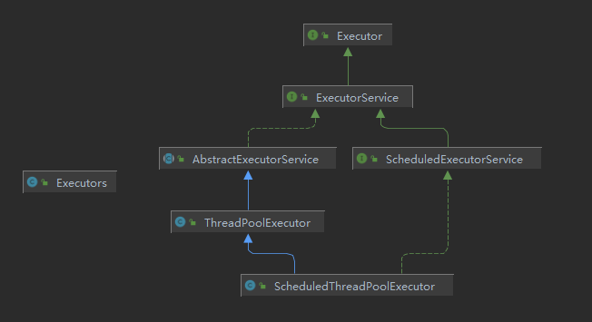

# JUC并发编程

## 1. JUC概述

### 什么是JUC

JUC就是java.util.concurrent包的简称，Java1.5出现

### 进程和线程的概念

#### 进程和线程

##### 进程

进程(Process)是计算机中的程序关于某数据集合上的一次运行活动，是系统进行资源分配和调度的基本单位，是操作系统的基础，进程是线程的容器，程序是指令、数据以及组织形式的描述，进程是程序的实体。

进程是指系统中正在运行的一个应用程序，程序一旦运行就是进程，进程是资源分配的最小单位

##### 线程

线程(thread)是操作系统能够进行运算调度的基本单位，被包含在进程之中，是进程中实际运作的单位，一个进程中可以并发多个线程，每条线程并行执行不同的任务

线程是系统分配处理时间资源的基本单位，或者说进程之内独立执行的一个单元执行流，线程是程序执行的最小单位

#### 线程的状态

Thread.State

```java
public enum State {
    /**
     * Thread state for a thread which has not yet started.
     * 新建状态
     */
    NEW,

    /**
     * Thread state for a runnable thread.  A thread in the runnable
     * state is executing in the Java virtual machine but it may
     * be waiting for other resources from the operating system
     * such as processor.
     * 准备就绪
     */
    RUNNABLE,

    /**
     * Thread state for a thread blocked waiting for a monitor lock.
     * A thread in the blocked state is waiting for a monitor lock
     * to enter a synchronized block/method or
     * reenter a synchronized block/method after calling
     * {@link Object#wait() Object.wait}.
     * 阻塞
     */
    BLOCKED,

    /**
     * Thread state for a waiting thread.
     * A thread is in the waiting state due to calling one of the
     * following methods:
     * <ul>
     *   <li>{@link Object#wait() Object.wait} with no timeout</li>
     *   <li>{@link #join() Thread.join} with no timeout</li>
     *   <li>{@link LockSupport#park() LockSupport.park}</li>
     * </ul>
     *
     * <p>A thread in the waiting state is waiting for another thread to
     * perform a particular action.
     *
     * For example, a thread that has called <tt>Object.wait()</tt>
     * on an object is waiting for another thread to call
     * <tt>Object.notify()</tt> or <tt>Object.notifyAll()</tt> on
     * that object. A thread that has called <tt>Thread.join()</tt>
     * is waiting for a specified thread to terminate.
     * 不见不散,会一直等待
     */
    WAITING,

    /**
     * Thread state for a waiting thread with a specified waiting time.
     * A thread is in the timed waiting state due to calling one of
     * the following methods with a specified positive waiting time:
     * <ul>
     *   <li>{@link #sleep Thread.sleep}</li>
     *   <li>{@link Object#wait(long) Object.wait} with timeout</li>
     *   <li>{@link #join(long) Thread.join} with timeout</li>
     *   <li>{@link LockSupport#parkNanos LockSupport.parkNanos}</li>
     *   <li>{@link LockSupport#parkUntil LockSupport.parkUntil}</li>
     * </ul>
     * 过时不候，到了指定时间后就不等待了
     */
    TIMED_WAITING,

    /**
     * Thread state for a terminated thread.
     * The thread has completed execution.
     * 终结
     */
    TERMINATED;
}
```

```java
public enum State {
    /**
     * 新建状态
     */
    NEW,

    /**
     * 准备就绪，运行
     */
    RUNNABLE,

    /**
     * 阻塞
     */
    BLOCKED,

    /**
     * 不见不散，等待
     */
    WAITING,
    /**
     * 过时不候，过时等待
     */
    TIMED_WAITING,

    /**
     * 终结，结束
     */
    TERMINATED;
}
```

#### wait和sleep

1. sleep是Thread的静态方法，wait是Object类的方法，任何对象实例都能调用
2. sleep不会释放锁，也不需要占有锁。wait会释放锁，但调用的前提是当前线程占有锁
3. 都可以被interrupted方法中断

#### 并发和并行

串行是排队依次执行任务，前一个完成了后面的才能执行

并发是多个线程同时请求同一个资源，实际上后面需要排队执行

并行是多个线程同时请求不同的各自资源，多个任务同时进行

#### 管程

monitor 监视器  也就是锁

监视器是一种同步机制，保证同一时间只有一个线程可以访问被保护的数据或代码

jvm同步基于进入和进出，使用管程对象实现，进入加锁，退出解锁，

对临界区进行操作

#### 用户线程和守护线程

平时自定义线程基本都是用户线程，主线程结束了，用户线程还在运行，jvm依旧存活

守护线程，比如垃圾回收，运行在后台

守护线程依赖于用户线程，没有用户线程，即使守护线程存在，jvm依旧会退出

## 2. Lock接口

### synchronized

#### 作用范围

synchronized是Java中的关键字，是一种同步锁，修饰的对象有以下几种

1. 修饰一个代码块，作用范围是代码块，作用对象是调用这个代码块的对象
2. 修饰一个方法
   - synchronized并不属于方法定义的一部分，因此关键字并不能被继承
3. 修饰静态方法，作用范围是整个静态方法，作用对象是这个类的所有对象
4. 修饰一个类，作用范围是括起来的部分，作用对象是这个类的所有对象

#### 多线程编程步骤

1. 创建资源类，在资源类创建属性和操作方法
2. 在资源类操作方法中
   - 判断，
   - 执行
   - 通知
3. 创建多个线程，调用资源类的操作方法
4. 防止虚假唤醒

#### 卖票例子

总共30张票，三个人售卖

```java
class Ticket {
    private int count = 30;

    public synchronized void sale() {
        if (count > 0) {
            System.out.println(Thread.currentThread().getName() + "卖出" + (count--) + "，剩余票:" + count);
        }
    }
}

public class SaleTicket {
    public static void main(String[] args) {
        Ticket ticket = new Ticket();
        Thread thread1 = new Thread(() -> {
            for (int i = 0; i < 40; i++) {
                ticket.sale();
            }
        }, "A");
        Thread thread2 = new Thread(() -> {
            for (int i = 0; i < 40; i++) {
                ticket.sale();
            }
        }, "B");
        Thread thread3 = new Thread(() -> {
            for (int i = 0; i < 40; i++) {
                ticket.sale();
            }
        }, "C");
        thread1.start();
        thread2.start();
        thread3.start();
    }
}
```

### Lock接口

#### Lock接口介绍

常见实现类 ReentrantLock,WriteLock,ReadLock

Lock锁实现提供了比使用同步方法和语句更广泛的锁操作，它允许更灵活的结构，支持多个关联的条件对象，Lock提供了比synchronized更多的功能

#### Lock和synchronized比较

1. Lock不是Java语言内置的，synchronized是Java语言的关键字，因此是内置特性，Lock是一个类，通过这个类可以实现同步访问
2. Lock和synchronized有一点很大的不同，采用synchronized不需要用户去手动释放锁，当synchronized方法或者synchronized代码块执行完之后，系统会自动让线程释放对锁的占用，而Lock必须要用户手动释放锁，如果没有主动释放，就有可能导致死锁现象发生
3. Lock可以让等待锁的线程相应中断，而sychronized却不行，使用synchronized时，等待的线程会一直等待下去，不能响应中断
4. 通过Lock可以直到有没有成功获取锁，但是synchronized无法办到
5. Lock可以提高多个线程进行读操作的效率
6. 在性能上来说，如果竞争资源不激烈，两者性能差不多，而当竞争资源非常激烈时，即有大量线程同时竞争，此时Lock的性能要远远优于synchronized

#### Lock实现卖票

```java
class LTicket{
    private int count = 30;
    private final ReentrantLock lock = new ReentrantLock();
    public void sale(){
        lock.lock();
        try {
            if (count > 0) {
                System.out.println(Thread.currentThread().getName()+"卖出"+(count--)+"剩余"+count);
            }
        }finally {
            lock.unlock();
        }
    }
}
public class LSaleTicket {
    public static void main(String[] args) {
        LTicket lTicket = new LTicket();
        new Thread(() ->{
            for (int i = 0; i < 40; i++) {
                lTicket.sale();
            }
        },"A").start();
        new Thread(() ->{
            for (int i = 0; i < 40; i++) {
                lTicket.sale();
            }
        },"B").start();
        new Thread(() ->{
            for (int i = 0; i < 40; i++) {
                lTicket.sale();
            }
        },"C").start();
    }
}
```

调用start方法后不一定立即执行，操作系统决定什么时候创建

## 3. 线程间通信

### 示例

实现对一个初始值为0的变量操作，一个线程+1，一个线程-1

#### synchronized实现

```java
class Share {
    private int number = 0;

    public synchronized void incr() throws InterruptedException {
        while (number != 0) {
            //wait应该在循环中使用，否则会出现虚假唤醒
            this.wait();
            //在哪里等待，就会在哪里唤醒，这样第一次判断等待后，
            //如果下一次还是这个线程拿到锁，那么程序就会直接往下执行
            //不会执行判断，所以需要用while，确保任何时候都会走判断
        }
        number++;
        System.out.println(Thread.currentThread().getName() + " number:" + number);
        this.notifyAll();
    }

    public synchronized void decr() throws InterruptedException {
        while (number != 1) {
            this.wait();
        }
        number--;
        System.out.println(Thread.currentThread().getName() + " number:" + number);
        this.notifyAll();
    }
}

public class ThreadDemo1 {
    public static void main(String[] args) {
        Share share = new Share();
        new Thread(() -> {
            for (int i = 0; i < 10; i++) {
                try {
                    share.incr();
                } catch (InterruptedException e) {
                    e.printStackTrace();
                }
            }
        }, "A").start();
        new Thread(() -> {
            for (int i = 0; i < 10; i++) {
                try {
                    share.decr();
                } catch (InterruptedException e) {
                    e.printStackTrace();
                }
            }
        }, "B").start();

        new Thread(() -> {
            for (int i = 0; i < 10; i++) {
                try {
                    share.incr();
                } catch (InterruptedException e) {
                    e.printStackTrace();
                }
            }
        }, "C").start();
        new Thread(() -> {
            for (int i = 0; i < 10; i++) {
                try {
                    share.decr();
                } catch (InterruptedException e) {
                    e.printStackTrace();
                }
            }
        }, "D").start();
    }
}
```

虚假唤醒，注意wait必须放到while循环中

#### Lock实现

```java
class LShare{
    private int number = 0;
    private  Lock lock = new ReentrantLock();
    private Condition condition = lock.newCondition();
    public void incr() throws InterruptedException {
        lock.lock();
        try {
            while (number!=0) {
                condition.await();
            }
            number++;
            System.out.println(Thread.currentThread().getName() + " number:" + number);
            condition.signalAll();
        }finally {
            lock.unlock();
        }
    }
    public void decr() throws InterruptedException {
        lock.lock();
        try {
            while (number!=1) {
                condition.await();
            }
            number--;
            System.out.println(Thread.currentThread().getName() + " number:" + number);
            condition.signalAll();
        }finally {
            lock.unlock();
        }
    }
}
public class ThreadDemo2 {
    public static void main(String[] args) {
        LShare lShare = new LShare();
        new Thread(() ->{
            for (int i = 0; i < 10; i++) {
                try {
                    lShare.incr();
                } catch (InterruptedException e) {
                    e.printStackTrace();
                }
            }
        },"A").start();
        new Thread(() ->{
            for (int i = 0; i < 10; i++) {
                try {
                    lShare.decr();
                } catch (InterruptedException e) {
                    e.printStackTrace();
                }
            }
        },"B").start();
        new Thread(() ->{
            for (int i = 0; i < 10; i++) {
                try {
                    lShare.incr();
                } catch (InterruptedException e) {
                    e.printStackTrace();
                }
            }
        },"C").start();
        new Thread(() ->{
            for (int i = 0; i < 10; i++) {
                try {
                    lShare.decr();
                } catch (InterruptedException e) {
                    e.printStackTrace();
                }
            }
        },"D").start();

    }
}
```

## 4. 线程间定制化通信

按照约定的顺序输出

A打印5次，B打印10次，C打印15次

添加标志位，运行结束后修改标志位，然后进行通知

```java
class ShareResource {
    private int flag = 1; //1A 2B 3C
    private Lock lock = new ReentrantLock();
    private Condition c1 = lock.newCondition();
    private Condition c2 = lock.newCondition();
    private Condition c3 = lock.newCondition();
    //打印五次
    public void print5(int loop) throws InterruptedException {
        lock.lock();
        try {
            while (flag != 1) {
                c1.await();
            }
            for (int i = 0; i < 5; i++) {
                System.out.println(Thread.currentThread().getName()+"::"+i+"轮数"+loop);
            }
            flag = 2;
            c2.signal();
        }finally {
            lock.unlock();
        }
    }
    //打印五次
    public void print10(int loop) throws InterruptedException {
        lock.lock();
        try {
            while (flag != 2) {
                c2.await();
            }
            for (int i = 0; i < 10; i++) {
                System.out.println(Thread.currentThread().getName()+"::"+i+"轮数"+loop);
            }
            flag = 3;
            c3.signal();
        }finally {
            lock.unlock();
        }
    }
    //打印五次
    public void print15(int loop) throws InterruptedException {
        lock.lock();
        try {
            while (flag != 3) {
                c3.await();
            }
            for (int i = 0; i < 15; i++) {
                System.out.println(Thread.currentThread().getName()+"::"+i+"轮数"+loop);
            }
            flag = 1;
            c1.signal();
        }finally {
            lock.unlock();
        }
    }
}
public class ThreadDemo3 {
    public static void main(String[] args) {
        ShareResource resource = new ShareResource();
        new Thread(()->{
            for (int i = 1; i <= 10; i++) {
                try {
                    resource.print5(i);
                } catch (InterruptedException e) {
                    e.printStackTrace();
                }
            }
        },"A").start();
        new Thread(()->{
            for (int i = 1; i <= 10; i++) {
                try {
                    resource.print10(i);
                } catch (InterruptedException e) {
                    e.printStackTrace();
                }
            }
        },"B").start();
        new Thread(()->{
            for (int i = 1; i <= 10; i++) {
                try {
                    resource.print15(i);
                } catch (InterruptedException e) {
                    e.printStackTrace();
                }
            }
        },"C").start();
    }
}
```

## 5. 集合的线程安全

### ArrayList线程不安全演示

```java
public class ThreadDemo4 {
    public static void main(String[] args) {
        List<String> list = new ArrayList<>();
        for (int i = 0; i < 10; i++) {
            new Thread(()->{
                list.add(UUID.randomUUID().toString().substring(0,8));
                System.out.println(list);
            }).start();
        }
        //java.util.ConcurrentModificationException
    }
}
```

#### 解决方案Vector

JDK1.0 不推荐使用 通过synchronized关键字实现

```java
public class ThreadDemo5 {
    public static void main(String[] args) {
        Vector<String> vector = new Vector<>();
        for (int i = 0; i < 10; i++) {
            new Thread(() -> {
                vector.add(UUID.randomUUID().toString().substring(0, 8));
                System.out.println(vector);
            }).start();
        }
    }
}
```

#### 解决方案synchronizedList

不推荐使用 通过synchronized关键字实现

```java
public class ThreadDemo7 {
    public static void main(String[] args) {
        List<String> list = new CopyOnWriteArrayList<>();
        for (int i = 0; i < 10; i++) {
            new Thread(() -> {
                list.add(UUID.randomUUID().toString().substring(0, 8));
                System.out.println(list);
            }).start();
        }
    }
}
```

#### 解决方案 CopyOnWriteArrayList

推荐使用

写时复制技术

支持并发读取

独立写，先复制和之前集合相同大小的区域，然后写入新的内容，之后合并新的和旧的区域，以此类推

类似于签到

只能保证最终一致性，不能保证实时一致性

读写不同的容器

```java
public class ThreadDemo7 {
    public static void main(String[] args) {
        List<String> list = new CopyOnWriteArrayList<>();
        for (int i = 0; i < 10; i++) {
            list.add(UUID.randomUUID().toString().substring(0,8));
            System.out.println(list);
        }
    }
}
```

### HashSet线程不安全演示

```java
public class ThreadDemo8 {
    public static void main(String[] args) {
        Set<String> set = new HashSet<>();
        for (int i = 0; i < 1000; i++) {
            new Thread(() -> {
                set.add(UUID.randomUUID().toString().substring(0, 8));
                System.out.println(set);
            }).start();
        }
        //java.util.ConcurrentModificationException
    }
}
```

#### 解决方法CopyOnWriteArraySet

```
public class ThreadDemo9 {
    public static void main(String[] args) {
        Set<String> set = new CopyOnWriteArraySet<>();
        for (int i = 0; i < 10; i++) {
            new Thread(() -> {
                set.add(UUID.randomUUID().toString().substring(0, 8));
                System.out.println(set);
            }).start();
        }
    }
}
```

### HashMap线程不安全演示

```java
public class ThreadDemo10 {
    public static void main(String[] args) {
        Map<String,String> map = new HashMap<>();
        for (int i = 0; i < 10; i++) {
            String key = String.valueOf(i);
            new Thread(() -> {
                map.put(key,UUID.randomUUID().toString().substring(0, 8));
                System.out.println(map);
            }).start();
        }
        //java.util.ConcurrentModificationException
    }
}
```

#### 解决方法ConcurrentHashMap

```java
public class ThreadDemo11 {
    public static void main(String[] args) {
        Map<String,String> map = new ConcurrentHashMap<>();
        for (int i = 0; i < 10; i++) {
            String key = String.valueOf(i);
            new Thread(() -> {
                map.put(key,UUID.randomUUID().toString().substring(0, 8));
                System.out.println(map);
            }).start();
        }
    }
}
```

## 6. 多线程锁

### 8种情况

```java
class Phone {
    public  synchronized void sendSMS()   {
        try {
            TimeUnit.SECONDS.sleep(4);
        } catch (InterruptedException e) {
            e.printStackTrace();
        }
        System.out.println("--sendSMS");
    }

    public  synchronized void sendEmail() {
        System.out.println("--sendEmail");
    }

    public void getHello() {
        System.out.println("---getHello");
    }
}
class StaticPhone{
    public static synchronized void sendSMS()   {
        try {
            TimeUnit.SECONDS.sleep(4);
        } catch (InterruptedException e) {
            e.printStackTrace();
        }
        System.out.println("--sendSMS");
    }

    public static synchronized void sendEmail() {
        System.out.println("--sendEmail");
    }

    public void getHello() {
        System.out.println("---getHello");
    }
}

/**
 * 1. 标准访问，先打样短信还是邮件
 * --sendSMS
 * --sendEmail
 * 2. 停留4s再短信方法内，先打印短信还是邮件
 * 4s
 * --sendSMS
 * --sendEmail
 * 3. 新增普通Hello方法，先打印短信还是hello
 * ---getHello
 * 4s
 * --sendSMS
 * 4. 有两部手机，先打印短信还是邮件
 * --sendEmail
 * 4s
 * --sendSMS
 * 5. 两个静态同步方法，1部手机，先打印短信还是邮件
 * 4s
 * --sendSMS
 * --sendEmail
 * 6. 两个静态同步方法，2部手机，先打印短信还是邮件
 * 4s
 * --sendSMS
 * --sendEmail
 * 7. 1个静态同步方法，1个普通同步方法，1部手机，先打印短信还是邮件
 * ---getHello
 * 4s
 * --sendSMS
 * 8. 1个静态同步方法，1个普通同步方法，2部手机，先打印短信还是邮件
 * ---getHello
 * 4s
 * --sendSMS
 */
public class ThreadDemo12 {
    public static void main(String[] args) throws InterruptedException {
        case8();
    }
    public static void case1() throws InterruptedException {
        Phone phone = new Phone();
        new Thread(phone::sendSMS,"A").start();
        Thread.sleep(100);
        new Thread(phone::sendEmail,"B").start();
    }
    public static void case2() throws InterruptedException {
        Phone phone = new Phone();
        new Thread(phone::sendSMS,"A").start();
        Thread.sleep(100);
        new Thread(phone::sendEmail,"B").start();
    }
    public static void case3() throws InterruptedException {
        Phone phone = new Phone();
        new Thread(phone::sendSMS,"A").start();
        Thread.sleep(100);
        new Thread(phone::getHello,"B").start();
    }
    public static void case4() throws InterruptedException {
        Phone phone = new Phone();
        Phone phone2 = new Phone();
        new Thread(phone::sendSMS,"A").start();
        Thread.sleep(100);
        new Thread(phone2::sendEmail,"B").start();
    }
    public static void case5() throws InterruptedException {
        StaticPhone phone = new StaticPhone();
        new Thread(()->{phone.sendSMS();},"A").start();
        Thread.sleep(100);
        new Thread(()->{phone.sendEmail();},"B").start();
    }
    public static void case6() throws InterruptedException {
        StaticPhone phone = new StaticPhone();
        StaticPhone phone2 = new StaticPhone();
        new Thread(()->{phone.sendSMS();},"A").start();
        Thread.sleep(100);
        new Thread(()->{phone2.sendEmail();},"B").start();
    }
    public static void case7() throws InterruptedException {
        StaticPhone phone = new StaticPhone();
        new Thread(()->{phone.sendSMS();},"A").start();
        Thread.sleep(100);
        new Thread(()->{phone.getHello();},"B").start();
    }
    public static void case8() throws InterruptedException {
        StaticPhone phone = new StaticPhone();
        StaticPhone phone2 = new StaticPhone();
        new Thread(()->{phone.sendSMS();},"A").start();
        Thread.sleep(100);
        new Thread(()->{phone2.getHello();},"B").start();
    }
}
```

1. synchronized锁普通方法锁住的是当前实例对象
2. synchronized锁静态方法锁住的是类
3. 不同对象或者不同类的锁不共享
4. 对于同步方法块，锁是synchronized括号里配置的对象

### 公平锁和非公平锁

随机和队列

公平锁 排队获取，

- 效率相对较低

非公平锁 只要可用就获取资源，

- 可能一个线程就完成所有任务
- 效率高

### 可重入锁

synchronized(隐式，自动上锁解锁)和Lock(显式，主动加锁解锁)都是可重入锁

可以自己递归自己

当前线程可以反复进入的锁，锁定和释放次数需要一致

```java
public class SyncLockDemo {
    public static void main(String[] args) {
        ReentrantLock lock = new ReentrantLock();
        new Thread(()->{
            try {
                lock.lock();
                System.out.println(Thread.currentThread().getName()+"外层");
                try {
                    lock.lock();
                    System.out.println(Thread.currentThread().getName()+"内层");
                }finally {
                    lock.unlock();//如果这里不释放，下面再次创建新线程用同一把锁就会阻塞住
                }
            }finally {
                lock.unlock();
            }
        },"t1").start();
//        synchronized 可重入锁
//        new SyncLockDemo().add(); 因为是可重入锁，所以可以自己调自己，因此出现栈溢出异常
//        Object o = new Object();
//        new Thread(()->{
//            synchronized (o){
//                System.out.println(Thread.currentThread().getName()+"外层");
//                synchronized (o){
//                    System.out.println(Thread.currentThread().getName()+"中层");
//                    synchronized (o){
//                        System.out.println(Thread.currentThread().getName()+"内层层");
//                    }
//                }
//            }
//        },"t1").start();//t1外层 t1中层 t1内层层
    }

    public synchronized void add(){
        add();
    }
}
```

### 死锁

#### 什么是死锁

两个或者两个以上的线程在执行过程中因为争夺资源而造成一种互相等待的现象，如果没有外力干涉就无法再次执行下去

#### 产生死锁原因

系统资源不足

线程运行顺序不合适

资源分配不当

#### 死锁例程

```java
public class DeadLock {
    static Object a = new Object();
    static Object b = new Object();
    public static void main(String[] args) {
        new Thread(()->{
            synchronized (a){
                System.out.println(Thread.currentThread().getName()+"试图获取锁b");
                try {
                    TimeUnit.SECONDS.sleep(1);
                } catch (InterruptedException e) {
                    e.printStackTrace();
                }
                synchronized (b){
                    System.out.println(Thread.currentThread().getName()+"获取锁b");
                }
            }
        },"a").start();
        new Thread(()->{
            synchronized (b){
                System.out.println(Thread.currentThread().getName()+"试图获取锁a");
                try {
                    TimeUnit.SECONDS.sleep(1);
                } catch (InterruptedException e) {
                    e.printStackTrace();
                }
                synchronized (a){
                    System.out.println(Thread.currentThread().getName()+"获取锁a");
                }
            }
        },"b").start();
        //程序会卡住
    }
}
```

#### 验证是不是死锁

jps命令 类似 linux ps -ef 查看

jstack  jvm自带的堆栈跟踪工具

PS E:\test> jps -l

会有对应的进程号

PS E:\test> jstack 23304

根据进程号查看是否有死锁

#### 条件

- 互斥
- 请求与保持
- 不可剥夺
- 循环等待

互相请求对方的锁但是又不释放自己的锁

## 7.Callable接口

有三种创建线程的方式

- 继承Thread类
- 实现Runnable接口创建线程，但是线程终止时无法返回结果
- 通过Callable接口创建，可以返回结果
- 通过线程池方式创建线程

Callable接口特点

- 为了实现Runnable，需要实现不返回任何内容的run()方法，而Callable，需要实现在完成时返回结果的call()方法
- call()方法可以引发异常，而run不能
- 为实现Callable必须重写call方法

```java
class MyThread1 implements Runnable {

    @Override
    public void run() {

    }
}

class MyThread2 implements Callable<Integer> {

    @Override
    public Integer call() throws Exception {
        return 200;
    }
}

public class Demo1 {
    //Runnable接口创建线程
    public static void main(String[] args) throws ExecutionException, InterruptedException {
        //Runnable创建线程
        new Thread(new MyThread1(), "A").start();
        //Callable创建线程
        FutureTask<Integer> future = new FutureTask<>(new MyThread2());
        new Thread(future, "B").start();
        try {
            Integer result = future.get();
            System.out.println(result);
        } catch (InterruptedException | ExecutionException e) {
            e.printStackTrace();
        }
        //lam表达式格式
        FutureTask<Integer> task = new FutureTask<>(() -> {
            Thread.sleep(4000);
            return 1024;
        });
        new Thread(task, "B").start();
        System.out.println(task.get());
//        FutureTask 常见应用
//        1.不影响主线程，当主线程需要的时候，再获取结果
//        2.一个任务分配给多个线程执行，最后主线程汇总
//        如果调用get时任务还没有完成，会一直等待
    }
}
```

## 8. JUC辅助类

### 减少计数CountDownLatch

CountDownLatch类可以设置一个计数器，然后通过countDown方法来进行减一的操作，使用await方法等待计数器不大于0，然后继续执行await方法之后的语句

- CountDownLatch主要有两个方法，当一个或多个线程调用await方法时，这些线程会阻塞
- 其他线程调用countDown方法会将计数器减1，调用countDown方法的线程不会阻塞
- 当计数器值变为0时，因await方法阻塞的线程会被唤醒，继续执行

```java
public class Demo1 {
    public static void main(String[] args) {
        CountDownLatch latch = new CountDownLatch(6);
        new Thread(() -> {
            try {
                latch.await();
            } catch (InterruptedException e) {
                e.printStackTrace();
            }
            System.out.println(Thread.currentThread().getName()+"可以结束了");
        }, "A").start();
        for (int i = 0; i < 6; i++) {
            new Thread(()->{
                latch.countDown();
                System.out.println(Thread.currentThread().getName()+"完成了");
            },String.valueOf(i)).start();
        }
    }
}
```

### 循环栅栏CyclicBarrier

同步辅助类，允许一组线程互相等待，直到达到某个公共屏障点。

在涉及一组固定大小线程的程序中，这些线程必须不时地互相等待，此时CyclicBarrier很有用，因为该barrier在释放等待线程后可以重用

```java
public class Demo2 {
    public static void main(String[] args) {
        //设置固定值以及达到固定值后要做的事情
        CyclicBarrier barrier = new CyclicBarrier(4,()->{
            System.out.println("结束了");
        });
        for (int i = 0; i < 4; i++) {
            new Thread(()->{
                System.out.println(Thread.currentThread().getName()+"准备好了");
                try {
                    //这里会阻塞住，阻塞的线程达到指定数量后就执行barrier任务
                    //同时被阻塞的线程也会继续往下进行
                    barrier.await();
                    System.out.println("dd");
                } catch (InterruptedException | BrokenBarrierException e) {
                    e.printStackTrace();
                }
            },String.valueOf(i)).start();
        }
    }
}
```

### 信号灯Sempohore

线程先获取许可，其他线程阻塞，完成任务后释放许可，其他线程继续执行

通常用于限制可访问的某些资源的线程数目

```java
public class Demo3 {
    public static void main(String[] args) {
        //设置许可数量
        Semaphore semaphore = new Semaphore(2);
        for (int i = 0; i < 5; i++) {
            new Thread(()->{
                //获取许可
                try {
                    semaphore.acquire();
                    System.out.println(Thread.currentThread().getName()+"开始了");
                    TimeUnit.SECONDS.sleep(new Random().nextInt(5));
                    System.out.println("----"+Thread.currentThread().getName()+"结束了");
                } catch (InterruptedException e) {
                    e.printStackTrace();
                }finally {
                    //释放
                    semaphore.release();
                }
            },String.valueOf(i)).start();
        }
//        1开始了
//        0开始了
//                ----1结束了
//        2开始了
//                ----0结束了
//        3开始了
//                ----2结束了
//        4开始了
//                ----3结束了
//                ----4结束了
    }
}
```

## 9. 读写锁

### 乐观锁和悲观锁

#### 悲观锁

A取钱，资源被锁住，其他线程无法访问资源，A释放锁

然后B取钱，资源被锁住....

每次都加锁，效率低，每次都只有一个人读写

#### 乐观锁

A取钱，资源版本为1，B取钱资源版本为2

A先提交剩余的钱，检查版本为1，正常更新，资源版本变成3，

B之后提交剩余的钱，检查版本为3，不是2，提交失败，再次获取资源，资源版本为4，然后提交，检查版本如果为4就提交成功

效率高，每次可以多个人读，但是可能导致多余的资源消耗，比如提交时总是版本不一致

### 表锁和行锁

#### 表锁

锁住整张表，同一时刻只有一个人操作，不会死锁

#### 行锁

锁住表中某一行，同一时刻可以多个人读表，但是某一行只能有一个人读，可能会导致死锁

### 读写锁

都有可能导致死锁，读锁发生死锁是因为和写锁嵌套

一个资源可以被多个读线程访问，或者一个写线程访问，但是不能同时存在读写线程，读写互斥

```java
//资源类
class MyCache{
    private volatile Map<String,Object> map = new HashMap<>();

    private ReadWriteLock rwLock = new ReentrantReadWriteLock();
    public void put(String key,Object value){
        //添加写锁
        rwLock.writeLock().lock();
        System.out.println(Thread.currentThread().getName()+"正在写操作");
        try {
            TimeUnit.MILLISECONDS.sleep(300);
            map.put(key,value);
            System.out.println(Thread.currentThread().getName()+"写完了");
        } catch (InterruptedException e) {
            e.printStackTrace();
        }finally {
            //释放写锁
            rwLock.writeLock().unlock();
        }

    }
    public Object get(String key){
        rwLock.readLock().lock();
        Object result = null;
        System.out.println(Thread.currentThread().getName()+"正在读操作");
        try {
            TimeUnit.MILLISECONDS.sleep(300);
             result = map.get(key);
            System.out.println(Thread.currentThread().getName()+"读完了");
        } catch (InterruptedException e) {
            e.printStackTrace();
        }finally {
            rwLock.readLock().unlock();
        }
        return result;
    }
}
public class ReadWriteDemo {
    public static void main(String[] args) {
        MyCache cache = new MyCache();
        //不加读写锁导致还没有写完就开始读了
        for (int i = 0; i < 5; i++) {
            final int num = i;
            new Thread(()->{
                cache.put(num+"",num+"");
            },String.valueOf(i)).start();
        }
        for (int i = 0; i < 5; i++) {
            final int num = i;
            new Thread(()->{
                cache.get(num+"");
            },String.valueOf(i)).start();
        }
    }
}
```

#### 读锁

共享锁，读时共享并发

#### 写锁

独占锁，写时独占

#### 读写锁的演变

无锁

- 多个线程抢占资源，资源管理混乱

添加锁

- 多个人读，读和写，多个人写，都要排队进行

读写锁

- 可以多个人同时读，不需要排队
- 同时只有一个人写
- 读和写互斥
- 可能导致一直读，没有写操作
- 读的时候不能写，读完之后才能写

#### 读写锁的降级

锁降级:将写入锁降级为读锁

JDK8说明

将写锁降级为读锁

读锁不能升级为写锁

获取写锁->获取读锁->释放写锁->释放读锁

```java
public class Demo2 {
    public static void main(String[] args) {
        ReentrantReadWriteLock rwLock = new ReentrantReadWriteLock();
        ReentrantReadWriteLock.ReadLock readLock = rwLock.readLock();;
        ReentrantReadWriteLock.WriteLock writeLock = rwLock.writeLock();
        //锁降级
        //1.获取写锁
        writeLock.lock();
        System.out.println("Write");
        //获取读锁
        readLock.lock();
        System.out.println("----Read");
        //3.释放写锁
        writeLock.unlock();
        //4.释放读锁
        readLock.unlock();

//会导致死锁
//        //获取读锁
//        readLock.lock();
//        System.out.println("----Read");
//        //1.获取写锁
//        writeLock.lock();
//        System.out.println("Write");
//        //3.释放写锁
//        writeLock.unlock();
//        //4.释放读锁
//        readLock.unlock();
    }
}
```

## 10. BlockingQueue阻塞队列

队列：先进先出  FIFO

栈：先进后出  FILO

阻塞共享队列，实现数据从一端输入，另一端输出

队列为空时，从队列获取元素的操作被阻塞

队列满时，从从队列添加元素的操作会被阻塞

### 分类

#### ArrayBlockingQueue 常用

基于数组的阻塞队列实现，在ArrayBlockingQueue内部，维护了一个定长数组，以便缓存队列中的数据对象，这是一个常用的阻塞队列，除了一个定长数组外，ArrayBlockingQueue内部还保存着两个整形变量，分别标识着队列的头部和尾部在数组中的位置。

ArrayBlockingQueue在生产者放入数据和消费者获取数据，都是共用一个锁对象，因此两者无法真正并行运行

由数组结构组成的有界阻塞队列

#### LinkedBlockingQueue 常用

基于链表的阻塞队列，同ArrayListBlockingQueue类似，当生产者往队列中放入一个数据时，队列会从生产者手中获取数据，并缓存在队列内部，而生产者立即返回，只有当队列缓冲区达到最大值缓存容量时，才会阻塞生产者队列，直到消费者从队列中消费掉一份数据，生产者线程会被唤醒。因为生产者和消费者可以并行操作队列中的数据，因此提高了整个队列并发性能

由链表结构组成的有界阻塞队列

#### DelayQueue

DelayQueue中的元素只有当其指定的延迟时间到了，才能够从队列中获取到该元素，DelayQueue是一个没有大小限制的队列，因此往队列中插入数据的操作永远不会被阻塞，只有获取数据的操作才会被阻塞

使用优先级队列实现的延迟无界阻塞队列

#### PriorityBlockingQueue

支持优先级排列的队列，不会阻塞生产者，只会在没有可消费的数据时，阻塞消费者

因此生产者生产数据的速度绝对不能快于消费者消费数据的速度

#### SynchronousQueue

无缓冲等待队列

- 公平模式 采用公平锁，配合FIFO队列阻塞多余的生产者和消费者
- 非公平模式 默认 配合LIFO队列管理多余的生产者和消费者，如果生产者和消费者处理速度有差异，可能到这某些生产者或是消费者的数据永远得不到处理

不存储元素的阻塞队列，即单个元素的队列

#### LinkedTransferQueue

由链表组成的无界阻塞队列


#### LinkedBlockingDeque

链表组成的双向阻塞队列

### 核心方法

| 方法类型 | 抛出异常  | 特殊值  | 阻塞   | 超时   |
| -------- | --------- | ------- | ------ | ------ |
| 插入     | add()     | offer() | put    | offer  |
| 移除     | remove()  | poll()  | take   | poll   |
| 检查     | element() | peek()  | 不可用 | 不可用 |

### eg

```java
public class BlockingQueueDemo {
    public static void main(String[] args) throws InterruptedException {
        BlockingQueue<String> queue = new ArrayBlockingQueue<>(3);
//        1.
//        System.out.println(queue.add("a"));
//        System.out.println(queue.add("b"));
//        System.out.println(queue.add("c"));
//        System.out.println(queue.element());
////        System.out.println(queue.add("d"));//超出指定数量会抛出异常
//        System.out.println(queue.remove());
//        System.out.println(queue.remove());
//        System.out.println(queue.remove());
//        System.out.println(queue.remove());//移除过量元素抛异常

//        2.
//        System.out.println(queue.offer("a"));
//        System.out.println(queue.offer("b"));
//        System.out.println(queue.offer("c"));
//        System.out.println(queue.offer("d"));//超出指定元素不会抛异常，但是会返回false

//        System.out.println(queue.poll());
//        System.out.println(queue.poll());
//        System.out.println(queue.poll());
//        System.out.println(queue.poll());//弹出过量元素不会抛异常但是会返回null

//        3.
//        queue.put("a");
//        queue.put("b");
//        queue.put("c");
////        queue.put("d"); //超出指定数量会阻塞
//
//        System.out.println(queue.take());
//        System.out.println(queue.take());
//        System.out.println(queue.take());
//        System.out.println(queue.take());//弹出过量元素不会抛异常但是会被阻塞
//        4.
        System.out.println(queue.offer("a"));
        System.out.println(queue.offer("b"));
        System.out.println(queue.offer("c"));
        System.out.println(queue.offer("d",3, TimeUnit.SECONDS));//超过了数量，但是设置了
        //超时时间，经过一段时间后，会停止阻塞
    }
}
```

## 11. 线程池

### 线程池概述

一种线程使用模式，线程过多会带来调度开销，进而影响缓存局部性能和整体性能，而线程池维护者多个线程，等待着监督管理者分配可并发执行的任务，从而避免了在处理短时间任务创建与销毁线程的代价。线程池可以宝成内核的充分利用，防止过分调度

线程池主要控制运行的线程数量，在处理过程中将任务放入队列，然后在线程创建后启动这些任务，如果线程数量超过了最大数量，超出数量的线程排队等候，等其他线程执行完毕，再从队列中取出任务来执行

优点

- 降低资源消耗：通过重复利用已经创建的线程降低线程创建和销毁造成的销毁
- 提高响应速度：当任务到达时，任务可以不需要等待线程创建就能立即执行
- 提高线程的客观理性：线程是稀缺资源，如果无限制的创建，不仅会消耗系统资源，还会降低系统的稳定性，使用线程池可以进行统一的分配，调优和监控
- Java中线程池是通过Executor实现的，里面用到了Executor、Executors、ExecutorService、ThreadPoolExecutor这几个类



### 线程池使用方式

线程池常见分类

- 一池N线程Executors.newFixedThreadPool(int n);
  - 线程池中线程处于一定的量，可以很好的控制线程的并发量
  - 线程可以重复被使用，在显式关闭之前，都将一直存在
  - 超出一定量的线程被提交时需要在队列中等待
- 一池一线程Executors.newSingleThreadExecutor();
- 动态扩容创建线程Executors.newCachedThreadPool();

```java
public class ThreadPoolDemo1 {
    public static void main(String[] args) {
        //一池N线程
//        ExecutorService threadPool = Executors.newFixedThreadPool(10);
//        try {
//            for (int i = 0; i < 10; i++) {
//                threadPool.execute(() -> {
//                    System.out.println(Thread.currentThread().getName() + "输出结果");
//                });
//            }
//        } catch (Exception e) {
//            e.printStackTrace();
//        } finally {
//            threadPool.shutdown();
//        }
        //一池一线程
//        ExecutorService executorService = Executors.newSingleThreadExecutor();
//        try {
//            for (int i = 0; i < 10; i++) {
//                executorService.execute(() -> {
//                    System.out.println(Thread.currentThread().getName() + "输出结果");
//                });
//            }
//        } catch (Exception e) {
//            e.printStackTrace();
//        } finally {
//            executorService.shutdown();
//        }
        //Cache
        ExecutorService cachedThreadPool = Executors.newCachedThreadPool();
        try {
            for (int i = 0; i < 10; i++) {
                cachedThreadPool.execute(() -> {
                    System.out.println(Thread.currentThread().getName() + "输出结果");
                });
            }
        } catch (Exception e) {
            e.printStackTrace();
        } finally {
            cachedThreadPool.shutdown();
        }
    }
}
```

#### 线程池核心参数

```java
public ThreadPoolExecutor(int corePoolSize,
                          int maximumPoolSize,
                          long keepAliveTime,
                          TimeUnit unit,
                          BlockingQueue<Runnable> workQueue,
                          ThreadFactory threadFactory,
                          RejectedExecutionHandler handler) 
```

- int corePoolSize 常驻线程数量，核心
- int maximumPoolSize 最大线程数量
- long keepAliveTime，TimeUnit unit线程存活时间
- BlockingQueue<Runnable> workQueue 阻塞队列，常驻线程满了才会进入阻塞队列
- ThreadFactory threadFactory 线程工厂，用于创建线程
- RejectedExecutionHandler handler 拒绝策略

#### 工作流程和拒绝策略

先进入corePool，corePool满了后先进入阻塞队列，队列满了后再创建线程

最大线程满了就执行拒绝策略

队列FILO

四种拒绝策略

- AbortPolicy默认 抛异常
- CallerRunsPolicy 哪来的从哪去
- DiscardOldestPolicy 抛弃队列中等待最久的任务
- DiscardPolicy 丢弃无法处理的任务

#### 自定义线程池

```java
public class ThreadPoolDemo2 {
    public static void main(String[] args) {
        ThreadPoolExecutor poolExecutor = new ThreadPoolExecutor(2, 5,
                2L, TimeUnit.SECONDS,
                new ArrayBlockingQueue<>(3),
                Executors.defaultThreadFactory(),
                new ThreadPoolExecutor.AbortPolicy());
        try {
            for (int i = 0; i < 6; i++) {
                poolExecutor.execute(() -> {
                    System.out.println(Thread.currentThread().getName() + "执行");
                });
            }
        } finally { 
            poolExecutor.shutdown();
        }
    }
}
```

## 11. Fork Join

### 简介

Fork 把复杂任务进行分拆，大事化小

Join 把分拆的任务的结果进行合并

比如1+2+...+1000

分成1+...+10    11+...+20   .。。。

最后合并结果

### 代码实现

```java
class MyTask extends RecursiveTask<Integer> {
    //拆分差值不能超过10
    private static final Integer VALUE = 10;
    private int begin; //拆分开始值
    private int end;//拆分结束值
    private int result = 0;//结果

    public MyTask(int begin, int end) {
        this.begin = begin;
        this.end = end;
    }
    //拆分和合并
    @Override
    protected Integer compute() {
        //判断相加的两个数值是否大于10
        if ((end - begin) <= VALUE) {
            //相加
            for (int i = begin; i <= end; i++) {
                result += i;
            }
        } else {
            //获取中间值
            int middle = (begin + end) / 2;
            //拆分左边
            MyTask myTaskL = new MyTask(begin, middle);
            //拆分右边
            MyTask myTaskR = new MyTask(middle + 1, end);
            //调用方法拆分
            myTaskL.fork();
            myTaskR.fork();
            //合并结果
            result = myTaskL.join() + myTaskR.join();
        }
        return result;
    }
}

public class ForkJoinDemo {
    public static void main(String[] args) throws ExecutionException, InterruptedException {
        MyTask myTask = new MyTask(0, 100);
        ForkJoinPool pool = new ForkJoinPool();
        ForkJoinTask<Integer> submit = pool.submit(myTask);
        Integer result = submit.get();
        System.out.println(result);
        pool.shutdown();
    }
}
```

## 13. 异步回调 CompletableFuture

```java
public class CompletableFutureDemo {
    public static void main(String[] args) throws ExecutionException, InterruptedException {
        //异步调用，没有返回值
        CompletableFuture<Void> completableFuture = CompletableFuture.runAsync(() -> {
            System.out.println(Thread.currentThread().getName() + "NOACK");
        });
        completableFuture.get();
        //异步调用，有返回值
        CompletableFuture<Integer> integerCompletableFuture = CompletableFuture.supplyAsync(() -> {
            System.out.println(Thread.currentThread().getName() + "ACK");
            return 1024;
        });
        integerCompletableFuture.whenComplete((t,u)->{
            System.out.println("---t "+ t);//返回值
            System.out.println("---u "+ u);//异常
        }).get();
    }
}
```

