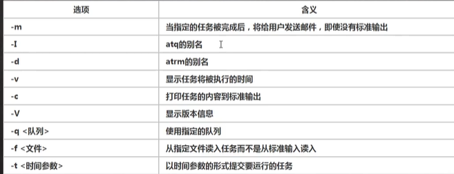

# Linux

## 1. 基础篇

### 1. 概述

#### 主要应用

服务器、嵌入式


#### 简介

免费、稳定、高并发

Linus Torvalds

linux主要是指内核

主要发行版本(内核一样)：

- Ubuntu、RedHat、CentOS、Debain、Fedora、SuSE、OpenSUSE

#### Linux和Unix的关系

Richard Stallman  GNU开源计划 

linux贡献出内核源码

unix只针对大型主机或服务器

linux适用于x86个人计算机，由unix的一个发行版编写而成

### 2. 安装VM和Centos

#### 基本知识

centos7.6/centos8.1

linux一般分为三个区

- boot分区，引导分区  1G  ext4   /boot
- swap 交换分区 2G
  - swap可以暂时作为虚拟内存内存使用，一般为物理内存两倍
- 根分区 剩余的 安装的软件一般都放这 /

#### 网络连接三种模式

同一个网段 ，比如 192.168.0.x，这个网段下的所有电脑都可以相互通信

桥接模式  192.168.0.x，

- 还是分配的这样的ip，所有同一个网段下可以相互通信，但是一个网段最多253个，因为.1一般为网关，.255一般为广播，容易造成IP冲突

NAT模式

- 虽然被分配的ip地址为192.168.0.x，但是实际里面新建的虚拟机ip地址是根据网卡分配的，可能是192.168.100.x，同时它也可以通过主机192.168.100.x访问外面的地址，用的是主机自己的网段而不是被分配的网段，这样不会造成IP冲突，内网可以访问外网，但是外网无法访问内网的具体哪一台主机，只能访问暴露的主机
- 主机模式 独立的系统

 虚拟机快照，类似于系统备份

### 3. linux文件目录

> linux里面，一切皆文件

#### 基本介绍


boot 引导启动

dev 相关设备

具体目录结构

- **/bin 常用**
  - /usr/bin、/usr/local/bin
  - 是Binary的缩写，存放最常使用的命令
- **/sbin   **
  - /usr/sbin、/usr/local/sbin
  - s就是super user的意思，这里存放的是系统管理员使用的系统管理程序
- **/home**
  - 存放普通用户的主目录，在linux中每个用户都有一个自己的目录，一般该目录名是以用户的账号命名
- **/root**
  - 该目录为系统管理员，也称作超级权限者的用户主目录
- **/lib**
  - 系统开机所需要最基本的动态连接共享库，其作用类似于windows里面的DLL文件，几乎所有应用程序都需要用到这些共享库
- /lost+found这个目录下一般是空的，当系统非法关机后，这里就存放了一些文件 
- **/etc**
  - 所有系统管理所需要的配置文件和子目录，比如安装mysql数据库my.conf
- **/usr**
  - 用户的很多应用程序和文件都放在这个目录下
- **/boot**
  - 存放linux启动时使用的一些核心文件，包含一些连接文件以及镜像文件
- /proc 
  - 这个目录是一个虚拟的目录，是系统内存的映射，访问这个目录来获取系统信息
- /srv
  - service缩写，该目录存放一些服务启动之后需要提取的数据
- /sys 这时linux2.6内核的一个很大编号，该目录下安装了2.6内核中新出现的一个文件系统sysfs
- /tmp 存放一些临时文件
- /dev
  - 类似于windwos设备管理器，把所有的硬件用文件的形式存储
- **/media**
  - linux系统会自动识别一些设备，例如U盘、光驱等，当识别后，linux会把识别的设备挂载到这个目录下
- **/mnt**
  - 系统提供该目录是为了让用户临时挂载别的文件系统的，我们可以将外部的存储挂载到/mnt/上，然后进入该目录就可以查看里面的内容了
- /opt 
  - 这是给主机额外安装软件所存放的目录，如安装oracle数据库就可以放到该目录下，默认为空
- **/usr/local**
  - 另一个给主机额外安装软件所安装的目录，一般通过编译源码方式安装的程序
- **/var**
  - 这个目录中存放着在不断扩充着的东西，习惯将经常被修改的目录放在这个目录下，包括各种日志文件
- /selinux
  - SELinux是一种安全子系统，它能控制程序只能访问特定文件，有三种工作模式，可以自行设置

### 4. 常用指令

#### 1. 查询用户信息指令

```bash
[root@VM-0-17-centos /]# id root
uid=0(root) gid=0(root) groups=0(root)
[root@VM-0-17-centos /]# id sss
id: sss: no such user
```

#### 2. 切换用户

```bash
[root@VM-0-17-centos /]# useradd fall
[root@VM-0-17-centos /]# passwd fall
Changing password for user fall.
New password:
BAD PASSWORD: The password is shorter than 8 characters
Retype new password:
passwd: all authentication tokens updated successfully.
[root@VM-0-17-centos /]# su - fall
```

- 从权限高的用户切换到权限低的用户，不需要输入密码，反之需要
- 当需要返回到原来用户时，使用exit/logout指令

#### 3. 查看当前用户/登录用户

```bash
[root@VM-0-17-centos /]# whoami
root
[root@VM-0-17-centos /]# who an I
root     pts/0        2021-10-01 14:19 (220.249.119.139)
```

ip是指从哪里登录的，

这两种方式有区别

#### 4. 用户组

类似于角色，系统可以对有共性的多个用户进行统一的管理，不同组添加不同的权限

新增组

- groupadd 组名

删除组

- groupdel 组名

增加用户时直接加上组

- useradd -g 用户组 用户名

 新建用户如果没有指定组，则会新建一个和用户名相同的组

```bash
[root@VM-0-17-centos ~]# groupadd test
[root@VM-0-17-centos ~]# useradd -g test zw
[root@VM-0-17-centos ~]# id zw
uid=1002(zw) gid=1002(test) groups=1002(test)
[root@VM-0-17-centos ~]# groupadd dev
[root@VM-0-17-centos ~]# usermod -g dev zw
[root@VM-0-17-centos ~]# id zw
uid=1002(zw) gid=1003(dev) groups=1003(dev)
```

用户和组相关文件

- /etc/passwd 文件
  - 用户user的配置文件，记录用户的各种信息
  - 每行的含义：**用户名:口令:用户标识号:组标识号:注释性描述:主目录:登录Shell**
- /etc/shadow 文件
  - 口令的配置文件
  - 每行的含义:**登录名:加密口令:最后一次修改时间:最小时间间隔:最大时间间隔:警告时间:不活动时间:失效时间:标志**
- /etc/group
  - 组配置文件，记录Linux包含的组的信息
  - 每行的含义:**组名:组标识号:组内用户列表**

shell是用来解释cd，mkdir等指令的，从而让linux内核识别，常见的shell，比如bash

## 2. 实操篇

### 1. 用户管理

> linux系统是一个多用户多任务的操作系统，任何一个要使用系统资源的用户，都必须先向管理员申请一个账号，然后以这个账号的身份进入系统

#### 基本用法

##### 添加用户

useradd 用户名

添加一个用户，默认该用户的目录在/home/下

当创建用户成功后，会自动创建和用户同名的home目录

也可以通过useradd -d 指定目录 新的用户名，

给新创建的用户指定home目录

##### 指定/修改密码

passwd 用户名

如果没有指定用户名就是修改当前用户名

pwd 显示当前路径

##### 删除用户

userdel 用户名

删除用户以及用户主目录 userdel -r 用户名

一般不建议删除用户主目录

##### 查询用户信息

id 用户名

##### 切换用户

su - 用户名

- 权限高用户切换到权限低用户，不需要输入密码，反之需要

- 需要返回原来用户时，使用exit/logout指令

##### 查看当前用户/登录用户

whoami

who am I

#### 用户组

类似于角色，系统可以对有共性的多个用户进行统一的管理，不同组添加不同的权限

##### 新增组

- groupadd 组名

##### 删除组

- groupdel 组名

组下面如果有用户是无法删除组的

##### 增加用户时直接加上组

- useradd -g 用户组 用户名

 新建用户如果没有指定组，则会新建一个和用户名相同的组

##### 修改用户的组

usermod -g 用户组 用户名

### 2. 实用指令

> 基本介绍:
>
> 运行级别说明:
>
> 0 关机
>
> 1 单用户 找回丢失密码
>
> 2 多用户状态没有网络服务
>
> 3 多用户状态有网络服务
>
> 4 系统未使用保留给用户
>
> 5 图形界面
>
> 6 系统重启
>
> 常用的运行级别是3和5，也可以指定默认运行级别
>
> init [0123456] 通过init来切换不同的运行级别，比如5-3 然后关机

#### 指定运行级别

centos7以前 /etc/inittab文件中

以后进行了简化

multi-user.target:analogous to runlevel 3

graphocal.targt:analogous to runlevel 5 

获取当前运行级别

systemctl get-default

设置默认的级别

systemctl set-default TARGET.target

重启

reboot

#### 找回root密码

启动系统，进入开机界面，在界面中按e，进入编辑界面

linux16开头，行的最后面输入init=/bin/sh

然后按ctrl+x进入单用户模式

输入mount -o remount,rw  /  完成后按回车

在新的一行最后面输入passwd 然后回车，输入密码，再次输入密码确认，一般至少为8位

接着输入touch /.autorelabel 回车

然后输入exec /sbin/init

回车后等待一段时间会自动重启

#### 登陆后更改密码 

passwd root

#### 帮助指令

man  命令或配置文件

在linux下隐藏文件是以.开头

help 命令

#### 文件目录类

##### pwd 指令

显示当前工作目录的绝对路径 

##### ls 指令

ls 选项 目录或文件

-a 显示当前目录所有的文件和目录，包括隐藏的

-l 以列表的方式显示信息

##### cd 指令

切换到指定目录

cd 参数 

绝对路径和相对路径

cd ~ 回到自己的home目录

cd .. 回到当前目录的上一级目录

##### mkdir指令

用于创建目录

mkdir 选项  要创建的目录

-p 创建多级目录

##### rmdir指令

删除空目录

rmdir 选项 要删除的空目录

如果要删除非空目录，需要使用 rm -rf 要删除的目录

##### touch指令

创建空文件

touch 文件名称

##### cp 指令

拷贝文件到指定目录

cp 选项 source dest

-r 递归复制整个文件夹

强制覆盖不提示的方法 \cp

##### rm指令

移除文件或目录

rm 选项 要删除的文件或目录

-r 递归删除整个文件夹

-r 强制删除不提示

##### mv指令

mv 移动文件与目录或重命名

mv oldNameFile newNameFile 重命名

mv 文件目录 目标目录  移动文件

可以移动整个文件目录

##### cat 指令

查看文件内容

cat 指令 要查看的文件

-n 显示行号

cat只能浏览文件，不能修改文件，为了浏览方便，一般加上 管道命令 | more

管道命令相当于把前面指令得到的结果交给下一个命令处理

##### more指令

基于VI编辑器的文本过滤器，它以全屏幕的方式按页显示文本文件的内容，more指令中内置了若干快捷键

more 要查看的文件

空格 向下翻一页

enter 向下翻一行

q 代表立刻离开more，不再显示该文件内容

ctrl+f 向下滚动一屏

ctrl+b 返回上一屏

= 输出当前行的行号

:f 输出文件名和当前行的行号

##### less指令

less指令用来分屏查看文件内容，它的功能与more指令类似，但是比more指令更加强大，支持各种显示终端，less指令在显示文件内容时，并不是一次将整个文件加载后才显示，而是根据显示需要加载内容，对于显示大型文件具有较高的效率

less 要查看的文件

空格键 向下翻页

pagedown 向下翻页

pageup 向上翻页

/字串 向下搜寻字串的功能，n向下查找N向上查找

?字串 向上搜寻字串的功能，n向上查找，N向下查找

q 离开less这个程序

##### echo指令

输出内容到控制台

echo 选项 输出内容 

echo $PATH

echo $HOSTNAME

##### head内容

用于显示文件的开头部分内容，默认情况下head指令显示文件的前10行内容

head 文件

head -n 5 文件

##### tail指令

用于输出文件中尾部的内容，默认情况下tail指令显示文件的后10行内容

tail 文件 查看文件尾10行内容

tail -n 5 文件 

tail -f 文件 实时追踪该文档的所有更新

##### >指令和>>指令

`>`输出重定向>>追加

ls -l > 文件 列表中的内容写入到文件中，覆盖写

ls -al >> 文件 列表中的内容追加到文件末尾

cat 文件1 > 文件2 文件1覆盖到文件2

echo "内容" >> 文件

cal显示当前日历信息

##### ln指令

软链接也称为符号链接，类似于windows里的快捷方式，主要存放了链接其他文件的路径

ln -s 原文件或目录 软链接名   给原文件创建一个软链接

使用pwd指令查看目录时，仍然看到的是软链接所在目录

##### history指令

查看已经执行过的历史指令，也可以执行历史指令

history  所有的

history 10 最近的10条指令

!5   执行历史指令为5的指令

#### 时间日期类

##### date指令 显示当前日志

date 显示当前时间

date +%Y 显示当前年份

date +%m 显示当前月份

date +%d 显示当前是哪一天

date "+%Y-%m-%d %H:%M:%S" 显示年月日 时分秒

##### date指令 设置日期

date -s 字符串时间

2021-11-11 11:11:11

##### cal指令

查看日历指令

cal 选项   不加选项，显示本月日历，选项范围为1-9999

#### 搜索查找类

##### find 指令

find指令将从指定目录向下递归地遍历其各个子目录，将满足条件的文件或者目录显示在终端

find 搜索范围 选项

-name  查询方式   按照指定的文件名查找模式查找文件

-user 用户名 查找属于指定用户的所有文件

-size 文件大小 按照指定的文件大小查找文件

+n 大于 -n小于  n等于   k  M  G  ...

find /root mysql

find / -size +200M 

ls -lh

##### locate指令

locate指令可以快速定位文件路径，locate指令利用实现建立的系统中所有文件名称及路径的locate数据库实现快速定位给定的文件，locate指令无需遍历整个文件系统，查询速度较快，为了保证查询结果的准确度，管理员必须定期更新locate时刻

locate 搜索文件

由于locate指令基于数据库进行查询，所有第一次运行前，必须使用updatedb指令创建locate数据库

##### which指令，查看某个指令在哪个目录下

which ls

##### grep指令和管道符号|

grep过滤查找，管道符 | ，表示将前一个命令的处理结果输出传递给后面的命令处理

grep 选项 查找内容 源文件

-n 显示匹配行及行号

-i 忽略字母大小写

ls | grep "my"

#### 压缩和解压类

##### gzip/gunzip指令

gzip 文件  压缩文件，只能将文件压缩为.gz文件

gunzip 解压文件命令

##### zip/unzip指令

zip用于压缩文件，unzip用于解压

zip 选项 xxx.zip

unzip 选项 xxx.zip

-r 递归压缩  即压缩目录

-d 目录  指定解压后文件的存放目录

##### tar指令

tar指令是打包指令，最后打包后的文件是.tar.gz的文件

tar 选项 xxx.tar.gz  打包的内容

-c 产生.tar打包文件

-v 显示详细信息

-f 指定压缩后的文件名

-z 打包同时压缩

-x 解包.tar文件

tar  -zcvf  

tar -zxvf  

tar -zxvf  mk.tar.gz   -C 指定的解压目录

-C 转到指定目录

### 3. 组管理和权限管理

#### 基本介绍

在linux中的每一个用户都必须属于一个组，不能独立于组外，在linux中每个文件有所有者，所在组，其他组的概念

所有者

所在组

其他组

改变用户所在的组

谁创建的文件谁就是所有者，所有者可以被更改

#### 文件/目录 所有者

谁创建了文件，就自然的成为该文件的所有者

查看文件的所有者

ls -ahl

修改文件所有者

chown 用户名 文件名

#### 组的创建

##### groupadd 组名

##### 查看文件/目录所在组

ls -ahl

##### 修改文件所在的组

chgrp 组名 文件名

#### 其他组

除文件的所有者和所在组的用户外，系统的其他用户都是文件的其他组

#### 改变用户所在组

在添加用户时，可以指定将该用户添加到哪个组中，同样的用root的管理权限可以改变某个用户所在的组

##### 改变用户所在组

usermod -g 组名 用户名

usermod -d 目录名 用户名   改变该用户登录的初始目录

cat /etc/group | grep  组名    查看组是否创建

#### 权限的基本介绍

ls -l 中显示的内容如下

`drwxr-xr-x 3 root root 4096 Sep  6 21:49 download`

0-9位说明

- 第0位时确定文件类型，d，-，l，c，b
  - l是链接，相当于快捷方式
  - d是目录，相当于文件夹
  - c是字符设备文件，鼠标，键盘
  - b是块设备，比如硬盘
  - -普通文件
- 第1-3位确定所有者  
- 第4-6位确定所属组 
- 第7-9位确定其他用户拥有该文件的权限 

##### rwx权限

rwx作用到文件

- r代表刻度，可以读取，查看
- w代表可写，可以修改，但是不代表可以删除该文件，删除一个文件的嵌套条件是对该文件所在的目录有写权限，才能删除该文件
- x代表可执行execute 可以被执行

rwx作用到目录

- r代表可以读取，ls查看目录内容
- w代表可写，可以修改，对目录内创建+删除+重命名目录
- x代表可执行executr 可以进入该目录 

##### 修改权限

chmod

第一种方式 + - = 变更权限

u 所有者 

g 所有组

o 其他人

a 所有人  u g  o 总和

chmod u=rwx,g=rx,o=x 文件目录名

chmod o+w  文件目录名  其他人得到写权限

chmod a-x  文件目录名  所有人去掉执行权限


第二种方式 通过数字变更权限

r=4 w=2 x=1   rwx=4+2+1=7

chmod u=rwx,g=rx,o=x  文件目录名

相当于chmod 751 文件目录名

##### 修改文件所有者

chown newowner  文件/目录  改变所有者

chown newowner:newgroup 文件/目录 改变所有者和所在组

-R 如果是目录 则使其下所有子文件或目录递归生效

##### 修改文件所在组

-chgrp

chgrp newgroup 文件/目录  改变所有组

### 4. 任务调度

#### crontal进行定时任务的设置

任务调度:是指系统在某个时间执行的特定的命令或程序

任务调度分类：

系统工作：有些重要的工作必须周而复始地执行，如病毒扫描等

个别用户工作：个别用户可能希望执行某些程序，比如对mysql数据库的备份

基本语法

crontab 选项

-e 编辑crontab定时任务

-l 查询crontab任务

-r 删除当前用户所有的crontab任务

快速入门

设置任务调度文件/etc/crontab

设置个人任务调度 执行crontab -e命令

输入任务，如

*/1 * * * * ls -l /etc/ > /tmp/to.txt

每分钟执行一次 ls -l /etc/ > /tmp/to.txt


*/1 * * * * ls -l /root > /root/a.txt

> [root@VM-0-17-centos ~]# crontab -e
> crontab: installing new crontab
> You have mail in /var/spool/mail/root
> [root@VM-0-17-centos ~]# ls
> download  mysql  software
> [root@VM-0-17-centos ~]# pwd
> /root
> [root@VM-0-17-centos ~]# ls
> download  mysql  software
> [root@VM-0-17-centos ~]# ls
> download  mysql  software
> [root@VM-0-17-centos ~]# ls
> a.txt  download  mysql  software
> [root@VM-0-17-centos ~]# cat a.txt
> total 12
> -rw-r--r-- 1 root root    0 Oct  5 20:22 a.txt
> drwxr-xr-x 3 root root 4096 Sep  6 21:49 download
> drwxr-xr-x 4 root root 4096 Aug  8 10:53 mysql
> drwxr-xr-x 2 root root 4096 Aug  7 11:31 software
> [root@VM-0-17-centos ~]#


crontab -r 终止任务调度

crontab -l 列出当前有哪些任务调度

service crond restart 重启任务调度

#### at定时任务

- at命令是一次性定时任务计划，at的守护进程atd会以后台模式运行，检查作业队列来运行
- 默认情况下，atd守护进程每60s检查作业队列，有作业时，会价差作业运行时间，如果时间与当前时间匹配，则运行此作业
- at命令是一次性定时计划任务，执行完一个任务后不再执行此任务了
- 在使用at命令的时候，一定要保证atd进程的启动，可以使用相关指令来查看ps -ef | grep atd

at 选项  时间

ctrl + d  结束at命令的输入




```bash
[root@VM-0-17-centos ~]# at 9pm - 10 minutes
at> ls /root<EOT>
job 1 at Tue Oct  5 20:50:00 2021
[root@VM-0-17-centos ~]# atq
1       Tue Oct  5 20:50:00 2021 a root
[root@VM-0-17-centos ~]# atrm 1
[root@VM-0-17-centos ~]# atd
[root@VM-0-17-centos ~]#
```

### 5. linux磁盘分区、挂载

> 原理介绍
>
> - linux来说无论有几个分区，分给哪一目录使用，它归根结底就只有一个根目录，一个独立且唯一的文件结构，linux中每个分区都是用来组成整个文件系统的一部分
> - liunx采用了一种叫载入的处理方法，它的整个文件系统中包含了一整套的文件和目录，且将一个分区和一个目录联系起来，这时要载入的一个分区使它的存储空间在一个目录下获得

lsblk

> 硬盘说明
>
> - linux硬盘分IDE硬盘和SCSI硬盘，目前基本上是SCSI硬盘
> - 对于IDE硬盘，驱动器标识符为hdx~ ，其中hd表明分区所在设备的类型，这里是指IDE硬盘，x为盘号(a为基本盘，b为基本从属盘，c为辅助主盘，d为辅助从属盘)，~代表分区，前四个分区用数字1到4表示，它们是主分区或扩展分区，从5开始就是逻辑分区，eg   hda3表示为第一个IDE硬盘上的第三个主分区或扩展分区，hdb2表示为第二个IDE硬盘上的第二个主分区或扩展分区
> - 对于SCSI硬盘则标识为sdx~，SCSI硬盘是用sd来表示分区所在设备的类型的，其余则和IDE硬盘的表示方法一样

#### 如何增加一块硬盘

分区命令 fdisk /dev/sdb

开始对/sdb分区

m 显示命令列表

p 显示磁盘分区 同 fdisk -l

n 新增分区

d 删除分区

w 写入并退出

说明：开始分区后输入n，新增分区，然后选择p，分区类型为主分区，两次回车默认剩余全部空间，最后输入w写入分区并退出，若不保存退出输入q

ctrl+del 删除

格式化磁盘

分区命令  mkfs -t ext4  /dev/sdb1

增加硬盘

挂载：将一个分区与一个目录联系起来

mount 设备名称 挂载目录

eg   

mount /dev/sdb1  /newdisk

umonut 设备名称或挂载目录

umonut /dev/sdb1或umonut /newdisk

用命令行挂载，重启后会失效

永久挂载，通过修改etc/fastab实现挂载

添加完成后执行mount -a 即刻生效

> 1. 虚拟机添加硬盘
>
>    虚拟机设备添加硬盘
>
> 2. 分区
>
> 3. 格式化
>
> 4. 挂载
>
> 5. 设置可以自动挂载

#### 磁盘情况查询

##### 查询系统整体磁盘使用情况

df -h

##### 查询指定目录的磁盘占用情况

du -h /目录

查询指定目录的磁盘占用情况，默认为当前目录

-s 指定目录占用大小汇总

-h 带计量单位

-a 含文件

--max-depth=1  子目录深度

-c 列出明细的同时，增加汇总值

##### 实用命令

- 统计/opt文件夹下文件的个数

  ls -l /opt | grep "^-" |wc -l

- 统计/opt文件夹下目录的个数

  ls -l /opt | grep "^d" | wc -l

- 统计/opt文件夹下文件的个数，包括子文件夹里的

  ls -lR /opt |grep "^-" | wc -l

- 统计/opt文件夹下目录的个数，包括子文件夹里的

  ls -lR /opt | grep "^d" | wc -l

- 以树状显示目录结构

  tree 目录  如果没有需要使用 yum install tree 安装

### 6. 网络配置

NAT网络配置


ipconfig  window查看ip地址

ifconfig   linux查看ip地址

#### ping 测试主机之间网络连通性

ping  目标主机    测试当前服务器是否可以连接到目标主机

ping www.baidu.com    测试当前服务器是否可以连接百度


自动获取IP，一般不会冲突，但是ip会自动分配DHCP

静态IP配置

vi /etc/sysconfig/network-scripts/ifcfg-ens33

DEVICE=eth0 接口名  设备  网卡

HWADDR=00:0c:2x:6x:0x:xx MAC地址

TYPE=Ethernet  网络类型

UUID =            随机id

ONBOOT=yes  系统启动的时候网络接口是否有效

BOOTPROTO=static       ip配置方法   none  static  bootp  dhcp  引导时不适用协议 静态分配IP BOOTP协议 DHCP协议

IPADDR = 192.168.3.5  IP地址

网关

GATEWAY=192.168.3.1

域名解析器

DNS1 = 192.168.3.1


/etc/sysconfig/network-scripts/ifcfg-eth0

以ifcfg开头的

```
BOOTPROTO=dhcp
DEVICE=eth0
HWADDR=52:54:00:5f:81:62
ONBOOT=yes
PERSISTENT_DHCLIENT=yes
TYPE=Ethernet
USERCTL=no

BOOTPROTO=static       
#ip配置方法   none  static  bootp  dhcp  
#引导时不适用协议 静态分配IP BOOTP协议 DHCP协议
#IP地址
IPADDR = 192.168.3.5  
#网关
GATEWAY=192.168.3.2
#域名解析器
DNS1 = 192.168.3.2
```

service network restart 重启网络服务

#### 设置主机名和hosts映射

 为了方便记忆，可以给linux系统设置主机名，也可以根据需要修改主机名

hostname  查看主机名

修改文件在 /etc/hostname  指定

重启生效

##### host映射

如何通过主机名能够找到比如ping某个linux系统

windows C:\windwoos\system32\deivers\etc\hosts 指定即可

linux /etc/hosts 文件指定

#### 主机名解析过程分析(Hosts DNS)

hosts是什么

一个文本文件，用来记录IP和Hostname的映射关系

DNS 就是Domain Name System的缩写，翻译过来就是域名系统

是互联网上作为域名和IP地址相互映射的一个分布式数据库

以用户在浏览器输入流www.baidu.com为例

> 1. 浏览器先检查浏览器缓存中有没有该域名的解析IP地址，有就先调用这个IP完成解析，如果没有，就检查DNS解析器缓存，如果有就之间返回IP完成解析，这两个缓存，可以理解为本地解析器缓存
>
> 2. 一般来说，当电脑第一次成功访问某一网站后，在一定时间内，浏览器或操作系统会缓存他的IP地址(DNS解析记录),如在cmd窗口输入
>
>    ipconfig /displaydns   dns域名解析缓存
>
>    ipconfig /flushdns  手动清理dns缓存
>
> 3. 如果本地解析器缓存没有找到对应映射，检查系统中hosts文件中有没有配置对应的域名IP映射，如果有，则完成解析并返回
>
> 4. 如果本地DNS解析器缓存和hosts文件中均没有找到对应的IP，则到域名服务器DNS进行解析域

浏览器 操作系统  hosts  互联网dns     域名不存在


dns域名劫持

### 7. 进程管理

#### 基本介绍

> 1. 在linux中，每个执行的程序都称为一个进程，每一个进程都分配一个ID号(PID,进程号)
> 2. 每个进程都可能以两种方式存在的，前台与后台，所谓前台进程就是用户目前的屏幕上可以进行操作的，后台进程则实际在操作，但由于屏幕上无法看到的进程，通常使用后台方式执行
> 3. 一般系统的服务都是以后台进程的方式存在，而且都会常驻在系统中，直到关机才结束

#### 显示系统执行的进程

ps 

PID 进程识别号

TTY 终端机号

TIME 此进程使用的CPU时间

CMD 正在执行的命令或进程名

ps -a 显示当前终端的所有进程信息

ps -u 以用户的格式显示进程信息

ps -x 显示后台进程运行的参数

ps -aux | more

ps指令详解

- ps -aux | grep xxx  查看有没有什么服务
- system V 展示风格
- USER  用户名称
- PID 进程号
- %CPU 进程占用CPU的百分比
- %MEM 进程占用物理内存的百分比
- VSZ 进程占用的虚拟内存的大小 KB
- RSS 进程占用的物理内存大小 KB
- TT 终端名称
- STAT 进程状态 S-睡眠 s-表示该进程是会话的先导进程，N-表示进程拥有比普通优先级更低的优先级，R-正在运行，D-短期等待，Z-僵死进程，T-被跟踪或者被停止等等
- STARTED 进程的启动时间
- TIME CPU时间，即进程使用CPU的总时间
- COMMAND启动进程所用的命令和参数，如果过长会被截断显示

ps -ef 是以全格式显示当前所有进程

-e 显示所有进程  -f全格式

是BSD风格

UID 用户ID

PID 进程ID

PPID 父进程ID

C CPU用于计算执行优先级的因子，数值越大，表明进程是CPU密集型运算，执行优先级会降低，数值越小，表明进程是I/O密集型运算，执行优先级会提高

STIME 进程启动的时间

TTY 完整的终端名称

TIME CPU时间

CMD 启动进程所用的命令和参数

一个进程可以创建子进程，杀掉父进程那么子进程就会全部被kill

#### 终止进程kill和killall

如果某个进程执行到一半需要停止时，或是已经消耗了很多的系统资源时，此时可以考虑停止该线程，使用kill命令来完成此项任务

kill 选项  进程号  通过进程号杀死进程

killall  进程名称 通过进程名称杀死进程，也支持通配符，这在系统因负载过大而变得很慢时很有用

-9 表示强迫进程立即停止

#### 查看进程树 pstree

pstree 选项 可以更加直观的来查看进程信息

-p 显示进程的PID

-u 显示进程的所属用户


#### 服务管理

service本质就是进程，但是是运行在后台的，通常都会监听某个端口，等待其他程序的请求。比如mysqld，sshd，防火墙，隐藏又称为守护进程

service 服务名  start | stop|restart|reload|status

centos7后，很多服务不再使用servie，而是systemctl

service指令管理的服务在/etc/init.d查看

ls -l  /etc/init.d/

##### 查看服务名

setup

##### 服务的运行级别

linux系统有7种运行级别runlevel，常用的级别是3和5

- 0 系统停机状态，系统默认运行级别不能为0，否则不能正常启动
- 1 单用户工作状态，root权限，用于系统维护，禁止远程登录
- 2 多用户状态，没有NFS，不支持网络
- 3 完全的多用户状态，有NFS，登陆后进入控制台命令行模式
- 4 系统未使用 保留
- 5 X11控制台，登陆后进入图形GUI模式
- 6 系统正常关闭并重启，默认运行级别不能设为6，否则不能正常启动

开机流程说明


##### centos7以后运行级别说明

```
[root@VM-0-17-centos ~]# cat /etc/inittab
# inittab is no longer used when using systemd.
#
# ADDING CONFIGURATION HERE WILL HAVE NO EFFECT ON YOUR SYSTEM.
#
# Ctrl-Alt-Delete is handled by /usr/lib/systemd/system/ctrl-alt-del.target
#
# systemd uses 'targets' instead of runlevels. By default, there are two main targets:
#
# multi-user.target: analogous to runlevel 3
# graphical.target: analogous to runlevel 5
#
# To view current default target, run:
# systemctl get-default
#
# To set a default target, run:
# systemctl set-default TARGET.target
#

```

/etc/inittab进行了简化

```
# multi-user.target: analogous to runlevel 3
# graphical.target: analogous to runlevel 5
#
# To view current default target, run:
# systemctl get-default
#
# To set a default target, run:
# systemctl set-default TARGET.target
```

reboot重启

##### chkconfig指令

通过chkconfig命令可以给服务的各个运行级别设置自 启动/关闭

chkconfig指令管理的服务在/etc/init.d 查看

centos7后，很多服务使用systemctl管理

chkconfig --list | grep xxx

chkconfig 服务名 --list

chkconfig --level 5 服务名 on/off

chkconfig重新设置服务后自启动或关闭，需要重启机器reboot生效

##### systemctl管理指令

基本语法

- systemctl start|stop|restart|status 服务名

systemctl指令管理的服务在/usr/lib/systemd/system查看

systemctl设置服务的自启动状态

1. systemctl list-unit-files  |grep  服务名  查看服务开启启动状态 grep过滤
2. systemctl enable 服务名 设置服务开机启动
3. systemctl disable 服务名 关闭服务开启启动
4. systemctl is-enabled 服务名 查询某个服务是否是自启动的

关闭或启用防火墙后，立即生效

这种方式只是临时生效，重启系统后回归以前的设置

如果希望自启动或关闭永久生效，要使用 systemctl enable|disable 服务名 .

##### 打开或关闭指定端口

firewall指令

打开端口 firewall-cmd --permanent --add-port=端口号/协议

关闭端口 firewall-cmd --permanent --remove-port=端口号/协议

重新载入才能生效 firewall-cmd --reload

查询端口是否开发 firewall-cmd --query-port=端口/协议

telnet

#### 动态监控进程

top和ps类似，都是用来显示正在执行的进程，top与ps最大的不同之处在于top在执行一段时间可以更新正在运行的进程

top 选项

-d 秒数     指定top命令每隔几秒更新，默认是3s

-i  使top不显示任何闲置或僵死进程

-p  通过指定监控进程ID来仅仅监控某个进程的状态

交互操作说明

P 以CPU使用率排序，默认

M 以内存的使用率排序

N 以PID排序

q 退出top

监视特定用户  输入u ，enter后悔输入 用户名

终止指定的进程 输入k  然后输入要结束的ID

#### 监控网络状态

查看系统网络情况netstat

netstat 选项

-an 按一定顺序排列输出

-p显示哪个进程在调用

netstat -anp |grep  xxxx

监测主机连接命令ping

### 8. RPM与YUM

#### RPM包的管理

rpm用于互联网下载包的打包及安装工具，它包含在某些linux分发版中，它生成具有.rpm扩展名的文件，rpm是RedHat Package Manager(RedHap软件包管理工具)的缩写，类似于windows的setup.exe，这一文件格式名称虽然打上了RedHat的标志，但理念是通用的

linux的分发版本都有采用

##### rpm包的简单查询指令

查询已安装的rpm列表

rpm -qa | grep xx

rpm -qa 查询所安装的所有RPM软件包

rpm -qa | more 

rpm -q 软件包名    查询软件包是否安装

rpm -qi 软件包名  查询软件包信息

rpm -qf 文件全路径名    查询文件所属的软件包

##### 卸载rpm包

rpm -e RPM包的名称

如果其他软件包依赖于要卸载的软件包，那么卸载时会产生报错信息

rpm -e --nodeps   软件包名    强制卸载

##### 安装RPM包

rpm -ivh RPM包全路径名称

i=install 安装

v=verbose 提示

h=hash 进度条

#### YUM

yum是一个shell前端软件包管理器，基于RPM包管理，能够从指定的服务器自动下载RPM包并且安装，可以自动处理依赖性关系，并且一次安装所有依赖的软件包

##### yum的基本指令

查询yum服务器是否有需要安装的软件

yum list|grep xx软件列表

安装指定的yum包

yum install xxx 下载安装

### 9.搭建Java EE环境


### 10. 搭建Tomcat


### 11. 安装IDEA


### 12. 安装Mysql5.7

### 13. Shell编程

Shell是一个命令行解释器，为用户提供了一个向Linux内核发送请求以便运行程序的界面系统级程序，用户可以用Shell来启动、挂起、停止、设置编写一些程序

#### Shell脚本执行方式

脚本的格式要求

- 脚本以#!/bin/bash开头
- 脚本需要有可执行的权限

常用执行方式

- 输入脚本的绝对路径或相对路径 ，首先要赋予脚本+x权限，再执行

  [root@VM-0-17-centos shell]# chmod u+x hello.sh
  [root@VM-0-17-centos shell]# ./hello.sh
  hello,world!

- sh+脚本执行，不需要赋予脚本+x权限

#### Shell的变量

shell变量介绍

- linux Shell中的变量分为系统变量和用户自定义变量
- 系统变量 `$HOME $PWD $SHELL $USER`等，
- 显示当前shell中所有变量 set

shell变量的定义

- 定义变量 变量=值
- 撤销变量 unset 变量
- 声明静态变量 readonly 变量  不能被unset

注意等号之间不要有空格

输出变量需要加入$

```shell
#!/bin/bash
# 案例1 定义变量A
A=100
# 输出变量需要加上$
echo A=$A
echo $A
echo "A=$A"
# 撤销变量A
unset A
echo "A=$A"
# 声明静态变量B=2 不能unset
readonly B=2
echo "B=$B"
# unset会报错
unset B
```

> A=100
> 100
> A=100
> A=
> B=2
> test1.sh: line 15: unset: B: cannot unset: readonly variable

shell变量定义的规则

- 变量名称可以由字母、数字和下划线组成，但是不能以数字开头
- 等号两侧不能有空格
- 变量名称一般习惯为大写

将命令的返回值赋值给变量

```
A=`date` 运行里面的命令，并把结果返回给变量A
```

A=$(date) 等价于反引号

#### 设置环境变量

export 变量名=变量值     将shell变量输出为环境变量

source 配置文件  让修改后的配置信息立即生效

echo $变量名  查询环境变量的值

/etc/profile里面定义

shell多行注释

:<<! 

 要注释的内容

!

#### 位置参数变量

当我们执行一个shell脚本时，如果希望获取到命令行的参数信息，就可以使用到位置参数变量，比如 ./myshell.sh 100 200 这个就是一个执行shell的命令行，可以在myshell脚本中获取到参数信息

```
$n  n为数字，$0代表命令本身，$1-$9代表第一到第九个参数，十以上的参数需要用大括号包含，如${10}
$* 这个变量代表命令行中所有的参数
$@  这个变量也代表命令行中所有的参数，不过$@把每个参数区分对待
$# 这个变量代表命令行中所有参数的个数
```

执行shell时传入参数

```bash
#!/bin/bash
echo "$0 $1 $2"
echo "$*"
echo "$@"
echo "$#"

```

> [root@VM-0-17-centos shell]# sh test2.sh 200 100 3 sd
> test2.sh 200 100
> 200 100 3 sd
> 200 100 3 sd
> 4

#### 位置参数变量

就是shell设计者事先已经定义好的变量，可以直接在shell脚本中使用

基本语法

$$ 当前进程的进程号 PID

$! 后台运行的最后一个进程的进程号 PID

$? 最后一次执行的命令的返回状态，如果这个变量的值为0，证明上一个命令正确执行，如果这个变量的值为非0，则证明上一个命令执行不正确了

命令最后加上 & 表示以后台方式运行

#### 运算符

基本语法

```
$((运算式)) 或 $[运算式]  或者 expr m + n
注意expr运算符间要有空格，如果希望将expr的结果赋给某个变量，用``括起来
expr m - n
expr \* / %  乘 除 取余

```

#### 条件判断

[ condition ]  注意condition前后要有空格

非空返回true，可用$?验证 ，0为true，>1为false

[ condition ] && echo OK || echo not  条件满足执行后面的语句

判断语句

= 字符串比较

两个整数的比较

- -lt 小于
- -le 小于等于
- -eq 等于
- -gt 大于
- -ge 大于等于
- -ne 不等于

按照文件权限进行判断

- -r 有读的权限
- -w有写的权限
- -x 有执行的权限

按照文件类型进行判断

- -f 文件存在并且是一个常规的文件
- -e 文件存在
- -d 文件存在并且是一个目录

```bash
if [ -f /root/mm.txt ]
then
	echo "存在"
fi
if [  ]
then 
	echo "假"
fi
```

#### 流程控制

##### if判断

```shell
if [ 条件判断式 ]
then
代码
fi
或
if [ 条件表达式 ]
then
代码
elif [ 条件表达式 ]
then
代码
fi
```

##### case语句

```bash
case $变量名 in
"值1")
如果变量值等于值1，执行程序1
;;
"值2")
如果变量值等于值2，执行程序2
;;
*)
如果变量值上面的都不等于，执行此程序
;;
esac
```

##### for循环

```shell
for 变量 in 值1  值2  值3
do
程序
done

for((初始值;循环控制条件;变量变化))
do
程序
done

```

##### while循环

```shell
while [ 条件判断式 ]
do
程序
done
```

while和中括号之间有空格

#### read读取控制台输入

read 选项 参数

-p 指定读取值时的提示符

-t 指定读取值时等待的时间秒，如果没有在指定的时间内输入，就不等待了

变量 指定读取值的变量名

```shell
read -p "请输入一个变量" NUM1
echo "$NUM1"
read -t 10 -p "请输入一个变量" NUM1
```

#### 函数

shell编程和其他编程语言一样，有系统函数，也可以自定义函数

##### 系统函数

basename

返回完整路径最后/的部分，常用于获取文件名

basename [pathname] [suffix]

basename [string] [suffix]   basename命令会删掉所有的前缀包括最后一个/字符，然后将字符串显示出来

选项 

suffix为后缀，如果suffix被指定了，basename会将pathname或string中的suffix去掉

dirname 

返回完整路径最后/的前面的部分，常用于返回路径部分

dirname 文件的绝对路径 从给定的包含绝对路径的文件名中取去除文件名，然后返回剩下的路径

```shell
[root@VM-0-17-centos shell]# basename /home/sem/a.txt  .txt
a
[root@VM-0-17-centos shell]# dirname /home/sem/a.txt
/home/sem
```

##### 自定义函数

```
[ function ] funname[()]
{
	Action;
	[return int;]
}
调用直接写funname [值]
```

```
#!/bin/bash
function getSum()
{
        SUM=$[$n1+$n2]
        echo "sum = $SUM"
}
read -p "请输入" n1
read -p "请输入" n2
getSum $n1 $n2


[root@VM-0-17-centos shell]# sh sum.sh
请输入1
请输入2
sum=3

```

#### Shell编程综合实例

每天两点半备份数据库

备份开始和结束输出信息

备份的文件打包为.tar.gz

备份时检查是否有前十天的，有就删除

```shell
#!/bin/bash
#备份目录
BACKUP=/data/backup/db
#当前时间
DATETIME=$(date +%Y-%m-%d_%H%M%S)
echo $DATETIME
#数据库的地址
HOST=localhost
#数据库用户名
DB_USER=root
#数据库密码
DB_PW=123456
#备份的数据库名
DATABASE=test

#创建备份目录，如果不存在就创建
[ ! -d "${BACKUP}/${DATETIME}" ] && mkdir -p "${BACKUP}/${DATETIME}"
#备份数据库
mysqldump -u${DB_USER} -p${DB_PW} --host=${HOST} -q -R --databases ${DATABASE} | gzip > ${BACKUP}/${DATETIME}/$DATETIME.sql.gz
#将文件处理成tar.gz
cd ${BACKUP}
tar -zcvf $DATETIME.tar.gz ${DATETIME}
#删除对应的备份目录
rm -rf ${BACKUP}/${DATETIME}

#删除10天前的备份文件
find ${BACKUP} -atime +10 -name "*.tar.gz" -exec rm -rf {} \;
echo "备份$DATABASE数据库成功"

```

 crontab -e

```
30 2 * * * /usr/sbin/mysql_db_backup.sh
```

crontab -l   查看定时任务

### 14. Python开发平台Ubuntu

Ubuntu是一个以**桌面**应用为主的开源GUN/linux操作系统，Ubuntu是基于GUN/Linux，支持x86，amd64(即x64)和**ppc**架构，由全球化的专业开发团队打造的

专业的python开发者一般会限制Ubuntu这款linux系统作为生产平台

Ubuntu和centos都是基于GUN/Linux内核的，因此基本使用和centos是几乎一样的，它们的各种指令都可以通用，只是界面和预安装的软件有所从差别

https://cn.ubuntu.com/download

#### 设置Ubuntu支持中文

默认安装的Ubuntu中只有英文语言，因此是不能显示汉字的，要正确显示汉字，需要安装中文语言包

1. 单击左侧图标栏打开language support菜单，点击打开language support选项卡
2. 点击Install/Remove languages,在弹出的选项卡中下拉找到Chinese(simplified)，即中文简体，在后面的选项框中打勾，然后点击Apply Changes提交，系统会自动联网下载中文语言包
3. 这时汉语(中国)在最后一位，因为当前第一位是English，所以默认显示都是英文，我们如果希望默认显示用中文，则应该将汉语(中国)设置为第一位，设置方式是拖动
4. 设置后不会立即生效，需要下一次登录才会生效

#### Ubuntu的root用户

安装ubuntu成功后，都是普通用户权限，并没有最高root权限，如果需要使用root权限的时候，通常会在命令前面加上sudo

我们一般使用su命令来直接切换到root用户，但是如果没有给root设置初始密码，就会抛出su: Authentication failure这样的问题，所以我们只要给root用户设置一个初始密码就可以

给root用户设置密码并使用

1. 输入sudo passwd命令，输入一般用户密码并设定root用户密码
2. 设定root密码成功后，输入su命令，并输入刚才设置的root密码，就可以切换成root了，提示符$代表一般用户，提示符#代表root用户
3. 以后就可以使用root用户了
4. 输入exit命令，退出root并返回一般用户

#### Ubuntu下开发python

安装好ubuntu后，默认就已经安装好python的开发环境了

python3

#### APT软件管理和远程登录

apt是advanced packaging tool的简称，是一款安装包管理工具，在Ubuntu下，我们可用使用apt命令进行软件包的安装、删除、清理等，类似于windows中的软件管理工具


#### Ubuntu软件操作的相关指令

> **sudo apt-get update  更新源**
>
> **sudo apt-get install package 安装包**
>
> **sudo apt-get remove package 删除包**
>
>  
>
> sudo apt-cache search package 搜索软件包
>
> **sudo apt-cache show package 获取包的相关信息，如说明，大小，版本等**
>
> sudo apt-get install package --reinstall 重新安装包
>
>  
>
> sudo apt-get -f install 修复安装
>
> sudo apt-get remove package --purge 删除包，包括配置文件等
>
> sudo apt-get build-dep package 安装相关的编译环境
>
>  
>
> sudo apt-get upgrade 更新已安装的包
>
> sudo apt-get dist-upgrade 升级系统
>
> sudo apt-cache depends package 了解使用该包依赖哪些包
>
> sudo apt-cache rdepends package 查看该包被哪些包依赖
>
> **sudo apt-get source package 下载该包的源代码**

寻找国内镜像源

https://mirrors.tuna.tsinghua.edu.cn/

先备份原来的

sudo cp /etc/apt/source.list   /etc/apt/source.list.backup

然后根据提示输入国内的

sudo apt-get update

安装vim

sudo apt-get remove vim  //删除

sudo apt-get install vim  //安装

sudo apt-cache show vim  //获取软件信息

#### 远程登录ubuntu

ssh介绍

ssh为Secure Shell的缩写，由IETF的网络工作小组(Network Working Group)所制定，SSH为建立在应用层和传输层基础上的安全协议

SSH是目前较可靠，专为远程登录会话和其他网络服务提供安全性的协议，常用于远程登录，几乎是所有UNIX/Linux平台都可运行SSH

使用SSH服务，需要安装相应的服务器和客户端，客户端和服务器的关系：如果A机器想被B机器远程控制，那么，A机器需要安装SSH服务器，B机器需要安装SSH客户端

和centos不一样，Ubuntu默认没有安装SSHD服务，使用netstat指令查看 apt install net-tools

因此不能进行远程登录

##### 安装SSH和启用

sudo apt-get install openssh-server

执行上面指令后，在当前这台linux上就安装了SSH服务端和客户端

service sshd restart

执行上面的指令，就启动了sshd服务，会监听端口22

##### 从一台linux系统远程登录另外一台linux系统

创建服务器集群时会用到

基本语法

ssh 用户名@IP

例如ssh  root@192.168.1.2

使用ssh访问，如果访问出现错误，可以查看是否有文件~/.ssh/known_ssh 尝试删除该文件解决，一般不会有问题

登出命令 exit或者logout

### 15. centos8.1使用

## 3. 高级篇

 ### 1. 日志管理

#### 基本介绍

日志文件是重要的系统信息文件，其中记录了许多重要的系统事件，包括用户的登录信息、系统的启动信息、系统的安全信息、邮件相关信息、各种服务相关的信息等

日志对于安全来说也很重要，它记录了系统每天发生的各种事情，通过日志来检查错误发生的原因，或者收到攻击时攻击者留下的痕迹

日志是用来记录重大事件的工具

/var/log就是系统日志文件的保存位置


#### 日志管理服务 reyslogd

centos7.6日志服务是rsyslogd，centos6.x日志服务是syslogd，rsyslogd功能更强大，和syslogd兼容

##### 查询linux中的rsyslogd服务是否启动

ps aux | grep "rsyslogd" | grep -v "grep"

-v注意是反向匹配，只选择不匹配的

##### 查询rsyslogd服务的自启动状态

systemctl list-unit-files | grep rsyslog

##### 配置文件

/etc/rsyslog.conf

编辑文件时的格式为 `*.*`存放日志文件

其中第一个`*`代表日志类型，第二个`*`代表日志级别

日志类型分为

auth    ##pam产生的日志

authpriv	##ssh、ftp等登录信息的验证信息

corn	##事件任务相关

kern	##内核

lpr	##打印

mail	##邮件

mark(syslog)-rsyslog	##服务内部的信息，事件标识

news	##新闻组

user	##用户程序产生的相关信息

uucp	##unix to unix copy主机之间相关的通信

local 1-7	##自定义的日志设备

日志级别分为

debug   ##有调试信息的，日志通信最多

info	##一般信息日志，最常用

notice	##最具有重要性的普通条件的信息

warning	##警告级别

err	##错误级别，阻止某个功能或模块不能正常工作的信息

cirt	##严重级别，阻止整个系统或者整个软件不能正常工作的信息

alert	##需要立刻修改的信息

emerg	##内核崩溃等重要信息

none	##什么都不记录

从上到下，级别从低到高，记录信息越来越少

由日志服务rsyslogd记录的日志文件，日志文件的格式包含以下4列

- 事件产生的时间
- 产生事件的服务器的主机名
- 产生事件的服务名或程序名
- 事件的具体信息

日志如何查看实例

查看一下/var/log/secure日志，这个日志中记录的是用户验证和授权方面的信息

#### 自定义日志

`*.*`       /var/log/hsp.log

#### 日志轮替

日志轮替就是把旧的日志文件移动并改名，同时建立新的空日志文件，当旧日志文件超出保存的范围之后，就会进行删除

日志轮替文件命名:

- centos7使用logrotate进行日志轮替管理，要想改变日志轮替文件名字，通过/etc/logrotate.conf配置文件中"dateext"参数
- 如果配置文件中有"dateext"参数，那么日志会用日期来作为日志文件的后缀，例如"secure-20201010",这样日志文件名不会重叠，也就不需要日志文件的改名，只需要指定保存日志个数，删除多余的日志文件即可
- 如果配置文件中没有dateext参数，日志文件就需要进行改名了，当第一次进行日志轮替时，当前的secure日志会自动改名为secure.1，然后新建secure日志，用来保存新的日志，当第二次进行日志轮替时，secure.1会自动改名为secure.2，当前的secure日志会自动改名为secure.1，然后也会新建secure日志，用来保存新的日志，以此类推

logrotate配置文件

/etc/logrotate.conf为logrotate的全局配置文件

```conf
# rotate log files weekly 每周对日志文件进行一次轮替
weekly
# keep 4 weeks worth of backlogs 共保存四份日志文件，当建立新的日志文件时，旧的将会被删除
rotate 4
# create new (empty) log files after rotating old ones 创建新的空的日志文件，在日志轮替后
create
# user date as a suffix of the rotated file 使用日期作为日志轮替文件的后缀
dateext
# uncomment this if you want your log files compressed 日志文件是否压缩，如果取消注释，则日志会在转储的同时进行压缩
# compress
#RPM packages drop log rotation information into this directory
include /etc/logrotate.d
# 包含/etc/logrotate.d/目录中所有的子配置文件，也就是说会把这个目录中所有子配置文件读取进来
#下面是单独设置，优先级更高
# no packages own wtmp and btmp -- we'll rotate them here
/var/log/wtmp{
	monthly # 每月对日志文件进行一次轮替
	create 0664 root utmp #建立的新日志文件，权限是0664，所有者是root，所属组是utmp组
	minsize 1M  # 日志文件最小轮替大小是1MB，也就是日志一定要超过1MB才会轮替，否则就算时间达到一个月，也不进行日志转储
	rotate 1  # 仅保留一个日志备份，也就是只有wtmp和wtmp.1日志保留而已
}
/var/log/btmp{
	missingok	#如果日志不存在，则忽略该日志的浸膏信息
	monthly
	create 0600 root utmp
	rotate 1
}
```

日志轮替参数说明

daily	日志的轮替周期是天

weekly	日志的轮替周期是每周

monthly	日志的轮替周期是每月

rotate 数字	保留的日志文件的个数，0指没有备份

compress	日志轮替时，旧的日志进行压缩

create mode owner group	建立新日志，同时指定新日志的权限与所有者和所属组

mail address	当日志轮替时，输出内容通过邮件发送到指定的邮件地址

missingok	如果日志不存在，则忽略该日志的警告信息

notifempty	如果日志为空文件，则不进行日志轮替

minsize 大小	日志轮替的最小值，也就是日志一定要达到这个最小值才会轮替，否则就算时间达到也不轮替

size 大小	日志只有大于指定大小才进行日志轮替，而不是按照时间轮替

dateext	使用日志作为日志轮替文件的后缀

sharescripts	在此关键字之后的脚本只执行一次

prerotate/endscript	在日志轮替之前执行脚本命令

postrotate/endscript	在日志轮替之后执行脚本命令

把自己的日志加入日志轮替

第一种方法是直接在/etc/logrotate.conf配置文件中写入该日志的轮替策略

第二种方法是在/etc/logrotate.d/目录中新建该日志文件的轮替文件，在该轮替文件中写入正确的轮替策略，因为该目录种的文件都会被"include"到主配置文件中，所以也可以把日志加入轮替

推荐使用第二种方法，因为系统中需要轮替达到日志非常多，如果全都写入/etc/logrotate.conf配置文件，那么这个文件的可管理性就会非常差，不利于此文件的维护

日志轮替机制原理

日志轮替之所以可以在指定的时间备份日志，是依赖系统的定时任务，在/etc/cron.daily目录，就会发现这个目录中是有logrotate文件(可执行),logrotate通过这个文件依赖定时任务执行的

#### 查看内存日志

journalctl 可用查看内存日志

journalctl	## 查看全部

journalctl -n 3	##查看最新三条

journalctl --since 19:00 --until 19:10:10	# 查看起始时间到结束时间的日志可加日期

journalctl -p err	#报错日志

journalctl -o verbose	#日志详细内容

journalctl _PID=1245 _COMM=sshd	##查看包含这些参数的日志

或者 journalctl | grep sshd

journalctl 查看的是内存日志，重启后清空

### 2. 定制自己的Linux系统

#### 基本介绍

可用通过裁剪现有的linux系统，构建自己的Linux系统

#### 基本原理

linux启动流程

1. 首先Linux要通过自检，检查硬件设备有没有故障
2. 如果有多块启动盘的话，需要在BIOS中选择启动盘
3. 启动MBR中的bootloader引导程序
4. 加载内核文件
5. 执行所有进程的父进程，总进程systemd
6. 欢迎界面

在linux启动流程中，加载内核文件时的关键文件

kernel文件	vmlinuz-3.10.0-957.el7.x86_64

initrd文件 intramfs-3.10.0-957.el7.x86_64.img

#### 思路分析

在现有的linux系统上加一块硬盘/dev/sdb，在硬盘上分两个分区，一个是/boot，一个是/，并将其格式化，需要明确的是，现在加的这个硬盘在现有的linux系统中是/dev/sdb，但是，当我们把东西全部设置好时，要把这个硬盘拔除，放在新系统上，此时，就是/dev/sda

在/dev/sdb硬盘上，将其打造成独立的linux系统，里面的所有文件都是需要拷贝进去的

作为能独立运行的linux系统，内核是一定不能少，要把内核文件和initramfs文件也一起拷到/dev/sdb上

以上步骤完成，我们的自制Linux就完成，创建一个新的Linux虚拟机，将其硬盘指向我们创建的硬盘，启动即可

### 3. linux内核源码阅读

一般分为进程管理、内存管理、文件系统、驱动程序和网络

### 4. 内核升级

注意对应版本和内核的对应版本

yum info kernel -q  //检测内核版本

uname -a    //查看当前内核版本

yum update kernel   //升级内核

yum list kernel -q //查看安装的内核

重启后会选择内核进行启动

reboot    重启

### 5. Linux系统备份与恢复

1. 把需要的文件或分区用tar打包，下次需要恢复的时候，解压覆盖即可
2. 使用dump和restore命令

如果linux上没有dump和restore指令，需要先按照

yum -y install dump

yum -y install restore

#### dump

dump支持分卷和增量备份，所谓增量备份是指备份上次备份后，修改/增加过的文件，也称是差异备份

dump语法

dump [-cu] [-123456789] [-f <备份后文件名>] [-T <日期>] [目录或文件系统]

dump [] -wW

-c 创建新的归档文件，并将由一个或多个文件参数所指定的内容写入归档文件的开头

-0123456789 备份的层级，0为最完整备份，会备份所有文件，若指定0以上的层级，则备份至上一次备份以来，修改或新增的文件，到9后，可以再次轮替

-f <备份后文件名>  指定备份后文件名

-j	调bzlib库压缩备份文件，也就是将备份后的文件压缩成bz2格式，让文件更小

-T <日期>	指定开始备份的时间与日期

-u	备份完毕后，在/etc/dumpdares中记录备份的文件系统，层级，日期与时间等

-t	指定文件名，若该文件已经存在备份文件中，则列出名称

-W	显示需要备份的文件以及最后一次备份的层级、时间、日期

-w	与-W类似，但仅显示需要备份的文件

通过dump命令和crontab可以实现无人值守备份

如果备份的是目录或文件，不支持增量备份，只支持分区增量备份

#### restore完成恢复

restore命令用来恢复已经备份的文件，可以从dump生成的备份文件中恢复原文件

restore 模式选项 选项

下面四种模式，不能混用，在一次命令中，只能指定一种

-C 使用交互对比模式，将备份的文件与已存在的文件相互对比

-i 使用交互模式，在进行还原操作时，restore指令将依序询问用户

-r 进行还原模式

-t 查看模式，看备份文件有哪些文件

-f <备份设备> 从指定的文件中读取备份数据，进行还原操作

分层备份需要依次分层恢复

恢复备份的文件

restore -r -f  备份的文件

### 6. webmin和bt运维工具

可视化管理工具

webmin是功能强大的基于Unix/linux系统管理工具，管理员通过浏览器访问webmin的各种管理功能并完成相应的管理操作，除了各版本的linux以外还可以用于：AIX,HPUX,Solaris,Unixware,Irix和FreeBSD等系统

#### 安装webmin&配置

1. 下载地址https://webmin.com/download.html，用下载工具下载即可，也可以使用wget下载
2. 安装 rpm -ivh webmin-1.700-1.noarch.rpm
3. 重置密码 /usr/libexec/webmin/changepass.pl /etc/webmin root test    root是webmin的用户名，不是OS的，这里就是把webmin的root用户密码改成了test
4. 修改webmin服务的端口号(默认是10000 处于安全目的) vim /etc/webmin/miniserv.conf  #修改端口，将port=10000修改为其他端口号，如port=6666，还有listen

/etc/webmin/restart   重启

/etc/webmin/start  启动

/etc/webmin/stop   停止

防火墙放开6666端口

firewall-cmd --zone=public --add-port=6666/tcp --permanent  配置防火墙开放6666端口

firewall-cmd --roload 更新防火墙配置

firewall-cmd --zone=public --list-ports 查看已经开放的端口号

登录webmin

http://ip:6666就可以访问了

用root账号和重置的新密码test

#### bt宝塔

yum install -y wget && wget -O install.sh http://download.bt.cn/install_6.0.sh && sh install.sh

安装成功后会出现访问地址以及用户密码

## 4.经典面试题

```
cat t.txt | cut -d '/' -f 3 | sort | uniq -c | sort -nr

netstat -an | grep ESTABLISHED | awk -F " " '{print $5}' | awk -F ":" '{print $1}' | cut -d ":" -f 1 | sort |uniq -c | s


```


