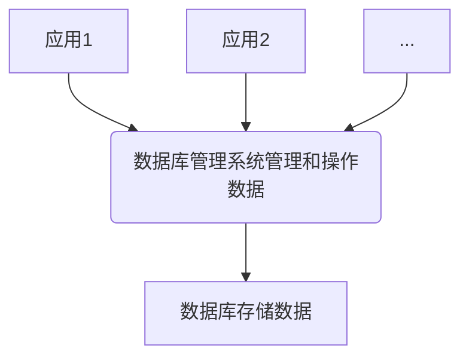
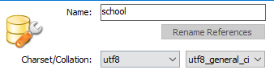
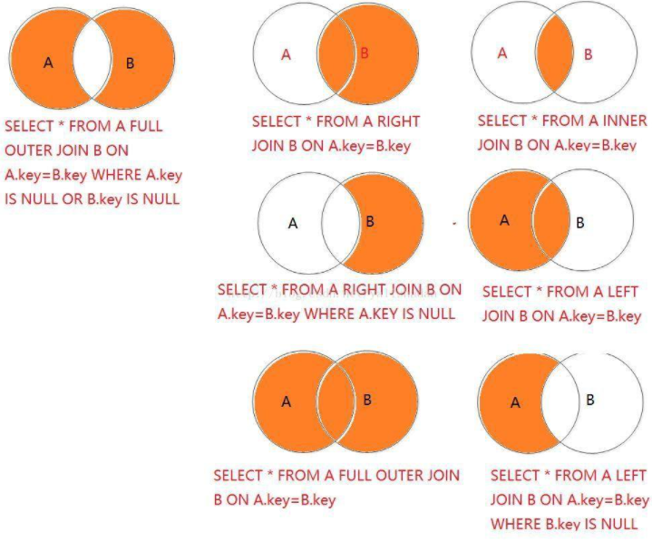

# MySQL

## 1.初识MySQL

JavaEE 企业级Java开发 Web

前端 页面 展示数据

后台 连接点 连接数据库JDBC，连接前端 控制，控制视图跳转，和给前端传递数据

数据库 存数据 txt，Execl，word

> 操作系统，数据结构与算法
>
> 离散数学，数字电路，体系结构，编译原理

### 为什么学习数据库

- 岗位需求
- 大数据时代
- 存数据
- 数据库是所有软件体系中最核心的存在

### 什么是数据库

数据库 DB Database

概念：数据仓库，软件，安装在操作系统之上的

作用：存储数据，管理数据

### 数据库分类

DBMS:database management system

关系型数据库

- MySQL，Oracle，Sqk Server，DB2，SQLite
- 通过表和表之间，行和列之间的关系进行数据的存储，类似于Excel

非关系型数据库

- Redis、MongDB
- 非关系型数据库，对象存储，通过对象自身的属性来决定。

DBMS(数据库管理系统)

- 数据库的管理软件，对数据库进行管理，维护和获取数据
- MySQL



### MySQL简介

- 关系型数据库管理系统
- Oracle旗下产品
- RDBMS 关系型数据库管理系统
- SQL语言
- 关系数据库将数据保存在不同的表中
- 开源
- 大中小网站

### 安装MySQL

[MySQL8.0.21安装](https://zhuanlan.zhihu.com/p/248765586)

1. 下载压缩包解压

2. 添加环境变量

3. 配置环境变量，bin目录F:\Program Files\mysql-8.0.21-winx64\bin\

4. 新建配置文件my.ini，和bin目录同级

   ```ini
   [mysql]
    
   # 设置mysql客户端默认字符编码形式
    
   default-character-set=utf8mb4
    
   [mysqld]
    
   #设置端口号，默认3306
    
   port = 3306
    
   # 设置mysql的安装目录
    
   basedir=F:\Program Files\mysql-8.0.21-winx64\
    
   # 设置mysql数据库的数据存放目录
    
   datadir=F:\Program Files\mysql-8.0.21-winx64\data\
    
   # 设置最大连接数
    
   max_connections=200
    
   # 允许连接失败的次数
    
   max_connect_errors=10
    
   # 服务端使用的字符集默认为utf8mb4
    
   character-set-server=utf8mb4
    
   # 创建新表时将使用的默认存储引擎
    
   default-storage-engine=INNODB
    
   # 默认使用“mysql_native_password”插件认证
    
   #mysql_native_password
    
   default_authentication_plugin=mysql_native_password
    
   [client]
    
   # 设置mysql客户端连接服务端时默认使用的端口
    
   port=3306
    
   default-character-set=utf8mb4
   
   # 第一次安装跳过密码验证
   # skip-grant-tables
   ```

5. 启动管理员模式下CMD，切换到bin目录下，运行所有命令

   ```cmd
   cd F:\Program Files\mysql-8.0.21-winx64\bin 
   进入 mysql的bin文件夹
   F:
   切换到bin路径
   mysqld --initialize --user=mysql --console
   获取mysql临时登录密码 即 root@localhost:后面的字符，注意，输入此命令后，需要等待十几秒钟，直到出现root@localhost:，之后如果还没有退出，按住ctrl+C，等待一段时间便会退出这个指令。
   mysqld --install
   安装mysql
   net start mysql
   启动mysql
   mysql -u root -p
   登录mysql，密码就是之前获得的密码
   ALTER USER USER() IDENTIFIED BY '123456';
   修改密码为123456
   ```


### 安装WorkBench或者SQLyog


- 新建一个数据库

  

- 新建一个表

  ```sql
  CREATE TABLE `school`.`student` (
    `id` INT NOT NULL COMMENT '学生id',
    `name` VARCHAR(100) NOT NULL COMMENT '\'学生姓名\'',
    `age` INT NOT NULL COMMENT '年龄',
    PRIMARY KEY (`id`))
  ENGINE = InnoDB
  DEFAULT CHARACTER SET = utf8;
  ```

- 插入数据

  ```sql
  INSERT INTO `school`.`student` (`id`, `name`, `age`) VALUES ('1', '张三', '10');
  ```

- 连接数据库

  WorkBench不显示mysql等表，可以通过下面设置

  Edit -> Preferences -> SQL Editor -> 勾上 Show Metadata and Internal Schemas

  命令行连接

  ```cmd
  mysql -uroot -p123456 -- 连接数据库
  update mysql.users set authentication_string=password('123456') where user='root' and Host = 'localhost'; --修改密码
  flush privileges; --刷新权限
  
  ----------------------------------
  -- 所有数据使用;结尾
  show databses; -- 查看所有数据库
  
  use school --切换数据库  use 数据库名
  show tables; --查看数据库中所有的表
  describe student;  --显示数据中表的所有信息
  create database flywinter; --创建一个数据库
  exit; -- 退出连接
  -- 单行注释
  /*
  sql的多行注释
  */
  ```

- 查看user表

  ```sql
  use mysql;
  show tables;
  select * from user;
  ```

  

DDL  数据库定义语言

DML 数据库操作语言

DQL 查询

DCL 控制

## 2. 操作数据库

操作数据库-->操作数据库中的表-->操作数据库中表的数据

### 操作数据库

mySql不区分大小写

1. 创建数据库

   ```sql
   create database [if not exists] season;
   ```

2. 删除数据库

   ```sql
   drop database [if exists] season;
   ```

3. 使用数据库

   ```sql
   use `season`; --如果是表名或字段名等是特殊字符就需要用`
   ```

4. 查看数据库

   ```sql
   show databases -- 查看所有的数据库
   ```

### 数据库的列类型

> 数值

- tinyint 	十分小的数据 1个字节
- smallint  较小的数据     2个字节
- mediumint  中等大小的数据 3个字节
- **int 标准的整数              4个字节**
- bigint 较大的数据        8个字节 
- float 浮点数 4个字节
- double 浮点数 8个字节
- decimal 字符串形式的浮点数  金融计算的使用一般使用

> 字符串

- char  字符串 固定大小 0~255
- **varchar  可变字符串 0~65535**  常用的String
- tinytext   微型文本   2^8-1
- **text  文本串     2^16-1**  保持大文本

> 时间日期

java.util.Date

- date  YYYY-MM-DD日期
- time  HH:mm:ss 时间格式
- **datetime YYYY-MM-DD HH:mm:ss 最常用的时间格式**
- **timestamp  时间戳  1970.1.1 到现在的毫秒数**
- year  年份表示

> null

- 没有值，未知
- 注意，不要使用NULL进行运算，运算结果一定为null

### 数据库的字段属性

Unsigned

- 无符号的整数
- 不能声明为负数

zerofill

- 0填充
- 不足的位数用0填充 int(3)  5  005

自增

- 通常理解为自增。自动在上一条记录的基础上+1(默认)
- 通常用来设计唯一的主键，index，必须是整数类型
- 可以自定义设计主键自增的起始值和步长

非空 not null

- 如果设置为not null，不赋值，就会报错
- Null，不写值，默认为null

默认

- 设置默认的值

```sql
/*
每一个表，都必须存在以下五个字段

id 			主键

version	乐观锁

is_delete	伪删除

gmt_create 创建时间

gmt_update 修改时间
*/
```


### 创建数据库表

```sql
-- 字符串使用单引号括起来
-- 所有的语句(最后一个除外)加,
-- primary key 一般一个表只有一个默认的主键
create table if not exists `student`(
    `id` int not null auto_increment comment  '主键',
    `name` varchar(30) not null default '匿名' comment '姓名',
    `pwd` varchar(20) not null default '123456' comment '密码',
    `gender` varchar(2) not null  default '女' comment '性别',
    `birthday` datetime default null comment '出生日期',
    `address` varchar(100) default null comment '住址',
    `email` varchar(50) default null comment '邮箱',
    primary key(`id`)
)engine = INNODB default charset = utf8 comment '学生表'
```

格式

```sql
create table [if not exists] `表名`(
    `字段名` 列类型 [属性] [索引] [注释],
    `字段名` 列类型 [属性] [索引] [注释],
    `字段名` 列类型 [属性] [索引] [注释]
    primary key(`主键`)
)[表类型][字符集设置][注释]
```

常用命令

```sql
show create database 数据库名; -- 查看创建数据库的语句
show create table 表名; -- 查看创建表的语句
DESC 表名 --显示表的结构
```

### 数据表的类型

```sql
/*
关于数据引擎
INNODB 默认使用
MYISAM 早些年使用的
*/
```

|              | MYISAM | INNODB        |
| ------------ | ------ | ------------- |
| 事务支持     | 不支持 | 支持          |
| 数据行锁定   | 不支持 | 支持          |
| 外键约束     | 不支持 | 支持          |
| 全文索引     | 支持   | 不支持        |
| 表空间的大小 | 较小   | 较大，约为2被 |

常规使用操作

- MYISAM 节约空间，速度较快
- INNODB 安全性高，事务的处理，多表多用户操作

> 在物理空间的存在位置

所有的数据库文件都存在data文件夹下，一个文件夹对应一个数据库

本质还是文件的存储

MYSQL引擎在物理文件上的区别

- InnoDB在数据库表中只有一个*.frm文件，以及上级目录下的ibdata1文件
- MYISAM对应文件
  - *.frm  表结构定义文件
  - *.MYD 数据文件 data
  - *.MYI  索引文件 index

> 设置数据库表的字符集编码

```sql
charset = utf8
```

不设置的话，会是mysql默认的字符集编码，不支持中文

MYSQL默认编码是Latin1，不支持中文

在my.ini中配置默认的编码

```ini
character-set-server=utf8
```

### 修改删除表

> 修改

```sql
-- 修改表名 alter table 旧表名 rename as 新表名; 
alter table school rename as schools; 
-- 增加表的字段 alter table 表名 add 字段名 列属性;
alter table school add age int;
-- 修改表的字段(重命名，修改约束)，change可以改约束，但是最好只改名
-- alter table 表名 modify 字段名 列属性;
alter table school modify age varchar(11); -- 修改约束
-- alter table 表名 旧名 新名 列属性;
alter table schoolchange age age1 int; -- 字段重命名

-- 删除表的字段
alter table school drop age;
```


> 删除

```sql
-- 删除表(如果表存在删除)
drop table if exists school;
```

所有的创建和删除操作尽量加上判断，避免报错

注意

- ``
- 注释 -- /**/
- 关键字大小写不敏感，最好小写
- 所有符号全部用英文

## 3. MySQL数据管理

### 外键 了解

比如学生和年级

学生的gradle引用年级表的id  约束

> 方式一，创建表的时候创建外键

```sql
create table users(
                      username varchar(50) not null primary key,
                      password varchar(500) not null,
                      enabled boolean not null
);

create table authorities (
                             username varchar(50) not null,
                             authority varchar(50) not null,
                             key fk_authorities_users(username),
    constraint fk_authorities_users foreign key(username) references users(username)
) ;
```

删除有外键关系的表的时候，必须要先删除引用别人的表(从表)，然后才能删除被引用的表(主表)

> 方式二 创建表成功后，增加外键约束

```sql
create table users(
                      username varchar(50) not null primary key,
                      password varchar(500) not null,
                      enabled boolean not null
);

create table authorities (
                             username varchar(50) not null,
                             authority varchar(50) not null,
) ;


alter table `authorities`
add constraint `fk_authorities_users` foreign key(`username`) references `users`(`username`);

-- alter table `表`
add constraint `约束名` foreign key(`作为外键的列`) references `哪个表`(`哪个字段`);
```

以上操作都是物理外键，数据库级别的外键，不建议使用，避免数据过多造成困扰

最佳实践

- 数据库就是单纯的表，只用来存数据，只有行数据和列字段
- 我们使用数据库多表查询的时候，在应用层解决(使用代码解决)

### DML语言 记住

数据库意义：数据存储，数据管理

DML语言：数据操作语言

- insert
- update
- delete

### 添加

> insert

```sql
-- 插入语句
insert into 表名 (字段名1,字段名2,...) values (值1，值2，...)
insert into users (username, password, enabled) values ('name','pass',true);
insert into users  values ('name','pass',true);
-- 一般写插入语句，我们一定要数据和字段一一对应
insert into users (username, password, enabled) values ('name','pass',true)
,('name','pass',true),...;
```

语法 ==insert into 表名 [(字段名1,字段名2,...)] values (值1，值2，...),(值1，值2，...),...;==

- 字段可以省略，但字段一定要一一对应

### 修改

> update 修改谁 条件  set 原来的值 = 新值

```sql
update users set username = 'Jack' where username = 'root';
-- 不指定条件下会修改表中所有数据
update users set username = 'Jack';

-- 语法
-- update 表名 set column_name = 'Jack',[...] where [条件];
-- 修改多个属性
update users set username = 'Jack',password = '123456' where username = 'root';
```

条件 where 字句 运算符 id大于某个值，等于某个值，在某个区间内修改

| 操作符            | 含义         | 范围        |
| ----------------- | ------------ | ----------- |
| =                 | 等于         | 5==6        |
| <>或!=            | 不等于       | 5<>6        |
| >                 | 大于         | 6>3         |
| <                 | 小于         | 5>3         |
| >=                | 大于等于     | 4<=6        |
| <=                | 小于等于     | 5>=3        |
| between... and... | 在某个范围内 | [2,5]       |
| and               | &&           | 5>6 and 6>3 |
| or                | \|\|         | 5>6 or 3<1  |
|                   |              |             |

语法 ==update 表名 set column_name = 'Jack',[...] where [条件];==

注意

- column_name是数据的列，尽量带上``
- 条件，筛选的条件，如果没有指定，则会修改所有的值
- set的value可以是值也可以是变量，比如sql内置的current_time()
- 多个设置的属性之间，使用英文逗号隔开

### 删除

> delete

语法 ==delete from 表名 [where 条件];==

```sql
-- 删除指定数据
delete from users where username = 'root';
-- 避免这样写，会删除全部的
delete from users
```

> TRUNCATE 命令

作用 完全清空一个数据库表，表的结构和索引约束不变

```sql
truncate users; -- 清空users表
```

> delete 和TRUNCATE 区别

- 相同点：都能删除数据，不会删除表结构
- 不同
  - TRUNCATE  重新设置自增列，计数器会归零
  - TRUNCATE 不会影响事务

delete删除的问题，重启数据库

- InnoDB自增列会从1开始(存在内存中，断点即失)
- MyISAM 继续从上一个子增量开始(存在文件中的，不会丢失)

## 4. DQL查询数据(最重点)

### DQL

(Data Query Language：数据查询语言)

- 所有的查询操作都用它
- 简单的查询，复杂的查询它都能做
- 数据库最核心的语言，最重要的语句
- 使用频率最高的语句

### 指定查询字段

```sql
-- 查询全部的用户
select * from users;
-- 查询指定字段
select username from users;
-- 别名，给结果起一个名字,可以给字段起别名，也可以给表起别名
-- as可以省略
select username as u from users;
select username  u from users;
select username  u from users as ta;
select username  u from users  ta;
-- 函数 Concat(a,b)
select concat('用户名：',username) newName from users;
```

语法：==select 字段,... from 表==

```sql
-- select完整语法
SELECT[ALL|DISTINCT|DISTINCTROW|TOP]
{*|talbe.*|[table.]field1[AS alias1][,[table.]field2[AS alias2][,…]]}
FROM tableexpression[,…][IN externaldatabase]
[WHERE…]
[GROUP BY…]
[HAVING…]
[ORDER BY…];
```


> 有时候，列或表名字没有那么见名知意，所以需要起别名  as 


> 去重 distinct

作用：去除select查询出来的结果中重复的数据，重复的数据只显示一条

```
select * from users; -- 查询全部的用户
select distinct username from users; -- 所有重复数据都会去除
```

> 数据库列 表达式

```sql
select version(); -- 查询系统版本 (函数)
select 100 *3-1 as 结果; -- 用来计算 （表达式）
select @@auto_increment_increment; -- 查询自增的步长 (变量)
```


```
-- 将record+1
select record, record + 1 as changed from student;
```

数据库中的表达式

- 文本值
- 列
- Null
- 计算表达式
- 系统变量

select ==表达式== from 表

### where 条件子句

作用：检索数据中符合条件的值

搜索条件由一个或者多个表达式组成，结果，布尔值

> 逻辑运算符

| 运算符  | 语法            | 描述                           |
| ------- | --------------- | ------------------------------ |
| and &&  | a and b    a&&b | 逻辑与，两个都为真，结果为真   |
| or \|\| | a or b  a\|\| b | 逻辑或，其中一个为真，结果为真 |
| not !   | not  a   !a     | 逻辑非，真为假，假为真         |

尽量使用英文字母

```sql
select record from student where record < 100 and record > 95;
select record from student where record between 100 and 95;
select record from student where not record 100;
select record from student where record != 100;
```

> 模糊查询 比较运算符

| 运算符      | 语法               | 描述                          |
| ----------- | ------------------ | ----------------------------- |
| is null     | a is null          | 如果操作符为null,结果为真     |
| is not null | a is not null      | 如果操作符为not null,结果为真 |
| between     | a between b and c  | 如果a在b和c之间，则结果为真   |
| like        | a like b           | SQL如果a匹配b，则结果为真     |
| in          | a in (a1,a,b,c,..) | 假设a在a1,a,b,...，则结果为真 |

```sql
-- like结合， %(代表0到任意个字符) _(一个字符)
select username from users where username like '%l%';
select username from users where username like 'l_';
-- 查询指定范围
select username from users where username in ('Jack','Liu');
-- 查询不为空的
select * from users where username is not null ;
```

### 连表查询

> join 对比


七种join




```sql
-- 连表查询
/*
思路
1. 分析查询的字段来自那些表 连接查询
2. 确定使用哪种连接查询 7种
确定交叉点 (这两个表中哪个数据是相同的)
判断的条件，学生表中的studentNo = 成绩表 studentNo
left join 左连接
*/
-- inner join
select u.username username,u.password password,u.enabled enbale,a.authority
from users u inner join authorities a
on u.username = a.username;
-- Right join
select u.username username,u.password password,u.enabled enbale,a.authority
from users u right join authorities a
on u.username = a.username;
-- left join
select u.username username,u.password password,u.enabled enbale,a.authority
from users u left join authorities a
 on u.username = a.username;
```

| 操作       | 描述                                       |
| ---------- | ------------------------------------------ |
| inner join | 如果表中至少有一个匹配，就返回行           |
| left join  | 会从左表返回所有的值，即使右表中没有匹配   |
| right join | 会从右表中返回所有的值，即使左表中没有匹配 |

> 自连接

自己的表和自己的表连接，核心：一张表拆为两张一样的表

### 分页和排序

limit  order by

```sql
-- 升序ASC 降序 DESC
-- order by 通过哪个字段进行排序
select * from users order by username desc ;
```

```sql
-- 为什么要分页
-- 缓解数据库压力
-- 语法 limit  跳过多少条数据,取多少条数据
-- 第n页   (n-1)*pageSize,pageSize
-- pageSize 页面大小 n当前页
-- (n-1)*pageSize 起始值
-- 数据总量/页面大小 = 总页数
select * from users limit 1,5;
```

### 子查询

where (值是计算的)

本质，在where语句中嵌套一个子查询语句

```sql
select * from users where username = (select  username from authorities);
```

### 分组和过滤

group by ...  having 条件

having是对分组后的进行筛选


### select小结

```sql
select 字段 from 表
xxx join 要连接的表 on 等值判断
where 具体的值，子查询语句
group by 通过哪个字段进行分组
having 过滤分组后的信息，条件和where一样，位置不同
order by 通过哪个字段排序 升序/降序
limit startindex，pagesize
```


## 5. MySQL函数

### 常用函数

```sql
select  abs(-8);  -- 绝对值
select ceiling(9.4); -- 向上取整
select floor(9.4); -- 向下取整
select rand(); -- 返回一个0~1之间的随机数
select sign(-10); -- 判断一个数的符合， 0-0 负数 -1 正数1
-- 字符串函数
select char_length('Black'); -- 返回字符串长度
select concat('1','2','3'); -- 拼接字符串
select insert('这是一个字符串',1,2,'123'); -- 查询，替换 某个位置替换某个长度
select lower('Black'); -- 变为小写
select upper('Black'); -- 变为大写
select instr('123456','3'); -- 返回第一次出现的字串的索引
select replace('123456','1','a'); -- 替换
select substr('123456',2,3); -- 返回指定的字符串，截取位置，截取长度
select reverse('123456'); -- 反转字符串


-- 时间函数
select current_date(); -- 获取当前日期
select curdate(); -- 获取当前日期
select now(); -- 获取当前时间
select localtime(); -- 本地时间
select sysdate(); -- 系统时间

select year(now());
select month(now());
select day(now());
select hour(now());
select minute(now());
select second(now());

-- 系统
select system_user();
select user();
select version();
```

### 聚合函数

| 函数名称 | 描述   |
| -------- | ------ |
| COUNT()  | 计数   |
| SUM()    | 求和   |
| AVG()    | 平均值 |
| MAX()    | 最大值 |
| MIN()    | 最小值 |
| ...      | ...    |

```sql
-- 都可以查出数量
select count(username) from users; -- 字段，忽略所有的null
select count(1) from users; -- 不会忽略null 本质计算行数
select count(*) from users; -- 不会忽略null

select sum(age) from student; -- 总和
select avg(age) from student; -- 平均
select max(age) from student; -- 最大
select min(age) from student; -- 最低

```

### 数据库级别的MD5加密

什么是MD5

信息摘要算法

MD5不可逆

MD5破解网站本质是字典，存储已经破解的值

```sql
insert into users (username, password, enabled) values ('Jack','123456',true);
update users set password = md5(password) where username = 'Jack';
update users set password = md5(password);
insert into users (username, password, enabled) values ('Jack',md5('123456'),true);
```

## 6. 事务

### 什么是事务

要么都成功，要么都失败

> 事务原则 ACID原则 原子性一致性 隔离性 持久性 幻读 脏读

#### 原子性(Atomicity)

要么都成功，要么都失败

#### 一致性(Consistency)

事务前后的数据完整性要保持一致

#### 持久性(Durability)

事务一旦提交不可逆转，被持久化到数据库中

#### 隔离性(Isolation)

十五点隔离性是指多个用户并发访问数据库时，数据库为每一个用户开启的事务，不能被其他事务的操作数据库所干扰，事务之间相互隔离

> 隔离导致的一些问题

#### 脏读

指一个事务读取了另外一个事务未提交的数据

#### 不可重复读

在一个事务内读取表中的某一行数据，多次读取结果不同，不一定是错误，只是读取场合不对

#### 幻读、虚读

在一个事务内读取到了别的事务插入的数据，导致对其前后不一致

> 执行事务

```sql
-- mysql默认开启事务自动提交的
set autocommit  = 0 ; -- 关闭自动提交
set autocommit  = 1 ; -- 开启自动提交

-- 手动处理事务
set autocommit  = 0 ; -- 关闭自动提交
start transaction ; -- 标记一个事务开始
insert into users (username, password, enabled) values ('11','11',true);
insert into users (username, password, enabled) values ('23','22',true);
commit; -- 提交事务
rollback ; -- 未提交之前回滚
-- 事务结束
set autocommit  = 1 ; -- 开启自动提交

savepoint 保存点名; -- 设置一个事务的保存点
rollback to savepoint 保存点名;
release savepoint 保存点名; -- 撤销保存点
```

## 7. 索引

> MySQL官方对索引的定义为：索引index是帮助MySQL高效获取数据的数据结构
>
> 索引本质是数据结构

### 索引分类

- 主键索引 primary key
  - 唯一的标识，主键不可重复，只能有一个列作为主键
- 唯一索引 unique key
  - 避免重复的列出现，唯一索引可以重复，多个列都可以标识为唯一索引
- 常规索引 key/index
  - 默认的 index/key关键字设置
- 全文索引 fullText
  - 特定的数据库引擎下才有MYISAM
  - 快速定位数据

```sql
show index from student; -- 显示所有索引信息
-- 增加一个索引 索引名 列名 
alter table `student` add fulltext index `name`(`name`);
-- 分析sql执行的状况
explain select * from users;
explain select * from users where match(username) against('张');
```

