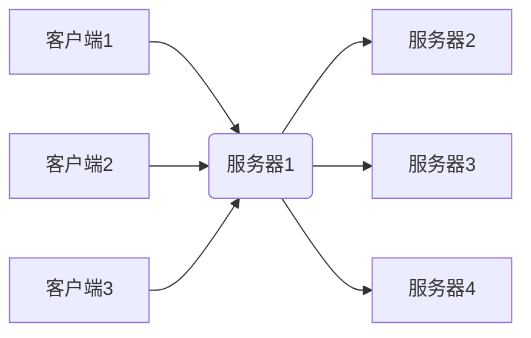
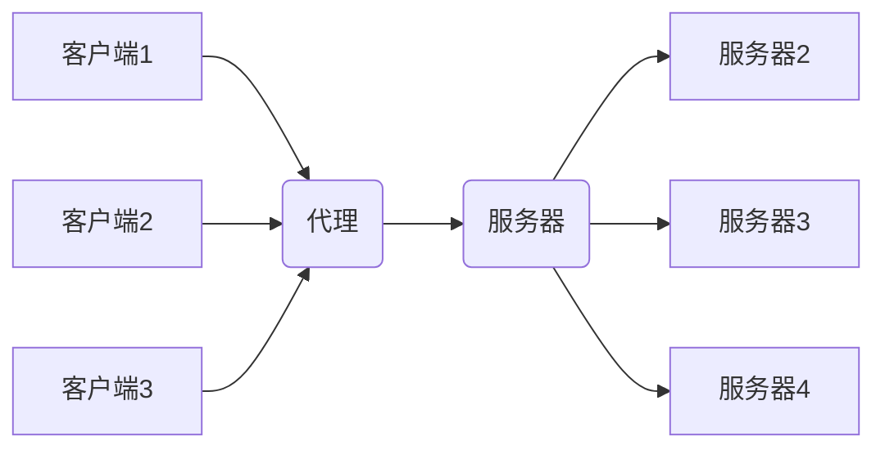
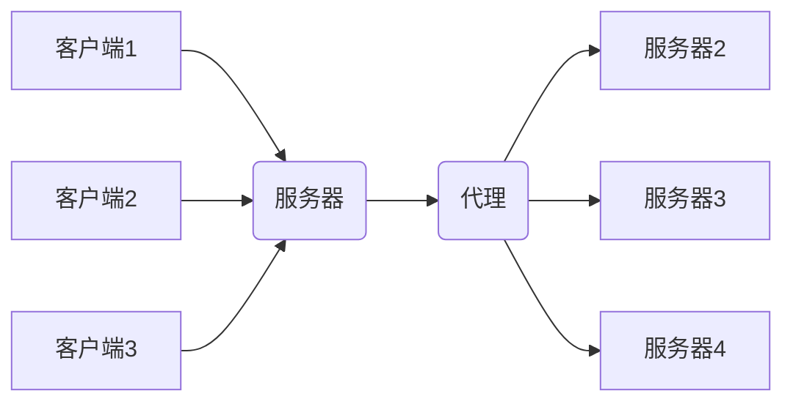
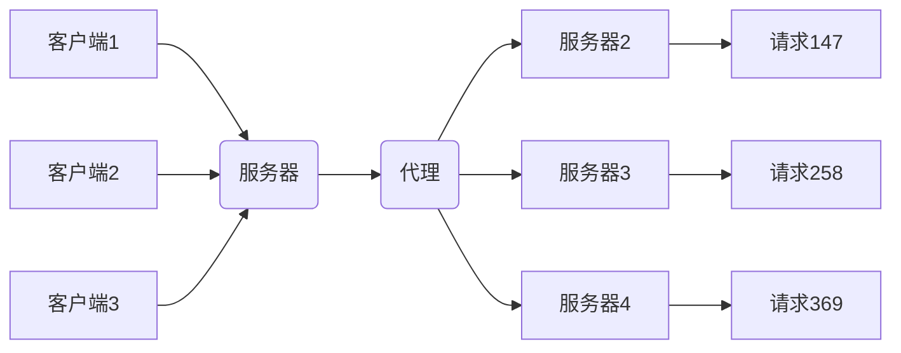
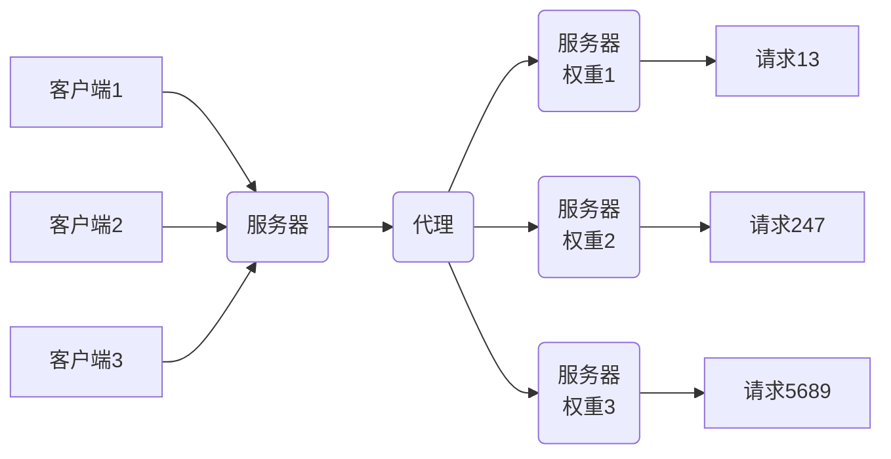
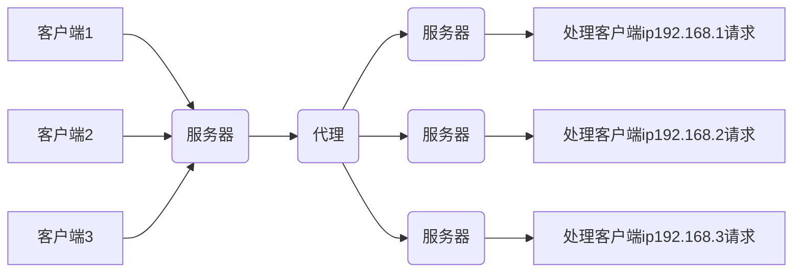
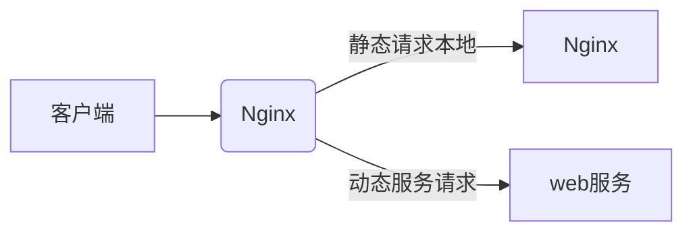

# Nginx

## 1. Nginx简介

在用户量小的时候，应用程序部署到一台服务器上，用户可以直接访问


在用户访问量很大的时候，一台服务器已经不能够满足要求了，所以需要同一个程序部署到多台服务器上，但是如果用户访问不同的服务器，session是无法共享的，因此需要在用户和服务器之间加一台代理服务器，用户访问时，先访问代理服务器，然后代理服务器再转发到对应的服务器上

反向代理，负载均衡



Nginx是一个高性能的HTTP和反向代理的web服务器，同时也提供了IMAP/POP3/SMTP服务

特点是是占有内存少，开发能力强

安装简单，占有内存少，并发能力强，配置文件简洁

完全用C写成，官方测试表明能够支持高达50000个并发连接的响应

## 2. Nginx作用

> 正向代理

比如VPN，用户先连接VPN。VPN再去访问服务器，代理客户端



> 反向代理

用户访问的都是一个域名，但是服务器收到请求后，又会转发到不同的服务器去处理

代理服务端



> Nginx提供的负载均衡策略有两种：内置策略和扩展策略，内置策略为轮询，加权轮询，Ip hash。扩展策略....

轮询

依次把请求发送到不同的服务器上



加权轮询

权重越大，分配的请求越多



ip hash

iphash对客户端请求的ip进行hash操作，然后根据hash结果将同一个客户端ip的请求分发给同一台服务器进行处理，可以解决session不共享的问题，推荐使用Redis进行session共享



> 动静分离，在我们的软件开发中，有些请求时需要后台处理的，有些请求是不需要经过后台处理的，如css，html，jpg，js等文件，这些不需要经过后台处理的文件称为静态文件，让动态网站里的动态网页根据一定规则把不变的资源和经常变的资源区分开来，动静资源做好了拆分以后，我们就可以根据静态资源的特点将其做缓存操作，提高资源的响应速度



## 3. Nginx安装

[Nginx官网](http://nginx.org/en/download.html)

### windows

选择stable version下的windows版本

下载解压运行即可

### Linux

```bash
# 下载压缩包
# 解压
tar -zxvf nginx-1.20.1.tar.gz
cd nginx-1.20.1/
# 执行配置文件
./configure
# 编译
make
# 验证一下
make install
[root@VM-0-17-centos nginx-1.20.1]# whereis nginx
nginx: /usr/local/nginx
[root@VM-0-17-centos nginx-1.20.1]# cd /usr/local/nginx
[root@VM-0-17-centos nginx]# cd sbin
[root@VM-0-17-centos sbin]# ll
total 3796
-rwxr-xr-x 1 root root 3883616 Aug  9 11:45 nginx
# 运行nginx
[root@VM-0-17-centos sbin]# ./nginx
```

## 4. nginx常用命令

```bash
cd /usr/local/nginx/sbin
./nginx 	# 启动
./nginx -s stop	# 停止
./nginx -s quit	# 安全退出
./nginx -s reload	# 重新加载配置文件
ps aux|grep nginx	# 查看nginx进程
```

> linux相关命令

```bash
# 开启
service firewalld start
# 重启
service firewalld restart
# 关闭
service firewalld stop
# 查看防火墙规则
firewall-cmd --list-all
# 查询端口是否开放
firewall-cmd --query-port=8080/tcp
# 开放80端口
firewall-cmd --permanent --add-port=80/tcp
# 移除端口
firewall-cmd --permanent --remove-port=8080/tcp
# 重启防火墙(修改配置后需要重启防火墙)
firewall-cmd --reload

#参数解释
firewall-cmd 是linux提供的操作firewall的一个工具
--permanent 表示设置为持久
--add-port b
```


