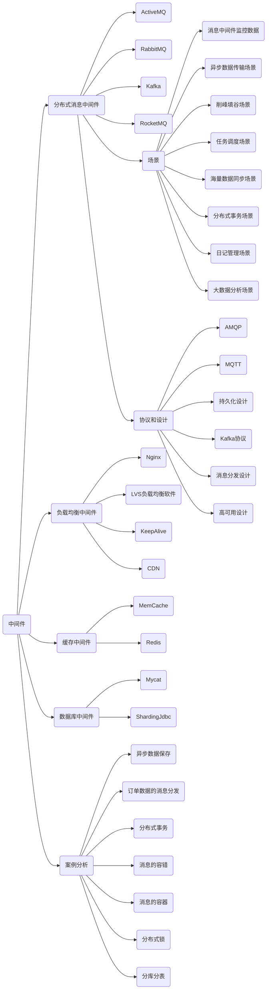

# MQ

## 简介

### 什么是中间件

> 中间件是处于操作系统和应用程序之间的软件

举例 

1. RMI 远程调用
2. Load Balancing 负载均衡
3. Transparent Fail-over透明的故障切换
4. Clustering 集群
5. Transaction事务
6. Resource pooling 资源池
7. Serurity 安全
8. Caching 缓存
9. ....

### 为什么使用消息中间件

> 中间件屏蔽了底层操作系统的复杂性，使程序开发人员面对一个简单而统一的开发环境，减少程序设计的复杂性，将注意力集中在自己的业务上

### 中间件特点

> 中间件是唯一平台和应用之间的通用服务，这些服务具有标准的程序接口和协议，针对不同的操作系统和硬件平台，他们可以有符合接口和协议规范的多种实现

1. 满足大量应用的需要
2. 运行于多种硬件和OS平台
3. 支持分布计算，提供跨网络、硬件和OS平台的透明性的应用或服务的交互
4. 支持标准的协议
5. 支持标准的接口

### 在项目中什么时候使用中间件技术


## 中间件技术及架构的概述



学习目标

1. 什么是消息中间件
2. 什么是协议
3. 什么是持久化
4. 消息分发
5. 消息的高可用
6. 消息的集群
7. 消息的容错
8. 消息的冗余

什么是消息中间件

单体架构

分布式架构

网络协议三要素

1. 语法
   - 以http为例，http规定了请求报文和响应报文的格式
2. 语义
   - 客户端主动发起请求称之为请求
3. 时序
   - 一个请求对应一个响应

为什么消息中间件不直接使用http

1. 请求报文头和响应报文头复杂
2. 大部分都是短连接，请求到响应可能会中断，中断后就不会进行持久化

AMQP

1. 分布式事务支持
2. 消息的持久化支持
3. 高性能和高可靠的消息处理优势
4. RabbitMq和ActivityMq

MQTT协议

1. 轻量
2. 结构简单
3. 传输快，不支持事务
4. 没有持久化设计

适用场景

1. 计算能力有限
2. 低带宽
3. 网络不稳定
4. RabbitMQ,ActivityMQ

OpenMessage协议

1. 结构简单
2. 解析速度快
3. 支持事务和持久化设计

Kafka协议

1. 结构简单
2. 解析速度快
3. 无事务支持
4. 有持久化设计


协议是在tcp/ip协议基础上构建的一种约定俗称的规范和机制

## 消息队列持久化

数据存入磁盘，而不是存在内存中随服务器重启断开而消失

常见持久化

文件存储支持 ActiveMQ，RabbitMQ,Kafka，RocketMQ

数据库支持ActiveMQ


## 消息的分发策略

### 消息的分发策略

MQ消息队列有如下几个角色

1. 生产者
2. 存储消息
3. 消费者

## RabbitMQ安装

RabbitMQ是一个开源的遵循AMQP协议实现的基于Frlang语言编写，支持多种客户端语言，用于在分布式系统中存储消息，转发消息，具有高可用，高可扩性，易用性等特征

[RabbitMQ下载网址](https://www.rabbitmq.com/download.html)

安装erlang

```bash
yum install erlang
```

安装socat

```bash
yum install socat
```

安装rabbitMQ

```bash
wget https://github.com/rabbitmq/rabbitmq-server/releases/download/v3.9.1/rabbitmq-server-generic-unix-3.9.1.tar.xz

```

https://www.jianshu.com/p/3e8d1e097174


Docker安装RabbitMQ

```bash
# 包更新到最新
yum update
# 安装所需要的软件包，yum-util提供yum-config-manager功能，灵感两个是devicemapper驱动依赖的
yum install -y yum-utils device-mapper-persistent-data lvm2
# 设置yum源为阿里云
yum-config-manager --add-repo http://mirrors.aliyun.com/docker-ce/linux/centos/docker-ce.repo
# 安装docker
yum install docker-ce -y
# 安装docker前先卸载
sudo yum remove docker \
                  docker-client \
                  docker-client-latest \
                  docker-common \
                  docker-latest \
                  docker-latest-logrotate \
                  docker-logrotate \
                  docker-selinux \
                  docker-engine-selinux \
                  docker-engine
# 查看docker版本
docker -v
# 安装加速镜像
mkdir -p/etc/docker
tee /etc/docker/daemon.json <<-'EOF'
> {"registry-mirrors":["https://0wrdwnn6.mirror.aliyun.com"]}
> EOF
systemctl daemon-reload
systemctl restart docker
# 获取rabbit镜像
docker pull rabbitmq:management
# 创建并运行容器
# --hostname 指定容器主机名称
# --name 指定容器名称
# -p
 将mq端口号映射到本地或者运行时设置用户密码
 rabbitMQ3.9之后已经无法通过命令行设置，需要挂载配置文件
docker run -di --name myrabbit -e RABBITMQ_DEFAULT_USER=admin -e RABBITMQ_DEFAULT_PASS=admin -p 15672:15672 -p 5672:5672 -p 25672:25672 -p 1883:1883 rabbitmq:management

进入容器
rabbitmqctl add_user admin admin
rabbitmqctl set_user_tags admin administrator
rabbitmqctl set_permissions -p / admin ".*" ".*" ".*"
```

> 端口访问
> RabbitMQ 节点绑定到端口（开放服务器 TCP 套接字）以接受客户端和 CLI 工具连接。其他进程和工具（例如 SELinux）可能会阻止 RabbitMQ 绑定到端口。发生这种情况时，节点将无法启动。
>
> CLI 工具、客户端库和 RabbitMQ 节点也会打开连接（客户端 TCP 套接字）。防火墙可以阻止节点和 CLI 工具相互通信。确保可以访问以下端口：
>
> 4369：epmd，RabbitMQ 节点和 CLI 工具使用的对等发现服务
> 5672、5671：由 AMQP 0-9-1 和 1.0 客户端使用，没有和有 TLS
> 25672：用于节点间和 CLI 工具通信（Erlang 分发服务器端口）并从动态范围分配（默认限制为单个端口，计算为 AMQP 端口 + 20000）。除非确实需要这些端口上的外部连接（例如，集群使用联合或在子网外的机器上使用 CLI 工具），否则不应公开这些端口。有关详细信息，请参阅网络指南。
> 35672-35682：由 CLI 工具（Erlang 分发客户端端口）用于与节点通信，并从动态范围（计算为服务器分发端口 + 10000 到服务器分发端口 + 10010）分配。有关详细信息，请参阅网络指南。
> 15672：HTTP API客户端、管理 UI和rabbitmqadmin （仅当启用管理插件时）
> 61613、61614：没有和有 TLS 的STOMP 客户端（仅当启用了STOMP 插件时）
> 1883、8883：MQTT 客户端没有和有 TLS，如果启用了MQTT 插件
> 15674：STOMP-over-WebSockets 客户端（仅当启用了Web STOMP 插件时）
> 15675：MQTT-over-WebSockets 客户端（仅当启用了Web MQTT 插件时）
> 15692：Prometheus 指标（仅当启用Prometheus 插件时）

## 角色分类

1. none

   无法访问management plugin

2. management 

   - 查看自己相关节点信息
   - 列出自己可以通过AMQP登入的虚拟机
   - 查看自己的虚拟机节点virtual hosts的queues。exchanges和bingdings信息
   - 查看和关闭自己的channel和connections
   - 查看有关自己虚拟机节点的virtual hosts的统计信息、包括其他用户在这个节点virtual hosts中的活动信息

3. Policymaker

   - 包含management所有权限
   - 查看和创建删除自己的virtual hosts所属的policies和parameters信息

4. Monitoring

   - 包含management所有权限
   - 罗列出所有的virtual hosts，包括不能登录的virtual hosts
   - 查看其他用户的connections和channels信息
   - 查看节点级别的数据如clustering和memory使用情况
   - 查看所有的virtual hosts的全局统计信息

5. Administrator

   - 最高权限
   - 可以创建和删除virtual hosts
   - 可以查看、创建和删除users
   - 查看创建permissions

## 快速入门


## NEW

## 1. MQ相关概念

### MQ简介

> 本质上还是个队列,FIFO，先入先出，只不过队列中存放的内容时message而已，还是一种跨进程的通信机制，用于上下游传递消息，在互联网架构中，MQ是一种非常常见的上下游"逻辑解耦+物理解耦"的消息通信服务，使用了MQ之后，消息发送上游只需要依赖MQ，不用依赖其他服务

### MQ作用

#### 1. 流量削峰

比如1s一万个订单，直接处理会导致服务宕机，可以把这一万个订单放到MQ中，作为缓冲，分散成十几秒来处理，虽然用户体验会差一点，但是比不能下单好一些

#### 2. 应用解耦

比如订单系统、库存系统、物流系统、支付系统，用户创建订单后，如果直接调用库存、物流、支付系统，任何一个系统出了故障，下订单操作就会出现故障，如果采用消息队列，将下订单放入队列中，那么其余的系统可以直接从队列中获取信息，只要队列可用，即使系统出了故障，比如网络故障，也可以在恢复后重新从队列中获取信息，比如下单成功了，但是没扣钱，过了一会扣钱，总比下单没成功好。

#### 3. 异步处理

有些服务是异步调用的，开始调用和返回结果需要的时间很长，虽然可以提供回调接口，但是并不是很好，使用消息队列，调用其他服务后，接着做自己的事情，等到被调用的服务返回结果后，存入MQ，MQ再通知A，当然，这种调用的前提是调用者并不是非得等被调用者返回结果才能执行后面的逻辑。

### MQ 分类

#### ActiveMQ 

单机吞吐万级，时效ms级，可用性高，基于主从架构实现高可用，消息可靠性较低概率丢失数据

维护越来越少，高吞吐量较少使用

#### Kafka

大数据常用，大数据而生，单机百万级TPS

性能卓越，单机写入TPS百万条每秒，吞吐量高，时效性ms级，可用性非常高，分布式，一个数据多个副本，少数机器宕机不会丢失数据，不会导致不可用，消费者采用pull方式获取消息，消息有序，保证被消费且只被消费一次，实时计算和日志采集大规模使用

kafka单机超过64个队列/分区，Load会发生明显的飙高现象，队列越多，load越高，发送消息响应时间变长，使用短轮询方式，实时性取决于轮询间隔时间，消费失败不支持重试，支持消息顺序但是一台代理宕机后就好产生消息乱序

#### RocketMQ

金融互联网，阿里巴巴开源，Java实现，参考了kafka

单机吞吐量十万级，可用性很高，分布式架构，消息0丢失，支持10亿级别的消息堆积，不会因为堆积导致性能下降

支持的客户端语言不多，目前是java和C++，C++不成熟，没有在MQ核心中实现JMS等接口

#### RabbitMQ

中小型企业，当前最主流消息中间件之一，AMQP基础上完成

高并发，吞吐量万级，跨平台，支持多种语言，微秒级

商业版收费

## 2. RabbitMQ

### 基本概念

是一个消息中间件，接收、存储并转发消息，不进行处理

### 四大角色

>  生产者

产生数据发送消息的程序是生产者

> 交换机

交换机是RabbitMQ非常重要的一个部件，接收来自生产者的消息，将消息推送到队列中

> 队列

消息存储在队列中，队列仅受主机的内存和磁盘限制，本质上是一个大的消息缓冲区，许多生产者可以将消息发送到一个队列，许多消费者可以尝试从一个队列接收数据

> 消费者

消费和接收具有相似的含义，等待接收消息的程序，同一个应用程序既可以是消费者也可以是生产者

### 核心部分(6大模式)

HelloWorld简单模式

一个消费者对应一个生产者


Work Queues 工作模式

一个生产者对应多个消费者，每个消息只会被一个消费者消费一次，处理消息积压

轮询

这里消费者可以称为工作线程


Publish/Subscribe发布订阅模式


Routing路由模式


Topics主题模式


RPC 发布确认


- Broker 接收和分发消息的应用 RabbitMQ Server就是Message Broker
  - 一个交换机可以对应多个队列
  - 一个Broker可以存在多个交换机
- Virtual host：多用户
- Connection publish/consumer和broker之间的TCP连接
  - Channel 是connection内部建立的逻辑连接，轻量级的connection
- Exchange message到达broker的第一站，根据分发规则，匹配表中的routing key，分发消息到queue中

- Binding exchange和queue之间的虚拟连接


## 3. 具体使用

### 导入依赖

创建普通maven项目并导入依赖

```xml
<dependency>
    <groupId>com.rabbitmq</groupId>
    <artifactId>amqp-client</artifactId>
    <version>5.13.1</version>
</dependency>
<dependency>
    <groupId>commons-io</groupId>
    <artifactId>commons-io</artifactId>
    <version>2.6</version>
</dependency>
```


#### 消息应答

> 消费者完成一个任务可能需要一端时间，如果其中一个消费者处理一个耗时比较长的任务并且只完成了部分突然它挂掉了，这样就会丢失这条信息
>
> 为了保证消息发送过程中不丢失，rabbitMQ引入消息应答机制，消息应答就是，消费者在接收到消息并且处理该消息之后，告诉rabbitMQ它已经处理了，rabbitMQ可以把该消息删除了

#### 自动应答

消息发送完后立即被认为已经传送成功，这样如果在消息收到之前，消费者连接就关闭了，那么就会丢失消息，或者说消费者接受的消息过多，导致消息挤压，仅适用于消费者可以高效并以某种速率能够处理这些消息的情况下使用

#### 消息应答的方法

1. Channel.basicAck(用于肯定确认)

   RabbitQM已经知道该消息，并且成功的处理消息，可以将其丢弃了

2. Channel.basicNack(用于否定确认)

3. Channel.basicReject(用于否定确认)

   与2相比少一个参数，不出来该消息了直接拒绝，可以丢弃

4. Multiple

   手动应答的好处是可以批量应答并减少网络拥堵

   批量应答为true，会把所有的消息都会应答，为false那么只会应答当前消息

#### 消息自动重新入队

如果消费者由于某些原因失去连接，导致消息未发送ACK确认，RabbitMQ了解到消息未完全处理，并将其重新排队，如果此时其他消费者可以处理，分配给其他消费者，这样即使某个消费者偶尔死亡也不会丢失任何消息

## 4. RabbitMQ持久化 

### 队列持久化

```java
channel.queueDeclare(TASK_QUEUE_NAME,false,false,false,null);
```

只需要把第二个参数改为true即可持久化队列，这样即使MQ重启，消息也不会丢失

如果之前声明的队列不是持久化的，需要把原先的队列先删除，或者重新创建一个持久化队列，否则就会出错，持久化的队列Features会有D表示

### 消息持久化

只有消息和队列都持久化那么消息才不丢失

只需要把第三个参数改为MessageProperties.PERSISTENT_TEXT_PLAIN

```java
channel.basicPublish("",TASK_QUEUE_NAME, MessageProperties.PERSISTENT_TEXT_PLAIN,message.getBytes(StandardCharsets.UTF_8));
```

这并不是绝对的持久化，

### 不公平分发

能者多劳

通过设置参数chnnel.basicQos(1);

```
//设置不公平分发
//这里为1表示消费者队列里只能有一个未确认的消息
```

### 预取值

```java
就是最多可以屯多少条未执行的消息
```

## 5. 发布确认

1. 设置要求队列是否持久化
2. 设置要求队列中的消息必须持久化
3. 发布确认，生产者发送消息后，RabbitMQ保存到磁盘中后，返回给生产者，生产者确认了才是真正实现了发布持久化

```java
//开启发布确认
channel.confirmSelect();
```

### 单个确认发布

同步确认发布，前一个成功了才会发布下一条

发布速度慢

### 批量确认发布

### 异步确认发布

异步发布未确认消息

最好的解决方案就是把未确认的消息放到一个基于内存的能被发布线程访问的队列，比如说用ConcurrentLinkedQueue这个队列在confirmcallbacks与发布线程之间进行消息的传递

## 6. 交换机

之前的都是每个任务恰好交给一个消费者，现在需要将消息传达给多个消费者，这种模式称为发布/订阅

可以构建一个简单的日志系统，第一个程序发送日志消息，第二个程序是消费者，第一个消费者接收到消息并把日志存储到磁盘，另一个消费者接收到消息把消息打印到屏幕上，事实上第一个存程序发出的日志将广播给所有消费者

### 发布订阅模式

通过交换机，生产者发送一条消息，交换机把消息推送到两个队列，这样每个队列都会被消费

### Exchange

RabbitMQ消息传递模型的核心思想是：生产者生产的消息不糊直接发送到队列，实际上，通常生产者甚至都不知道这些消息传递到了哪些队列中

相反，生产者只能将消息发送到交换机，交换机的工作原理就是，一方面它接收来自生产者的消息，另一方面将它们推入队列，较罕见必须确切的知道如何处理接收到的消息，是应该把这些消息放到指定队列还是很多队列还是丢弃

### Exchange类型

直接(direct)、主题(topic)、标题(headers)、扇出(fanout)

routingKey 绑定队列和交换机

### 无名 exchange

默认的交换机

### 临时队列

没有持久化的队列

创建临时队列，名字随机产生的

```java
String Name = channel.queueDeclare().getQueue();
```

### Fanout

将所有消息广播到它知道的所有队列中

实战

### Direct exchange

路由模式

比如只把严重错误消息存储到日志文件，但是控制台打印所有的日志信息

routingKey来表示也可称该参数为binding key，创建绑定我们用代码

```
channel.queueBind(queueName,EXCHANGE_NAME,"routingKey");
```

绑定之后的意义由交换类型决定

对于fanout交换机，他只能进行无意识的广播，也就是只要有消息，那么就推给指定的队列，采用direct可以不同的消息推给不同的队列，如果绑定的routingKey一样，那么和fanout其实一样，fanout模式下，无论绑定的routingKey是否一样，都会给所有队列发消息

### Topics

就是加了通配符，通过通配符发送给多个或一个队列

必须是单调列表，点号分开

比如 

sto.nam   sim.mm 不能超过255个字节

*可以替代一个单词

#可以替代零个或多个单词

*.rab 以rab结尾的

当一个队列绑定键为#，那么这个队列将接收所有数据

如果队列没有#和*，那么就类似于direct

### 死信队列

顾名思义就是无法被消费的消息，一般来说，producet将消息投递到beoker或者直接到queue里面，consumer从queue取出消息进行消费，但某些时候由于特定的原因导致queue中的某些消息无法被消费，这样的消息如果没有后续的处理，就变成了死信

当消费发生异常，将消息放入到死信队列中，用户下单指定时间未支付，自动失效

#### 死信的来源

消息TTL过期

队列达到最大长度

消息被拒绝，拒绝应答并且没有放到队列中


### 延迟队列

> 队列内部是有序的，最重要的特性就体现在它的延时属性上，延时队列中的元素希望在指定时间到了以后或之前取出和处理，就是存放需要在指定时间被处理的元素的队列

#### 使用场景

1. 订单在十分钟之内未支付则自动取消
2. 新创建的店铺，如果在十天内都没有上传过商品，则自动发送消息提醒
3. 用户注册成功后，如果三天内没有登录则短信提醒
4. 用户发起退款，如果三天内没有得到处理则通知相关运营人员
5. 预定会议后，需要在预定的时间点前十分钟通知各个与会人员参加会议

 虽然这些场景可以通过定时任务实现，但是如果数据量比较大，时效性比较强的业务，实际上并不合适

### 整合SpirngBoot


#### 引入延迟队列插件


https://github.com/rabbitmq/rabbitmq-delayed-message-exchange/releases/tag/3.9.0


docker

```bash
$wget https://github.com/rabbitmq/rabbitmq-delayed-message-exchange/releases/download/3.9.0/rabbitmq_delayed_message_exchange-3.9.0.ez
$ docker cp rabbitmq_delayed_message_exchange-3.9.0.ez 7b01fca9f00b:plugins
$docker exec -it 7b01fca9f00b /bin/bash
$ cd plugins
$ ls -l|grep delay
$ rabbitmq-plugins enable rabbitmq_delayed_message_exchange
$ docker restart 7b01fca9f00b
成功
```


### 总结

基于死信和基于插件的延迟消息

基于死信的，不管时间大小，先进先出

基于插件的，时间小的先出来

当然，延时队列也可以使用Java的DelayQueue，Redis的zset，Quartz或者kafka的时间轮

## 7. 发布确认

在生产环境中由于一些不明原因，导致rabbitMQ重启，在RabbitMQ重启期间生产者消息投递失败，导致消息丢失，需要手动处理和恢复，最极端的情况RabbitMQ集群不可用的时候无法投递的消息如何处理

交换机或者队列出问题

### springboot版本

先解决交换机

配置文件中添加

```
spring.rabbitmq.publisher-confirm-type=correlated
```


不可路由，交换机收到了但是可能队列不存在，这样消息会直接丢弃，设置mandatory消息不可送达的时候把消息返回给生产者


### 备份交换机

当为某一个交换机声明一个对应的备份交换机是，由备份交换机来进行转发和处理，通常备份交换机的类型为Fanout，这样就能把所有消息都投递到与其绑定的队列中，然后我们在备份交换机下绑定一个队列，这样所有那些原交换机无法路由的消息，就会进入到这个队列中了，还可以建立一个报警队列，用独立的消费者进行检测和报警


备份交换机优先级更高，如果被备份了，就不会回退了


## 8. RabbitMQ其他知识

### 幂等性

用户对于统一操作发起的一次请求或者多次请求的结果是一致的，不会因为多次点击而产生了副作用

比如支付，用户购买商品后支付，支付扣款成功，但是返回结果时网络异常，次数钱已经扣了，用户再次点击按钮，进行第二次付款，返回结果成功，这样就会多扣钱，流水记录变成两条，以前放入事务即可

#### 消费者重复消费

消费者消费MQ消息时，MQ已经把消息发送给消费者，消费者返回ACK时网络中断，所以MQ没有收到确认信息，那么这条信息就会重新发给其他消费者，或者网络重连后再次发送给消费者，但是实际上该消费者已经成功消费了该条消息，造成消费者重复消费

#### 解决思路

一般使用去全局ID或者写个唯一标识比如时间戳或者UUID，或者订单消费者字节的ID，每次消费者消费时先判断该消息是否已经消费过

#### 唯一ID+指纹码

基于业务拼接形成，先利用查询语句判断这个id是否存在数据库中，然后判断是否重复，劣势是单个数据库就会有写入性能瓶颈，当然也可以分库分表 ，但并不是推荐的方式

#### Redis原子性

利用redis执行setnx命令，天然具有幂等性，从而实现不重复消费

### 优先级队列

比如订单催付，用户指定时间内未支付就发短信提醒，但是如果同一时间有大量催付需要，就需要区分优先级，比如订单金额大的先催促

x-max-priority 一般设置10，最大可以设置255

代码实现，声明队列，添加优先级参数，

发消息时，设置优先级，

实际中，消费太多消费不过来了优先级才会有作用

#### 惰性队列

消息保存在内存中还是磁盘上

正常情况：消息保存在内存中

惰性队列：消息保存在磁盘中

通常消费者宕机或者消费者维护的时候才会用惰性队列

x-queue-mode  lazy

## 9. RabbitMQ集群

master slave模式

hostname

reboot

vi /etc/hosts

确保cookie使用的是同一个值

### 镜像队列

集群后在哪台机器上创建的队列就只在哪台机器上存在，所以使用镜像队列，把消息备份只要在任意一个节点添加策略即可，那么即使一台机器挂了，消息也能够被消费，

### 实现高可用负载均衡

Haproxy  keepalive

### Federation Exchange

网络延迟，不同区域MQ信息同步

开启插件，上游到下游，交换机级别

### Federation Queue


### Shovel

