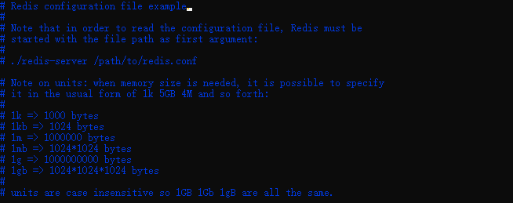
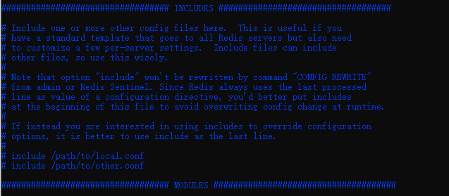
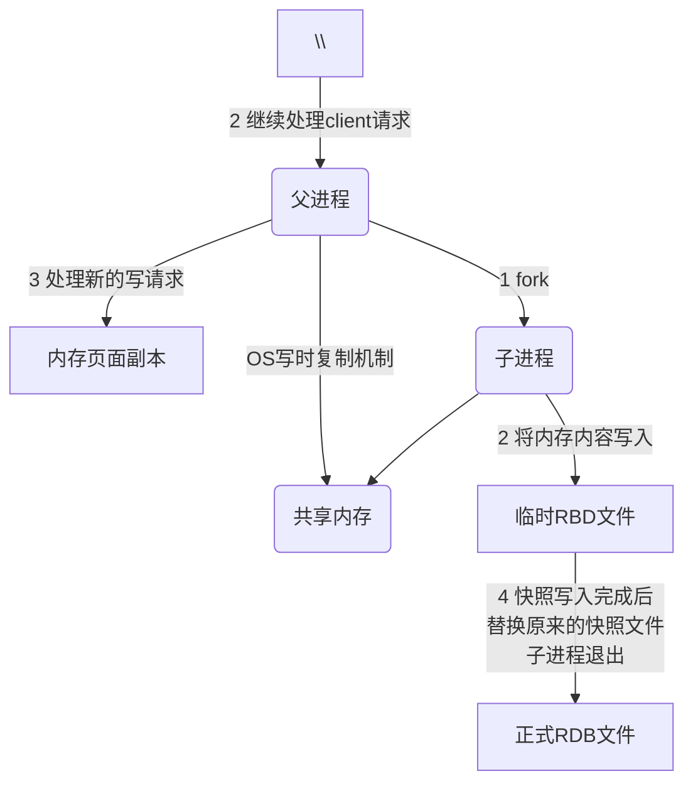
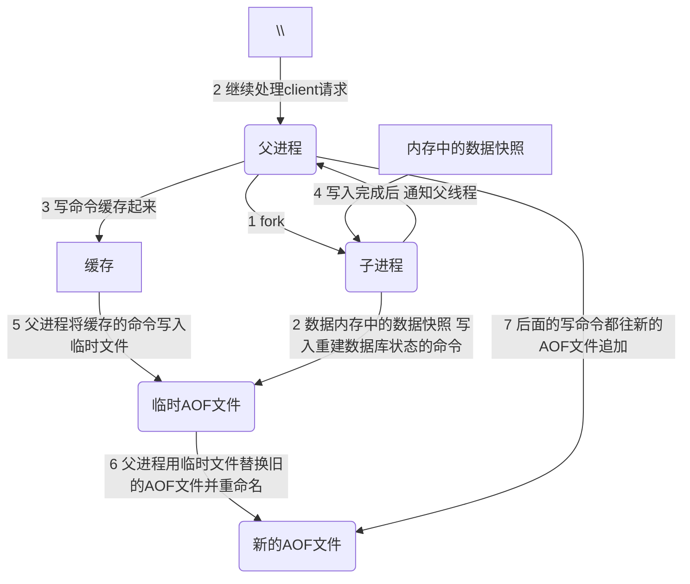
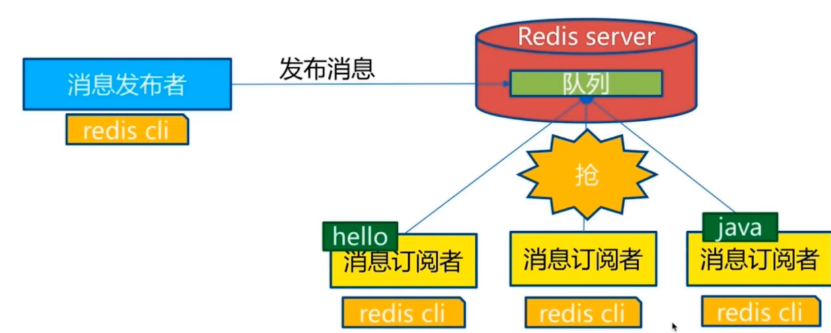

# Redis

## NoSql概述

小型网站，一个数据库足够，这时候，整个网站的瓶颈是什么


### #什么是NoSQL

NoSQL = Not only SQL

使用键值对控制 Map

> NoSQL特点

解耦

1. 方便扩展（数据之间没有关系，很好扩展)

2. 大数据高性能(Redis一秒写8万次，读11万次，NoSQL的缓存记录级，是一种细粒度的缓存，性能会比较高

3. 数据类型是多样型的（不需要实现设计数据库，随取随用)

4. 传统EDBMS和NoSQL

   ```
   传统的RDBMS
   - 结构化组织
   - SQL
   - 数据和关系都存在单独的表中
   - 数据定义语言
   - 严格的一致性
   - 基础的事务
   - ...
   ```

   ```
   NoSQL
   - 不仅仅是数据
   - 没有固定的查询语言
   - 键值对存储 列存储 文档存储 图形数据库(社交关系)
   - 最终一致性
   - CAP定理和BASE(异地多活)
   - 高性能 高可用 高可扩
   - ...
   ```


> 3V+ 3高

大数据时代的3V 主要是描述问题的

1. 海量 Volume
2. 多样 Variety
3. 实时Velocity

大数据时代的3高 主要是对程序的要求

1. 高并发
2. 高可扩
3. 高性能

真正在公司中的实现：NoSQL+RDBMS


## 阿里巴巴演进分析

```
商品的基本信息
	名称，价格、商家信息
	关系型数据库就可以解决 MYSQL/Oracle
	淘宝内部的MySQL不是大家常用的MySQL
商品的描述、评论 文字比较多
	文档型数据库  MongoDB
图片
	分布式文件系统 FastDFS
	- 淘宝自己的 TFS
	- Google GFS
	- Hadoop HDFS
	- 阿里云的 oss
商品的关键字
	- 搜索引擎 solr elasticsearch
	- ISerach 多隆
商品热门的波段信息
	- 内存数据库
	- Redis，Rair Memache
商品的交易，外部的支付接口
	- 三方应用
```


大型互联网应用问题

- 数据类型太多了
- 数据源繁多 经常重构
- 数据要改造 大面积改造？

加一层 UDSL

## NoSQL四大分类

### KV键值对

- 新浪 Redis
- 美团 Redis + Tair
- 阿里、百度 Redis+memecache

### 文档型数据库（bson格式和json一样）

- **MongoDB**
  - MongoDB 是一个基于分布式文件存储的数据库 C++编写，主要用来处理大量的文档
  - MongoDB是一个介于关系型数据库和非关系型数据库中中间的产品，MongoDB是非关系型数据库中功能最丰富，最像关系型数据库的
- ConthDB

### 列存储数据库

- HBase
- 分布式文件系统

### 图关系数据库

- 不是存图形，放的是关系，比如朋友社交网络，广告推荐
- Neo4j，InfoGrid


## Redis入门

### 概述

> Redis是什么

Redis (Remote Dictionary Server)  远程字典服务

开源 使用ANSI C编写 支持网络 可基于内存亦可持久化的日志型 KV数据库，提供多语言API

> Redis能干什么

1. 内存存储，持久化、断电即失 持久化很重要(rdb、aof)
2. 效率高 可以用于告诉缓存
3. 发布订阅系统
4. 地图信息分析
5. 计时器、计数器(浏览量)
6. ...

> 特性

1. 多样的数据类型
2. 持久化
3. 集群
4. 事务
5. ...

> 学习用到的东西

1. [Redis中文网站](http://www.redis.cn/)
2. [Redis官网](https://redis.io/)
3. [Redis中文教程](https://www.redis.com.cn/linux-install-redis.html)
4. 下载地址 官网下载即可
   - Windows通过Github下载(停更很久了)
   - 推荐Linux上下载


```
ping 测试连接
set key value
get key
```

​	Redis 是一个开源（BSD许可）的，内存中的数据结构存储系统，它可以用作数据库、缓存和消息中间件。 它支持多种类型的数据结构，如 [字符串（strings）](http://www.redis.cn/topics/data-types-intro.html#strings)， [散列（hashes）](http://www.redis.cn/topics/data-types-intro.html#hashes)， [列表（lists）](http://www.redis.cn/topics/data-types-intro.html#lists)， [集合（sets）](http://www.redis.cn/topics/data-types-intro.html#sets)， [有序集合（sorted sets）](http://www.redis.cn/topics/data-types-intro.html#sorted-sets) 与范围查询， [bitmaps](http://www.redis.cn/topics/data-types-intro.html#bitmaps)， [hyperloglogs](http://www.redis.cn/topics/data-types-intro.html#hyperloglogs) 和 [地理空间（geospatial）](http://www.redis.cn/commands/geoadd.html) 索引半径查询。 Redis 内置了 [复制（replication）](http://www.redis.cn/topics/replication.html)，[LUA脚本（Lua scripting）](http://www.redis.cn/commands/eval.html)， [LRU驱动事件（LRU eviction）](http://www.redis.cn/topics/lru-cache.html)，[事务（transactions）](http://www.redis.cn/topics/transactions.html) 和不同级别的 [磁盘持久化（persistence）](http://www.redis.cn/topics/persistence.html)， 并通过 [Redis哨兵（Sentinel）](http://www.redis.cn/topics/sentinel.html)和自动 [分区（Cluster）](http://www.redis.cn/topics/cluster-tutorial.html)提供高可用性（high availability）。


### 安装

#### Linux

```bash
$ yum install wget
$ wget https://download.redis.io/releases/redis-6.2.5.tar.gz
$ mv redis-6.2.5.tar.gz /opt
$ cd opt
$ tar -zxvf redis-6.2.5.tar.gz
$ cd redis-6.2.5
$ yum install gcc-c++
$ yum -y install gcc automake autoconf libtool make
$ make
$ make install
$ cd /usr/local/bin
$ mkdir kconfig
$ cp /opt/redis-6.2.5/redis.conf kconfig
$ cd kconfig
$ yum install vim
$ vim redis.config
i切换到输入模式
daemonize no改为 daemonize yes
ESC 切换到命令模式
Shift+:
输入wq保存退出
$ cd ..
$ pwd
/usr/local/bin
$ redis-server
$ redis-server kconfig/redis.conf
$ redis-cli -p 6379
127.0.0.1:6379> ping
PONG
127.0.0.1:6379> set name flywinter
OK
127.0.0.1:6379> get name
"flywinter"
127.0.0.1:6379> key *
(error) ERR unknown command `key`, with args beginning with: `*`,
127.0.0.1:6379> keys *
1) "name"
127.0.0.1:6379> shutdown
not connected> exit
$ ps -ef|grep redis
```

redis默认安装路径

```bash
$ cd /usr/local/bin
```


**意**：该命令是在 redis 的目录下执行的，而不是 redis 客户端的内部指令。

### 实例

以下实例同时执行 10000 个请求来检测性能：

```
$ redis-benchmark -n 10000  -q

PING_INLINE: 141043.72 requests per second
PING_BULK: 142857.14 requests per second
SET: 141442.72 requests per second
GET: 145348.83 requests per second
INCR: 137362.64 requests per second
LPUSH: 145348.83 requests per second
LPOP: 146198.83 requests per second
SADD: 146198.83 requests per second
SPOP: 149253.73 requests per second
LPUSH (needed to benchmark LRANGE): 148588.42 requests per second
LRANGE_100 (first 100 elements): 58411.21 requests per second
LRANGE_300 (first 300 elements): 21195.42 requests per second
LRANGE_500 (first 450 elements): 14539.11 requests per second
LRANGE_600 (first 600 elements): 10504.20 requests per second
MSET (10 keys): 93283.58 requests per second
```

redis 性能测试工具可选参数如下所示：


| 序号 | 选项                      | 描述                                       | 默认值    |
| :--- | :------------------------ | :----------------------------------------- | :-------- |
| 1    | **-h**                    | 指定服务器主机名                           | 127.0.0.1 |
| 2    | **-p**                    | 指定服务器端口                             | 6379      |
| 3    | **-s**                    | 指定服务器 socket                          |           |
| 4    | **-c**                    | 指定并发连接数                             | 50        |
| 5    | **-n**                    | 指定请求数                                 | 10000     |
| 6    | **-d**                    | 以字节的形式指定 SET/GET 值的数据大小      | 2         |
| 7    | **-k**                    | 1=keep alive 0=reconnect                   | 1         |
| 8    | **-r**                    | SET/GET/INCR 使用随机 key, SADD 使用随机值 |           |
| 9    | **-P**                    | 通过管道传输 <numreq> 请求                 | 1         |
| 10   | **-q**                    | 强制退出 redis。仅显示 query/sec 值        |           |
| 11   | **--csv**                 | 以 CSV 格式输出                            |           |
| 12   | ***-l\*（L 的小写字母）** | 生成循环，永久执行测试                     |           |
| 13   | **-t**                    | 仅运行以逗号分隔的测试命令列表。           |           |
| 14   | ***-I\*（i 的大写字母）** | Idle 模式。仅打开 N 个 idle 连接并等待。   |           |


### Redis基础数据库

redis默认有16个数据库，默认使用第0个数据库

可以使用select切换

```bash
127.0.0.1:6379> ping  # 检测redis是否能连接
PONG
127.0.0.1:6379> dbsize  # 获取当前数据库大小
(integer) 5
127.0.0.1:6379> select 3 # 选择3号数据库
OK
127.0.0.1:6379[3]> dbsize
(integer) 0
127.0.0.1:6379[3]> set name one  # 放入Value
127.0.0.1:6379[7]> get name   #获取key对应value
(nil)
127.0.0.1:6379[7]> select 3
OK
127.0.0.1:6379[3]> get name
"one"
127.0.0.1:6379[3]> keys *   #查看所有的key
1) "name"
127.0.0.1:6379[3]> flushdb  # 清空当前数据库
OK
127.0.0.1:6379[3]> flushall # 清空所有数据库
OK

```

为什么redis采用端口6379

> Redis是单线程的 Redis6以后可以使用多线程

Redis读写速度是很快的，官方表示Redis是基于内存操作，CPU不是Redis性能瓶颈，Redis的瓶颈是根据机器内存和网络带宽，既然可以使用单线程使用，所以就使用单线程

Redis是C语言写的，100000+的QPS，完全不比同样使用key-value的Memecache查

Redis为什么单线程还这么快

1. 高性能服务器不一定是多线程
2. 多线程(上下文会切换)不一定比单线程效率高

速度 CPU>内存>硬盘

核心：Redis将所有的数据放在内存中了，所以使用单线程就是效率最高的，多线程(CPU上下文会切换，耗时)，对于内存系统，如果没有上下文切换就是最高的，多次读写在一个CPU上，在内存情况下，这就是最高效的

## 五大数据类型

Redis 是一个开源（BSD许可）的，内存中的数据结构存储系统，它可以用作数据库、缓存和消息中间件。 它支持多种类型的数据结构，如 [字符串（strings）](http://www.redis.cn/topics/data-types-intro.html#strings)， [散列（hashes）](http://www.redis.cn/topics/data-types-intro.html#hashes)， [列表（lists）](http://www.redis.cn/topics/data-types-intro.html#lists)， [集合（sets）](http://www.redis.cn/topics/data-types-intro.html#sets)， [有序集合（sorted sets）](http://www.redis.cn/topics/data-types-intro.html#sorted-sets) 与范围查询， [bitmaps](http://www.redis.cn/topics/data-types-intro.html#bitmaps)， [hyperloglogs](http://www.redis.cn/topics/data-types-intro.html#hyperloglogs) 和 [地理空间（geospatial）](http://www.redis.cn/commands/geoadd.html) 索引半径查询。 Redis 内置了 [复制（replication）](http://www.redis.cn/topics/replication.html)，[LUA脚本（Lua scripting）](http://www.redis.cn/commands/eval.html)， [LRU驱动事件（LRU eviction）](http://www.redis.cn/topics/lru-cache.html)，[事务（transactions）](http://www.redis.cn/topics/transactions.html) 和不同级别的 [磁盘持久化（persistence）](http://www.redis.cn/topics/persistence.html)， 并通过 [Redis哨兵（Sentinel）](http://www.redis.cn/topics/sentinel.html)和自动 [分区（Cluster）](http://www.redis.cn/topics/cluster-tutorial.html)提供高可用性（high availability）。

### Redis-key

```bash
sh-4.4# redis-server kconfig/redis.conf
sh-4.4# redis-cli -p 6379
127.0.0.1:6379> ping
PONG
127.0.0.1:6379> flushall
OK
127.0.0.1:6379> keys *
(empty array)
127.0.0.1:6379> set age 1
OK
127.0.0.1:6379> exists age #判断key是否存在
(integer) 1
127.0.0.1:6379> move age 1 #移动到对应数据库
(integer) 1
127.0.0.1:6379> keys *
(empty array)
127.0.0.1:6379> select 1
OK
127.0.0.1:6379[1]> keys *
1) "age"
127.0.0.1:6379[1]> select 0
OK
127.0.0.1:6379> expire name 10 # 设置key过期时间
(integer) 0
127.0.0.1:6379> ttl name #查看key剩余存在时间
(integer) -2
127.0.0.1:6379> get name
(nil)
127.0.0.1:6379> set nn 12
OK
127.0.0.1:6379> del nn  #删除对应key
127.0.0.1:6379> type name #查看key对应的值的类型
```

### String

```bash
127.0.0.1:6379> flushdb
OK
127.0.0.1:6379> set key1 v1
OK
127.0.0.1:6379> get key1
"v1"
127.0.0.1:6379> APPEND key1 # "hello" #追加值，如果key不存在相当于新建
(integer) 7
127.0.0.1:6379> get key1
"v1hello"
127.0.0.1:6379> STRLEN key1 # 获得对应值的长度
(integer) 7
127.0.0.1:6379>
################################
127.0.0.1:6379> set views 0
OK
127.0.0.1:6379> get views
"0"
127.0.0.1:6379> incr views # 加一
(integer) 1
127.0.0.1:6379> get views
"1"
127.0.0.1:6379> DECR views # 减一
(integer) 0
127.0.0.1:6379> get views
"0"
127.0.0.1:6379>

127.0.0.1:6379> INCRBY views 10  # 加10
(integer) 10
127.0.0.1:6379> DECRBY views 5  # 减5
(integer) 5
127.0.0.1:6379>
################################
字符串范围
127.0.0.1:6379> set key1 "adas,hello,lisii"
OK
127.0.0.1:6379> GETRANGE key1 0 3  # 截取字符串0-3
"adas"
127.0.0.1:6379> GETRANGE key1 0 -1 # 截取全部
"adas,hello,lisii"

替换字符串
127.0.0.1:6379> set key2 "abcdefgh"
OK
127.0.0.1:6379> SETRANGE key2 1 xx
(integer) 8
127.0.0.1:6379> get key2
"axxdefgh"

############
setex (set with expire) #设置过期时间
setnx (set if not exist) # 不存在再设置(在分布式锁中会常常使用)

127.0.0.1:6379> setex key3 30 "hello" #设置key3 为hello 30s后过期
OK
127.0.0.1:6379> ttl key3
(integer) 26
127.0.0.1:6379> setnx mykey redis # 如果key不存在，创建，已存在，创建失败
(integer) 1
127.0.0.1:6379> keys *
1) "key2"
2) "key1"
3) "mykey"
127.0.0.1:6379> setnx mykey mongodb
(integer) 0
127.0.0.1:6379> get mykey
"redis"
############
mset 批量设置KV
mget 批量获取KV
msetnx 如果不存在创建 原子性操作，要么全部成功，要么全部失败
127.0.0.1:6379> mset  k1 v1 k2 v2 k3 v3
OK
127.0.0.1:6379> keys *
1) "k1"
2) "k2"
3) "k3"
127.0.0.1:6379> mget k1 k2 k3
1) "v1"
2) "v2"
3) "v3"
127.0.0.1:6379> msetnx k1 v1 k4 v4
(integer) 0

# 对象
set user:1{name:zhangsan,age:3} #设置user:1对象 值为json字符来保存一个对象

127.0.0.1:6379> mset  user:1:name zhangsan user:1:age 2
OK
127.0.0.1:6379> mget user:1:name user:1:age
1) "zhangsan"
2) "2"
##########
getset 先get后set

127.0.0.1:6379> getset db redis # 如果不存在，返回nil
(nil)
127.0.0.1:6379> get db
"redis"
127.0.0.1:6379> getset db mongodb # 如果存在值，获取原来值，并设置新的值
"redis"
127.0.0.1:6379> get db
"mongodb"
```

使用场景

- 计数器
- 统计多单位的数据
- 粉丝数

### List

基本数据类型，列表

所有的list命令都是以l开头的

```bash
127.0.0.1:6379> LPUSH list one #将一个值或多个值放到列表的头部
(integer) 1
127.0.0.1:6379> LPUSH list two
(integer) 2
127.0.0.1:6379> LRANGE list 0 -1
1) "two"
2) "one"
127.0.0.1:6379> LRANGE list 0 1
1) "two"
2) "one"
127.0.0.1:6379> LRANGE list 0 0
1) "two"
127.0.0.1:6379> RPUSH list right # 将一个值或多个值放在列表的最后面
(integer) 3
127.0.0.1:6379> LRANGE list 0 -1
1) "two"
2) "one"
3) "right"
##################
LPOP 
RPOP

127.0.0.1:6379> LRANGE list 0 -1
1) "two"
2) "one"
3) "right"
127.0.0.1:6379> LPOP list #移除列表的第一个元素
"two"
127.0.0.1:6379> LRANGE list 0 -1
1) "one"
2) "right"
127.0.0.1:6379> RPOP list #移除list的最后一个元素
"right"
127.0.0.1:6379> LRANGE list 0 -1
1) "one"
###########################
LINDEX
127.0.0.1:6379> lindex list 0 #通过下标获取list的第0个值
"one"
#############
127.0.0.1:6379> LLEN list # 获取list长度
(integer) 1
##############
移除指定值
count > 0: 从头往尾移除值为 value 的元素。 count < 0: 从尾往头移除值为 value 的元素。 count = 0: 移除所有值为 value 的元素。
127.0.0.1:6379> LREM list 1 one #移除1个值为one的，精确匹配
(integer) 1
127.0.0.1:6379> LRANGE list 0 -1
(empty array)
###############
trim 修剪
127.0.0.1:6379> rpush list 1
(integer) 1
127.0.0.1:6379> rpush list 2
(integer) 2
127.0.0.1:6379> rpush list 3
(integer) 3
127.0.0.1:6379> rpush list 4
(integer) 4
127.0.0.1:6379> LTRIM  list 1 2 #通过下标截取对应的长度，截取后，原数据被修改
OK
127.0.0.1:6379> Lrange  list 1 2
1) "3"
127.0.0.1:6379> Lrange  list 0 -1
1) "2"
2) "3"
###############################
# rpoplpush 移除列表的最后一个元素，将他移动到新的列表
127.0.0.1:6379> rpush list 1
(integer) 1
127.0.0.1:6379> rpush list 2
(integer) 2
127.0.0.1:6379> rpush list 3
(integer) 3
127.0.0.1:6379> RPOPLPUSH list otherlist
"3"
127.0.0.1:6379> LRANGE list 0 -1
1) "1"
2) "2"
127.0.0.1:6379> LRANGE otherlist 0 -1
1) "3"
##################################
127.0.0.1:6379> lset list 0 one
(error) ERR no such key
127.0.0.1:6379> lpush list value1
(integer) 1
127.0.0.1:6379> LRANGE list 0 -1
1) "value1"
127.0.0.1:6379> lset list 0 item1  #修改对应下标的值，如果对应下标不存在会报错
OK
127.0.0.1:6379> LRANGE list 0 -1
1) "item1"
#################################
linsert

127.0.0.1:6379> rpush list hello
(integer) 1
127.0.0.1:6379> rpush list world
(integer) 2
127.0.0.1:6379> LInsert list before "world" "other"  # 将other插入到列表的world前面
(integer) 3
127.0.0.1:6379> lrange list 0 -1
1) "hello"
2) "other"
3) "world"
127.0.0.1:6379> LInsert list after "hello" "mm" # 将mm插入到列表的hello后面
(integer) 4
127.0.0.1:6379> lrange list 0 -1
1) "hello"
2) "mm"
3) "other"
4) "world"
```

> 小结

- 实际上是一个链表，before Node after，left，right都可以插入
- 如果key不存在，创建新的链表
- 如果key存在，新增内容
- 如果移除了所有值，空链表，也代表不存在
- 在两边插入或改动值，效率更高，中间元素效率会低一点

消息排队，消息队列，Lpush，Rpop 栈(Lpush Lpop)

### Set(集合)

set中的值不能重复

```bash
127.0.0.1:6379> sadd set "hello"   #set添加值
(integer) 1
127.0.0.1:6379> sadd set "world" #添加重复的会失败
(integer) 1
127.0.0.1:6379> SMEMBERS set    #查看set所有值
1) "hello"
2) "world"
127.0.0.1:6379> SISMEMBER set "hello"  #查看set中是否存在hello
(integer) 1
127.0.0.1:6379> SISMEMBER set "ww"
(integer) 0
127.0.0.1:6379>
#################
127.0.0.1:6379> SCARD set  # 查看set大小
(integer) 2
############
127.0.0.1:6379> srem set hello  #移除set中指定元素
(integer) 1
127.0.0.1:6379> SMEMBERS set
1) "world"
##################
set 无序不重复集合
127.0.0.1:6379> SRANDMEMBER set 1 #随机抽取指定个数元素
1) "world"
127.0.0.1:6379> SRANDMEMBER set # 随机抽取一个元素
"world"
####################
删除指定的key
随机删除key
127.0.0.1:6379> SADD member m1
(integer) 1
127.0.0.1:6379> SADD member m2
(integer) 1
127.0.0.1:6379> SADD member m3
(integer) 1
127.0.0.1:6379> SADD member m4
(integer) 1
127.0.0.1:6379> SMEMBERS member
1) "m1"
2) "m2"
3) "m3"
4) "m4"
127.0.0.1:6379> spop member  #随机删除集合中的一个元素
###################
将一个集合中的元素移动到另一个set集合中
127.0.0.1:6379> sadd member2 zz1
(integer) 1
127.0.0.1:6379> sadd member2 zz2
(integer) 1
127.0.0.1:6379> sadd member2 zz3
(integer) 1
127.0.0.1:6379> SMOVE member member2 m1  #将一个指定的值移动到另一个集合
(integer) 1
127.0.0.1:6379> SMEMBERS member
1) "m2"
2) "m3"
127.0.0.1:6379> SMEMBERS member2
1) "m1"
2) "zz3"
3) "zz2"
4) "zz1"
##################
- 差集
- 交集
- 并集
127.0.0.1:6379> sadd k1 a
(integer) 1
127.0.0.1:6379> sadd k1 b
(integer) 1
127.0.0.1:6379> sadd k1 c
(integer) 1
127.0.0.1:6379> sadd k2 c
(integer) 1
127.0.0.1:6379> sadd k2 d
(integer) 1
127.0.0.1:6379> sadd k2 e
(integer) 1
127.0.0.1:6379> SDIFF k1 k2   #差集 查看不同部分
1) "a"
2) "b"
127.0.0.1:6379> SINTER k1 k2 #交集 查看相同部分  查看共同好友
1) "c"
127.0.0.1:6379> SUNION k1 k2 # 并集  
1) "b"
2) "d"
3) "c"
4) "a"
5) "e"
```

微博 A用户将所有关注的人放在一个set集合中，粉丝也放在一个集合中

共同关注

六度分隔理论

### Hash(哈希)

Map集合 key-Map集合 存的值是map集合，本质和Stirng没什么区别，还是一个简单的key value

```bash
hset key field value  field1 value1  # 覆盖设置值
hget key field
hgetall
hmget key field field1
hdel key field   #删除对应值
######################
hlen key  #获取字段数量
#############
hexists key field  # 判断对应字段是否存在
#######################
hkeys key  #只获得所有field
hvals key #只获得所有value
#################
incr 
decr

hset key field value 5 #指定增量为5
hincrby key field  1 #加一
hincrby key field  -1 #减一
hsetnx key field hello  #如果不存在则可以设置
```

hash变更的数据  user name  age 用户信息，经常变动的信息 hash更适合对象的存储，String更适合存字符串

### ZSet(有序集合)

在set的基础上，增加了一个值 set k1 v1     zset k1  score  v1

```bash
127.0.0.1:6379> zadd myset 1 one
(integer) 1
127.0.0.1:6379> zadd myset 2 two 3 three
(integer) 2
127.0.0.1:6379> ZRANGE myset 0 -1
1) "one"
2) "two"
3) "three"
#########################
127.0.0.1:6379> ZRANGEBYSCORE myset -inf +inf
1) "one"
2) "two"
3) "three"
127.0.0.1:6379> ZRANGEBYSCORE myset -inf +inf withscores
1) "one"
2) "1"
3) "two"
4) "2"
5) "three"
6) "3"
127.0.0.1:6379> ZRANGEBYSCORE myset -inf 2 withscores  升序排列
1) "one"
2) "1"
3) "two"
4) "2"
127.0.0.1:6379> zrevrangebyscore myset +inf -inf withscores  #降序排列
1) "three"
2) "3"
3) "two"
4) "2"
5) "one"
6) "1"
#####################################
移除元素
zrem key value

zcard  查看数量
zcount myset  1  2   获取指定区间成员数量
```

set排序  存储班级成绩表 工资表排序

普通消息  重要消息 带权重消息

取Top N个

## 三种特殊数据类型

### geospatial 地理位置

朋友的定位，附近的人，打车距离计算

3.2版本就推出了，可以推算地理位置的信息，两地之间的距离，方圆几里的人

一个经纬度查询的网站：https://jingweidu.wncx.cn/

只有6个命令

```bash
GEOADD
GEODIST
GEOHASH
GEOPOS
GEORADIUS
GEORADIUSBYMEMBER
```

> geoadd 将指定的地理空间位置（纬度、经度、名称）添加到指定的`key`中

```
redis> GEOADD Sicily 13.361389 38.115556 "Palermo" 15.087269 37.502669 "Catania"
(integer) 2
redis> GEODIST Sicily Palermo Catania
"166274.15156960039"
redis> GEORADIUS Sicily 15 37 100 km
1) "Catania"
redis> GEORADIUS Sicily 15 37 200 km
1) "Palermo"
2) "Catania"
redis> 
```

> geodist 返回两个给定位置之间的距离

```
redis> GEOADD Sicily 13.361389 38.115556 "Palermo" 15.087269 37.502669 "Catania"
(integer) 2
redis> GEODIST Sicily Palermo Catania
"166274.15156960039"
redis> GEODIST Sicily Palermo Catania km
"166.27415156960038"
redis> GEODIST Sicily Palermo Catania mi
"103.31822459492736"
redis> GEODIST Sicily Foo Bar
(nil)
redis> 
```

> geohash  返回一个或多个位置元素的 [Geohash](https://en.wikipedia.org/wiki/Geohash) 表示

```
redis> GEOADD Sicily 13.361389 38.115556 "Palermo" 15.087269 37.502669 "Catania"
(integer) 2
redis> GEOHASH Sicily Palermo Catania
1) "sqc8b49rny0"
2) "sqdtr74hyu0"
redis> 
```

> geopos 从`key`里返回所有给定位置元素的位置（经度和纬度）

```
redis> GEOADD Sicily 13.361389 38.115556 "Palermo" 15.087269 37.502669 "Catania"
(integer) 2
redis> GEOPOS Sicily Palermo Catania NonExisting
1) 1) "13.361389338970184"
   2) "38.115556395496299"
2) 1) "15.087267458438873"
   2) "37.50266842333162"
3) (nil)
redis> 
```

> georadiu 以给定的经纬度为中心， 返回键包含的位置元素当中， 与中心的距离不超过给定最大距离的所有位置元素

```
redis> GEOADD Sicily 13.361389 38.115556 "Palermo" 15.087269 37.502669 "Catania"
(integer) 2
redis> GEORADIUS Sicily 15 37 200 km WITHDIST
1) 1) "Palermo"
   2) "190.4424"
2) 1) "Catania"
   2) "56.4413"
redis> GEORADIUS Sicily 15 37 200 km WITHCOORD
1) 1) "Palermo"
   2) 1) "13.361389338970184"
      2) "38.115556395496299"
2) 1) "Catania"
   2) 1) "15.087267458438873"
      2) "37.50266842333162"
redis> GEORADIUS Sicily 15 37 200 km WITHDIST WITHCOORD
1) 1) "Palermo"
   2) "190.4424"
   3) 1) "13.361389338970184"
      2) "38.115556395496299"
2) 1) "Catania"
   2) "56.4413"
   3) 1) "15.087267458438873"
      2) "37.50266842333162"
redis> 
```

> georadiusbymember 这个命令和 [GEORADIUS](http://www.redis.cn/commands/georadius.html) 命令一样， 都可以找出位于指定范围内的元素， 但是 `GEORADIUSBYMEMBER` 的中心点是由给定的位置元素决定的， 而不是像 [GEORADIUS](http://www.redis.cn/commands/georadius.html) 那样， 使用输入的经度和纬度来决定中心点

```
redis> GEOADD Sicily 13.583333 37.316667 "Agrigento"
(integer) 1
redis> GEOADD Sicily 13.361389 38.115556 "Palermo" 15.087269 37.502669 "Catania"
(integer) 2
redis> GEORADIUSBYMEMBER Sicily Agrigento 100 km
1) "Agrigento"
2) "Palermo"
redis> 
```

### Hyperloglog

> 什么是基数

A{1,3,5,7,9} 

B{1,3,5,8}

基数 一个集合中不重复的元素  5  4

> 简介

是一种结构

基数统计的算法

优点：占用的内存是固定的2^64不同元素的技术，只需要12kb的内存

网页UV(一个人访问一个网站多次还是算一个人)

传统的方式 set保存用户id，然后就可以统计set中的元素数量作为标注判断

这个方式如果保存大量用户id就会比较麻烦，目的是为了计数而不是保存用户id

0.81%错误率，统计UV，可以忽略不计

```bash
127.0.0.1:6379> pfadd a b c d e f g h i j
(integer) 1
127.0.0.1:6379> PFCOUNT a #统计数量
(integer) 9
127.0.0.1:6379> PFadd a i j z s d e l p q
(integer) 1
127.0.0.1:6379> PFCOUNT a
(integer) 14
127.0.0.1:6379> PFADD i sdi  eie we d
(integer) 1
127.0.0.1:6379> PFMERGE mykey a i  #合并 并集
OK
127.0.0.1:6379> PFCOUNT mykey
(integer) 17
```

### Bitmap

> 位存储

统计疫情感染人数 010101

统计用户信息，活跃 不活跃 打卡 两个状态的都可以使用Bitmap

位图  数据结构 都是操作二进制位进行记录 只有0和1两个状态

> 测试

```bash
127.0.0.1:6379> setbit sign 0 0
(integer) 0
127.0.0.1:6379> setbit sign 1 0
(integer) 0
127.0.0.1:6379> setbit sign 2 1
(integer) 0
127.0.0.1:6379> setbit sign 3 1
(integer) 0
127.0.0.1:6379> setbit sign 4 0
(integer) 0
127.0.0.1:6379> getbit sign 3
(integer) 1
127.0.0.1:6379> getbit sign 4
(integer) 0
127.0.0.1:6379> bitcount sign
(integer) 2
```

## 事务

要么同时成功，要么同时失败，原子性

==Redis单条命令是保证原子性的，但是redis事务不保证原子性的==

==Redis事务没有隔离级别的概念==

所有的命令在食物中，并没有直接被执行，只有发起执行命令的时候才会执行exec

Redis事务本质：一组命令的集合 一个事务中的所有命令都会被序列化，在事务执行过程中，会按照顺序执行

一次性、顺序性、排他性 执行一系列的命令

redis的事务

- 开启事务(multi)
- 命令入队(...)
- 执行事务(exec)

> 正常执行事务

```bash
127.0.0.1:6379> multi
OK
127.0.0.1:6379(TX)>
127.0.0.1:6379(TX)> set k1 v1
QUEUED
127.0.0.1:6379(TX)> set k2 v2
QUEUED
127.0.0.1:6379(TX)> get k2
QUEUED
127.0.0.1:6379(TX)> set k3 v3
QUEUED
127.0.0.1:6379(TX)> exec
1) OK
2) OK
3) "v2"
4) OK
```

> 放弃事务

```bash
127.0.0.1:6379> multi
OK
127.0.0.1:6379(TX)> set k1 v1
QUEUED
127.0.0.1:6379(TX)> set k2 v2
QUEUED
127.0.0.1:6379(TX)> set k3 v3
QUEUED
127.0.0.1:6379(TX)> set k4 v4
QUEUED
127.0.0.1:6379(TX)> discard
OK
127.0.0.1:6379> get k4
(nil)
```

> 编译型异常 (代码有问题 命令有错) 事务中所有命令都不会被执行


> 运行时异常  如果事务队列中存在语法性错误，那么执行命令的时候，其他命令是可以被正常运行的 错误命令抛出异常

锁：Redis可以实现乐观锁

> 监控 watch

悲观锁

- 什么时候都会出问题，无论干什么都加锁

乐观锁

- 什么时候都不会出现问题，所以不会上锁，更新数据的时候去判断一下，在此期间是否有人修改过这个数据
- 获取version
- 更新的时候比较version

> Redis监视测试

正常执行成功

```bash
127.0.0.1:6379> set money 100
OK
127.0.0.1:6379> set out 0
OK
127.0.0.1:6379> watch money
OK
127.0.0.1:6379> multi
OK
127.0.0.1:6379(TX)> decrby money 20
QUEUED
127.0.0.1:6379(TX)> incrby out 20
QUEUED
127.0.0.1:6379(TX)> exec
1) (integer) 80
2) (integer) 20
```

测试多线程修改值 使用watch，可以当作redis的乐观锁操作

unwatch 放弃监视

## Jedis

我们要使用Java来操作Redis

> Jedis 是Redis官方推荐的java连接开发工具

1. 导入对应的依赖

   ```xml
   <dependency>
       <groupId>redis.clients</groupId>
       <artifactId>jedis</artifactId>
       <version>3.3.0</version>
   </dependency>
   <dependency>
       <groupId>com.alibaba</groupId>
       <artifactId>fastjson</artifactId>
       <version>1.2.62</version>
   </dependency>
   ```

2. 编码测试

   - 连接数据库
   - 操作命令
   - 断开连接

```java
public static void main(String[] args) {
    //1. new Jedis对象即可
    Jedis jedis = new Jedis("127.0.0.1",6379);
    //jedis所有的命令就是官方里的命令
    String ping = jedis.ping();
    System.out.println(ping);
}
```

## 常用的API

String

List

Set

Hash

ZSet

## SpringBoot整合

SpringBoot操作数据 spring-data  jdbc mongodb redis

SpringData也是和SpringBoot齐名的项目

说明 springBoot2.x之后，原来使用的jedis被替换为lettuce

jedis 采用直连 多个线程操作是不安全的，如果想要避免不安全的连接，需要使用连接池，更像BIO模式 

lettuce采用netty，实例可以在多个线程中共享，不存在线程不安全的情况，更像NIO模式

源码分析

```java
@ConditionalOnSingleCandidate(RedisConnectionFactory.class) 
public RedisTemplate<Object, Object> redisTemplate(RedisConnectionFactory redisConnectionFactory) {
    //默认的RedisTemple没有过多的设置，redis对象都是需要序列化
    //两个反向都是Object，Object的类型后期使用需要强转<String,Object>
    RedisTemplate<Object, Object> template = new RedisTemplate();
    template.setConnectionFactory(redisConnectionFactory);
    return template;
}

@Bean
@ConditionalOnMissingBean //由于String是redis最常使用的类型，所以单独提出来了
@ConditionalOnSingleCandidate(RedisConnectionFactory.class)
public StringRedisTemplate stringRedisTemplate(RedisConnectionFactory redisConnectionFactory) {
    StringRedisTemplate template = new StringRedisTemplate();
    template.setConnectionFactory(redisConnectionFactory);
    return template;
}
```

> 整合测试一下

1. 导入依赖

   ```xml
   <dependency>
       <groupId>org.springframework.boot</groupId>
       <artifactId>spring-boot-starter-data-redis</artifactId>
   </dependency>
   ```

2. 配置连接

   ```properties
   spring.redis.host=127.0.0.1
   spring.redis.port=6379
   ```

3. 测试

   中文存入数据库后会被转义

```java
//序列化配置
@Nullable
private RedisSerializer<?> defaultSerializer;
@Nullable
private ClassLoader classLoader;
@Nullable
private RedisSerializer keySerializer = null;
@Nullable
private RedisSerializer valueSerializer = null;
@Nullable
private RedisSerializer hashKeySerializer = null;
@Nullable
private RedisSerializer hashValueSerializer = null;
```

默认的序列化方式是JDK序列化，这样可能会使中文转义，我们可能使用JSON来序列化

```java
public void afterPropertiesSet() {
    super.afterPropertiesSet();
    boolean defaultUsed = false;
    if (this.defaultSerializer == null) {
        this.defaultSerializer = new JdkSerializationRedisSerializer(this.classLoader != null ? this.classLoader : this.getClass().getClassLoader());
    }
```

对象需要序列化才能存储

Cannot serialize; nested exception is org.springframework.core.serializer.support.SerializationFailedException: Failed to serialize object using DefaultSerializer


编写一个自己的RedisTemplate

```java
@Configuration
public class RedisConfig {
    
    //一个固定模板
    //编写我们自己的redisTemplate
    @Bean
    @SuppressWarnings("all")
    public RedisTemplate<String,Object> redisTemplate(RedisConnectionFactory redisConnectionFactory){

        // 为了开发方便，直接使用<String, Object>
        RedisTemplate<String, Object> template = new RedisTemplate();
        template.setConnectionFactory(redisConnectionFactory);

        // Json 配置序列化
        // 使用 jackson 解析任意的对象
        Jackson2JsonRedisSerializer<Object> jackson2JsonRedisSerializer = new Jackson2JsonRedisSerializer<>(Object.class);
        // 使用 objectMapper 进行转义
        ObjectMapper objectMapper = new ObjectMapper();
        objectMapper.setVisibility(PropertyAccessor.ALL, JsonAutoDetect.Visibility.ANY);
        objectMapper.activateDefaultTyping(LaissezFaireSubTypeValidator.instance, ObjectMapper.DefaultTyping.NON_FINAL);
        jackson2JsonRedisSerializer.setObjectMapper(objectMapper);
        // String 的序列化
        StringRedisSerializer stringRedisSerializer = new StringRedisSerializer();

        // key 采用 String 的序列化方式
        template.setKeySerializer(stringRedisSerializer);
        // Hash 的 key 采用 String 的序列化方式
        template.setHashKeySerializer(stringRedisSerializer);
        // value 采用 jackson 的序列化方式
        template.setValueSerializer(jackson2JsonRedisSerializer);
        // Hash 的 value 采用 jackson 的序列化方式
        template.setHashValueSerializer(jackson2JsonRedisSerializer);
        // 把所有的配置 set 进 template
        template.afterPropertiesSet();

        return template;
    }
}
```

### Redis工具类

```java
package com.flywinter.utils;

import org.springframework.beans.factory.annotation.Autowired;
import org.springframework.data.redis.core.RedisTemplate;
import org.springframework.stereotype.Component;
import org.springframework.util.CollectionUtils;

import java.util.Collection;
import java.util.List;
import java.util.Map;
import java.util.Set;
import java.util.concurrent.TimeUnit;

/**
 * Created by IntelliJ IDEA
 * User:Zhang Xingkun
 * Date:2021/8/5 17:35
 * Description:
 */
@Component
public final class RedisUtil {

    @Autowired
    private RedisTemplate<String, Object> redisTemplate;

    // =============================common============================
    /**
     * 指定缓存失效时间
     * @param key  键
     * @param time 时间(秒)
     */
    public boolean expire(String key, long time) {
        try {
            if (time > 0) {
                redisTemplate.expire(key, time, TimeUnit.SECONDS);
            }
            return true;
        } catch (Exception e) {
            e.printStackTrace();
            return false;
        }
    }

    /**
     * 根据key 获取过期时间
     * @param key 键 不能为null
     * @return 时间(秒) 返回0代表为永久有效
     */
    public long getExpire(String key) {
        return redisTemplate.getExpire(key, TimeUnit.SECONDS);
    }


    /**
     * 判断key是否存在
     * @param key 键
     * @return true 存在 false不存在
     */
    public boolean hasKey(String key) {
        try {
            return redisTemplate.hasKey(key);
        } catch (Exception e) {
            e.printStackTrace();
            return false;
        }
    }


    /**
     * 删除缓存
     * @param key 可以传一个值 或多个
     */
    @SuppressWarnings("unchecked")
    public void del(String... key) {
        if (key != null && key.length > 0) {
            if (key.length == 1) {
                redisTemplate.delete(key[0]);
            } else {
                redisTemplate.delete((Collection<String>) CollectionUtils.arrayToList(key));
            }
        }
    }


    // ============================String=============================

    /**
     * 普通缓存获取
     * @param key 键
     * @return 值
     */
    public Object get(String key) {
        return key == null ? null : redisTemplate.opsForValue().get(key);
    }

    /**
     * 普通缓存放入
     * @param key   键
     * @param value 值
     * @return true成功 false失败
     */

    public boolean set(String key, Object value) {
        try {
            redisTemplate.opsForValue().set(key, value);
            return true;
        } catch (Exception e) {
            e.printStackTrace();
            return false;
        }
    }


    /**
     * 普通缓存放入并设置时间
     * @param key   键
     * @param value 值
     * @param time  时间(秒) time要大于0 如果time小于等于0 将设置无限期
     * @return true成功 false 失败
     */

    public boolean set(String key, Object value, long time) {
        try {
            if (time > 0) {
                redisTemplate.opsForValue().set(key, value, time, TimeUnit.SECONDS);
            } else {
                set(key, value);
            }
            return true;
        } catch (Exception e) {
            e.printStackTrace();
            return false;
        }
    }


    /**
     * 递增
     * @param key   键
     * @param delta 要增加几(大于0)
     */
    public long incr(String key, long delta) {
        if (delta < 0) {
            throw new RuntimeException("递增因子必须大于0");
        }
        return redisTemplate.opsForValue().increment(key, delta);
    }


    /**
     * 递减
     * @param key   键
     * @param delta 要减少几(小于0)
     */
    public long decr(String key, long delta) {
        if (delta < 0) {
            throw new RuntimeException("递减因子必须大于0");
        }
        return redisTemplate.opsForValue().increment(key, -delta);
    }


    // ================================Map=================================

    /**
     * HashGet
     * @param key  键 不能为null
     * @param item 项 不能为null
     */
    public Object hget(String key, String item) {
        return redisTemplate.opsForHash().get(key, item);
    }

    /**
     * 获取hashKey对应的所有键值
     * @param key 键
     * @return 对应的多个键值
     */
    public Map<Object, Object> hmget(String key) {
        return redisTemplate.opsForHash().entries(key);
    }

    /**
     * HashSet
     * @param key 键
     * @param map 对应多个键值
     */
    public boolean hmset(String key, Map<String, Object> map) {
        try {
            redisTemplate.opsForHash().putAll(key, map);
            return true;
        } catch (Exception e) {
            e.printStackTrace();
            return false;
        }
    }


    /**
     * HashSet 并设置时间
     * @param key  键
     * @param map  对应多个键值
     * @param time 时间(秒)
     * @return true成功 false失败
     */
    public boolean hmset(String key, Map<String, Object> map, long time) {
        try {
            redisTemplate.opsForHash().putAll(key, map);
            if (time > 0) {
                expire(key, time);
            }
            return true;
        } catch (Exception e) {
            e.printStackTrace();
            return false;
        }
    }


    /**
     * 向一张hash表中放入数据,如果不存在将创建
     *
     * @param key   键
     * @param item  项
     * @param value 值
     * @return true 成功 false失败
     */
    public boolean hset(String key, String item, Object value) {
        try {
            redisTemplate.opsForHash().put(key, item, value);
            return true;
        } catch (Exception e) {
            e.printStackTrace();
            return false;
        }
    }

    /**
     * 向一张hash表中放入数据,如果不存在将创建
     *
     * @param key   键
     * @param item  项
     * @param value 值
     * @param time  时间(秒) 注意:如果已存在的hash表有时间,这里将会替换原有的时间
     * @return true 成功 false失败
     */
    public boolean hset(String key, String item, Object value, long time) {
        try {
            redisTemplate.opsForHash().put(key, item, value);
            if (time > 0) {
                expire(key, time);
            }
            return true;
        } catch (Exception e) {
            e.printStackTrace();
            return false;
        }
    }


    /**
     * 删除hash表中的值
     *
     * @param key  键 不能为null
     * @param item 项 可以使多个 不能为null
     */
    public void hdel(String key, Object... item) {
        redisTemplate.opsForHash().delete(key, item);
    }


    /**
     * 判断hash表中是否有该项的值
     *
     * @param key  键 不能为null
     * @param item 项 不能为null
     * @return true 存在 false不存在
     */
    public boolean hHasKey(String key, String item) {
        return redisTemplate.opsForHash().hasKey(key, item);
    }


    /**
     * hash递增 如果不存在,就会创建一个 并把新增后的值返回
     *
     * @param key  键
     * @param item 项
     * @param by   要增加几(大于0)
     */
    public double hincr(String key, String item, double by) {
        return redisTemplate.opsForHash().increment(key, item, by);
    }


    /**
     * hash递减
     *
     * @param key  键
     * @param item 项
     * @param by   要减少记(小于0)
     */
    public double hdecr(String key, String item, double by) {
        return redisTemplate.opsForHash().increment(key, item, -by);
    }


    // ============================set=============================

    /**
     * 根据key获取Set中的所有值
     * @param key 键
     */
    public Set<Object> sGet(String key) {
        try {
            return redisTemplate.opsForSet().members(key);
        } catch (Exception e) {
            e.printStackTrace();
            return null;
        }
    }


    /**
     * 根据value从一个set中查询,是否存在
     *
     * @param key   键
     * @param value 值
     * @return true 存在 false不存在
     */
    public boolean sHasKey(String key, Object value) {
        try {
            return redisTemplate.opsForSet().isMember(key, value);
        } catch (Exception e) {
            e.printStackTrace();
            return false;
        }
    }


    /**
     * 将数据放入set缓存
     *
     * @param key    键
     * @param values 值 可以是多个
     * @return 成功个数
     */
    public long sSet(String key, Object... values) {
        try {
            return redisTemplate.opsForSet().add(key, values);
        } catch (Exception e) {
            e.printStackTrace();
            return 0;
        }
    }


    /**
     * 将set数据放入缓存
     *
     * @param key    键
     * @param time   时间(秒)
     * @param values 值 可以是多个
     * @return 成功个数
     */
    public long sSetAndTime(String key, long time, Object... values) {
        try {
            Long count = redisTemplate.opsForSet().add(key, values);
            if (time > 0)
                expire(key, time);
            return count;
        } catch (Exception e) {
            e.printStackTrace();
            return 0;
        }
    }


    /**
     * 获取set缓存的长度
     *
     * @param key 键
     */
    public long sGetSetSize(String key) {
        try {
            return redisTemplate.opsForSet().size(key);
        } catch (Exception e) {
            e.printStackTrace();
            return 0;
        }
    }


    /**
     * 移除值为value的
     *
     * @param key    键
     * @param values 值 可以是多个
     * @return 移除的个数
     */

    public long setRemove(String key, Object... values) {
        try {
            Long count = redisTemplate.opsForSet().remove(key, values);
            return count;
        } catch (Exception e) {
            e.printStackTrace();
            return 0;
        }
    }

    // ===============================list=================================

    /**
     * 获取list缓存的内容
     *
     * @param key   键
     * @param start 开始
     * @param end   结束 0 到 -1代表所有值
     */
    public List<Object> lGet(String key, long start, long end) {
        try {
            return redisTemplate.opsForList().range(key, start, end);
        } catch (Exception e) {
            e.printStackTrace();
            return null;
        }
    }


    /**
     * 获取list缓存的长度
     *
     * @param key 键
     */
    public long lGetListSize(String key) {
        try {
            return redisTemplate.opsForList().size(key);
        } catch (Exception e) {
            e.printStackTrace();
            return 0;
        }
    }


    /**
     * 通过索引 获取list中的值
     *
     * @param key   键
     * @param index 索引 index>=0时， 0 表头，1 第二个元素，依次类推；index<0时，-1，表尾，-2倒数第二个元素，依次类推
     */
    public Object lGetIndex(String key, long index) {
        try {
            return redisTemplate.opsForList().index(key, index);
        } catch (Exception e) {
            e.printStackTrace();
            return null;
        }
    }


    /**
     * 将list放入缓存
     *
     * @param key   键
     * @param value 值
     */
    public boolean lSet(String key, Object value) {
        try {
            redisTemplate.opsForList().rightPush(key, value);
            return true;
        } catch (Exception e) {
            e.printStackTrace();
            return false;
        }
    }


    /**
     * 将list放入缓存
     * @param key   键
     * @param value 值
     * @param time  时间(秒)
     */
    public boolean lSet(String key, Object value, long time) {
        try {
            redisTemplate.opsForList().rightPush(key, value);
            if (time > 0)
                expire(key, time);
            return true;
        } catch (Exception e) {
            e.printStackTrace();
            return false;
        }

    }


    /**
     * 将list放入缓存
     *
     * @param key   键
     * @param value 值
     * @return
     */
    public boolean lSet(String key, List<Object> value) {
        try {
            redisTemplate.opsForList().rightPushAll(key, value);
            return true;
        } catch (Exception e) {
            e.printStackTrace();
            return false;
        }

    }


    /**
     * 将list放入缓存
     *
     * @param key   键
     * @param value 值
     * @param time  时间(秒)
     * @return
     */
    public boolean lSet(String key, List<Object> value, long time) {
        try {
            redisTemplate.opsForList().rightPushAll(key, value);
            if (time > 0)
                expire(key, time);
            return true;
        } catch (Exception e) {
            e.printStackTrace();
            return false;
        }
    }


    /**
     * 根据索引修改list中的某条数据
     *
     * @param key   键
     * @param index 索引
     * @param value 值
     * @return
     */

    public boolean lUpdateIndex(String key, long index, Object value) {
        try {
            redisTemplate.opsForList().set(key, index, value);
            return true;
        } catch (Exception e) {
            e.printStackTrace();
            return false;
        }
    }


    /**
     * 移除N个值为value
     *
     * @param key   键
     * @param count 移除多少个
     * @param value 值
     * @return 移除的个数
     */

    public long lRemove(String key, long count, Object value) {
        try {
            Long remove = redisTemplate.opsForList().remove(key, count, value);
            return remove;
        } catch (Exception e) {
            e.printStackTrace();
            return 0;
        }

    }

}
```

## Redis.conf详解



1. 配置文件unit单位对大小写不敏感

> 包含



好比学习spring，引入多个配置文件

> 网络

```bash
# 绑定的IP
bind 127.0.0.1              # listens on loopback IPv4 and IPv6
protected-mode yes   # 保护模式
port 6379  # 端口设置
```

> 通用 GENERAL

```bash
daemonize yes # 以守护进程的方式运行，默认是no，我们现需要开启为yes
pidfile /var/run/redis_6379.pid  # 如果以后台模式运行，就需要指定一个pid文件
# 日志
# Specify the server verbosity level.
# This can be one of:
# debug (a lot of information, useful for development/testing)
# verbose (many rarely useful info, but not a mess like the debug level)
# notice (moderately verbose, what you want in production probably) 生成环境
# warning (only very important / critical messages are logged)
loglevel notice
logfile ""  # 日志的文件位置名
databases 16  # 数据库数量，默认是16个数据库
always-show-logo no  # 是否显示log

```

> 快照

持久化，在规定的时间内，执行了多少次操作，则会持久化到文件.rdb .aof

redis是内存数据库，如果没有持久化，那么数据断电即失

```bash
# save 3600 1    # 如果900s内，如果至少有一个key进行了修改，就会进行持久化操作
# save 300 100    # 如果在300s内，如果至少100个key进行了修改，我们进行持久化操作
# save 60 10000  # 如果60s内，如果至少10000个key进行了修改，就会进行持久化操作
stop-writes-on-bgsave-error yes # 持久化如果出错，是否还需要继续工作
rdbcompression yes  # 是否压缩rdb文件，需要消耗一些cpu资源
rdbchecksum yes # 保存rdb文件的时候，进行错误检查校验
dir ./   # rdb文件保存的目录
```

> REPLICATION 复制 主从复制


> SECURITY

可以在这里设置redis密码，默认没有密码

config get requirepass

config set requirepass

auth  password

> CLIENTS

```bash
maxclients 10000 # 设置连接redis的最大客户端数量
maxmemory  <bytes> # redis配置最大的内存容量
maxmemory-policy noeviction  # 内存到达上限的处理策略
# 移除过期的key
# 报错
# ...
1、volatile-lru：只对设置了过期时间的key进行LRU（默认值） 

2、allkeys-lru ： 删除lru算法的key   

3、volatile-random：随机删除即将过期key   

4、allkeys-random：随机删除   

5、volatile-ttl ： 删除即将过期的   

6、noeviction ： 永不过期，返回错误
```

> APPEND ONLY模式 aof配置

```bash
appendonly no #默认是不开启aof模式的，默认是使用rdb方式持久化的，在大部分所有的情况下，rdb完全够用
appendfilename "appendonly.aof" # 持久化的文件的名字
# appendfsync always  #每一次修改都会写入sync 速度比较慢
appendfsync everysec # 每秒执行一次sync 可能会丢失这1s的数据
# appendfsync no   # 不执行sync 这个时候操作系统自己同步数据，速度最快
```

## Redis持久化

Redis是内存数据库，如果不将内存中的数据库状态保存到磁盘，那么一旦服务器进程退出，服务器中的数据库状态也会消失，所以Redis提供了持久化功能

### RDB

持久化快照保存过程



在指定的时间间隔内将内存中的数据集快照写入磁盘，也就是行话讲的Snapshot快照，他恢复时是将快照文件直接读到内存里

Redis会单独创建fork一个子进程来进行持久化，会先将数据写入到一个临时文件中，等到持久化过程都结束了，再用这个临时文件替换上次持久化好的文件，整个过程中，主进程是不进行任何IO操作的，这就确保了极高的性能，如果需要进行大规模数据的恢复，且对于数据恢复的完整性不是非常敏感，那么RDB方式要比AOD方式更加高效，RDB的缺点是最后一次持久化后的数据可能丢失，我们默认的就是RDB，一般情况下不需要修改这个配置

有时候生产环境会将这个文件备份

==rdb保存的文件是dump.rdb==

> 触发机制

1. save 的规则满足的情况下，会自动触发rdb规则
2. 执行flushadd命令，也会触发我们的rdb规则
3. 退出redis，也会产生rdb文件

备份就自动生成一个dump.rdb

> 如果恢复rdb文件

1. 只需要将dump.rdb文件放在redis的启动目录就可以，redis启动的时候会自动检查dump.rdb恢复其中的数据
2. docker是/data下
3. config get dir

> 默认的配置就够用了

优点：

1. 适合大规模的数据恢复
2. 对数据的完整性要求不高

缺点：

1. 需要一定的时间间隔进行操作，如果redis意外宕机了，最后一次修改的数据就没有了
2. fork进程的时候，会占用一定的内存空间

### AOF

将我们所有命令都记录下来，history，恢复的时候就把这个文件全部执行一遍



以日志的形式来记录每个写操作，将Redis执行过的所有指令记录下来(读操作不记录)，只许追加文件但不可以改写文件，redis启动之初会读取该文件重新构建数据，换言之，redis重庆的话就根据日志文件的内容将写指令从前到后执行一次以完成数据的恢复工作

aof保存的的appendonly.aof文件

优点

1. 每一次修改都同步，文件的完整性更好
2. 每秒同步一次，可能会丢失一秒的数据
3. 从不同步，效率最高

缺点

1. 相对于数据文件来说，aof远远大于rdb，修复的速度也比rdb慢
2. aof运行效率也比rdb慢

> rewrite 重写

如果aof文件大于64m(根据配置文件)，fork一个新的进程将我们的文件进行重写

## Redis订阅发布


pub/sub  发送者发送消息 订阅者接收消息  微信 微博 关注 系统

redis客户端可以订阅任意数量的频道

第一个：消息发送者

第二个：频道

第三个：消息订阅者



Redis 发布订阅 (pub/sub) 是一种消息通信模式：发送者 (pub) 发送消息，订阅者 (sub) 接收消息。

Redis 客户端可以订阅任意数量的频道。

下图展示了频道 channel1 ， 以及订阅这个频道的三个客户端 —— client2 、 client5 和 client1 之间的关系：


当有新消息通过 PUBLISH 命令发送给频道 channel1 时， 这个消息就会被发送给订阅它的三个客户端：


## Redis 发布订阅命令

下表列出了 redis 发布订阅常用命令：

| 序号 | 命令及描述                                                   |
| :--- | :----------------------------------------------------------- |
| 1    | [PSUBSCRIBE pattern [pattern ...\]](https://www.runoob.com/redis/pub-sub-psubscribe.html) 订阅一个或多个符合给定模式的频道。 |
| 2    | [PUBSUB subcommand [argument [argument ...\]]](https://www.runoob.com/redis/pub-sub-pubsub.html) 查看订阅与发布系统状态。 |
| 3    | [PUBLISH channel message](https://www.runoob.com/redis/pub-sub-publish.html) 将信息发送到指定的频道。 |
| 4    | [PUNSUBSCRIBE [pattern [pattern ...\]]](https://www.runoob.com/redis/pub-sub-punsubscribe.html) 退订所有给定模式的频道。 |
| 5    | [SUBSCRIBE channel [channel ...\]](https://www.runoob.com/redis/pub-sub-subscribe.html) 订阅给定的一个或多个频道的信息。 |
| 6    | [UNSUBSCRIBE [channel [channel ...\]]](https://www.runoob.com/redis/pub-sub-unsubscribe.html) 指退订给定的频道。 |


应用

1. 实时聊天系统
2. 实时聊天
3. 订阅，关注

稍微复杂的场景会使用消息中间件MQ


## Redis主从复制

一台Redis服务器的数据复制到其他Redis服务器，前者称为主节点，后者称为从节点复制单向，Master写为主，Slave读为主

默认状态下，每台Redis服务器都是主节点，一个主节点可以有多个从节点，但是一个从节点只能有一个主节点

主从复制主要作用：

1. 数据冗余
2. 故障恢复
3. 负载均衡
4. 高可用基础

最少一主二从

只使用一台Redis会发生单点故障，并且一台服务器处理所有请求负载，压力较大

单台Redis最大使用内存不应该超过20GB

### 环境配置

只用配置从库，不用配置主库

```bash
127.0.0.1:6379> info replication # 查看当前库信息
# Replication 
role:master   #角色
connected_slaves:0
master_failover_state:no-failover
master_replid:1585bf20f5d3c32e9389481935d725c68d21e16c
master_replid2:0000000000000000000000000000000000000000
master_repl_offset:0
second_repl_offset:-1
repl_backlog_active:0
repl_backlog_size:1048576
repl_backlog_first_byte_offset:0
repl_backlog_histlen:0
```

复制三个文件，然后修改对应的信息

1. 端口
2. pid名字
3. log文件名字
4. dump.rdb名字

ps -ef|grep redis

slaveof  127.0.0.1 6379 

真实的主从配置应该在文件中配置

> 细节

主机可以写，从机只能读，主机中所有数据都会被从机保存

主机突然断了，从机还是从机，只能读

主机回来了，从机依旧可以作为从机，获得主机数据

从机如果突然断开，如果在配置文件里配置了，重启后可以拿到主机数据

- 全量复制
- 增量复制

从机只要重新连接master，全量复制自动执行

### 主机宕机后手动配置主机

> 层层链路

从机可以再配置从机，这样主机断了，手动设置使从机变为主节点，从机的从机就变成了从机

如果主机断开了，可以使用slaveof no one 让自己变成主机，其他节点手动连接到这个最新的节点


## 哨兵模式(Sentinel)

自动选取主机的模式

主从切换技术的方法是：当主服务器宕机后，需要手动把一台从服务器切换为主服务器，这就需要人工干预，会导致一段时间内服务不可用，因此可以考虑使用哨兵模式来解决

能够后台监控主机是否故障，如果故障了根据投票数自动将从库转换为主库

哨兵模式是一种特殊的模式，首先redis提供了哨兵的命令，哨兵是一个独立的进程，作为进程，他会独立运行，其原理是哨兵通过发送命令，等待Redis服务器响应，从而监控运行的多个Redsi实例

三个哨兵 一个master 两个slave 一般配置

> 测试

目前是一主二从

配置文件里面

```bash
# sentinel monitor 被监控的名称 host  port  1
sentinel monitor myredis 127.0.0.1 6379   1
```

后面的这个数字代表有几个哨兵认为主机挂了就开启投票模式

一个哨兵写1，三个哨兵写2

redis-sentinel  kconfig/sentinel.conf

主机宕机后，再次回来，主机变为从机

> 哨兵模式

优点

1. 哨兵集群，基于主从复制模式，所有主从配置优点他全都有
2. 主从可以切换，故障可以转移，系统的可用性就会更好
3. 哨兵模式就是主从模式的升级，手动到自动，更加健壮

缺点

1. Redis不好在线扩容，集群容量一旦达到上限，在线扩容就十分麻烦
2. 实现哨兵模式的配置其实是很麻烦的，里面有很多选择

哨兵模式的全部配置

```bash
# Example sentinel.conf
# 哨兵sentinel实例运行的端口 默认26379
# 如果有哨兵集群，我们还需要配置每个哨兵的端口
port 26379
# 哨兵sentinel的工作目录
dir /tmp
# 哨兵sentinel监控的redis主节点的 ip port
# master-name  可以自己命名的主节点名字 只能由字母A-z、数字0-9 、这三个字符".-_"组成。
#quorum 当这些quorum个数sentinel哨兵认为master主节点失联 那么这时 客观上认为主节点失联了
#sentinel monitor <master-name> <ip> <redis-port> <quorum>
sentinel monitor mymaster 127.0.0.1 6379 1
# 当在Redis实例中开启了requirepass foobared 授权密码 这样所有连接Redis实例的客户端都要提供密码
#设置哨兵sentinel 连接主从的密码 注意必须为主从设置一样的验证密码

sentinel auth-pass <master-name> <password>

sentinel auth-pass mymaster MySUPER--secret-0123passw0rd


#指定多少毫秒之后 主节点没有应答哨兵sentinel 此时 哨兵主观上认为主节点下线 默认30秒

sentinel down-after-milliseconds <master-name> <milliseconds>

sentinel down-after-milliseconds mymaster 30000


#这个配置项指定了在发生failover主备切换时最多可以有多少个slave同时对新的master进行 同步，

#这个数字越小，完成failover所需的时间就越长，

#但是如果这个数字越大，就意味着越 多的slave因为replication而不可用。

#可以通过将这个值设为 1 来保证每次只有一个slave 处于不能处理命令请求的状态。


sentinel parallel-syncs <master-name> <numslaves>

sentinel parallel-syncs mymaster 1


#故障转移的超时时间 failover-timeout 可以用在以下这些方面：

1. 同一个sentinel对同一个master两次failover之间的间隔时间。

2. 当一个slave从一个错误的master那里同步数据开始计算时间。直到slave被纠正为向正确的master那里同步数据时。

3.当想要取消一个正在进行的failover所需要的时间。

4.当进行failover时，配置所有slaves指向新的master所需的最大时间。不过，即使过了这个超时，slaves依然会被正确配置为指向master，但是就不按parallel-syncs所配置的规则来了

默认三分钟

sentinel failover-timeout <master-name> <milliseconds>

sentinel failover-timeout mymaster 180000


SCRIPTS EXECUTION

配置当某一事件发生时所需要执行的脚本，可以通过脚本来通知管理员，例如当系统运行不正常时发邮件通知相关人员。

对于脚本的运行结果有以下规则：

若脚本执行后返回1，那么该脚本稍后将会被再次执行，重复次数目前默认为10

若脚本执行后返回2，或者比2更高的一个返回值，脚本将不会重复执行。

如果脚本在执行过程中由于收到系统中断信号被终止了，则同返回值为1时的行为相同。

一个脚本的最大执行时间为60s，如果超过这个时间，脚本将会被一个SIGKILL信号终止，之后重新执行。

通知型脚本:当sentinel有任何警告级别的事件发生时（比如说redis实例的主观失效和客观失效等等），将会去调用这个脚本，

这时这个脚本应该通过邮件，SMS等方式去通知系统管理员关于系统不正常运行的信息。调用该脚本时，将传给脚本两个参数，

一个是事件的类型，

一个是事件的描述。

如果sentinel.conf配置文件中配置了这个脚本路径，那么必须保证这个脚本存在于这个路径，并且是可执行的，否则sentinel无法正常启动成功。

通知脚本

sentinel notification-script <master-name> <script-path>

sentinel notification-script mymaster /var/redis/notify.sh


客户端重新配置主节点参数脚本

当一个master由于failover而发生改变时，这个脚本将会被调用，通知相关的客户端关于master地址已经发生改变的信息。

以下参数将会在调用脚本时传给脚本:

<master-name> <role> <state> <from-ip> <from-port> <to-ip> <to-port>

目前<state>总是“failover”,

<role>是“leader”或者“observer”中的一个。

参数 from-ip, from-port, to-ip, to-port是用来和旧的master和新的master(即旧的slave)通信的

这个脚本应该是通用的，能被多次调用，不是针对性的。

sentinel client-reconfig-script <master-name> <script-path>

sentinel client-reconfig-script mymaster /var/redis/reconfig.sh
```

## 缓存穿透和雪崩

缓存最重要的就是很难保证数据的一致性，如果要保证数据一致性，就不能使用缓存

缓存穿透，雪崩，击穿

### 缓存穿透(差不到)

> 概念

缓存穿透的概念很简单，用户想要查询一个数据，发现redis内存数据库中没有，也就是缓存没有命中，于是向持久层数据库查询，发现也没有，于是本次查询失败，当用户很多的时候，缓存都没有命中，于是都去请求了持久层数据库，这会给持久层数据库造成很大的压力，这时候就相当于出现了缓存穿透

> 解决方案

布隆过滤器

布隆过滤器是一种数据结构，对所有可能查询的参数以hash形式存储，在控制层先进行校验，不符合则丢弃，从而避免了对底层存储系统的查询压力

缓存空对象

当存储层不命中后，即使返回的空对象也将其缓存起来，同时会设置一个过期时间，之后再访问这个数据将会从缓存中获取，保护了后端数据源

但这种方法会存在两个问题

1. 如果空值能够被缓存起来，这就意味着缓存需要更多的空间存储更多的键，因为这当中可能会有很多空值的键
2. 即使对空值设置了过期时间，还是会存在缓存层和存储层的数据会有一段时间的不一致，这对需要保持一致性的业务会有影响

### 缓存击穿(量太大，缓存过期)

微博服务器宕机

换从击穿是指一个key非常热点，在不停的扛着大并发，大并发集中对这一个点进行访问，当这个key在失效的瞬间，持续的大并发就穿破缓存，直接请求数据库，就像在一个屏障上凿开了一个洞

当某个key在过期的瞬间，有大量的请求并发访问，这类数据一般是热点数据，由于缓存过期，会同时访问数据库来查询最新数据，并且回写缓存，导致数据库瞬间压力过大

> 解决方案

设置热点数据永不过期

从缓存层面来看，没有设置过期时间，所以不会出现热点key过期后产生的问题

加互斥锁

分布式锁：使用分布式锁，保证对每个key同时只有一个线程去查询后端服务，其他线程没有获得分布式锁的权限，因此只需要等待即可，这种方式将高并发的压力转移到了分布式锁，因此对分布式锁的考验很大

### 缓存雪崩

缓存雪崩，是指一个时间段，缓存集中过期失效,或者Redis宕机

产生雪崩的原因之一，比如在写文本的时候，马上到双十二零点，很快就会迎来一波抢购，这波商品时间比较集中的放入了缓存，那么到了凌晨一点钟的时候，这批商品的缓存就都过期了，耳对这批商品的访问查询，都落到了数据库上，对于数据库而言，就会产生周期性的压力波峰，于是所有请求都会到达存储层，存储层的调用量会暴增，造成存储层也会挂掉的情况


集中过期并不是最致命，缓存服务器宕机或者断网才是最致命的

双十一，停掉一些服务

> 解决方案

redis高可用

多增加几台redis

异地多活

限流降级 

缓存失效后，通过加锁或者队列来空值读数据库写缓存的线程数量，比如对某个key只允许一个线程查询数据和写缓存，其他线程等待

数据预热

正式部署之前把可能的数据预先访问一遍，这样部分可能大量访问的数据就会加载到缓存中，即将发生大并发访问前手动触发加载缓存不同的key，设置不同的过期时间，让缓存失效的时间点尽量均匀


