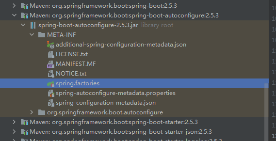
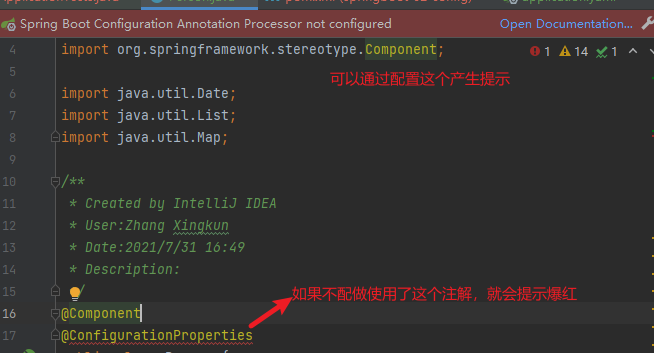

# SpringBoot

SpringBoot

- 是什么
- 配置如何写xml
- **自动装配原理**
- 集成web开发，业务核心
- 集成数据库Druid
- 分布式开发 Dubbo(RPC)+zookeeper
- swagger：接口文档
- 任务调度
- SpringSecurity，shiro

Linux

SpringCloud

- 微服务
- springCloud入门
- Restful风格
- Eureka
- Ribbon
- Feign
- HyStrix
- Zuul路由网关
- SpringCloud config git

JVM

## 1.什么是SpringBoot

### 什么是Spring

- Spring是一个开源框架，2003年兴起的一个轻量级Java开发框架，作者Rod Johnson

- Spring是为了解决企业级应用开发的复杂性而创建的，简化开发

### Spring如何简化Java开发的

为了降低Java开发的复杂性，Spring采用以下4种关键策略

1. 基于POJO的轻量级和最小侵入编程
2. 通过IOC，依赖注入(DI)和面向接口实现松耦合
3. 基于切面(AOP)和惯例进行声明式编程
4. 通过切面和模板减少样式代码

### 什么是SpringBoot

开发一个Javaweb程序，从最初Servlet结合Tomcat需要经历很多步骤，然后出现了框架Struts，再后来是SpringMVC，到了现在的SpringBoot

约定大于配置

Java企业级应用-->J2EE-->Spring-->SpringBoot

SpringBoot基于Spring，SpringBoot本身并不提供Spring框架的核心特性及拓展功能，只是用于快速、敏捷地开发新一代基于Spring框架的应用程序，本身并不是为了替代Spring，SpringBoot约定大于配置，集成了大量的第三方库配置，maven整合了所有jar包，SpringBoot整合了所有框架

主要优点

- 开箱即用，提供各种默认配置
- 内嵌式容器简化web项目
- 没有冗余代码生成和XML配置的要求
- 提供更快的入门

程序= 数据结构和算法

程序= 面向对象和框架

### 什么是微服务架构

MVC MVVM  微服务架构

业务 service  userService 模块

微服务是一种架构风格，他要求我们在开发一个应用的时候，这个应用必须构建成一系列小服务的组合，可以通过http的方式进行互通

### 单体应用架构

所谓单体应用架构(all in one)是指一个应用中的所有服务都放在一个应用程序中

微服务架构将功能元素独立出来，微服务架构是对功能元素进行复制，而没有对整个应用进行复制

优点

- 节省了调用资源
- 每个功能元素都是一个可替换的，可独立升级的代码

## 2.第一个SpringBoot程序

- 官网快速集成开发
- IEAD快速开始

[自定义Banner网站](https://www.bootschool.net/ascii)

resources下面新建banner.txt,自定义Banner

## 3. SpringBoot自动配置原理

pom.xml

- spring-boot-dependencies-2.5.3核心依赖在父工程中
- 我们在引入一些SpringBoot依赖时不需要指定版本，就是因为有这些版本仓库

启动器

- ```xml
  <!--        web依赖 tomcat dispatherServlet xml-->
          <dependency>
              <groupId>org.springframework.boot</groupId>
              <artifactId>spring-boot-starter-web</artifactId>
          </dependency>
  ```

- 实际上就是springboot的启动场景

- 比如引入spring-boot-starter-web，就会自动引入web相关依赖

- springboot会将所有的功能场景都封装成一个个启动器

- 我们要使用什么功能，只需要引入指定的启动器就可以了

> Maven下载项目源码命令
>
> mvn dependency:sourcesmvn dependency:resolve -Dclassifier=javadoc

主程序

```java
//标注这个类是一个SpringBoot应用
@SpringBootApplication
public class HelloworldApplication {

//    将SpringBoot应用启动
    public static void main(String[] args) {
        SpringApplication.run(HelloworldApplication.class, args);
    }

}
```

- 注解

  - ```java
    //springBoot的配置
    @SpringBootConfiguration
    	@Configuration  //Spring配置类
    		@Component //说明也是一个Spring组件
    @EnableAutoConfiguration //自动配置
    	@AutoConfigurationPackage  //自动导入包
    		@Import({Registrar.class}) //自动配置包注册
    	@Import({AutoConfigurationImportSelector.class})//自动配置导入选择
    //获取所有的配置
    List<String> configurations = this.getCandidateConfigurations(annotationMetadata, attributes);
    ```
    
  - 获取候选的配置
  
    ```java
    protected List<String> getCandidateConfigurations(AnnotationMetadata metadata, AnnotationAttributes attributes) {
        List<String> configurations = SpringFactoriesLoader.loadFactoryNames(this.getSpringFactoriesLoaderFactoryClass(), this.getBeanClassLoader());
        Assert.notEmpty(configurations, "No auto configuration classes found in META-INF/spring.factories. If you are using a custom packaging, make sure that file is correct.");
        return configurations;
    }
    ```
  
    META-INF/spring.factories 自动配置核心文件
  
    

结论 springboot所有自动配置都是在启动的时候扫描并加载：spring.factories所有的自动配置类都在这里面，但是不一定生效，要判断条件是否程来，只要导入了对应的start，就有对应的启动器了，有了启动器，自动装配就会生效，然后就配置成功

1. Springboot在启动的时候，从类路径下/META-INF/spring.factories获取指定的值
2. 将这些自动配置的类导入容器，自动配置就会生效，帮我们自动配置
3. 以前我们需要自动配置的东西，现在springboot帮我们做了
4. 整合JavaEE，解决方案和自动配置的东西都在spring-boot-autoconfigure这个包下
5. 它会把所有需要导入的组件，以类名的方式返回，这些组件就被添加到容器
6. 容器中也会存在非常多的xxxConfiguration的文件(@Bean)，就是这些类给容器中导入了这个场景所需要的所有组件，并自动配置@Configuration，JavaConfig
7. 有了自动配置类，免去了手写配置文件的问题

SpringApplication主要做了以下四件事情

1. 推断应用的类型是普通的项目还是Web项目
2. 查找并加载所有可用初始器，设置到initializers属性中
3. 找出所有的应用程序监听器，设置到listeners属性中
4. 推断并设置main方法的定义类，找到运行的主类

## 4. SpringBoot配置

### yaml文件

```yaml
server:
  port: 8081

#对空格的要求十分高
#普通的ket-value
name: zhangsan
#对象
student:
  name: 李四
  age: 3
#  行内写法
student1: {name: zhangsan,age: 5}
#数组
pets:
  - cat
  - cat
pets1: [cat,dog,pig]
```

properties文件

```properties
#springboot这个配置文件中到底可以配置哪些配置
#properties 只能保存键值对
```



加依赖

```xml
<dependency>
    <groupId>org.springframework.boot</groupId>
    <artifactId>spring-boot-configuration-processor</artifactId>
    <optional>true</optional>
</dependency>
```

```yaml
person:
  name: lisi
  age: 3
  happy: false
  birth: 2019/11/02
  maps: {k1: v1,k2: v2}
  hello: hhh
  lists:
    - code
    - music
    - drink
  dog:
#    name: 小白
    name: ${person.hello:hello}_小白
    age: 4
```

```java
@Component
//加载yaml文件中定义的对象
//@ConfigurationProperties(prefix = "person")
//javaConfig绑定我们配置文件的值可以采取这种方式
//加载指定的配置文件
//@PropertySource("classpath:person.properties")
public class Person {
//    SPEL表达式取出配置文件的值
//    @Value("${name}")
    private String name;
    private Integer age;
    private Boolean happy;
    private Date birth;
    private Map<String,Object> maps;
    private List<Object> lists;
    private Dog dog;
```

### 松散绑定：比如实体类中lastName，可以识别到yaml中的last_name

结论：

- 配置yml和配置properties都可以获取到值，推荐使用yml
- 如果我们在某个业务中，只需要获取配置文件中的某个值，可以使用@value
- 如果说，我们专门编写了一个JavaBean来和配置文件进行映射，可以直接使用@ConfigurationPrroperties

### JSR303校验

导入依赖

```xml
<dependency>
    <groupId>org.springframework.boot</groupId>
    <artifactId>spring-boot-starter-validation</artifactId>
</dependency>
```

实体类加对应注解

```java
//数据校验
@Validated
public class Person {

//    SPEL表达式取出配置文件的值
//    @Value("${name}")
    @Email(message = "邮箱格式错误")
    private String name;
```

> @NotNull(message="名字不能为空")
> private String userName;
> @Max(value=120,message="年龄最大不能查过120")
> private int age;
> @Email(message="邮箱格式错误")
> private String email;
>
> 空检查
> @Null       验证对象是否为null
> @NotNull    验证对象是否不为null, 无法查检长度为0的字符串
> @NotBlank   检查约束字符串是不是Null还有被Trim的长度是否大于0,只对字符串,且会去掉前后空格.
> @NotEmpty   检查约束元素是否为NULL或者是EMPTY.
>     
> Booelan检查
> @AssertTrue     验证 Boolean 对象是否为 true  
> @AssertFalse    验证 Boolean 对象是否为 false  
>     
> 长度检查
> @Size(min=, max=) 验证对象（Array,Collection,Map,String）长度是否在给定的范围之内  
> @Length(min=, max=) string is between min and max included.
>
> 日期检查
> @Past       验证 Date 和 Calendar 对象是否在当前时间之前  
> @Future     验证 Date 和 Calendar 对象是否在当前时间之后  
> @Pattern(value)    验证 String 对象是否符合正则表达式的规则

### 配置文件优先级

application.yml 优先级依次向下

1. file: ./config/
2. file: ./
3. classpath: /config/
4. classpath:/

配置文件切换多环境

```yaml
#多个文件，指定
#springboot多环境配置，可以选择激活哪一个配置文件
spring:
  profiles:
    active: dev  #使用application-dev.yml环境
```

```yaml
#相当于把多个文件写在一个文件里
#springboot多环境配置，可以选择激活哪一个配置文件
spring:
  profiles:
    active: dev

server:
  port: 8081
---
server:
  port: 8083
spring:
  config:
    activate:
      on-profile: dev #指定文件的名字
---
```

自动配置再探

```yaml
#配置文件能配置什么 和spring.factories联系
#xxxAutoConfiguration默认值 xxxProperties 和配置文件绑定，就可以使用自定义的配置了
```

1. SpringBoot启动时会加载大量的自动配置类
2. 我们看我们需要的功能有没有在SpringBoot默认写好的自动配置类中
3. 我们再来看这个自动配置类中到底配置了哪些组件(只要我们要用的组件存在其中，我们呢就不需要再手动配置了)
4. 给容器中自动配置类添加组件的时候，会从properties类中获取某些属性，我们只需要在配置文件中指定这些属性的值即可
5. xxxxAutoConfiguration 自动配置类 给容器中添加组件
6. xxxxProperties 封装配置文件中的相关属性

```yaml
debug: true # 查看哪些自动配置生效了
```

## 5. SpringBoot Web开发

jar: webapp

自动装配

springboot到底帮我们配置了什么，我们能不能修改?能修改哪些东西?能不能扩展

- xxxAutoConfiguration 向容器中自动配置组件
- xxxProperties 自动配置类，装配配置文件中自定义的一些内容

要解决的问题

- 导入静态资源
- 首页
- jsp,模板引擎
- 装配扩展SpringMVC
- 增删改查
- 拦截器
- 国际化

### 静态资源

```java
public void addResourceHandlers(ResourceHandlerRegistry registry) {
    if (!this.resourceProperties.isAddMappings()) {
        logger.debug("Default resource handling disabled");
    } else {
        this.addResourceHandler(registry, "/webjars/**", "classpath:/META-INF/resources/webjars/");
        this.addResourceHandler(registry, this.mvcProperties.getStaticPathPattern(), (registration) -> {
            registration.addResourceLocations(this.resourceProperties.getStaticLocations());
            if (this.servletContext != null) {
                ServletContextResource resource = new ServletContextResource(this.servletContext, "/");
                registration.addResourceLocations(new Resource[]{resource});
            }

        });
    }
}
```

什么是webjars

总结

1. 在Springboot中，我们可以使用以下方式处理静态资源
   - webjars   localhost:8080/webjars/
   - public, static, resources   localhost:8080/
2. 优先级 resources>static(默认)>public

### 首页如何定制

首先2.2.x 和 2.2.x之前的版本 配置方式是不一样：

　　　　2.2.x之前配置：

　　　　　　只需要在yml文件中配置


```
spring:
  mvc:
    favicon:
      enabled: false
```

　　　　　　以及在resources文件夹中添加 favicon.ico 图片既可

 　　　2.2.x之后配置：

　　　　　　不需要在yml文件中配置了

　　　　　　而是在html中配置

```
<head>

    <meta charset="UTF-8"/>
    <title>nosoul</title>
    <link rel="icon" th:href="@{/public/favicon.ico}" type="image/x-icon"/>
    <link rel="bookmark" th:href="@{/public/favicon.ico}" type="image/x-icon"/>
</head>

```

新版直接丢到static下名字为favicon.ico即可


## 6.模板引擎

结论：使用thymeleaf，只需要导入相关的依赖就可以了，将.html文件放在templates文件夹下

```xml
<dependency>
    <groupId>org.springframework.boot</groupId>
    <artifactId>spring-boot-starter-thymeleaf</artifactId>
</dependency>
```

```java
public static final String DEFAULT_PREFIX = "classpath:/templates/";
public static final String DEFAULT_SUFFIX = ".html";
```


1. 首页配置 
   1. 注意 ，所有的静态资源都需要使用thymeleaf接管 @{}
   2. url @{}
2. 页面国际化
   1. 我们需要配置i18n文件
   2. 我们如果需要在项目中进行按钮自动切换中英文，需要自定义组件LocaleResolver
   3. 记得将自己写的组件配置到spring容器
   4. @Bean#{}取出国际化的文字
3. 登录+拦截器
4. 增删改查
   1. 提取公共页面
      1. th:fragment="sidebar"
      2. th:replacce="~{common/commons::sidebar}"
      3. 如果要传递参数，可以直接使用()传参，接收判断即可
   2. 列表循环展示
5. 添加员工
   1. 按钮提交
   2. 跳转到添加页面
   3. 添加员工成功
   4. 返回首页
6. CRUD
7. 404

前端

- 模板 别人写好的
- 框架 组件 自己手动组合拼接
  - 栅格系统
  - 导航栏
  - 侧边栏
  - 表单

## 7. 回顾

- Springboot是什么
- 微服务
- Helloworld
- 探究源码 自动装配原理
- 配置yaml
- 多文档环境切换
- 静态资源映射
- Thymeleaf th:
- SpringBoot如何扩展MVC javaconfig
- 如何修改SpringBoot的默认配置
- CRUD
- 国际化
- 拦截器
- 定制首页，错误页

One week

- JDBC
- **Mybatis** 
- **Druid**
- **Shiro 安全**
- **SpringSecurity 安全**
- 异步任务 邮件发送  定时任务
- Swagger
- Dubbo+Zookeeper

## 8. Data 

## 9. Mybatis

## 10. SpringSerurity

## 11. Shiro


