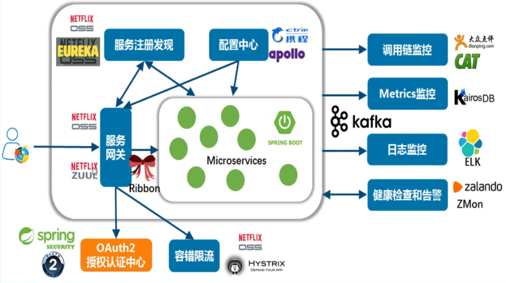

# SpringCloud

## 1. 微服务架构与SpringCloud

### 1. 微服务架构

微服务架构是一种架构模式，他提倡将单一的应用程序划分成一组小的服务，服务之间互相协调、互相配合，服务与服务间采用轻量级的通信机制互相协作(通常是基于HTTP协议的RESTful API)，每个服务都能被独立的部署到生产环境，应尽量避免统一的、集中式的服务管理机制，具体的服务应根据服务上下文进行创建


#### 基于分布式的微服务架构

> - 服务注册与发现
> - 服务调用
> - 服务熔断
> - 负载均衡
> - 服务降级
> - 服务消息队列
> - 配置中心管理
> - 服务网关
> - 服务监控
> - 全链路追踪
> - 自动化构建部署
> - 服务定时任务调度操作

### 2. SpringCloud简介

> 分布式微服务架构的一站式解决方法，是多种微服务架构落地技术的集合体，俗称微服务全家桶

#### SpringCloud中有哪些技术

> - Spring Cloud Config
> - Spring Cloud Bus
> - Eureka/Nacus
> - Hystrix
> - Zuul
> - Archaius
> - Consul
> - Spring Cloud Sleuth
> - Spring Cloud Data Flow
> - Spirng Cloud Security
> - Spring Cloud Zookeeper
> - Spring Cloud Stream
> - Spring Cloud Cli
> - Ribbon
> - Feign
> - Spring Cloud Task
> - Spring Cloud Connectors
> - Spring Cloud Cluster
> - Spring Cloud Starters
> - Spring Cloud for Cloud Foundry
> - Turbine

#### 3 SpringCloud 技术栈



> - 服务注册与发现 Eureka
> - 服务负载与调用 Ribbon
> - 服务负载与第哦啊用 Feign
> - 服务熔断降级 Hystrix
> - 服务网关 Zuul
> - 服务分布式配置 SPringleCloud Config
> - 服务开发 SpringBoot

#### 4. SpringCloud版本选择

英国伦敦地铁站 A-Z命名

现在是H版

SpringBoot和SpringCloud版本对应关系

Hoxton.SR1

2.2.2.RELEASE

start.spring.io/actuator/info

查看更详细的版本对应关系

#### 5. SpringCloud 停更\升级\替换

停更不停用

- 被动修改bugs

- 不再接受合并请求

- 不再发布新版本


### 3. 微服务架构编码构建

#### 1.工程构建

约定>配置>编码

IDEA新建project工作空间

Rest微服务工程创建


总父工程

POM

project

module

> 微服务cloud整体聚合父工程
>
> 父工程步骤
>
> - New project
> - 聚合总父工程名字
> - Maven选版本
> - 工程名字
>   - Maven --> create from archetype --> maven-archetype-site-->新建
> - 字符编码
>   - Editor-->File Encodings 全部UTF-8  勾选
> - 注解生效激活
>   - Builder，E...-->Compiler-->Annotation Processors 注解激活生效
> - Java编译版本选8
>   - Builder，E...-->Compiler-->Java Compiler 选择8版本
> - File Type过滤
>   - 就是看着清爽点
>
> 父工程POM
>
> 父工程src直接删掉即可，只用pom做版本管理
>
> ```xml
> <?xml version="1.0" encoding="UTF-8"?>
> 
> <project xmlns="http://maven.apache.org/POM/4.0.0" xmlns:xsi="http://www.w3.org/2001/XMLSchema-instance"
>   xsi:schemaLocation="http://maven.apache.org/POM/4.0.0 http://maven.apache.org/xsd/maven-4.0.0.xsd">
>   <modelVersion>4.0.0</modelVersion>
> 
>   <groupId>com.flywinter.springcloud</groupId>
>   <artifactId>springcloudh</artifactId>
>   <version>1.0-SNAPSHOT</version>
> <!--  用在父级工程或者聚合工程中，用来做jar包的版本控制-->
>   <packaging>pom</packaging>
> 
> <!--  统一管理jar包版本-->
>   <properties>
>     <project.build.sourceEncoding>UTF-8</project.build.sourceEncoding>
>     <maven.compiler.source>1.8</maven.compiler.source>
>     <maven.compiler.target>1.8</maven.compiler.target>
>     <junit.version>4.12</junit.version>
>     <log4j.version>1.2.17</log4j.version>
>     <lombok.version>1.16.18</lombok.version>
>     <mysql.version>8.0.25</mysql.version>
>     <druid.version>1.1.16</druid.version>
>     <mybatis.spring.boot.version>1.3.0</mybatis.spring.boot.version>
>   </properties>
> <!--  子模块继承以后,提供作用,锁定版本+module不用写groupId和version-->
>   <dependencyManagement>
>     <dependencies>
> <!--      springBoot 2.2.2-->
>       <dependency>
>         <groupId>org.springframework.boot</groupId>
>         <artifactId>spring-boot-dependencies</artifactId>
>         <version>2.2.2.RELEASE</version>
>         <type>pom</type>
>         <scope>import</scope>
>       </dependency>
> <!--      springcloud hoxtonSR1-->
>       <dependency>
>         <groupId>org.springframework.cloud</groupId>
>         <artifactId>spring-cloud-dependencies</artifactId>
>         <version>Hoxton.SR1</version>
>         <type>pom</type>
>         <scope>import</scope>
>       </dependency>
> <!--      springcloudalibaba 2.1.0.RELEASE-->
>       <dependency>
>         <groupId>com.alibaba.cloud</groupId>
>         <artifactId>spring-cloud-alibaba-dependencies</artifactId>
>         <version>2.1.0.RELEASE</version>
>         <type>pom</type>
>         <scope>import</scope>
>       </dependency>
>       <dependency>
>         <groupId>mysql</groupId>
>         <artifactId>mysql-connector-java</artifactId>
>         <version>${mysql.version}</version>
>       </dependency>
>       <dependency>
>         <groupId>com.alibaba</groupId>
>         <artifactId>druid</artifactId>
>         <version>${druid.version}</version>
>       </dependency>
>       <dependency>
>         <groupId>org.mybatis.spring.boot</groupId>
>         <artifactId>mybatis-spring-boot-starter</artifactId>
>         <version>${mybatis.spring.boot.version}</version>
>       </dependency>
>       <dependency>
>         <groupId>junit</groupId>
>         <artifactId>junit</artifactId>
>         <version>${junit.version}</version>
>       </dependency>
>       <dependency>
>         <groupId>log4j</groupId>
>         <artifactId>log4j</artifactId>
>         <version>${log4j.version}</version>
>       </dependency>
>       <dependency>
>         <groupId>org.projectlombok</groupId>
>         <artifactId>lombok</artifactId>
>         <version>${log4j.version}</version>
>         <optional>true</optional>
>       </dependency>
>     </dependencies>
>   </dependencyManagement>
>   <build>
>     <plugins>
>       <plugin>
>         <groupId>org.springframework.boot</groupId>
>         <artifactId>spring-boot-maven-plugin</artifactId>
>         <configuration>
>           <fork>true</fork>
>           <addResources>true</addResources>
>         </configuration>
>       </plugin>
>     </plugins>
>   </build>
> 
> </project>
> ```
>
> Maven工程落地细节
>
> dependencyManagement
>
> 通常会在一个组织或者项目最顶层的POM中看到dependencyManagement
>
> 可以让所以在子项目中引用一个依赖而不用显式的列出版本号，maven会沿着父子层次向上走，知道找到一个拥有dependencyManagement元素的项目，然后他就会使用这个dependencyManagement里面指定的版本号，如果子项目想用其他版本，就自己加上版本，只是声明，子类用来才会引入依赖
>
> Maven跳过单元测试 ，加快速度
>
> 完成后执行
>
> mvn clean install -DskipTests
>
> 将父工程发布到仓库中方便子工程继承

#### 2.支付订单示例


- Devtools热部署模块

- cloud-provider-payment8001微服务提供者支付Module模块
- cloud-consumer-order80微服务消费者订单Module模块
- 工程重构

步骤

1. 建Module

2. 改POM

   ```xml
   <dependencies>
       <dependency>
           <groupId>org.springframework.boot</groupId>
           <artifactId>spring-boot-starter-web</artifactId>
       </dependency>
       <dependency>
           <groupId>org.springframework.boot</groupId>
           <artifactId>spring-boot-starter-actuator</artifactId>
       </dependency>
       <dependency>
           <groupId>org.mybatis.spring.boot</groupId>
           <artifactId>mybatis-spring-boot-starter</artifactId>
       </dependency>
       <dependency>
           <groupId>com.alibaba</groupId>
           <artifactId>druid-spring-boot-starter</artifactId>
           <version>1.2.6</version>
       </dependency>
       <dependency>
           <groupId>mysql</groupId>
           <artifactId>mysql-connector-java</artifactId>
       </dependency>
       <dependency>
           <groupId>org.springframework.boot</groupId>
           <artifactId>spring-boot-starter-jdbc</artifactId>
       </dependency>
       <dependency>
           <groupId>org.springframework.boot</groupId>
           <artifactId>spring-boot-starter-test</artifactId>
           <scope>test</scope>
       </dependency>
       <dependency>
           <groupId>org.springframework.boot</groupId>
           <artifactId>spring-boot-devtools</artifactId>
           <scope>runtime</scope>
           <optional>true</optional>
       </dependency>
       <dependency>
           <groupId>org.projectlombok</groupId>
           <artifactId>lombok</artifactId>
           <optional>true</optional>
       </dependency>
   </dependencies>
   ```

3. 写YML

   ```yaml
   server:
     port: 8001
   
   spring:
     application:
       name: cloud-payment-service
     datasource:
       type: com.alibaba.druid.pool.DruidDataSource # 当前数据源操作类型
       driver-class-name: com.mysql.cj.jdbc.Driver
       url: jdbc:mysql://localhost:3306/db2021?useUnicode=true&characterEncoding=utf-8&useSSL=false
       username: root
       password: 123456
   mybatis:
     mapper-locations: classpath:mapper/*.xml
     type-aliases-package: com.flywinter.springcloud.entities # 所有Entity别名类所在包
   ```

4. 主启动

   ```java
   @SpringBootApplication
   public class PaymentMain8001 {
       public static void main(String[] args) {
           SpringApplication.run(PaymentMain8001.class,args);
       }
   }
   ```

5. 业务类

   vue-controller-service-dao-mysql

   controller-service-dao-mysql

   json

   - 建表

     ```sql
     create database if not exists db2021;
     use db2021;
     create table `payment`(
         `id` bigint(20) not null auto_increment comment 'ID',
         `serial` varchar(200) default '',
         primary key(`id`)
     )engine = InnoDB auto_increment=1 default charset = utf8;
     ```

   - entities

   - dao

   - service

   - controller

run --> run Dashboard 即Service

 

#### 3.热部署Devtools

添加热部署xml

```xml
<dependency>
    <groupId>org.springframework.boot</groupId>
    <artifactId>spring-boot-devtools</artifactId>
    <scope>runtime</scope>
    <optional>true</optional>
</dependency>
```

添加热部署插件

```xml
<build>
<!--        <finalName>cloud-provider-payment8001</finalName>-->
    <plugins>
        <plugin>
            <groupId>org.springframework.boot</groupId>
            <artifactId>spring-boot-maven-plugin</artifactId>
            <configuration>
                <fork>true</fork>
                <addResources>true</addResources>
            </configuration>
        </plugin>
    </plugins>
</build>
```

Enable automatic build

设置里面compiler全部打勾

Update the value of

ctrl+shift+alt+/

enable app.running   assertFocusAccessFromEdt 打勾

httpClient -->封装为RestTemplate

#### 4.RestTemplate

RestTemplate提供了多种便捷访问远程Http服务的方法，是一种简单便捷的访问restful服务模板类，是Spring提供的用于访问Rest服务的客户端模板工具集

#### 5. 工程重构

把共同的实体类提取出来

新建cloud-api-commons  module

修改pom

```xml
<dependencies>
    <dependency>
        <groupId>org.springframework.boot</groupId>
        <artifactId>spring-boot-devtools</artifactId>
        <scope>runtime</scope>
        <optional>true</optional>
    </dependency>
    <dependency>
        <groupId>org.projectlombok</groupId>
        <artifactId>lombok</artifactId>
        <optional>true</optional>
    </dependency>
    <dependency>
        <groupId>cn.hutool</groupId>
        <artifactId>hutool-aop</artifactId>
        <version>5.7.11</version>
    </dependency>
</dependencies>
```

将entity公共文件提取到新建的commons module下

commons模块执行mvn clean install -DskipTests

删除其他mudule里面的公共部分，pom里面引入公共模块

```xml
<dependency>
    <groupId>com.flywinter.springcloud</groupId>
    <artifactId>cloud-api-commons</artifactId>
    <version>${project.version}</version>
</dependency>
```


## 2.服务注册中心

### 为什么需要服务注册中心

用来查看一共有哪些服务，哪些服务可用

在传统的rpc远程调用框架中，管理每个服务与服务之间的依赖关系比较复杂，，管理比较复杂，所以需要使用服务治理，管理服务与服务之间的依赖关系，可以实现服务调用、负载均衡、容错等，实现服务发现与注册

### 1. Eureka 服务注册与发现(废弃)

#### 1.什么是服务注册与发现

Eureka采用了CS的设计架构，Eureka Server作为服务注册功能的服务器，它是服务注册功能的服务器，是服务注册中心。而系统中其他的微服务，使用Eureka的客户端连接到Eureka Server并维持心跳连接，这样系统的维护人员就可以通过Eureka Server来监控系统中各个微服务是否正常运行

在服务中蹙额与发现中，有一个注册中心，当服务器启动的时候，会把自己服务器的信息比如服务地址通讯地址等以别名方式注册到注册中心上，另一方以该别名的方式去注册中心上获取到实际的服务通讯地址没然后再实现本地RPC调用，任何RPC远程框架中，都会有一个注册中心

#### 2. Eureka和Dubbo

Eureka


Dubbo


#### 3. Eureka组件

##### Eureka Server提供服务注册服务

各个微服务节点通过配置启动后，会在EurekaServer中进行注册，这样Eureka中的服务注册表中将会存储所有可用服务节点信息，服务节点的信息可用在界面中直观看到

##### Eureka Client通过注册中心进行访问

是一个Java客户端，用于简化Eureka Server的交互，客户端同时也具备一个内置的、使用轮询round-robin负载算法的负载均衡器，在应用启动后，将会向Eureka Server发送心跳(默认周期30s)，如果Eureka Server在多个心跳周期内没有接受到某个节点的心跳，EurekaServer将会从服务注册表中把这个服务节点移除(默认90s)

#### 4. 单机Eureka构建

> IDEA 生成EurekaServer端服务注册中心
>
> - 建Module
>
>   ```
>   cloud-eureka-server7001
>   ```
>
> - 改POM
>
>   ```xml
>   以前的老版本1.0
>   <dependency>
>   	<groupId>org.springframework.cloud</groupId>
>       <artifactId>spring-cloud-stater-eureka</artifactId>
>   </dependency>
>   现在2020.2
>   <dependency>
>               <groupId>org.springframework.cloud</groupId>
>               <artifactId>spring-cloud-starter-netflix-eureka-server</artifactId>
>           </dependency>
>   ```
>
>   ```xml
>      <dependencies>
>   <!--        eureka Server-->
>           <dependency>
>               <groupId>org.springframework.cloud</groupId>
>               <artifactId>spring-cloud-starter-netflix-eureka-server</artifactId>
>           </dependency>
>   <!--        引入自己定义的API通用包，可用使用Payment-->
>           <dependency>
>               <groupId>com.flywinter.springcloud</groupId>
>               <artifactId>cloud-api-commons</artifactId>
>               <version>${project.version}</version>
>           </dependency>
>   <!--        boot web actuator-->
>           <dependency>
>               <groupId>org.springframework.boot</groupId>
>               <artifactId>spring-boot-starter-web</artifactId>
>           </dependency>
>           <dependency>
>               <groupId>org.springframework.boot</groupId>
>               <artifactId>spring-boot-starter-actuator</artifactId>
>           </dependency>
>   <!--通用配置-->
>           <dependency>
>               <groupId>org.springframework.boot</groupId>
>               <artifactId>spring-boot-starter-test</artifactId>
>               <scope>test</scope>
>           </dependency>
>           <dependency>
>               <groupId>org.springframework.boot</groupId>
>               <artifactId>spring-boot-devtools</artifactId>
>               <scope>runtime</scope>
>               <optional>true</optional>
>           </dependency>
>           <dependency>
>               <groupId>org.projectlombok</groupId>
>               <artifactId>lombok</artifactId>
>               <optional>true</optional>
>           </dependency>
>       </dependencies>
>   
>       <build>
>           <!--        <finalName>cloud-provider-payment8001</finalName>-->
>           <plugins>
>               <plugin>
>                   <groupId>org.springframework.boot</groupId>
>                   <artifactId>spring-boot-maven-plugin</artifactId>
>                   <configuration>
>                       <fork>true</fork>
>                       <addResources>true</addResources>
>                   </configuration>
>               </plugin>
>           </plugins>
>       </build>
>   ```
>
> - 写YML
>
>   ```yaml
>   server:
>     port: 7001
>   
>   eureka:
>     instance:
>       hostname: localhost #eureka服务端实例名称
>     client:
>   #    false表示不向服务注册中心注册自己
>       register-with-eureka: false
>   #    false 表示自己端就是注册中心，我的职责就是维护服务实例，并不需要去检索服务
>       fetch-registry: false
>       service-url:
>   #      设置与Eureka Server交互的地址查询服务和注册服务都需要依赖这个地址
>         defaultZone: http://${eureka.instance.hostname}:${server.port}/eureka/
>   ```
>
> - 主启动
>
> - 测试

#### 5. 入驻微服务

> EurekaClient端注册进Eureka作为服务提供者cloud-provider-payment8001
>
> - 改POM
>
>   ```xml
>   <!--        以前的版本-->
>           <dependency>
>               <groupId>org.springframework.cloud</groupId>
>               <artifactId>spring-cloud-starter-eureka</artifactId>
>           </dependency>
>   <!--        现在的版本-->
>           <dependency>
>               <groupId>org.springframework.cloud</groupId>
>               <artifactId>spring-cloud-starter-netflix-eureka-client</artifactId>
>           </dependency>
>   ```
>
>   添加
>
>   ```xml
>   <!--        eureka client-->
>           <dependency>
>               <groupId>org.springframework.cloud</groupId>
>               <artifactId>spring-cloud-starter-netflix-eureka-client</artifactId>
>           </dependency>
>   ```
>
> - 改yml
>
>   添加
>
>   ```yaml
>   eureka:
>     client:
>       #    true表示向服务注册中心注册自己
>       register-with-eureka: true
>       #    true表示从EurekaServer抓取已有的注册信息，单点无所谓，集群必须为true才能负载均衡
>       fetch-registry: true
>       service-url:
>         #      设置与Eureka Server交互的地址查询服务和注册服务都需要依赖这个地址
>         defaultZone: http://localhost:7001/eureka/
>   ```
>
> - 修改主启动类
>
>   ```java
>   @EnableEurekaClient
>   ```
>
> EurekaClient端注册进Eureka作为服务消费者cloud-consumer-order80
>
> 同上
>
> - 修改yml
>
>   ```yaml
>   spring:
>     application:
>       name: cloud-order-service
>   eureka:
>     client:
>       #    true表示向服务注册中心注册自己
>       register-with-eureka: true
>       #    true表示从EurekaServer抓取已有的注册信息，单点无所谓，集群必须为true才能负载均衡
>       fetch-registry: true
>       service-url:
>         #      设置与Eureka Server交互的地址查询服务和注册服务都需要依赖这个地址
>         defaultZone: http://localhost:7001/eureka/
>   ```

#### 6. 集群Eurake搭建

##### 简介

服务注册，将服务信息注册进注册中心

服务发现：从注册中心上获取服务信息

实质：存key服务，取value调用地址

1. 先启动eureka注册中心
2. 启动服务提供者payment支付服务
3. 支付服务启动后会把自身信息，比如服务地址注册进eureka
4. 消费者order服务在需要调用接口时，使用服务别名去注册中心获取实际的RPC远程调用地址
5. 消费者获得调用地址后，底层实际是利用HttpClient技术实现远程调用
6. 消费者获得服务地址后会缓存在本地jvm内存中，默认每间隔30s更新一次服务调用地址

问题：微服务RPC远程服务调用最核心的是什么

高可用，如果注册中心只有一个，挂了就会出现单点故障，导致整个服务不可用

解决方法：搭建Eureka注册中心集群，实现负载均衡+故障容错

##### 原理

互相注册，相互守望，对外暴露一个

##### 构建

> 参考cloud-eureka-server7001
>
> - 新建cloud-eureka-server7002
>
> - 改POM
>
> - 修改映射配置
>
>   C:\Windows\System32\drivers\etc下找到hosts文件
>
>   添加
>
>   127.0.0.1       eureka7001.com
>   127.0.0.1       eureka7002.com
>
>   为了让不同的端口号映射同一个Ip地址
>
> - 写YML
>
>   ```yaml
>   server:
>     port: 7002
>   
>   eureka:
>     instance:
>       hostname: eureka7002.com
>     #    hostname: localhost #eureka服务端实例名称
>     client:
>   #    false表示不向服务注册中心注册自己
>       register-with-eureka: false
>   #    false 表示自己端就是注册中心，我的职责就是维护服务实例，并不需要去检索服务
>       fetch-registry: false
>       service-url:
>   #      设置与Eureka Server交互的地址查询服务和注册服务都需要依赖这个地址
>   #      defaultZone: http://${eureka.instance.hostname}:${server.port}/eureka/
>         defaultZone: http://eureka7001.com:7001/eureka/
>   ```
>
>   同时修改7001的yaml
>
>   ```yaml
>   server:
>     port: 7001
>   
>   eureka:
>     instance:
>       hostname:  eureka7001.com #eureka服务端实例名称
>     client:
>   #    false表示不向服务注册中心注册自己
>       register-with-eureka: false
>   #    false 表示自己端就是注册中心，我的职责就是维护服务实例，并不需要去检索服务
>       fetch-registry: false
>       service-url:
>   #      设置与Eureka Server交互的地址查询服务和注册服务都需要依赖这个地址
>         defaultZone: http://eureka7002.com:7002/eureka/
>   ```
>
> - 主启动
>
> 将支付服务8001发布到上面的两台Eureka集群配置中
>
> - 修改yml
>
>   ```yaml
>   defaultZone: http://eureka7001.com:7001/eureka/, http://eureka7002.com:7002/eureka/
>   ```
>
> 将订单服务80发布到上面的两台Eureka集群配置中
>
> - 同上
>
> 

#### 7.服务集群搭建

> 构建服务提供者集群
>
> - 参考cloud-provider-payment8001
>
> - 搭建cloud-provider-payment8002
>
> - 在两者的controller上添加
>
> - ```java
>   @Value("${server.port}")
>   private String serverPort;
>   ```
>
> - 这样调用时就知道负载均衡是否起作用
>
> - 同时两者的yml修改
>
> ```yaml
> defaultZone: http://eureka7001.com:7001/eureka/, http://eureka7002.com:7002/eureka/
> ```
>
> 同时修改consumer即restTemplate的ip为微服务名字，只要服务名，不需要
>
> 然后使用负载均衡
>
> cuosumer里面
>
> ```java
> @Configuration
> public class ApplicationContextConfig {
>     @Bean
>     @LoadBalanced
>     public RestTemplate getRestTemplate(){
>         return new RestTemplate();
>     }
> }
> ```
>
> 之后通过消费者请求时会发现轮询请求

#### 8. actuator微服务信息完善

在8001和8002上面配置、消费者也可以配置

```yaml
instance:
  instance-id: payment8001 # 8002
  prefer-ip-address: true
```

这样服务名后面显示的就是定义的instance-id，而且鼠标悬浮时会显示ip

#### 9. 服务发现Discovery

对于注册进eureka里面的微服务，可用通过服务发现来获得该服务的信息

比如修改8001

controller注入

```java
@Resource
private DiscoveryClient discoveryClient;
```

添加访问方法

```java
@GetMapping("/payment/discovery")
public Object discovery(){
    List<String> services = discoveryClient.getServices();
    for (String service : services) {
        log.info("***element:"+service);
    }
    List<ServiceInstance> instances = discoveryClient.getInstances("CLOUD-PAYMENT-SERVICE");
    for (ServiceInstance instance : instances) {
        log.info(instance.getServiceId()+":"+instance.getHost()+""+instance.getUri());
    }
    return this.discoveryClient;
}
```

主启动添加注解

```java
@EnableDiscoveryClient
```

访问后会返回所有服务名

log打印同一个服务名的多个实例

#### 10.Eureka自我保护

**EMERGENCY! EUREKA MAY BE INCORRECTLY CLAIMING INSTANCES ARE UP WHEN THEY'RE NOT. RENEWALS ARE LESSER THAN THRESHOLD AND HENCE THE INSTANCES ARE NOT BEING EXPIRED JUST TO BE SAFE.**

某一时刻某一个微服务不可用了，Eureka不会立即清理，依旧会对该微服务的信息进行保存，属于CAP里面的AP

服务不可用了，不会立即删除服务，当Eureka短时间内丢失了过多的客户端时，可能发生了分区故障，这个节点就会进入自我保护模式


默认情况下EurekaClient定时向EurekaServer端发送心跳包，如果Eureka在Server端在一定时间内（默认90s）没有收到EurekaClient发送心跳包，便会直接从服务注册列表直接剔除该服务，但是在短时间内（90s中）丢失了大量的服务实例心跳，这时候EurekaServer就会开启自我保护机制，不会提出该服务（该现象可能出现在如果网络不通但是EurekaClient没有出现宕机，此时如果换做别的注册中心如果一定时间内没有收到心跳就会剔除该服务，这样就出现了严重失误，因为客户端还能正常发送心跳，知识网络延迟问题，保护机制就是为了防止这种现象发生）

宁可保留错误的服务注册信息，也不盲目注销可能健康的服务实例，好死不如赖活着

##### 如何禁止自我保护

注册中心和服务提供者

7001 

```yaml
  server:
#    关闭自我保护机制，保证不可用服务及时剔除
    enable-self-preservation: false
    eviction-interval-timer-in-ms: 2000
```

8001

```yaml
#    Eureka客户端向服务端发送心跳的时间间隔，s
    lease-expiration-duration-in-seconds: 30
#    Eureka服务端在收到最后一次心跳后等待时间上限，超时将剔除
    lease-renewal-interval-in-seconds: 90
```

#### 11. Eureka停更说明

### 2. Zookeeper

zookeeper是一个分布式协调工具，可以实现注册中心的功能

关闭linux服务器防火墙后启动zookeeper服务器

zookeeper服务器取代Eureka服务器，zk作为服务注册中心

password 用户名 修改对应用户名的密码

#### Zookeeper实现注册中心

> 注册中心Zookeeper
>
> 服务提供者
>
> - 新建cloud-provider-payment8004
>
> - 改POM
>
>   ```xml
>    <dependencies>
>   
>   
>   <!--        springBoot整合zookeeper客户端-->
>   
>           <dependency>
>               <groupId>org.springframework.cloud</groupId>
>               <artifactId>spring-cloud-starter-zookeeper-discovery</artifactId>
>           </dependency>
>                               
>           <dependency>
>               <groupId>com.flywinter.springcloud</groupId>
>               <artifactId>cloud-api-commons</artifactId>
>               <version>${project.version}</version>
>           </dependency>
>                               
>           <dependency>
>               <groupId>org.springframework.boot</groupId>
>               <artifactId>spring-boot-starter-web</artifactId>
>           </dependency>
>           <dependency>
>               <groupId>org.springframework.boot</groupId>
>               <artifactId>spring-boot-starter-actuator</artifactId>
>           </dependency>
>           <dependency>
>               <groupId>org.mybatis.spring.boot</groupId>
>               <artifactId>mybatis-spring-boot-starter</artifactId>
>           </dependency>
>           <dependency>
>               <groupId>com.alibaba</groupId>
>               <artifactId>druid-spring-boot-starter</artifactId>
>               <version>1.2.6</version>
>           </dependency>
>           <dependency>
>               <groupId>mysql</groupId>
>               <artifactId>mysql-connector-java</artifactId>
>           </dependency>
>           <dependency>
>               <groupId>org.springframework.boot</groupId>
>               <artifactId>spring-boot-starter-jdbc</artifactId>
>           </dependency>
>           <dependency>
>               <groupId>org.springframework.boot</groupId>
>               <artifactId>spring-boot-starter-test</artifactId>
>               <scope>test</scope>
>           </dependency>
>           <dependency>
>               <groupId>org.springframework.boot</groupId>
>               <artifactId>spring-boot-devtools</artifactId>
>               <scope>runtime</scope>
>               <optional>true</optional>
>           </dependency>
>           <dependency>
>               <groupId>org.projectlombok</groupId>
>               <artifactId>lombok</artifactId>
>               <optional>true</optional>
>           </dependency>
>       </dependencies>
>                               
>       <build>
>           <!--        <finalName>cloud-provider-payment8001</finalName>-->
>           <plugins>
>               <plugin>
>                   <groupId>org.springframework.boot</groupId>
>                   <artifactId>spring-boot-maven-plugin</artifactId>
>                   <configuration>
>                       <fork>true</fork>
>                       <addResources>true</addResources>
>                   </configuration>
>               </plugin>
>           </plugins>
>       </build>
>   ```
>
> - 改yml
>
>   ```yaml
>   #端口号
>   server:
>     port: 8004
>   #服务别名，注册zookeeper到注册中心的名称
>   spring:
>     application:
>       name: cloud-provider-payment
>     cloud:
>       zookeeper:
>         connect-string: 192.168.31.213:2181
>   ```
>
>   ```yaml
>   #端口号
>   server:
>     port: 8004
>   
>   
>         
>         
>   spring:
>     application:
>       #服务别名，注册zookeeper到注册中心的名称
>       name: cloud-payment-service # 微服务名称
>     cloud:
>       zookeeper:
>         connect-string: 192.168.31.213:2181
>         
>     datasource:
>       type: com.alibaba.druid.pool.DruidDataSource # 当前数据源操作类型
>       driver-class-name: com.mysql.cj.jdbc.Driver
>       url: jdbc:mysql://localhost:3306/db2021?useUnicode=true&characterEncoding=utf-8&useSSL=false
>       username: root
>       password: 123456
>   
>   
>   mybatis:
>     mapper-locations: classpath:mapper/*.xml
>     type-aliases-package: com.flywinter.springcloud.entity # 所有Entity别名类所在包
>   ```
>
> - 主启动类
>
> - Controller
>
>   ```java
>   @Slf4j
>   @RestController
>   public class PaymentController {
>       @Resource
>       PaymentService paymentService;
>       @Value("${server.port}")
>       private String serverPort;
>   
>       @GetMapping("/payment/zk")
>       public String paymentZK(){
>           return "spring cloud with zookeeper:"+serverPort+"\t"+ UUID.randomUUID();
>       }
>   
>   }
>   ```
>
> - 启动注册进Zookeeper
>
>   ```bash
>   # 启动zookeeper
>   zxkfall@fall:/opt/module/zookeeper-3.5.7/bin$ sudo ./zkServer.sh start
>   /usr/bin/java
>   ZooKeeper JMX enabled by default
>   Using config: /opt/module/zookeeper-3.5.7/bin/../conf/zoo.cfg
>   # 通过命令行查看连接情况
>   zxkfall@fall:/opt/module/zookeeper-3.5.7/bin$ sudo ./zkCli.sh
>   [zk: localhost:2181(CONNECTED) 10] ls /
>   services    zookeeper
>   [zk: localhost:2181(CONNECTED) 10] ls /services
>   [cloud-payment-service]
>   [zk: localhost:2181(CONNECTED) 11] ls -R /
>   [zk: localhost:2181(CONNECTED) 11] ls -R /
>   /
>   /services
>   /zookeeper
>   /services/cloud-payment-service
>   /services/cloud-payment-service/6229b3ca-5690-4ec5-b7eb-938edde6364e
>   /zookeeper/config
>   /zookeeper/quota
>   [zk: localhost:2181(CONNECTED) 12] get /services/cloud-payment-service/6229b3ca-5690-4ec5-b7eb-938edde6364e
>   {"name":"cloud-payment-service","id":"6229b3ca-5690-4ec5-b7eb-938edde6364e","address":"localhost","port":8004,"sslPort":null,"payload":{"@class":"org.springframework.cloud.zookeeper.discovery.ZookeeperInstance","id":"application-1","name":"cloud-payment-service","metadata":{}},"registrationTimeUTC":1631160196581,"serviceType":"DYNAMIC","uriSpec":{"parts":[{"value":"scheme","variable":true},{"value":"://","variable":false},{"value":"address","variable":true},{"value":":","variable":false},{"value":"port","variable":true}]}}
>   
>   ```
>
> - 测试
>
> - 服务节点是临时节点还是持久节点
>
>   临时节点，心跳时间外断掉就删除

#### Zookpeeper代替Eureka

> 新建cloud-sonsumerzk-order80
>
> - POM
>
>   ```xml
>     <dependencies>
>           <!--        springBoot整合zookeeper客户端-->
>           <dependency>
>               <groupId>org.springframework.cloud</groupId>
>               <artifactId>spring-cloud-starter-zookeeper-discovery</artifactId>
>           </dependency>
>               
>           <dependency>
>               <groupId>com.flywinter.springcloud</groupId>
>               <artifactId>cloud-api-commons</artifactId>
>               <version>${project.version}</version>
>           </dependency>
>               
>           <dependency>
>               <groupId>org.springframework.boot</groupId>
>               <artifactId>spring-boot-starter-web</artifactId>
>           </dependency>
>           <dependency>
>               <groupId>org.springframework.boot</groupId>
>               <artifactId>spring-boot-starter-actuator</artifactId>
>           </dependency>
>   
>   
>           <dependency>
>               <groupId>org.springframework.boot</groupId>
>               <artifactId>spring-boot-starter-test</artifactId>
>               <scope>test</scope>
>           </dependency>
>           <dependency>
>               <groupId>org.springframework.boot</groupId>
>               <artifactId>spring-boot-devtools</artifactId>
>               <scope>runtime</scope>
>               <optional>true</optional>
>           </dependency>
>           <dependency>
>               <groupId>org.projectlombok</groupId>
>               <artifactId>lombok</artifactId>
>               <optional>true</optional>
>           </dependency>
>       </dependencies>
>                           
>       <build>
>           <!--        <finalName>cloud-provider-payment8001</finalName>-->
>           <plugins>
>               <plugin>
>                   <groupId>org.springframework.boot</groupId>
>                   <artifactId>spring-boot-maven-plugin</artifactId>
>                   <configuration>
>                       <fork>true</fork>
>                       <addResources>true</addResources>
>                   </configuration>
>               </plugin>
>           </plugins>
>       </build>
>   ```
>
> - YML
>
>   ```yaml
>   #端口号
>   server:
>     port: 80
>   
>   spring:
>     application:
>       #服务别名，注册zookeeper到注册中心的名称
>       name: cloud-consumer-order # 微服务名称
>     cloud:
>       zookeeper:
>         connect-string: 192.168.31.213:2181
>   ```
>
> - 主启动
>
> - 业务类
>
>   ```java
>   @Configuration
>   public class ApplicationContextConfig {
>       @Bean
>       @LoadBalanced
>       public RestTemplate getRestTemplate(){
>           return new RestTemplate();
>       }
>   }
>   ```
>
>   ```java
>   @RestController
>   @Slf4j
>   public class OrderZKController {
>       public static String INVOKE_URL = "http://cloud-payment-service";
>   
>       @Autowired
>       private RestTemplate restTemplate;
>   
>       @GetMapping("/consumer/payment/zk")
>       public String paymentInfo(){
>           String object = restTemplate.getForObject(INVOKE_URL + "/payment/zk", String.class);
>           return object;
>       }
>   }
>   
>   ```
>
> - 验证测试
>
> - 访问测试地址

### 3. Consul

#### 简介

[consul官网](https://www.consul.io/)

go写的

> Consul是一套开源的分布式服务发现和配置管理系统，由HashiCorp公司用Go语言开发
>
> 提供了微服务系统中的服务治理、配置中心、控制总线等功能，这些功能中的每一个都可以根据需要单独使用，也可以一起作为服务网格，Consul提供了一种完整的服务网格解决方案


> 基于raft协议，比较简洁；支持健康检查，同时支持HTTP和DNS协议，支持跨数据中心WAN集群，提供图形界面，支持Linux，Mac，Windows
>
> - 服务发现
>
>   支持HTTP和DNS两种发现方式
>
> - 健康检测
>
>   支持多种方式HTTP、TCP、Docker、Shell脚本定制化
>
> - KV存储
>
>   Key Value的存储方式
>
> - 多数据中心
>
>   Consul支持多数据中心
>
> - 可视化Web界面

[consul下载](https://www.consul.io/downloads)

#### 安装运行

> windows下载后只有一个exe文件，用cmd打开
>
> 双击即可运行，但是可能会闪退，所以用开发模式启动
>
> consul -version 查看版本
>
> 使用开发模式启动
>
> consul agent -dev
>
> http://localhost:8500 访问页面

#### 服务提供者

> cloud-providerconsul-payment8006
>
> - 新建module cloud-providerconsul-payment8006
>
> - POM
>
>   ```xml
>   <dependencies>
>       <!--        springBoot整合consul客户端-->
>       <dependency>
>           <groupId>org.springframework.cloud</groupId>
>           <artifactId>spring-cloud-starter-consul-discovery</artifactId>
>       </dependency>
>               
>       <dependency>
>           <groupId>com.flywinter.springcloud</groupId>
>           <artifactId>cloud-api-commons</artifactId>
>           <version>${project.version}</version>
>       </dependency>
>               
>       <dependency>
>           <groupId>org.springframework.boot</groupId>
>           <artifactId>spring-boot-starter-web</artifactId>
>       </dependency>
>       <dependency>
>           <groupId>org.springframework.boot</groupId>
>           <artifactId>spring-boot-starter-actuator</artifactId>
>       </dependency>
>   
>   
>       <dependency>
>           <groupId>org.springframework.boot</groupId>
>           <artifactId>spring-boot-starter-test</artifactId>
>           <scope>test</scope>
>       </dependency>
>       <dependency>
>           <groupId>org.springframework.boot</groupId>
>           <artifactId>spring-boot-devtools</artifactId>
>           <scope>runtime</scope>
>           <optional>true</optional>
>       </dependency>
>       <dependency>
>           <groupId>org.projectlombok</groupId>
>           <artifactId>lombok</artifactId>
>           <optional>true</optional>
>       </dependency>
>   </dependencies>
>   
>   <build>
>       <!--        <finalName>cloud-provider-payment8001</finalName>-->
>       <plugins>
>           <plugin>
>               <groupId>org.springframework.boot</groupId>
>               <artifactId>spring-boot-maven-plugin</artifactId>
>               <configuration>
>                   <fork>true</fork>
>                   <addResources>true</addResources>
>               </configuration>
>           </plugin>
>       </plugins>
>   </build>
>   ```
>
> - YML
>
> - 主启动类
>
> - Controller

#### 服务消费者

> cloud-sonsumerconsul-order80
>
> - POM
>
>   ```xml
>   <dependencies>
>       <!--        springBoot整合consul客户端-->
>       <dependency>
>           <groupId>org.springframework.cloud</groupId>
>           <artifactId>spring-cloud-starter-consul-discovery</artifactId>
>       </dependency>
>               
>       <dependency>
>           <groupId>com.flywinter.springcloud</groupId>
>           <artifactId>cloud-api-commons</artifactId>
>           <version>${project.version}</version>
>       </dependency>
>               
>       <dependency>
>           <groupId>org.springframework.boot</groupId>
>           <artifactId>spring-boot-starter-web</artifactId>
>       </dependency>
>       <dependency>
>           <groupId>org.springframework.boot</groupId>
>           <artifactId>spring-boot-starter-actuator</artifactId>
>       </dependency>
>   
>   
>       <dependency>
>           <groupId>org.springframework.boot</groupId>
>           <artifactId>spring-boot-starter-test</artifactId>
>           <scope>test</scope>
>       </dependency>
>       <dependency>
>           <groupId>org.springframework.boot</groupId>
>           <artifactId>spring-boot-devtools</artifactId>
>           <scope>runtime</scope>
>           <optional>true</optional>
>       </dependency>
>       <dependency>
>           <groupId>org.projectlombok</groupId>
>           <artifactId>lombok</artifactId>
>           <optional>true</optional>
>       </dependency>
>   </dependencies>
>   
>   <build>
>       <!--        <finalName>cloud-provider-payment8001</finalName>-->
>       <plugins>
>           <plugin>
>               <groupId>org.springframework.boot</groupId>
>               <artifactId>spring-boot-maven-plugin</artifactId>
>               <configuration>
>                   <fork>true</fork>
>                   <addResources>true</addResources>
>               </configuration>
>           </plugin>
>       </plugins>
>   </build>
>   ```
>
> - YML
>
>   ```yaml
>   server:
>     port: 80
>   spring:
>     application:
>       name: cloud-sonsumer-order
>     cloud:
>       consul:
>         host: localhost
>         port: 8500
>         discovery:
>           service-name: ${spring.application.name}
>   #        hostname: 127.0.0.1
>   #    consul注册中心地址
>   ```
>
> - 主启动类
>
> - 配置Bean
>
>   ```java
>   @Configuration
>   public class ApplicationContextConfig {
>       @Bean
>       @LoadBalanced
>       public RestTemplate getRestTemplate(){
>           return new RestTemplate();
>       }
>   }
>   ```
>
> - Controller
>
> - 验证测试

### 4. 三个注册中心异同

| 组件名    | 语言 | CAP  | 服务健康检测 | 对外暴露接口 | Spring Cloud集成 |
| --------- | ---- | ---- | ------------ | ------------ | ---------------- |
| Eureka    | Java | AP   | 可配支持     | HTTP         | 已集成           |
| Consul    | go   | CP   | 支持         | HTTP/DNS     | 已集成           |
| Zookeeper | Java | CP   | 支持         | 客户端       | 已集成           |


CAP最多只能满足两个

CAP理论的核心是，一个分布式系统不可能同时很好的满足一致性、可用性和分区容错性这三个需求

因此根据CAP原理将NoSQL数据库分成了满足CA原则，满足哦CP原则和满足AP原则三大类

CA 单点集群，满足一致性，可用性的系统，通常在可扩展性上不强大

CP满足一致性，分区容错性的系统，通常性能不是特别高

AP满足可用性，分区容错性的系统，通常可能对一致性要求低一点

## 3. Ribbon负载均衡

### 1. 简介

> Spring Cloud Ribbon是基于Netflix Ribbon实现的一套客户端 负载均衡的工具
>
> 客户端的软件负载均衡算法和服务调用
>
> 自定义负载均衡算法 

已经进入维护模式

未来替换LoadBalance

Ribbon本地负载均衡客户端和Nginx服务端负载均衡区别

- Nginx是服务器负载均衡，客户端所有请求都会交给Nginx，然后由Nginx实现转发请求，负载均衡是由服务端实现的
- Ribbon本地负载均衡，在调用微服务接口的时候，将会在注册中心上获取注册信息服务列表之后缓存到JVM本地，从而在本地实现RPC远程调用技术

所有请求都会到nginx，nginx转发请求，Ribbon得到请求后动态调用服务

Nginx是分布式负载均衡，针对服务器，ribbon是集群式负载均衡，针对微服务

- 集中式LB

  即在服务的消费方和提供方之间使用独立的LB设施，可以是硬件，F5，也可以是软件Nginx，由该设施负责把访问请求通过某种策略转发到服务的提供方

- 进程内LB

  将LB逻辑集成到消费方，消费方从服务注册中心获知有哪些地址可用，然后自己再从这些地址中选择出一个合适的服务器，Ribbon就属于进程内LB，它只是一个类库，集成于消费方进程，消费方通过它来获取到服务提供方的地址

### 2. 负载均衡演示

Ribbon其实就是一个软负载均衡的客户端组件，它可以和其他所需请求的客户端结合使用，和Eureka结合只是其中的一个实例

1. 先选择EurekaServer，它优先选择在同一个区域内负载较少的Server
2. 根据用户指定的策略，从server取到的服务注册列表中选择一个地址

Ribbon提供了多种策略，比如轮询、随机和根据响应时间加权

Eureka自己引入了Ribbon

#### RestTemplate作用

getForObject

getForEntity

postForObject

postForEntity

GET

POST

Object 返回对象为响应体中数据转化成的对象，基本上可以理解为JSON

Entity返回对象为ResponseEntity，包含了响应中的一些重要信息，比如响应头，相应状态码，响应体等

#### Ribbon核心组件IRule

根据特定算法从服务列表中选取一个要访问的服务

常见内置调用

- RoundRobinRule 默认轮询
- RandomRule 随机
- RetryRule 先按照RoundRobinRule 的策略获取服务，如果获取服务失败则在指定时间会重试，获取可用的服务
- WeightedResponseTimeRule 对RoundRobinRule 的扩展，相应速度越快的实例权重越大，越容易被选择
- BestAvilableRule 先过滤掉由于多次访问故障处于短路跳闸状态的服务，然后选择一个并发量最小的服务
- AvailabilityFilteringRule 先过滤掉故障实例，再选择并发较小的实例
- ZoneAvoidanceRule 默认规则，符合判断server所在区域的性能和server的可用性选择服务器

如何替换

> 修改cloud-sonsumer-order80
>
> - 配置细节
>
>   这个自定义配置类不能放在@ComponentScan所扫描的当前包及子包下，否则我们定义的这个配置类就会被所有的Ribbon客户端所共享，达不到特殊化定制的目的，就是不要放在包扫描下
>
> - 新建package
>
>   com.flywinter.myrule
>
> - 新建配置类
>
>   ```java
>   @Configuration
>   public class MySelfRule {
>       @Bean
>       public IRule myRule(){
>           return new RandomRule();
>       }
>   }
>   ```
>
> - 主启动类添加
>
>   ```java
>   @RibbonClient(name = "CLOUD-PAYMENT-SERVICE",configuration = MySelfRule.class)
>   ```
>
> - 测试
>
>   springboot 2020版本 eureka删除了ribbon可以通过@LoadBalancerClient注解来改变LoadBalancer

### 3. Ribbon负载均衡算法

负载均衡算法：rest接口第几次请求数%服务器集群总数量=实际调用服务器位置下标，每次服务重启后rest计数从1开始

假设两台服务器

1%2 = 1

2%2 = 0

3%2 = 1

4%2 = 0

...

### 4. 手写负载均衡算法

原理加JUC(CAS+自旋锁)

> 8001和8002添加
>
> ```java
> @GetMapping("/payment/lb")
> public String getPaymentLB(){
>     return serverPort;
> }
> ```
>
> 80
>
> ApplicationContextBean去掉注解@LoadBalanced
>
> LoadBanlancer接口
>
> MyLBOrderController
>
> 测试

## 4. OpenFeign服务调用

### 1. 概述

Feign是一个声明式webService客户端，使用Feign能让编写WebService客户端更加简单

它的使用方法是定义一个服务接口然后在上面添加注解，Feign也支持可拔插式的编码器和解码器，Spring cloud对Feign进行了封装，使其支持了Spring MVC标准注解和HttpMEssageConvertrs。Feign可以与Eureka和Ribbon组合使用以支持负载均衡

只需要创建接口添加注解

feign能干什么，Feign旨在使Java Http客户端变得很容易。

前面使用Ribbon+RestTemplate时，利用RestTemplate对http请求的封装处理，形成了一套模板化的调用方法，但是在实际开发中，由于对服务依赖的调用可能不止一处，往往一个接口会被多处调用，所以通常会针对每个微服务自行封装一些客户端类来包装这些依赖服务的调用，所以Feign在此基础上进行了进一步封装，在Feign的实现下，我们只需要创建一个接口并使用注解的方式来配置它(以前是Dao接口上面标注Mapper注解，现在是一个微服务接口上面标注一个Feign注解即可)，即可完成对服务提供方的接口绑定

Feign集成了Ribbon

### 2. OpenFeign使用

> 新建cloud-sonsumer-feign-order80
>
> - POM
>
>   ```xml
>    <dependencies>
>   <!--        openFeign-->
>           <dependency>
>               <groupId>org.springframework.cloud</groupId>
>               <artifactId>spring-cloud-starter-openfeign</artifactId>
>           </dependency>
>           <!--        eureka client-->
>           <dependency>
>               <groupId>org.springframework.cloud</groupId>
>               <artifactId>spring-cloud-starter-netflix-eureka-client</artifactId>
>           </dependency>
>           <!--        引入公共模块-->
>           <dependency>
>               <groupId>com.flywinter.springcloud</groupId>
>               <artifactId>cloud-api-commons</artifactId>
>               <version>${project.version}</version>
>           </dependency>
>               
>           <dependency>
>               <groupId>org.springframework.boot</groupId>
>               <artifactId>spring-boot-starter-web</artifactId>
>           </dependency>
>           <dependency>
>               <groupId>org.springframework.boot</groupId>
>               <artifactId>spring-boot-starter-actuator</artifactId>
>           </dependency>
>   
>   
>           <dependency>
>               <groupId>org.springframework.boot</groupId>
>               <artifactId>spring-boot-starter-test</artifactId>
>               <scope>test</scope>
>           </dependency>
>           <dependency>
>               <groupId>org.springframework.boot</groupId>
>               <artifactId>spring-boot-devtools</artifactId>
>               <scope>runtime</scope>
>               <optional>true</optional>
>           </dependency>
>           <dependency>
>               <groupId>org.projectlombok</groupId>
>               <artifactId>lombok</artifactId>
>               <optional>true</optional>
>           </dependency>
>       </dependencies>
>                           
>       <build>
>           <!--        <finalName>cloud-provider-payment8001</finalName>-->
>           <plugins>
>               <plugin>
>                   <groupId>org.springframework.boot</groupId>
>                   <artifactId>spring-boot-maven-plugin</artifactId>
>                   <configuration>
>                       <fork>true</fork>
>                       <addResources>true</addResources>
>                   </configuration>
>               </plugin>
>           </plugins>
>       </build>
>   ```
>
> - YAML
>
>   ```yaml
>   server:
>     port: 80
>   
>   #spring:
>   #  application:
>   #    name: cloud-order-service
>   eureka:
>     client:
>       #    true表示向服务注册中心注册自己
>       register-with-eureka: false
>       service-url:
>         #      设置与Eureka Server交互的地址查询服务和注册服务都需要依赖这个地址
>         defaultZone: http://eureka7001.com:7001/eureka/, http://eureka7002.com:7002/eureka/
>   #  instance:
>   #    instance-id: consumer80
>   #    prefer-ip-address: true
>   ```
>
> - 主启动
>
>   ```java
>   @SpringBootApplication
>   @EnableFeignClients
>   public class OrderFeignMain80 {
>       public static void main(String[] args) {
>           SpringApplication.run(OrderFeignMain80.class,args);
>       }
>   }
>   ```
>
> - 业务类
>
>   ```java
>   @Component
>   @FeignClient(value = "CLOUD-PAYMENT-SERVICE")
>   public interface PaymentFeignService {
>       @GetMapping("/payment/get/{id}")
>        CommonResult<Payment> getPaymentById(@PathVariable("id") Long id);
>   }
>   ```
>
> - Controller
>
>   ```java
>   @RestController
>   public class OrderFeignController {
>       @Resource
>       private PaymentFeignService paymentFeignService;
>       @GetMapping("/consumer/payment/get/{id}")
>       public CommonResult<Payment> getPaymentById(@PathVariable("id") Long id){
>           return paymentFeignService.getPaymentById(id);
>       }
>   }
>   ```
>
> - 测试

### 3. OpenFeign超时控制

ribbon+restTemplate

public class XXXController

{

//面向接口

}

> 8001Controller添加
>
> ```java
> @GetMapping("/payment/feign/timeout")
> public String paymentFeignTimeout(){
>     try {
>         TimeUnit.SECONDS.sleep(3);
>     } catch (InterruptedException e) {
>         e.printStackTrace();
>     }
>     return serverPort;
> }
> ```
>
> PaymentFeignService添加
>
> ```java
> @GetMapping("/payment/feign/timeout")
> public String paymentFeignTimeout();
> ```
>
> OrderFeignController添加
>
> ```java
> @GetMapping("/consumer/payment/feign/timeout")
> public String paymentFeignTimeout(){
>     //openFeign-ribbon 客户端一般等待1s
>     return paymentFeignService.paymentFeignTimeout();
> }
> ```
>
> 超时会报错，这时候需要在yml里面配置
>
> 超时控制由Ribbon控制
>
> 80 yml添加
>
> ```yaml
> ribbon:
>   #  建立连接后从服务器读取到可用资源所用的时间
>   ReadTimeout: 5000
>   #  指的是建立连接所用的时间，适用于网络正常状况下，两端连接所用的时间
>   ConnectTime: 5000
> ```

### 4. OpenFeign日志打印功能

Feign提供了日志打印功能，可以通过配置来调整日级别，从而了解Feign中的Http请求的细节，说白了就是对Feign接口的调用情况进行监控和输出

#### 日志级别

- NONE:默认的，不显示任何日志
- BASIC:仅记录请求方法、URL、相应状态码及执行时间
- HEADERS:处理BASIC中定义的信息之外，还有请求和相应的头信息
- FULL:除了HEADERS中定义的信息之外，还有请求和响应的正文及元数据 

#### 如何配置

> 80添加config
>
> ```java
> @Configuration
> public class FeignConfig {
>     @Bean
>     Logger.Level feignLoggerLevel(){
>         return Logger.Level.FULL;
>     }
> }
> ```
>
> yaml添加
>
> ```yaml
> logging:
>   level:
>     # feign以什么级别监控哪个接口
>     com.flywinter.springcloud.service.PaymentFeignService: debug
> ```

## 5. Hystrix断路器(废弃)

服务降级

设计理念

### 1. 概述

##### 分布式系统的问题

复杂分布式系统结构中的应用程序有数十个依赖关系，每个依赖关系在某些时候将不可避免地失败

##### 服务雪崩

多个微服务之间调用的时候，假设微服务A第哦啊用微服务B和微服务C，微服务B和微服务C又调用其他的微服务，这就是所谓的扇出，如果扇出链路上某个微服务的调用时间过长或者不可用，对微服务A的调用就会占用越来越多的系统资源，从而引起系统崩溃，就是雪崩

对于高流量的应用来说，单一的后端依赖可能导致所有服务器上的所有资源都在几秒内饱和，所以需要对故障进行隔离

##### Hystrix是

一个用于处理分布式系统的延迟和容错的开源库，在分布式系统里，许多依赖不可避免的会调用失败，比如超时、异常等，Hystrix能够保证在一个依赖出问题的情况下，不会导致整体服务失败、比米娜级联故障，以提高分布式系统的弹性

断路器本身是一种开关装置，当某个服务单元发生故障后，通过断路器的故障监控，类似于熔断保险丝，向调用方法返回一个预期的、可处理的备选响应FallBack，而不是长时间的等待或者抛出调用方法无法处理的异常，这样就保证了服务调用方的线程不会被长时间的、不必要的占用，从而避免了故障在分布式系统中的蔓延，乃至雪崩

##### 用法

服务降级、服务熔断、接近实时的监控...

Hystrix停更开始维护

### 2. 重要概念

#### 服务降级 fallback

服务器忙，请稍后再试，不让客户端等待并立即返回一个友好提示

哪些情况会发生降级

- 程序运行异常
- 超时
- 服务熔断触发服务降级
- 线程池/信号量打满也会造成服务降级

#### 服务熔断 break

达到最大服务访问后直接拒绝访问，然后调用服务降级的方法返回友好提示

#### 服务限流 flowlimit

秒杀高并发等操作，避免同时处理请求，进行排队，1s内N个，排队进行

### 3. 案例

#### 构建

>  新建cloud-provider-hystrix-payment8001
>
> - POM
>
>   ```xml
>       <dependencies>
>   <!--        hystrix-->
>           <dependency>
>               <groupId>org.springframework.cloud</groupId>
>               <artifactId>spring-cloud-starter-netflix-hystrix</artifactId>
>           </dependency>
>           <!--        eureka client-->
>           <dependency>
>               <groupId>org.springframework.cloud</groupId>
>               <artifactId>spring-cloud-starter-netflix-eureka-client</artifactId>
>           </dependency>
>   
>           <dependency>
>               <groupId>com.flywinter.springcloud</groupId>
>               <artifactId>cloud-api-commons</artifactId>
>               <version>${project.version}</version>
>           </dependency>
>   
>           <dependency>
>               <groupId>org.springframework.boot</groupId>
>               <artifactId>spring-boot-starter-web</artifactId>
>           </dependency>
>           <dependency>
>               <groupId>org.springframework.boot</groupId>
>               <artifactId>spring-boot-starter-actuator</artifactId>
>           </dependency>
>   
>           <dependency>
>               <groupId>org.springframework.boot</groupId>
>               <artifactId>spring-boot-starter-test</artifactId>
>               <scope>test</scope>
>           </dependency>
>           <dependency>
>               <groupId>org.springframework.boot</groupId>
>               <artifactId>spring-boot-devtools</artifactId>
>               <scope>runtime</scope>
>               <optional>true</optional>
>           </dependency>
>           <dependency>
>               <groupId>org.projectlombok</groupId>
>               <artifactId>lombok</artifactId>
>               <optional>true</optional>
>           </dependency>
>       </dependencies>
>       <build>
>           <!--        <finalName>cloud-provider-payment8001</finalName>-->
>           <plugins>
>               <plugin>
>                   <groupId>org.springframework.boot</groupId>
>                   <artifactId>spring-boot-maven-plugin</artifactId>
>                   <configuration>
>                       <fork>true</fork>
>                       <addResources>true</addResources>
>                   </configuration>
>               </plugin>
>           </plugins>
>       </build>
>   ```
>
> - YML
>
>   ```yaml
>   server:
>     port: 8001
>   
>   spring:
>     application:
>       name: cloud-provider-hystrix-payment # 微服务名称
>   
>   eureka:
>     client:
>       #    true表示向服务注册中心注册自己
>       register-with-eureka: true
>       #    true表示从EurekaServer抓取已有的注册信息，单点无所谓，集群必须为true才能负载均衡
>       fetch-registry: true
>       service-url:
>         #      设置与Eureka Server交互的地址查询服务和注册服务都需要依赖这个地址
>   #      defaultZone: http://localhost:7001/eureka/
>         defaultZone: http://eureka7001.com:7001/eureka/, http://eureka7002.com:7002/eureka/
>     instance:
>       instance-id: payment8001
>       prefer-ip-address: true
>   ```
>
> - 主启动
>
>   ```java
>   @SpringBootApplication
>   @EnableEurekaClient
>   public class PaymentHystrixMain8001 {
>       public static void main(String[] args) {
>           SpringApplication.run(PaymentHystrixMain8001.class,args);
>       }
>   }
>   ```
>
> - 业务类
>
>   ```java
>   @Service
>   public class PaymentService {
>       /**
>        * 正常访问
>        * @param id
>        * @return
>        */
>       public String paymentInfo_OK(Integer id){
>           return "线程池:"+Thread.currentThread().getName()+" paymentInfo_ON,id"+id;
>       }
>       public String paymentInfo_Timeout(Integer id){
>           int timeout = 3;
>           try {
>               TimeUnit.SECONDS.sleep(timeout);
>           } catch (InterruptedException e) {
>               e.printStackTrace();
>           }
>           return "线程池:"+Thread.currentThread().getName()+" paymentInfo_Timeout,id"+id+"耗时"+timeout+"s";
>       }
>   }
>   ```
>
> - controller
>
>   ```java
>   @RestController
>   @Slf4j
>   public class PaymentController {
>       @Resource
>       private PaymentService paymentService;
>       @Value("${server.port}")
>       private String serverPort;
>       @GetMapping("/payment/hystrix/ok/{id}")
>       public String paymentInfo_OK(@PathVariable("id") Integer id){
>           String result = paymentService.paymentInfo_OK(id);
>           log.info("****result:"+result);
>           return result;
>       }
>       @GetMapping("/payment/hystrix/timeout/{id}")
>       public String paymentInfo_Timeout(@PathVariable("id") Integer id){
>           String result = paymentService.paymentInfo_Timeout(id);
>           log.info("****result:"+result);
>           return result;
>       }
>   
>   }
>   ```
>
> - 测试
>
> - 高并发测试
>
>   - 开启Jmeter压测，2000线程数，1s，循环100
>   - 这时候网页访问会很慢，因为tomcat默认的工作线程数被打满了，没有多余的线程来分解压力和处理
>
> 新建消费者cloud-consumer-fegin-hystrix-order80
>
> hystrix消费端和服务端都可以加，一般加载服务端
>
> - POM
>
>   ```xml
>   <dependencies>
>       <!--        hystrix-->
>       <dependency>
>           <groupId>org.springframework.cloud</groupId>
>           <artifactId>spring-cloud-starter-netflix-hystrix</artifactId>
>       </dependency>
>       <dependency>
>           <groupId>org.springframework.cloud</groupId>
>           <artifactId>spring-cloud-starter-openfeign</artifactId>
>       </dependency>
>       <!--        eureka client-->
>       <dependency>
>           <groupId>org.springframework.cloud</groupId>
>           <artifactId>spring-cloud-starter-netflix-eureka-client</artifactId>
>       </dependency>
>   
>       <dependency>
>           <groupId>com.flywinter.springcloud</groupId>
>           <artifactId>cloud-api-commons</artifactId>
>           <version>${project.version}</version>
>       </dependency>
>   
>       <dependency>
>           <groupId>org.springframework.boot</groupId>
>           <artifactId>spring-boot-starter-web</artifactId>
>       </dependency>
>       <dependency>
>           <groupId>org.springframework.boot</groupId>
>           <artifactId>spring-boot-starter-actuator</artifactId>
>       </dependency>
>   
>       <dependency>
>           <groupId>org.springframework.boot</groupId>
>           <artifactId>spring-boot-starter-test</artifactId>
>           <scope>test</scope>
>       </dependency>
>       <dependency>
>           <groupId>org.springframework.boot</groupId>
>           <artifactId>spring-boot-devtools</artifactId>
>           <scope>runtime</scope>
>           <optional>true</optional>
>       </dependency>
>       <dependency>
>           <groupId>org.projectlombok</groupId>
>           <artifactId>lombok</artifactId>
>           <optional>true</optional>
>       </dependency>
>   </dependencies>
>   <build>
>       <!--        <finalName>cloud-provider-payment8001</finalName>-->
>       <plugins>
>           <plugin>
>               <groupId>org.springframework.boot</groupId>
>               <artifactId>spring-boot-maven-plugin</artifactId>
>               <configuration>
>                   <fork>true</fork>
>                   <addResources>true</addResources>
>               </configuration>
>           </plugin>
>       </plugins>
>   </build>
>   ```
>
> - YAML
>
>   ```yaml
>   server:
>     port: 80
>   eureka:
>     client:
>       #    true表示向服务注册中心注册自己
>       register-with-eureka: false
>       service-url:
>         #      设置与Eureka Server交互的地址查询服务和注册服务都需要依赖这个地址
>   #      defaultZone: http://localhost:7001/eureka/
>         defaultZone: http://eureka7001.com:7001/eureka/, http://eureka7002.com:7002/eureka/
>   ```
>
> - 主启动
>
>   ```java
>   @SpringBootApplication
>   @EnableFeignClients
>   public class OrderHystrixMain80 {
>       public static void main(String[] args) {
>           SpringApplication.run(OrderHystrixMain80.class,args);
>       }
>   }
>   ```
>
> - 业务类
>
>   ```java
>   @Component
>   @FeignClient(value = "CLOUD-PROVIDER-HYSTRIX-PAYMENT")
>   public interface PaymentHystrixService {
>       @GetMapping("/payment/hystrix/ok/{id}")
>       public String paymentInfo_OK(@PathVariable("id") Integer id);
>       @GetMapping("/payment/hystrix/timeout/{id}")
>       public String paymentInfo_Timeout(@PathVariable("id") Integer id);
>   }
>   ```
>
> - controller
>
>   ```java
>   @RestController
>   @Slf4j
>   public class OrderHystrixController {
>       @Resource
>       private PaymentHystrixService paymentHystrixService;
>   
>       @GetMapping("/consumer/payment/hystrix/ok/{id}")
>       public String paymentInfo_OK(@PathVariable("id") Integer id){
>           String result = paymentHystrixService.paymentInfo_OK(id);
>           return result;
>       }
>       @GetMapping("/consumer//payment/hystrix/timeout/{id}")
>       public String paymentInfo_Timeout(@PathVariable("id") Integer id){
>           String result = paymentHystrixService.paymentInfo_Timeout(id);
>           return result;
>       }
>   }
>   ```
>
> - 正常测试
>
> - 高并发测试
>
>   压测消费端，发现访问异常缓慢
>
>   所以需要hystrix

#### 解决方法,服务降级

对方服务8001超时了，调用者80不能一致卡死等待

宕机了

8001OK但是自己故障或者有要求(有等待时间限制)

> 8001自身找问题
>
> - 设置自身调用超时时间的峰值，峰值内可用正常运行，超过了需要有兜底的方法处理，作为服务降级fallback
>
> - 8001service添加
>
>   - ```java
>     @HystrixCommand(fallbackMethod = "paymentInfo_TimeOutHandler",commandProperties = {
>             @HystrixProperty(name = "execution.isolation.thread.timeoutInMilliseconds",value = "500")
>     })
>     public String paymentInfo_Timeout(Integer id){
>         int timeout = 500;
>         try {
>             TimeUnit.MILLISECONDS.sleep(timeout);
>         } catch (InterruptedException e) {
>             e.printStackTrace();
>         }
>         return "线程池:"+Thread.currentThread().getName()+" paymentInfo_Timeout,id"+id+"耗时"+timeout+"s";
>     }
>             
>     public String paymentInfo_TimeOutHandler(Integer id){
>         return "线程池:"+Thread.currentThread().getName()+" paymentInfo_Timeout,id"+id+"超时后的方法";
>     }
>     ```
>
> - 主启动类添加
>
>   - ```java
>     @EnableCircuitBreaker
>     ```
>
> - 这样无论是请求超时还是其他的错误，都会有一个兜底的方法
>
> 80客户端配置，一般服务降级都是放在客户端
>
> YML
>
> 添加
>
> ```yaml
> feign:
>   hystrix:
>     enabled: true
> ```
>
> 主启动添加
>
> ```java
> @EnableHystrix
> ```
>
> controller添加
>
> ```java
> @HystrixCommand(fallbackMethod = "paymentInfo_TimeOutHandler",commandProperties = {
>         @HystrixProperty(name = "execution.isolation.thread.timeoutInMilliseconds",value = "600")
> })
> @GetMapping("/consumer//payment/hystrix/timeout/{id}")
> public String paymentInfo_Timeout(@PathVariable("id") Integer id){
>     String result = paymentHystrixService.paymentInfo_Timeout(id);
>     return result;
> }
> 
> 
> public String paymentInfo_TimeOutHandler(Integer id){
>     return "线程池:"+Thread.currentThread().getName()+" paymentInfo_Timeout,id"+id+"客户端超时";
> }
> ```

#### 全局Fallback

80 

OrderHystrixController添加

```
@DefaultProperties(defaultFallback = "payment_Global_FallbackMethod")
```

里面添加

```java
//下面是全局fallback
public String payment_Global_FallbackMethod(){
    return "全局兜底的方法";
}
```

同时

```java
//    @HystrixCommand(fallbackMethod = "paymentInfo_TimeOutHandler",commandProperties = {
//            @HystrixProperty(name = "execution.isolation.thread.timeoutInMilliseconds",value = "600")
//    })
    @HystrixCommand
```

这样加了注解@HystrixCommand，但是没有指定具体的方法，就会走全局方法，如果有指定的方法，就走指定的方法

#### 代码解耦

同样是客户端80

新建接口

```java
@Component
@FeignClient(value = "CLOUD-PROVIDER-HYSTRIX-PAYMENT",fallback = PaymentCallbackService.class)
public interface PaymentHystrixService {
    @GetMapping("/payment/hystrix/ok/{id}")
    public String paymentInfo_OK(@PathVariable("id") Integer id);
    @GetMapping("/payment/hystrix/timeout/{id}")
    public String paymentInfo_Timeout(@PathVariable("id") Integer id);
}
```

实现该接口

```java
@Component
public class PaymentCallbackService implements PaymentHystrixService{
    @Override
    public String paymentInfo_OK(Integer id) {
        return "PaymentCallbackService -- paymentInfo_OK";
    }

    @Override
    public String paymentInfo_Timeout(Integer id) {
        return "PaymentCallbackService -- paymentInfo_Timeout";
    }
}
```

YML添加

```yaml
feign:
  hystrix:
    enabled: true
```

相当于在service层解耦

### 4. 熔断

规定最近一段时间内大于默认次数的请求超过一定百分比调用失败便会熔断，熔断后直接返回熔断方法，这时即使传入的参数正确也会返回错误方法，一半的时间过后传入的第一个请求会请求正确方法，如果不报错，才会解除熔断状态

cloud-provider-hystrix-payment8001修改

PaymentService添加

```java
 //======服务熔断
    @HystrixCommand(fallbackMethod = "paymentCircuitBreaker_fallback", commandProperties = {
            //是否开启断路器
            @HystrixProperty(name = HystrixPropertiesManager.CIRCUIT_BREAKER_ENABLED, value = "true"),
//            请求次数
            @HystrixProperty(name = HystrixPropertiesManager.CIRCUIT_BREAKER_REQUEST_VOLUME_THRESHOLD, value = "10"),
//            时间窗口期，经过多久后恢复一次尝试
            @HystrixProperty(name = HystrixPropertiesManager.CIRCUIT_BREAKER_SLEEP_WINDOW_IN_MILLISECONDS, value = "10000"),
//失败率达到多少后熔断，百分比
            @HystrixProperty(name = HystrixPropertiesManager.CIRCUIT_BREAKER_ERROR_THRESHOLD_PERCENTAGE, value = "60")
    })
    public String paymentCircuitBreaker(@PathVariable("id") Integer id) {
        if (id < 0) {
            throw new RuntimeException("id不能为负数");
        }
        String simpleUUID = IdUtil.simpleUUID();
        return Thread.currentThread().getName() + "调用成功 流水号" + simpleUUID;
    }

    public String paymentCircuitBreaker_fallback(@PathVariable("id") Integer id) {
        return "id 不能为负数" + id;
    }
```

controller添加

```java
//==服务熔断
@GetMapping("/payment/circuit/{id}")
public String paymentCircuitBreaker(@PathVariable("id") Integer id){
    String result = paymentService.paymentCircuitBreaker(id);
    log.info("result: "+result);
    return result;
}
```

时间窗口期是指保险丝开启后经过的一段时间再转换为半开状态

熔断打开

熔断半开

熔断关闭

#### HystrixDashboard

9001

监控8001

网址为http://localhost:8001/hystrix.stream

## 6. 服务网关Zuul(废弃)和Gateway

服务网关，nginx之后，所有微服务之前

### 1. 概述

gateway基于springboot2,Spring webflux和project reactor

gateway是zuul1.x的替代

webFlux底层使用了高性能的Reactor模式通信框架Netty

gateway为目标提供统一的路由方式且基于Filter方式提供了网关的基本功能

功能

反向代理、鉴权、流量控制、熔断、日志监控。。。

异步非阻塞模型

动态路由、可以断言、过滤器、集成断路器功能、集成服务发现、请求限流、路径重写

传统servlet并发太高性能消耗严重

zuul1.x是基于一个servlet DispatcherServlet并由该Servlet阻塞式处理，所以无法摆脱阻塞的弊端

Spring WebFlux对标Spring MVC

三大概念

Route Predicate  Filter

核心逻辑

路由转发+执行过滤器链

### 2. 入门配置

> 新建cloud-gateway-gateway9527
>
> POM 注意gateway和web冲突
>
> - ```xml
>     <dependencies>
>   <!--        gateway-->
>           <dependency>
>               <groupId>org.springframework.cloud</groupId>
>               <artifactId>spring-cloud-starter-gateway</artifactId>
>           </dependency>
>           <!--        eureka client-->
>           <dependency>
>               <groupId>org.springframework.cloud</groupId>
>               <artifactId>spring-cloud-starter-netflix-eureka-client</artifactId>
>           </dependency>
>           
>           <dependency>
>               <groupId>com.flywinter.springcloud</groupId>
>               <artifactId>cloud-api-commons</artifactId>
>               <version>${project.version}</version>
>           </dependency>
>           
>           <dependency>
>               <groupId>org.springframework.boot</groupId>
>               <artifactId>spring-boot-starter-test</artifactId>
>               <scope>test</scope>
>           </dependency>
>           <dependency>
>               <groupId>org.springframework.boot</groupId>
>               <artifactId>spring-boot-devtools</artifactId>
>               <scope>runtime</scope>
>               <optional>true</optional>
>           </dependency>
>           <dependency>
>               <groupId>org.projectlombok</groupId>
>               <artifactId>lombok</artifactId>
>               <optional>true</optional>
>           </dependency>
>       </dependencies>
>       <build>
>           <!--        <finalName>cloud-provider-payment8001</finalName>-->
>           <plugins>
>               <plugin>
>                   <groupId>org.springframework.boot</groupId>
>                   <artifactId>spring-boot-maven-plugin</artifactId>
>                   <configuration>
>                       <fork>true</fork>
>                       <addResources>true</addResources>
>                   </configuration>
>               </plugin>
>           </plugins>
>       </build>
>   ```
>
> YML
>
> ```yaml
> server:
>   port: 9527
> 
> spring:
>   application:
>     name: cloud-gateway # 网关名称
> 
> eureka:
>   instance:
>     hostname: cloud-gateway-service
>   client:
>     #    true表示向服务注册中心注册自己
>     register-with-eureka: true
>     #    true表示从EurekaServer抓取已有的注册信息，单点无所谓，集群必须为true才能负载均衡
>     fetch-registry: true
>     service-url:
>       #      设置与Eureka Server交互的地址查询服务和注册服务都需要依赖这个地址
> #      defaultZone: http://localhost:7001/eureka/
>       defaultZone: http://eureka7001.com:7001/eureka/, http://eureka7002.com:7002/eureka/
> ```
>
> 主启动类
>
> ```java
> @SpringBootApplication
> @EnableEurekaClient
> public class GateWayMain9527 {
>     public static void main(String[] args) {
>         SpringApplication.run(GateWayMain9527.class,args);
>     }
> }
> ```
>
> 网关如何做路由映射？
>
> cloud-provider-payment8001里controller的访问地址 get/lb
>
> 目前不想暴露8001断开，希望在8001外面套一层9527 
>
> gateway yaml添加
>
> ```yaml
> spring:
>   application:
>     name: cloud-gateway # 网关名称
>   cloud:
>     gateway:
>       routes:
>         - id: payment_routh # 路由Id，没有固定规则但要求唯一，最好配合服务名
>           uri: http://localhost:8001 # 匹配后提供服务的路由地址
>           predicates:
>             - Path=/payment/get/** # 断言，路径相匹配进行路由
>         - id: payment_routh2
>           uri: http://localhost:8001
>           predicates:
>             - Path=/payment/lb/**
> ```
>
> 之后可以通过
>
> http://localhost:9527/payment/lb访问，相当于换了域名和端口号
>
> 隐藏真实地址
>
> 配置方式可以通过yml，也可以通过RouteLocator的Bean
>
> ```java
> @Configuration
> public class GateWayConfig {
>     @Bean
>     public RouteLocator customRouteLocator(RouteLocatorBuilder builder){
>         RouteLocatorBuilder.Builder routes = builder.routes();
>         routes.route("path_route_flywinter",predicateSpec ->
>                 predicateSpec.path("/china")
>                         .uri("https://cn.bing.com/")).build();
>         return routes.build();
>     }
> }
> ```

### 3. 使用微服务名实现动态路由

以前是Ribbon实现负载均衡，现在是Gateway实现

一个eureka7001和两个服务提供者8001/8002

9527yaml改为

```
uri: lb://cloud-payment-service # 匹配后提供服务的路由地址
```

外界访问Nginx，nginx访问网关，网关访问消费者，消费者ribbon访问服务

网关是隔离内部服务的和外部调用的

### 4. Predicate使用

jmeter

postman

curl 

url  --cookie "key=value"

url --H "key=value"

test测试里面获取固定的时间格式

```java
ZonedDateTime now = ZonedDateTime.now();
```

```yaml
          predicates:
            - Path=/payment/lb/**
#            - Method
#            - Header=X-Request-Id, \d+ # 请求头要有这个属性并且匹配正则表达式
#            - Cookie=name,value  # name和正则表达式 匹配上才能访问
#            - Before 时间
#            - Between 时间
#            - After=2021-09-11T23:08:31.704+08:00[Asia/Shanghai] # 这个时间之后才能访问这个路径，404
...
```

### 5. 过滤器

指的是spring框架中的GatewayFilter的实例，使用过滤器，可以在请求被路由之前或之后进行修改

生命周期

- Pre
- Post

种类

- GatewayFilter
- GlobalFilter

自定义过滤器常用

添加filter

```java
@Component
@Slf4j
public class MyLogGateWay implements GlobalFilter, Ordered {


    @Override
    public Mono<Void> filter(ServerWebExchange exchange, GatewayFilterChain chain) {
        log.info("***come in MyLogGateWayFilter "+new Date());
        String uname = exchange.getRequest().getQueryParams().getFirst("uname");
        if (uname == null) {
            log.info("非法用户");
            exchange.getResponse().setStatusCode(HttpStatus.NOT_ACCEPTABLE);
            return exchange.getResponse().setComplete();
        }
        return chain.filter(exchange);
    }

    @Override
    public int getOrder() {
        return 0;
    }
}
```

## 7. Config分布式配置中心

### 1. 简介

Config可用，但是逐渐被nacos替代

统一进行配置，一处修改，处处生效

生产环境，开发环境，测试环境，灰度发布环境

SpringCloud Config为微服务架构中的微服务提供集中化的外部配置支持，配置服务器为各个不同微服务应用的所有环境提供了一个中心化的外部配置

config server--> Local Git repository --> Reomte Gir resitory

how to do ?

spring cloud config分为服务端和客户端两部分

服务端也称分布式配置中心，他是一个独立的微服务应用，永安里连接配置服务器并为客户端提供获取配置信息，加密/解密信息等访问接口

客户端则是采用指定的配置中心来管理应用资源，以及与业务相关的配置内容，并在启动的时候从配置中心获取和加载配置信息配置服务，默认采用git来存储配置信息，这样有助于对环境配置进行版本管理并且可用使用git客户端工具来方便的管理和访问配置内容

- 几种管理
- 不同环境不同配置，动态更新
- 自动感知变化
- REST接口形式调用

### 2. 配置

Config服务端配置

>用github账号新建名为springcloud-config的新Repository
>
>获得上一步新建的git地址 https://github.com/fallofleaf/springcloud-config
>
>```bash
>git clone https://github.com/fallofleaf/springcloud-config
>```
>
>本地硬盘目录新建git仓库并克隆
>
>添加配置文件
>
>新建module模块cloud-config-center-3344
>
>它即为cloud配置中心模块cloudConfig Center
>
>POM
>
>```xml
><dependencies>
>
>    <dependency>
>        <groupId>org.springframework.cloud</groupId>
>        <artifactId>spring-cloud-config-server</artifactId>
>    </dependency>
>    <!--        eureka client-->
>    <dependency>
>        <groupId>org.springframework.cloud</groupId>
>        <artifactId>spring-cloud-starter-netflix-eureka-client</artifactId>
>    </dependency>
>
>    <dependency>
>        <groupId>org.springframework.boot</groupId>
>        <artifactId>spring-boot-starter-web</artifactId>
>    </dependency>
>    <dependency>
>        <groupId>org.springframework.boot</groupId>
>        <artifactId>spring-boot-starter-actuator</artifactId>
>    </dependency>
>
>    <dependency>
>        <groupId>org.springframework.boot</groupId>
>        <artifactId>spring-boot-starter-test</artifactId>
>        <scope>test</scope>
>    </dependency>
>    <dependency>
>        <groupId>org.springframework.boot</groupId>
>        <artifactId>spring-boot-devtools</artifactId>
>        <scope>runtime</scope>
>        <optional>true</optional>
>    </dependency>
>    <dependency>
>        <groupId>org.projectlombok</groupId>
>        <artifactId>lombok</artifactId>
>        <optional>true</optional>
>    </dependency>
></dependencies>
><build>
>    <!--        <finalName>cloud-provider-payment8001</finalName>-->
>    <plugins>
>        <plugin>
>            <groupId>org.springframework.boot</groupId>
>            <artifactId>spring-boot-maven-plugin</artifactId>
>            <configuration>
>                <fork>true</fork>
>                <addResources>true</addResources>
>            </configuration>
>        </plugin>
>    </plugins>
></build>
>```
>
>YML
>
>```yaml
>server:
>  port: 3344
>spring:
>  application:
>    name: cloud-config-center
>  cloud:
>    config:
>      server:
>        git:
>          uri: https://github.com/fallofleaf/springcloud-config.git # git仓库地址
>          search-paths:
>            - springcloud-config
>          default-label: main
>      #      读取分支
>      label: main
>eureka:
>  client:
>    #    true表示向服务注册中心注册自己
>    register-with-eureka: false
>    service-url:
>      #      设置与Eureka Server交互的地址查询服务和注册服务都需要依赖这个地址
>      #      defaultZone: http://localhost:7001/eureka/
>      defaultZone: http://eureka7001.com:7001/eureka/, http://eureka7002.com:7002/eureka/
>```
>
>主启动类
>
>```java
>@SpringBootApplication
>@EnableConfigServer
>public class ConfigCenterMain3344 {
>    public static void main(String[] args) {
>        SpringApplication.run(ConfigCenterMain3344.class,args);
>    }
>}
>```
>
>hosts文件增加映射
>
>127.0.0.1 config-3344.com
>
>启动微服务查看是否能获得配置内容
>
>http://localhost:3344/main/README.md
>
>配置读取规则
>
>- ip地址或域名/{application}/{profile}/{label}
>- ip地址或域名/{application}-{profile}.yml
>- ip地址或域名/{label}/{application}-{profile}.yml
>- ip地址或域名/{application}-{profile}.properties
>- ip地址或域名/{label}/{application}-{profile}.properties

Config客户端配置

> 新建cloud-config-client-3355
>
> POM
>
> ```xml
> <dependencies>
> 
>     <dependency>
>         <groupId>org.springframework.cloud</groupId>
>         <artifactId>spring-cloud-starter-config</artifactId>
>     </dependency>
>     <!--        eureka client-->
>     <dependency>
>         <groupId>org.springframework.cloud</groupId>
>         <artifactId>spring-cloud-starter-netflix-eureka-client</artifactId>
>     </dependency>
> 
>     <dependency>
>         <groupId>org.springframework.boot</groupId>
>         <artifactId>spring-boot-starter-web</artifactId>
>     </dependency>
>     <dependency>
>         <groupId>org.springframework.boot</groupId>
>         <artifactId>spring-boot-starter-actuator</artifactId>
>     </dependency>
> 
>     <dependency>
>         <groupId>org.springframework.boot</groupId>
>         <artifactId>spring-boot-starter-test</artifactId>
>         <scope>test</scope>
>     </dependency>
>     <dependency>
>         <groupId>org.springframework.boot</groupId>
>         <artifactId>spring-boot-devtools</artifactId>
>         <scope>runtime</scope>
>         <optional>true</optional>
>     </dependency>
>     <dependency>
>         <groupId>org.projectlombok</groupId>
>         <artifactId>lombok</artifactId>
>         <optional>true</optional>
>     </dependency>
> </dependencies>
> <build>
>     <!--        <finalName>cloud-provider-payment8001</finalName>-->
>     <plugins>
>         <plugin>
>             <groupId>org.springframework.boot</groupId>
>             <artifactId>spring-boot-maven-plugin</artifactId>
>             <configuration>
>                 <fork>true</fork>
>                 <addResources>true</addResources>
>             </configuration>
>         </plugin>
>     </plugins>
> </build>
> ```
>
> bootstrap.yml
>
> - application.yml是用户级的资源配置项
>
> - bootstrap.yml是系统级的，优先级更高
> - Spring cloud会创建一个Bootstrap Context作为Spring应用的Application Context的父上下文，初始化的时候，Bootstrap Context负责从外部源加载配置属性并解析配置，这两个上下文共享一个从外部获取的environment
> - BootStrap属性具有高优先级，默认情况下，它们不会被本地配置覆盖，Bootstrap和Application Context有着不同的约定，所以新增了一个bootstrap.yml的文件，保证Bootstrap Context和Application Context配置的分离
>
> 修改config-dev.yml配置并提交到Github中
>
> config:
>
> ​	info: system
>
> 添加bootstrap.yml
>
> ```yaml
> server:
>   port: 3355
> spring:
>   application:
>     name: config-client
>   cloud:
>     config:
> #      config客户端配置
>       label: main # 分支名称
>       name: config #配置文件名称
>       profile: dev #后缀名成
>       uri: http://localhost:3344
> eureka:
>   client:
>     #    true表示向服务注册中心注册自己
>     register-with-eureka: false
>     service-url:
>       #      设置与Eureka Server交互的地址查询服务和注册服务都需要依赖这个地址
>       #      defaultZone: http://localhost:7001/eureka/
>       defaultZone: http://eureka7001.com:7001/eureka/, http://eureka7002.com:7002/eureka/
> ```
>
> 主启动
>
> ```
> @SpringBootApplication
> @EnableEurekaClient
> public class ConfigClientMain3355 {
>     public static void main(String[] args) {
>         SpringApplication.run(ConfigClientMain3355.class,args);
>     }
> }
> ```
>
> 业务类
>
> ```java
> @SpringBootApplication
> @EnableEurekaClient
> public class ConfigClientMain3355 {
>     public static void main(String[] args) {
>         SpringApplication.run(ConfigClientMain3355.class,args);
>     }
> }
> ```
>
> 测试
>
> 成功实现了客户端3355访问SpringCloud3344通过github获取配置信息
>
> 

动态刷新问题

> 修改config-dev.yml并提交到github上
>
> 3344可以立即改变
>
> 3355却不会改变，重启之后才会改变
>
> 优化方式
>
> POM加入actuator
>
> 修改bootstrap.yml，暴露监控断开
>
> ```
> #      暴露监控端点
> management:
>   endpoints:
>     web:
>       exposure:
>         include: "*"
> ```
>
> controller添加
>
> ```java
> @RefreshScope
> ```
>
> 发送POST请求刷新，3355就能得到最新的配置了
>
> curl -X POST "http://localhost:3355/actuator/refresh"

## 8. SpringCloud Bus消息总线

多个微服务客户端

广播全部刷新

大范围自动刷新

Bus支持两种消息代理RabbitMQ和kafka

Bus和Config配合可以实现配置的动态刷新

基本原理

ConfigClient实例都监听MQ中同一个topic，默认是SpringCloudBus，当一个服务刷新数据的时候，它会把这个信息放入到topic中，这样其他同一个Topic的服务就能收到通知，然后去更新自身的配置

> windows安装RabbitMQ
>
> https://www.rabbitmq.com/install-windows.html
>
> 安装完进入sbin目录运行
>
> rabbitmq-plugins enable rabbitmq_management
>
> 开启图形化界面
>
> 访问地址http://localhost:15672
>
> guest
>
> guest登录

BUS动态刷新

以3355为模板再次制作一个3366

> ```
> cloud-config-client-3366
> ```
>
> POM
>
> ```xml
> <dependencies>
> 
>     <dependency>
>         <groupId>org.springframework.cloud</groupId>
>         <artifactId>spring-cloud-starter-config</artifactId>
>     </dependency>
>     <!--        eureka client-->
>     <dependency>
>         <groupId>org.springframework.cloud</groupId>
>         <artifactId>spring-cloud-starter-netflix-eureka-client</artifactId>
>     </dependency>
> 
>     <dependency>
>         <groupId>org.springframework.boot</groupId>
>         <artifactId>spring-boot-starter-web</artifactId>
>     </dependency>
>     <dependency>
>         <groupId>org.springframework.boot</groupId>
>         <artifactId>spring-boot-starter-actuator</artifactId>
>     </dependency>
> 
>     <dependency>
>         <groupId>org.springframework.boot</groupId>
>         <artifactId>spring-boot-starter-test</artifactId>
>         <scope>test</scope>
>     </dependency>
>     <dependency>
>         <groupId>org.springframework.boot</groupId>
>         <artifactId>spring-boot-devtools</artifactId>
>         <scope>runtime</scope>
>         <optional>true</optional>
>     </dependency>
>     <dependency>
>         <groupId>org.projectlombok</groupId>
>         <artifactId>lombok</artifactId>
>         <optional>true</optional>
>     </dependency>
> </dependencies>
> <build>
>     <!--        <finalName>cloud-provider-payment8001</finalName>-->
>     <plugins>
>         <plugin>
>             <groupId>org.springframework.boot</groupId>
>             <artifactId>spring-boot-maven-plugin</artifactId>
>             <configuration>
>                 <fork>true</fork>
>                 <addResources>true</addResources>
>             </configuration>
>         </plugin>
>     </plugins>
> </build>
> ```
>
> YML
>
> bootstrap
>
> ```yaml
> server:
>   port: 3366
> spring:
>   application:
>     name: config-client
>   cloud:
>     config:
> #      config客户端配置
>       label: main # 分支名称
>       name: config #配置文件名称
>       profile: dev #后缀名成
>       uri: http://localhost:3344
> eureka:
>   client:
>     #    true表示向服务注册中心注册自己
>     register-with-eureka: false
>     service-url:
>       #      设置与Eureka Server交互的地址查询服务和注册服务都需要依赖这个地址
>       #      defaultZone: http://localhost:7001/eureka/
>       defaultZone: http://eureka7001.com:7001/eureka/, http://eureka7002.com:7002/eureka/
> #      暴露监控端点
> management:
>   endpoints:
>     web:
>       exposure:
>         include: "*"
> ```
>
> 主启动
>
> ```java
> @SpringBootApplication
> @EnableEurekaClient
> public class ConfigClientMain3366 {
>     public static void main(String[] args) {
>         SpringApplication.run(ConfigClientMain3366.class,args);
>     }
> }
> ```
>
> controller
>
> ```java
> @RestController
> @RefreshScope
> public class ConfigClientController {
>     //必须联网才能读取到
>     @Value("${config.info}")
>     private String configInfo;
>     @GetMapping("/configInfo")
>     public String getConfigInfo(){
>         return configInfo;
>     }
> }
> ```

设计思想

> 利用消息总线触发一个客户端/bus/refresh，而刷新所有客户端的配置
>
> 利用消息总线触发一个服务端ConfigServer的bush/refresh端点，而刷新所有客户端的配置更适合

给cloud-config-center-3344配置中心服务端添加消息总线支持

> 3344POM添加
>
> ```xml
> <!--添加消息总线的支持-->
>         <dependency>
>             <groupId>org.springframework.cloud</groupId>
>             <artifactId>spring-cloud-starter-bus-amqp</artifactId>
>         </dependency>
> ```
>
> 3344YML添加
>
> ```yaml
>   rabbitmq:
>     host: localhost
>     port: 5672
>     username: guest
>     password: guest
> management:
>   endpoints:
>     web:
>       exposure:
>         include: 'bus-refresh'
> ```

给cloud-config-client-3355客户端添加消息总线支持

> POM
>
> ```xml
> <!--添加消息总线的支持-->
> <dependency>
>     <groupId>org.springframework.cloud</groupId>
>     <artifactId>spring-cloud-starter-bus-amqp</artifactId>
> </dependency>
> ```
>
> YML
>
> ```yaml
> rabbitmq:
>   host: localhost
>   port: 5672
>   username: guest
>   password: guest
> ```

给cloud-config-client-3366客户端添加消息总线支持

> ```xml
> <!--添加消息总线的支持-->
> <dependency>
>     <groupId>org.springframework.cloud</groupId>
>     <artifactId>spring-cloud-starter-bus-amqp</artifactId>
> </dependency>
> ```
>
> YML
>
> ```yaml
> rabbitmq:
>   host: localhost
>   port: 5672
>   username: guest
>   password: guest
> ```

测试

github修改后，只需要post3344，所有客户端都会刷新了

> curl -X POST "http://localhost:3344/actuator/bus-refresh"

### Bus动态刷新定点通知

curl -X POST "http://localhost:3344/actuator/bus-refresh/{destination}"

destination 客户端的名称，如config-client:3355，微服务加端口号

## 9. SpringCloud Stream消息驱动

### 1. 为什么要引入Stream

存在多种MQ如何切换、维护、开发

不再关注具体MQ的细节，只需要一种适配绑定的方式，自动在各种MQ中切换

屏蔽底层差异，加一层

#### 什么是SpringCloudStream

官方定义SpringCloud Stream是一个构建消息驱动微服务的框架

应用程序通过inputs或者outputs来与springcloud stream中的binder对象交互

通过我们配置来binding(绑定)，而springcloud stream的binder对象负责与消息中间件交互

所以我们只需要搞清楚如何与springcloud stream交互就可以方便使用消息驱动的方式


通过Spring Integration来连接消息代理中间件以实现消息事件驱动

SpringCloud Stream为一些供应商的消息中间件产品提供了个性化的自动化配置实现，引用了发布-订阅、消费组、分区三个核心概念

目前只支持RabbitMQ，kafka

### 2. 概述

标准MQ

> 生产者/消费者之间靠消息媒介传递信息内容 Message
>
> 消息必须走特定的通道 消息通道MessageChannel
>
> 消息通道里面的消息如何被消费，谁负责收发处理

Binder 

> INPUT对应消费者
>
> OUTPUT对应生产者

标准流程

>Binder很方便的连接中间件，屏蔽差异
>
>Channel 通道，是队列Queue的一种抽象，在消息通讯系统中就是实现存储和转发的媒介，通过Channel对队列进行配置
>
>Source和Sink 发消息就是输出，收消息就是输入

> Middleware
>
> Binder
>
> @Input
>
> @Output
>
> @StreamListener 监听队列，用于消费组消息监听
>
> @EnableBinding  channel和Exchange绑定

### 3. 编码

新建三个子模块

cloud-stream-rabbitmq-provider8801 作为生产者发送消息模块

> POM
>
> ```xml
> <dependencies>
>     <dependency>
>         <groupId>org.springframework.cloud</groupId>
>         <artifactId>spring-cloud-starter-stream-rabbit</artifactId>
>     </dependency>
>     <!--        eureka client-->
>     <dependency>
>         <groupId>org.springframework.cloud</groupId>
>         <artifactId>spring-cloud-starter-netflix-eureka-client</artifactId>
>     </dependency>
> 
>     <dependency>
>         <groupId>org.springframework.boot</groupId>
>         <artifactId>spring-boot-starter-web</artifactId>
>     </dependency>
>     <dependency>
>         <groupId>org.springframework.boot</groupId>
>         <artifactId>spring-boot-starter-actuator</artifactId>
>     </dependency>
> 
> 
>     <dependency>
>         <groupId>org.springframework.boot</groupId>
>         <artifactId>spring-boot-starter-test</artifactId>
>         <scope>test</scope>
>     </dependency>
>     <dependency>
>         <groupId>org.springframework.boot</groupId>
>         <artifactId>spring-boot-devtools</artifactId>
>         <scope>runtime</scope>
>         <optional>true</optional>
>     </dependency>
>     <dependency>
>         <groupId>org.projectlombok</groupId>
>         <artifactId>lombok</artifactId>
>         <optional>true</optional>
>     </dependency>
> </dependencies>
> 
> <build>
>     <!--        <finalName>cloud-provider-payment8001</finalName>-->
>     <plugins>
>         <plugin>
>             <groupId>org.springframework.boot</groupId>
>             <artifactId>spring-boot-maven-plugin</artifactId>
>             <configuration>
>                 <fork>true</fork>
>                 <addResources>true</addResources>
>             </configuration>
>         </plugin>
>     </plugins>
> </build>
> ```
>
> YML
>
> ```yaml
> eureka:
>   client:
>     #    true表示向服务注册中心注册自己
>     register-with-eureka: true
>     #    true表示从EurekaServer抓取已有的注册信息，单点无所谓，集群必须为true才能负载均衡
>     fetch-registry: true
>     service-url:
>       defaultZone: http://localhost:7001/eureka/
>       #      设置与Eureka Server交互的地址查询服务和注册服务都需要依赖这个地址
> 
> #      defaultZone: http://eureka7001.com:7001/eureka/, http://eureka7002.com:7002/eureka/
>   instance:
>     lease-renewal-interval-in-seconds: 2  # 心跳时间间隔
>     lease-expiration-duration-in-seconds: 5 # 默认90
>     instance-id: send-8801.com # 信息列表显示主机名称
>     prefer-ip-address: true # 访问的路径变为IP
> server:
>   port: 8801
> spring:
>   application:
>     name: cloud-stream-provider
>   cloud:
>     stream:
>       binders: # 在此处配置要绑定的rabbitmq服务信息
>         defaultRabbit: # 表示定义的名称，用于binding整合
>           type: rabbit # 消息组件类型
>           environment: # 设置rabbitMq相关配置
>             spring:
>               rabbitmq:
>                 host: localhost
>                 port: 5672
>                 username: guest
>                 password: guest
>       bindings:  # 服务的整合处理
>         output: # 这个名字是一个通道的名字
>           destination: studyExchange # 设置要使用的exchange名称定义
>           content-type: application/json # 设置消息类型
>           binder: defaultRabbit   # 设置要绑定的消息服务具体配置
> ```
>
> 主启动
>
> ```java
> @SpringBootApplication
> @EnableEurekaClient
> public class StreamMQMain8801 {
>     public static void main(String[] args) {
>         SpringApplication.run(StreamMQMain8801.class,args);
>     }
> }
> ```
>
> service
>
> ```java
> public interface IMessageProvider {
>     String send();
> }
> ```
>
> IMPL
>
> ```java
> @EnableBinding(Source.class) //定义消息的推送管道
> public class IMessageProviderImpl implements IMessageProvider {
> 
>     @Resource
>     private MessageChannel output; //消息发送通道
>     @Override
>     public String send() {
>         String serial = UUID.randomUUID().toString();
>         output.send(MessageBuilder.withPayload(serial).build());
>         System.out.println("*****serial:"+serial);
>         return null;
>     }
> }
> ```
>
> controller
>
> ```java
> @RestController
> public class SendMessageController {
>     @Resource
>     private IMessageProvider messageProvider;
> 
>     @GetMapping("/sendMessage")
>     public String sendMessage(){
>         return messageProvider.send();
>     }
> }
> ```

cloud-stream-rabbitmq-consumer8802 作为消息接收模块

> POM
>
> ```xml
> <dependencies>
>     <dependency>
>         <groupId>org.springframework.cloud</groupId>
>         <artifactId>spring-cloud-starter-stream-rabbit</artifactId>
>     </dependency>
>     <!--        eureka client-->
>     <dependency>
>         <groupId>org.springframework.cloud</groupId>
>         <artifactId>spring-cloud-starter-netflix-eureka-client</artifactId>
>     </dependency>
> 
>     <dependency>
>         <groupId>org.springframework.boot</groupId>
>         <artifactId>spring-boot-starter-web</artifactId>
>     </dependency>
>     <dependency>
>         <groupId>org.springframework.boot</groupId>
>         <artifactId>spring-boot-starter-actuator</artifactId>
>     </dependency>
> 
> 
>     <dependency>
>         <groupId>org.springframework.boot</groupId>
>         <artifactId>spring-boot-starter-test</artifactId>
>         <scope>test</scope>
>     </dependency>
>     <dependency>
>         <groupId>org.springframework.boot</groupId>
>         <artifactId>spring-boot-devtools</artifactId>
>         <scope>runtime</scope>
>         <optional>true</optional>
>     </dependency>
>     <dependency>
>         <groupId>org.projectlombok</groupId>
>         <artifactId>lombok</artifactId>
>         <optional>true</optional>
>     </dependency>
> </dependencies>
> 
> <build>
>     <!--        <finalName>cloud-provider-payment8001</finalName>-->
>     <plugins>
>         <plugin>
>             <groupId>org.springframework.boot</groupId>
>             <artifactId>spring-boot-maven-plugin</artifactId>
>             <configuration>
>                 <fork>true</fork>
>                 <addResources>true</addResources>
>             </configuration>
>         </plugin>
>     </plugins>
> </build>
> ```
>
> YML
>
> ```yaml
> eureka:
>   client:
>     #    true表示向服务注册中心注册自己
>     register-with-eureka: true
>     #    true表示从EurekaServer抓取已有的注册信息，单点无所谓，集群必须为true才能负载均衡
>     fetch-registry: true
>     service-url:
>       defaultZone: http://localhost:7001/eureka/
>       #      设置与Eureka Server交互的地址查询服务和注册服务都需要依赖这个地址
> 
> #      defaultZone: http://eureka7001.com:7001/eureka/, http://eureka7002.com:7002/eureka/
>   instance:
>     lease-renewal-interval-in-seconds: 2  # 心跳时间间隔
>     lease-expiration-duration-in-seconds: 5 # 默认90
>     instance-id: receive-8802.com # 信息列表显示主机名称
>     prefer-ip-address: true # 访问的路径变为IP
> server:
>   port: 8802
> spring:
>   application:
>     name: cloud-stream-consumer
>   cloud:
>     stream:
>       binders: # 在此处配置要绑定的rabbitmq服务信息
>         defaultRabbit: # 表示定义的名称，用于binding整合
>           type: rabbit # 消息组件类型
>           environment: # 设置rabbitMq相关配置
>             spring:
>               rabbitmq:
>                 host: localhost
>                 port: 5672
>                 username: guest
>                 password: guest
>       bindings:  # 服务的整合处理
>         input: # 这个名字是一个通道的名字
>           destination: studyExchange # 设置要使用的exchange名称定义
>           content-type: application/json # 设置消息类型
>           binder: defaultRabbit   # 设置要绑定的消息服务具体配置
> ```
>
> 主启动
>
> ```java
> @SpringBootApplication
> @EnableEurekaClient
> public class StreamMQMain8802 {
>     public static void main(String[] args) {
>         SpringApplication.run(StreamMQMain8802.class,args);
>     }
> }
> ```
>
> controller
>
> ```java
> @Component
> @EnableBinding(Sink.class)
> public class ReceiveMessageListenerController {
>     @Value("${server.port}")
>     private String serverPort;
>     @StreamListener(Sink.INPUT)
>     public void input(Message<String> message){
>         System.out.println("消费者1号接收的消息:"+message.getPayload()+" port:"+serverPort);
>     }
> }
> ```
>
> 8801发8802收

cloud-stream-rabbitmq-consumer8803 作为消息接收模块

### 4. 分组消费与持久化

依据8802，新建8803

#### 重复消费

8802和8803都收到了消息，因为处于不同的组

stream中，处于同一个group中的多个消费者是竞争关系，

不同组是可以重复消费，类似于扇出

修改XML，改变流水号(group)

8802和8803binder下面添加

```
group: flywinterA  # 8802
```

```
group: flywinterB # 8803
```

不同的组可以消费

如果只消费一次，改为相同的组

#### 持久化

加了group，那么即使MQ重启，对应的队列名还是一样的，不然重启后重新生成队列名，队列名不对应，那么相当于消息丢失

## 10.  Springcloud Sleuth分布式请求链路跟踪

### 1. 概述

提供了一整套完整的服务跟踪解决方案，在分布式系统中提供追踪解决方案并且兼容支持了zipkin

### 2. 搭建步骤

#### 1. zipkin

SpringCloud从F版起已经不需要自己构建zipkin server了，只需要调用jar包即可

下载地址

https://zipkin.io/pages/quickstart

运行jar包

java -jar zipkin-server-2.23.4-exec.jar

运行控制台

http://localhost:9411/zipkin/

一个请求在每个地方所用的时间

Trace类似树结构的span集合，表示一条调用链路，存在唯一标识

span标识调用链路来源，通俗的理解span就是一次请求信息

#### 2. 服务提供者

cloud-provider-payment8001修改

> POM添加
>
> ```xml
> <!--        包含了sleuth+zipkin-->
>         <dependency>
>             <groupId>org.springframework.cloud</groupId>
>             <artifactId>spring-cloud-starter-zipkin</artifactId>
>         </dependency>
> ```
>
> yml添加
>
> ```yml
>   zipkin:
>     base-url: http://localhost:9411
>   sleuth:
>     sampler:
> #      采样率值介于0-1之间，1则表示全部采集
>       probability: 1
> ```
>
> 业务类PaymentController添加
>
> ```java
> @GetMapping("/payment/zipkin")
> public String paymentZipkin(){
>     return "This is zipkin";
> }
> ```

#### 3. 服务消费者

cloud-consumer-order80

> POM添加
>
> ```xml
> <!--        包含了sleuth+zipkin-->
> <dependency>
>     <groupId>org.springframework.cloud</groupId>
>     <artifactId>spring-cloud-starter-zipkin</artifactId>
> </dependency>
> ```
>
> yml添加
>
> ```yaml
> zipkin:
>   base-url: http://localhost:9411
> sleuth:
>     sampler:
>       #      采样率值介于0-1之间，1则表示全部采集
>       probability: 1
> ```
>
> Ordercontroller添加
>
> ```java
> @GetMapping("/consumer/payment/zipkin")
> public String paymentZipkin(){
>     return  restTemplate.getForObject(PAYMENT_URL+"/payment/zipkin",String.class);;
> }
> ```

消费者调用后，去zipkin查看

## 11. SpringCloud Alibaba

### 1. 简介

https://github.com/alibaba/spring-cloud-alibaba

为什么会出现springcloud alibaba

netflix相关组件进入维护模式，只进行优先的维护

dubbo停更后，springcloud出来了，springcloud开始维护后，springcloud alibaba就出现了

2018.10.31正式入住springcloud

服务限流降级

服务注册与发现

分布式配置管理

消息驱动能力

阿里云对象存储

分布式任务调度

#### 如何使用

总工程添加

```xml
<dependencyManagement>
    <dependencies>
        <dependency>
            <groupId>com.alibaba.cloud</groupId>
            <artifactId>spring-cloud-alibaba-dependencies</artifactId>
            <version>2.1.0.RELEASE</version>
            <type>pom</type>
            <scope>import</scope>
        </dependency>
    </dependencies>
</dependencyManagement>
```

### 2. Nacos服务注册和配置中心

#### 1. 简介

Naming configurateon service

注册中心加配置中心的组合

Nacos = Eureka + Config  + Bus

#### 2. 安装运行

https://github.com/alibaba/Nacos

AP

官网下载Nacos

解压，然后运行bin目录下的startup.cmd

单机启动

startup.cmd -m standalone

访问http://localhost:8848/nacos

默认账号密码都是nacos

#### 3.服务提供者注册

新建Module

>cloudalibaba-provider-payment9001
>
>POM
>
>```xml
><dependencies>
>    <dependency>
>        <groupId>com.alibaba.cloud</groupId>
>        <artifactId>spring-cloud-starter-alibaba-nacos-discovery</artifactId>
>    </dependency>
>    <dependency>
>        <groupId>org.springframework.boot</groupId>
>        <artifactId>spring-boot-starter-web</artifactId>
>    </dependency>
>    <dependency>
>        <groupId>org.springframework.boot</groupId>
>        <artifactId>spring-boot-starter-actuator</artifactId>
>    </dependency>
>
>
>    <dependency>
>        <groupId>org.springframework.boot</groupId>
>        <artifactId>spring-boot-starter-test</artifactId>
>        <scope>test</scope>
>    </dependency>
>    <dependency>
>        <groupId>org.springframework.boot</groupId>
>        <artifactId>spring-boot-devtools</artifactId>
>        <scope>runtime</scope>
>        <optional>true</optional>
>    </dependency>
>    <dependency>
>        <groupId>org.projectlombok</groupId>
>        <artifactId>lombok</artifactId>
>        <optional>true</optional>
>    </dependency>
></dependencies>
><build>
>    <!--        <finalName>cloud-provider-payment8001</finalName>-->
>    <plugins>
>        <plugin>
>            <groupId>org.springframework.boot</groupId>
>            <artifactId>spring-boot-maven-plugin</artifactId>
>            <configuration>
>                <fork>true</fork>
>                <addResources>true</addResources>
>            </configuration>
>        </plugin>
>    </plugins>
></build>
>```
>
>YML
>
>```yaml
>server:
>  port: 9001
>spring:
>  application:
>    name: nacos-payment-provider
>  cloud:
>    nacos:
>      discovery:
>        server-addr: localhost:8848 # 配置nacos地址
>management:
>  endpoints:
>    web:
>      exposure:
>        include: '*'
>```
>
>主启动类
>
>```java
>@SpringBootApplication
>@EnableDiscoveryClient
>public class PaymentMain9001 {
>    public static void main(String[] args) {
>        SpringApplication.run(PaymentMain9001.class,args);
>    }
>}
>```
>
>controller
>
>```java
>@RestController
>public class PaymentController {
>    @Value("${server.port}")
>    private String serverPort;
>    @GetMapping("/payment/nacos/{id}")
>    public String getPayment(@PathVariable("id") Integer id){
>        return "nacos register,serverPort is "+ serverPort;
>    }
>}
>```
>
>为了演示负载均衡，新建9002

cloudalibaba-provider-payment9001

#### 4. 服务消费者注册

新建Module

>cloudalibaba-consumer-nacos-order83
>
>POM
>
>YAML
>
>```yaml
>server:
>  port: 83
>spring:
>  application:
>    name: nacos-order-consumer
>  cloud:
>    nacos:
>      discovery:
>        server-addr: localhost:8848 # 配置nacos地址
>#消费者将要去访问的微服务名称(注册成功进nacos的微服务提供者)
>service-url:
>  nacos-user-service: http://nacos-payment-provider
>```
>
>主启动类
>
>```java
>@SpringBootApplication
>@EnableDiscoveryClient
>public class OrderMain83 {
>    public static void main(String[] args) {
>        SpringApplication.run(OrderMain83.class,args);
>    }
>}
>```
>
>config
>
>```java
>@Configuration
>public class ApplicationContextConfig {
>    @Bean
>    @LoadBalanced
>    public RestTemplate getRestTemplate(){
>        return new RestTemplate();
>    }
>}
>```
>
>controller
>
>```java
>@RestController
>@Slf4j
>public class OrderNacosController {
>    @Resource
>    private RestTemplate restTemplate;
>    @Value("${service-url.nacos-user-service}")
>    private String serverURL;
>
>    @GetMapping("/consumer/payment/nacos/{id}")
>    public String getPayment(@PathVariable("id") Integer id){
>        return restTemplate.getForObject(serverURL+"/payment/nacos/"+id,String.class);
>    }
>}
>```
>
>测试
>
>访问http://localhost:83/consumer/payment/nacos/1
>
>发现可以负载均衡
>
>


nacos默认集成ribbon实现的负载均衡


#### 5. 注册中心对比

nacos支持AP和CP，默认AP


C是所有节点在同一时间看到的数据是一致的；而A的定义是所有的请求都会收到响应

旦选择使用何种模式？

一般来说，如果不需要存储服务级别的信息并且服务实例时通过nacos-client注册，并能够保持心跳上报，就可以选择AP模式，当前主流的服务如Springcloud 和Dubbo服务，都适用于AP模式，AP模式为了服务的可能性而减弱了一致性，因此AP模式下只址除注册临时实例。

如果需要在服务级别编辑或者存储配置信息，那么CP时必须，K8S和DNS服务则适用于CP模式

CP模式下则支持注册持久化实例，测试则是以Raft协议为集群运行模式，该模式下注册实例之前必须先注册服务，如果服务不存在，则会返回错误

```cmd
curl -X PUT '$NACOS_SERVER:8848'/nacos/v1/ns/operator/switches?entry=serverMode&value=CP'
```

#### 6. Nacos替代Config作为服务配置中心

##### 基础配置

Nacos作为配置中心-基础配置

> 新建项目 cloudalibaba-config-nacos-client3377
>
> POM
>
> ```xml
> <dependencies>
>  <dependency>
>      <groupId>com.alibaba.cloud</groupId>
>      <artifactId>spring-cloud-starter-alibaba-nacos-config</artifactId>
>  </dependency>
>  <dependency>
>      <groupId>com.alibaba.cloud</groupId>
>      <artifactId>spring-cloud-starter-alibaba-nacos-discovery</artifactId>
>  </dependency>
>  <dependency>
>      <groupId>org.springframework.boot</groupId>
>      <artifactId>spring-boot-starter-web</artifactId>
>  </dependency>
>  <dependency>
>      <groupId>org.springframework.boot</groupId>
>      <artifactId>spring-boot-starter-actuator</artifactId>
>  </dependency>
>  <dependency>
>      <groupId>org.springframework.boot</groupId>
>      <artifactId>spring-boot-starter-test</artifactId>
>      <scope>test</scope>
>  </dependency>
>  <dependency>
>      <groupId>org.springframework.boot</groupId>
>      <artifactId>spring-boot-devtools</artifactId>
>      <scope>runtime</scope>
>      <optional>true</optional>
>  </dependency>
>  <dependency>
>      <groupId>org.projectlombok</groupId>
>      <artifactId>lombok</artifactId>
>      <optional>true</optional>
>  </dependency>
> </dependencies>
> <build>
>  <!--        <finalName>cloud-provider-payment8001</finalName>-->
>  <plugins>
>      <plugin>
>          <groupId>org.springframework.boot</groupId>
>          <artifactId>spring-boot-maven-plugin</artifactId>
>          <configuration>
>              <fork>true</fork>
>              <addResources>true</addResources>
>          </configuration>
>      </plugin>
>  </plugins>
> </build>
> ```
>
> 配置两个YML
>
> 为什么配置两个？
>
> Nacos和springcloud-config一样，在项目初始化时，要保证先从配置中心进行配置拉取，拉取配置之后，才能保证项目的正常启动
>
> springboot中配置文件的加载是存在优先级顺序的，bootstrap优先级高于application
>
> application.yml
>
> ```yaml
> spring:
> profiles:
>  active: dev # 表示开发环境
> ```
>
> bootstrap.yml
>
> ```yaml
> server:
> port: 3377
> spring:
> application:
>  name: nacos-config-client
> cloud:
>  nacos:
>    discovery:
>      server-addr: localhost:8844 # nacos服务注册中心地址
>    config:
>      server-addr: localhost:8848 # nacos作为配置中心地址
>      file-extension: yaml # 指定yaml格式的配置
> ```
>
> 主启动
>
> ```java
> @EnableDiscoveryClient
> @SpringBootApplication
> public class NacosConfigClientMain3377 {
>     public static void main(String[] args) {
>         SpringApplication.run(NacosConfigClientMain3377.class,args);
>     }
> }
> ```
>
> 业务类
>
> ```java
> @RestController
> @RefreshScope //支持Nacos的动态刷新功能
> public class ConfigClientController {
>     @Value("${config.info}")
>     private String configInfo;
>     @GetMapping("/config/info")
>     public String getConfigInfo(){
>         return configInfo;
>     }
> }
> ```
>
> 在Nacos中添加配置信息
>
> > 之所以配置spring.application.name，是因为它是构成nacos配置管理dataId字段的一部分
> >
> > 在Nacos Spring Cloud中，dataId的完整格式如下
> >
> > `${prefix}-${spring.profile.active}.${file-extension}`
> >
> > - prefix默认位spring.application.name的值，也可以通过配置项spring.cloud.config.prefix来配置
> > - spring.profile.active即为当前环境对应的profile，当它为空时，对应的连接符-也不存在，dataId的拼接格式变为`${prefix}.${file-extension}`
> > - file-exetension为配置内容的数据个数，可以通过配置项spring.cloud.config.file-extension来配置，目前只支持properties和yaml类型
> > - 通过springcloud原生注解@RefreshScope实现配置自动更新
> >
> > nacos配置列表新加配置名字为nacos-config-client-dev.yaml
> >
> > 格式为yaml，内容为
> >
> > ```yaml
> > config:
> >   info: "config info for dev"
> > ```
> >
> > 
>
> 测试
>
> 启动3377
>
> 调用controller查看配置信息
>
> http://localhost:3377/config/info
>
> 自带动态刷新
>
> 只要在nacos修改，自动会刷新

##### 分类配置

Namespace+Group+DataID

类似于Java package名和类名

最外层namespace可以区分部署环境，Group和DataId逻辑上区分两个目标对象

namespace=public ，Group=DEFAULT_GROUP，默认cluster是DEFAULT

比如有三个环境，开发、测试、生产环境，那么就可以创建三个Namespace，不同namespace之间是隔离的

GROUP可以把不同的微服务划分到同一个分组中去

> 指定spring.profile.active和配置文件的DataID来使不同环境下读取不同的配置
>
> 默认空间+默认分组+新建dev和test两个DataID
>
> - 新建dev的配置DataID，已建
> - 新建test配置DataID
> - 
>
> 通过spring.profile.active属性就能进行多环境下配置文件的读取
>
> 3377  yaml的active改为test
>
> 再次访问那么访问的是test
>
> 配什么加载什么

Group

> 新建DATAID 
>
> nacos-config-client-info.yaml配置为DEV_GROUP
>
> 类型为yaml
>
> 内容为
>
> ```yaml
> config:
>     info: nacos-config-client-info.yaml DEV_GROUP
> ```
>
> 同上新建TEST_GROUP
>
> bootstrap.yaml的config下面添加group，然后指定group name就可以了
>
> appliaction.yaml的active改为info

Namespace

> 新建dev和test命名空间
>
> 对应bootstrap.yaml下面添加namespace，值为namespace的id，
>
> 对应namespace下面新建相关配置文件

#### 7. Nacos集群和持久化配置


默认Nacos使用嵌入式数据库实现数据的存储，如果启动多个默认配置下的Nacos节点，存在数据一致性问题，为了解决一致性问题，Nacos使用集中式存储的方式来支持集群化部署，目前只支持MySQL存储

Nacos支持三种部署模式

- 单机模式 测试和单机使用
- 集群模式 生产环境，确保高可用
- 多集群模式 用于多数据中心场景

##### 单机模式支持mysql

在0.7版本之前，在单机模式时nacos使用嵌入式数据库实现数据的存储，不方便观察数据存储的基本情况。0.7版本增加了支持mysql数据源能力，具体的操作步骤：

- 1.安装数据库，版本要求：5.6.5+
- 2.初始化mysql数据库，数据库初始化文件：nacos-mysql.sql
- 3.修改conf/application.properties文件，增加支持mysql数据源配置（目前只支持mysql），添加mysql数据源的url、用户名和密码。

```
spring.datasource.platform=mysql

db.num=1
db.url.0=jdbc:mysql://11.162.196.16:3306/nacos_devtest?characterEncoding=utf8&connectTimeout=1000&socketTimeout=3000&autoReconnect=true
db.user=nacos_devtest
db.password=youdontknow
```

再以单机模式启动nacos，nacos所有写嵌入式数据库的数据都写到了mysql

##### Linux集群环境配置

1个Nginx+3个nacos注册中心+1个mysql

Nacos下载linux版

集群配置步骤

测试

总结

### 3. SpringCloud Alibaba Sentinel实现熔断与限流

单独一个组件，可以独立出来

直接界面化的细粒度统一配置

约定>配置>编码

下载地址https://github.com/alibaba/Sentinel/releases

sentinel分为两部分

- 核心库(Java客户端) 不依赖任何框架/库，能够运行于所有Java运行时化境，同时对Dubbo/Spring Cloud等框架也有较好的支持
- 控制台基于spring Boot开发，打包后可以直接运行，不需要额外的Tomcat等应用容器

java -jar  运行

访问8080端口

默认用户和密码都是sentinel

#### 2. 初始化监控

启动nacos8848

新建cloudalibaba-sentinel-service8401

>POM
>
>```yaml
> <dependencies>
><!--        后续持久化用到-->
>        <dependency>
>            <groupId>com.alibaba.csp</groupId>
>            <artifactId>sentinel-datasource-nacos</artifactId>
>        </dependency>
><!--        nacos-->
>        <dependency>
>            <groupId>com.alibaba.cloud</groupId>
>            <artifactId>spring-cloud-starter-alibaba-nacos-discovery</artifactId>
>        </dependency>
><!--        sentinel-->
>        <dependency>
>            <groupId>com.alibaba.cloud</groupId>
>            <artifactId>spring-cloud-starter-alibaba-sentinel</artifactId>
>        </dependency>
><!--        openfeign-->
>        <dependency>
>            <groupId>org.springframework.cloud</groupId>
>            <artifactId>spring-cloud-starter-openfeign</artifactId>
>        </dependency>
>        <dependency>
>            <groupId>org.springframework.boot</groupId>
>            <artifactId>spring-boot-starter-web</artifactId>
>        </dependency>
>        <dependency>
>            <groupId>org.springframework.boot</groupId>
>            <artifactId>spring-boot-starter-actuator</artifactId>
>        </dependency>
>
>
>        <dependency>
>            <groupId>org.springframework.boot</groupId>
>            <artifactId>spring-boot-starter-test</artifactId>
>            <scope>test</scope>
>        </dependency>
>        <dependency>
>            <groupId>org.springframework.boot</groupId>
>            <artifactId>spring-boot-devtools</artifactId>
>            <scope>runtime</scope>
>            <optional>true</optional>
>        </dependency>
>        <dependency>
>            <groupId>org.projectlombok</groupId>
>            <artifactId>lombok</artifactId>
>            <optional>true</optional>
>        </dependency>
>    </dependencies>
>    <build>
>        <!--        <finalName>cloud-provider-payment8001</finalName>-->
>        <plugins>
>            <plugin>
>                <groupId>org.springframework.boot</groupId>
>                <artifactId>spring-boot-maven-plugin</artifactId>
>                <configuration>
>                    <fork>true</fork>
>                    <addResources>true</addResources>
>                </configuration>
>            </plugin>
>        </plugins>
>    </build>
>```
>
>YML
>
>```yaml
>server:
>  port: 8401
>spring:
>  application:
>    name: cloudalibaba-sentinel-service
>  cloud:
>    nacos:
>      discovery:
>#        nacos服务注册中心地址
>        server-addr: localhost:8848
>    sentinel:
>      transport:
>#        Nacos服务注册中心地址
>        dashboard: localhost:8080
>#        默认8179，加入被占用会自动从8719开始依次+1扫描，直到找到未被占用的端口
>        port: 8179
>management:
>  endpoints:
>    web:
>      exposure:
>        include: '*'
>```
>
>主启动
>
>```java
>@SpringBootApplication
>@EnableDiscoveryClient
>public class MainApp8401 {
>    public static void main(String[] args) {
>        SpringApplication.run(MainApp8401.class,args);
>    }
>}
>```
>
>业务类FlowLimitController
>
>```java
>@RestController
>public class FlowLimitController {
>    @GetMapping("/testA")
>    public String testA(){
>        return "----testA";
>    }
>    @GetMapping("/testB")
>    public String testB(){
>        return "----testB";
>    }
>}
>```
>
>之后访问sentinel，由于是懒加载，所以需要先访问一次8401才能在sentinel中看到

名词解释

> 资源名：唯一路径，默认请求来源
>
> 针对来源：Sentinel可以针对调用者进行限流，填写微服务名，默认defalut不区分来源
>
> 阈值类型/单机阈值：
>
> - QPS:每秒的请求数量
> - 线程数:当调用该API的线程数达到阈值的时候，进行限流
>
> 是否集群：
>
> 监控模式：
>
> - 直接：API达到限流条件时，直接限流
> - 关联：当关联的资源达到阈值时，就限流自己
> - 链路：值记录指定链路上的流量
>
> 流控效果：
>
> - 快速失败：直接失败，抛异常
> - Warm up：根据codeFactor(冷加载因子，默认3)的值，从阈值/codeFactor，经过预热时长，才达到设置的QPS阈值
> - 排队等待：匀速排队，让请求以匀速的速度通过，阈值类型必须设置为QPS，否则无效

#### 3.流控规则

流控模式

> 直接、关联、链路
>
> 直接 达到限定数后挂掉
>
> 关联 B大批量访问后A挂了
>
> 链路 

#### 4. 降级

RT 平均响应时间

平均响应时间超出阈值且在时间窗口内通过的请求>=5，两个条件同时满足后触发降级

窗口期过后关闭断路器

RT最大4900，更大的需要通过-Dcsp.sentinel.statistic.rt=XXXX才生效

异常比率(秒级)

异常数 分钟级

sentinel现在已经支持半开了

#### 5. 热点规则

热点即为经常访问的数据，很多时候我们希望统计某个热点数据中访问频次最高的TopK数据，并对其访问进行限制比如：

- 商品ID为参数，统计一段时间内最常购买的商品ID并进行限制
- 用户ID为参数，针对一段时间内频繁访问的用户ID进行限制

热点参数限流会统计传入参数中的热点参数，并根据配置的限流阈值与模式，对包含热点参数的资源调用进行限流，热点参数限流可以看作是一种特殊的流量控制，仅对包含热点参数的资源调用生效。

Sentinel利用LRU策略统计最近常访问的热点参数，结合令牌桶算法来进行参数界别的流控，热点参数限流支持集群模式

基本使用

从@HystrixCommand到@SentineResource

请求地址加兜底方法

```java
@SentinelResource(value = "testHotKey",blockHandler = "deal_testHotKey")
```

含有参数才会被限制

参数例外项

当参数时某个特殊值时，限流值和默认的限流不一样


系统规则，根据总体来设置，考虑CPU，线程数，LD等

Load(仅对Linux/Unix-like机器生效)自适用

CPU usage cpu超过阈值后触发保护

平均RT 当单台机器上所有入口流量的平均RT达到阈值即触发系统保护

并发线程数 当单台机器上所有入口流量的并发线程数达到阈值即触发系统保护

入口QPS 当单台机器上所有入口流量的QPS达到阈值即触发系统保护

#### 6. 限流

按资源名称限流+后续处理

按URL地址限流+后续处理

上面兜底方案存在的问题

cloudalibaba-sentinel-service8401

> POM引入自定义的API通用包
>
> ```xml
> <dependency>
>     <groupId>com.flywinter.springcloud</groupId>
>     <artifactId>cloud-api-commons</artifactId>
>     <version>${project.version}</version>
> </dependency>
> ```
>
> YML不变
>
> 新建RateLimitController
>
> 主启动

客户自定义限流逻辑，代码解耦

创建CustomerBlockHandler类用于自定义限流处理逻辑

也可以在代码里面写限流配置

注解方式埋点不支持private方法

Sentinel有三个核心API

SphU定义资源

Tracer定义统计

ContextUtil定义了上下文

#### 7. Sentinel熔断Ribbon环境搭建

> 启动nacos和sentinel
>
> 提供者9003/9004
>
> 新建cloudalibaba-provider-payment9003/9004
>
> POM
>
> ```xml
> <dependencies>
>     <dependency>
>         <groupId>com.flywinter.springcloud</groupId>
>         <artifactId>cloud-api-commons</artifactId>
>         <version>${project.version}</version>
>     </dependency>
>     <!--        nacos-->
>     <dependency>
>         <groupId>com.alibaba.cloud</groupId>
>         <artifactId>spring-cloud-starter-alibaba-nacos-discovery</artifactId>
>     </dependency>
>     <dependency>
>         <groupId>org.springframework.boot</groupId>
>         <artifactId>spring-boot-starter-web</artifactId>
>     </dependency>
>     <dependency>
>         <groupId>org.springframework.boot</groupId>
>         <artifactId>spring-boot-starter-actuator</artifactId>
>     </dependency>
> 
> 
>     <dependency>
>         <groupId>org.springframework.boot</groupId>
>         <artifactId>spring-boot-starter-test</artifactId>
>         <scope>test</scope>
>     </dependency>
>     <dependency>
>         <groupId>org.springframework.boot</groupId>
>         <artifactId>spring-boot-devtools</artifactId>
>         <scope>runtime</scope>
>         <optional>true</optional>
>     </dependency>
>     <dependency>
>         <groupId>org.projectlombok</groupId>
>         <artifactId>lombok</artifactId>
>         <optional>true</optional>
>     </dependency>
> </dependencies>
> <build>
>     <!--        <finalName>cloud-provider-payment8001</finalName>-->
>     <plugins>
>         <plugin>
>             <groupId>org.springframework.boot</groupId>
>             <artifactId>spring-boot-maven-plugin</artifactId>
>             <configuration>
>                 <fork>true</fork>
>                 <addResources>true</addResources>
>             </configuration>
>         </plugin>
>     </plugins>
> </build>
> ```
>
> YML 注意修改端口号
>
> ```yaml
> server:
>   port: 9003
> spring:
>   application:
>     name: nacos-payment-provider
>   cloud:
>     nacos:
>       discovery:
>         server-addr: localhost:8848
> management:
>   endpoints:
>     web:
>       exposure:
>         include: '*'
> ```
>
> 主启动
>
> ```java
> @SpringBootApplication
> @EnableDiscoveryClient
> public class PaymentMain9003 {
>     public static void main(String[] args) {
>         SpringApplication.run(PaymentMain9003.class,args);
>     }
> }
> ```
>
> 业务类
>
> ```java
> @RestController
> public class PaymentController {
>     @Value("${server.port}")
>     private String serverPort;
>     public static HashMap<Long, Payment> hashMap = new HashMap<>();
>     static {
>         hashMap.put(1L,new Payment(1L,"wdfsdfddddddddsdsd"));
>         hashMap.put(2L,new Payment(2L,"sdfsefddddddsdsdsd"));
>         hashMap.put(3L,new Payment(3L,"ddfssdsfddddddddsdsd"));
>     }
>     @GetMapping("/paymentSQL/{id}")
>     public CommonResult<Payment> paymentSQL(@PathVariable("id") Long id){
>         Payment payment = hashMap.get(id);
>         CommonResult<Payment> result = new CommonResult<>(200, "from my serverPort:"+serverPort, payment);
>         return  result;
>     }
> }
> ```
>
> 测试

消费者84

> 新建cloudalibaba-consumer-nacos-order84
>
> POM
>
> ```xml
> <dependencies>
>     <!--        sentinel-->
>     <dependency>
>         <groupId>com.alibaba.cloud</groupId>
>         <artifactId>spring-cloud-starter-alibaba-sentinel</artifactId>
>     </dependency>
>     <!--        openfeign-->
>     <dependency>
>         <groupId>org.springframework.cloud</groupId>
>         <artifactId>spring-cloud-starter-openfeign</artifactId>
>     </dependency>
>     <dependency>
>         <groupId>com.flywinter.springcloud</groupId>
>         <artifactId>cloud-api-commons</artifactId>
>         <version>${project.version}</version>
>     </dependency>
>     <!--        nacos-->
>     <dependency>
>         <groupId>com.alibaba.cloud</groupId>
>         <artifactId>spring-cloud-starter-alibaba-nacos-discovery</artifactId>
>     </dependency>
>     <dependency>
>         <groupId>org.springframework.boot</groupId>
>         <artifactId>spring-boot-starter-web</artifactId>
>     </dependency>
>     <dependency>
>         <groupId>org.springframework.boot</groupId>
>         <artifactId>spring-boot-starter-actuator</artifactId>
>     </dependency>
> 
> 
>     <dependency>
>         <groupId>org.springframework.boot</groupId>
>         <artifactId>spring-boot-starter-test</artifactId>
>         <scope>test</scope>
>     </dependency>
>     <dependency>
>         <groupId>org.springframework.boot</groupId>
>         <artifactId>spring-boot-devtools</artifactId>
>         <scope>runtime</scope>
>         <optional>true</optional>
>     </dependency>
>     <dependency>
>         <groupId>org.projectlombok</groupId>
>         <artifactId>lombok</artifactId>
>         <optional>true</optional>
>     </dependency>
> </dependencies>
> <build>
>     <!--        <finalName>cloud-provider-payment8001</finalName>-->
>     <plugins>
>         <plugin>
>             <groupId>org.springframework.boot</groupId>
>             <artifactId>spring-boot-maven-plugin</artifactId>
>             <configuration>
>                 <fork>true</fork>
>                 <addResources>true</addResources>
>             </configuration>
>         </plugin>
>     </plugins>
> </build>
> ```
>
> YML
>
> ```yaml
> server:
>   port: 84
> spring:
>   application:
>     name: nacos-order-consumer
>   cloud:
>     nacos:
>       discovery:
>         server-addr: localhost:8848
>     sentinel:
>       transport:
>         dashboard: localhost:8080
>         port: 8719
> 
> #消费者将要去访问的微服务名称(注册成功进nacos的微服务提供者)
> service-url:
>   nacos-user-service: http://nacos-payment-provider
> ```
>
> 主启动
>
> ```java
> @EnableDiscoveryClient
> @SpringBootApplication
> public class OrderNacosMain84 {
>     public static void main(String[] args) {
>         SpringApplication.run(OrderNacosMain84.class,args);
>     }
> }
> ```
>
> 业务类
>
> ```java
> @Configuration
> public class ApplicationContextConfig {
>     @Bean
>     @LoadBalanced
>     public RestTemplate getRestTemplate(){
>         return new RestTemplate();
>     }
> }
> ```
>
> ```java
> @RestController
> @Slf4j
> public class CircleBreakerController {
>     public static final String SERVICE_URL = "http://nacos-payment-provider";
>     @Resource
>     private RestTemplate restTemplate;
> 
>     /**
>      * fallback管运行时异常
>      * blockHandler管配置违规
>      */
>     @GetMapping("/consumer/fallback/{id}")
> //    @SentinelResource(value = "fallback")//没有配置，会直接返回错误页面，不美观
> //    @SentinelResource(value = "fallback",fallback = "handlerFallback")//fallback只负责业务异常
> //    @SentinelResource(value = "fallback",blockHandler = "blockHandler")//blockHandler只负责控制台配置违规
>     @SentinelResource(value = "fallback",fallback = "handlerFallback",blockHandler = "blockHandler",
>     exceptionsToIgnore = {IllegalArgumentException.class})//blockHandler和fallback都配
>     //exceptionsToIgnore 报对应异常时，不再有fallback方法兜底，没有降级效果
>     public CommonResult<Payment> fallback(@PathVariable("id") Long id ){
>         CommonResult<Payment> result = restTemplate.getForObject(SERVICE_URL + "/paymentSQL/" + id, CommonResult.class,id);
>         if (id == 4) {
>             throw new IllegalArgumentException("IllegalArgumentException 非法参数异常");
>         }else if (result.getData() == null){
>             throw new NullPointerException("NullPointerException 该ID没有记录，空指针异常");
>         }
>         return result;
>     }
> //    //本例是fallback
>     public CommonResult handlerFallback(@PathVariable("id") Long id,Throwable e){
>         Payment payment = new Payment(id, "null");
>         return new CommonResult<>(444,"兜底异常handler "+e.getMessage(),payment);
>     }
>     //本例是blockHandler
>     public CommonResult blockHandler(@PathVariable("id") Long id, Throwable e) {
>         Payment payment = new Payment(id, "null");
>         return new CommonResult<>(444, "blockHandler " + e.getMessage(), payment);
>     }
> //    流控规则优先级高
> }
> ```
>
> 测试
>
> 访问消费者
>
> http://localhost:84/consumer/fallback/1
>
> 忽略属性

#### 8. sentinel整合Feign

> 修改84 
>
> 84消费调用提供者9003
>
> Feign组件一般是消费侧
>
> 84 引入
>
> ```xml
> <!--        Spring Cloud opoenFeign-->
>         <dependency>
>             <groupId>org.springframework.cloud</groupId>
>             <artifactId>spring-cloud-starter-openfeign</artifactId>
>         </dependency>
> ```
>
> YML添加
>
> ```yaml
> #激活Sentinel对Feign的支持
> feign:
>   sentinel:
>     enabled: true
> ```
>
> 主启动类添加
>
> ```java
> @EnableFeignClients
> ```
>
> 添加service
>
> ```java
> @FeignClient(value = "nacos-payment-provider",fallback = PaymentFallbackService.class)
> public interface PaymentService {
>     @GetMapping("/paymentSQL/{id}")
>     CommonResult<Payment> paymentSQL(@PathVariable("id") Long id);
> }
> ```
>
> ```java
> @Component
> public class PaymentFallbackService implements PaymentService {
>     @Override
>     public CommonResult<Payment> paymentSQL(Long id) {
>         return new CommonResult<>(444,"服务降级返回 PaymentFallbackService",new Payment(id,"error"));
>     }
> }
> ```
>
> controller添加
>
> ```java
> @Resource
> private PaymentService paymentService;
> @GetMapping("/consumer/paymentSQL/{id}")
> public CommonResult<Payment> paymentSQL(@PathVariable("id") Long id){
>     return paymentService.paymentSQL(id);
> }
> ```
>
> 测试调用
>
> http://localhost:84/consumer/paymentSQL/1
>
> 断掉9003或者9004


#### 9. 规则持久化

一旦重启sentinel，会丢失

如何配置

将限流配置规则持久化到Nacos保存，只要刷新8401某个rest地址，sentinel控制台的流控规则就能看到，只要Nacos里面的配置不删除，针对8401上的sentinel流控规则持续有效

也可以持久化到其他地方

8401添加

```xml
<!--        后续持久化用到-->
        <dependency>
            <groupId>com.alibaba.csp</groupId>
            <artifactId>sentinel-datasource-nacos</artifactId>
        </dependency>
```

YAML

sentinel下面添加

```yaml
datasource:
  ds1:
    nacos:
      server-addr: localhost:8848
      dataId: cloudalibaba-sentinel-service
      groupId: DEFAULT_GROUP
      data-type: json
      rule-type: flow
```

nacos添加sentinel规则配置

dataId为cloudalibaba-sentinel-service

json

内容为

```json
[
    {
        "resource": "/rateLimit/byUrl",
        "limitApp": "default",
        "grade": 1,
        "count": 1,
        "strategy": 0,
        "controlBehavior": 0,
        "clusterMode": false
    }
]
```

> resource:资源名称
>
> limitApp: 来源应用
>
> grade: 阈值类型，0表示线程数，1表示QPS
>
> strategy:流控模式，0表示直接，1表示关联，2表示链路
>
> controlBehavior:流控效果，0表示快速失败，1表示Warm up，2表示排队等待
>
> clusterMode:是否集群

刷新8401

### 4. SpringCloud Alibaba Seata处理分布式事务

##### 分布式事务问题

> 单机单库没有这个问题
>
> 分布式之后
>
> 多数据源，多库访问
>
> 单体应用被拆分为微服务应用，原来的三个模块被拆分为三个独立的应用，分别使用三个独立的数据源
>
> 业务操作需要调用三个服务来完成，次数每个服务内部的数据一致性由本地事务来保证，但是全局的数据一致性问题没办法保证
>
> yi从业务操作需要跨多个数据源或者需要跨多个系统调用，就会出现分布式问题

##### 简介

Seata是一款开源的分布式事务解决方案，致力于在微服务架构下提供高性能和简单易用的分布式事务服务

分布式事务过程

分布式事务处理过程的一ID+三组件模型

处理过程

全局唯一的事务ID

TC transaction Coordinator 事务协调者，维护全局和分支事务的状态，驱动全局事务提交或回滚

TM transaction manager  事务管理器，定义全局事务的范围，开始全局事务、提交或回滚全局事务

RM resource manager 资源管理器 管理分支事务处理的资源，与TC交谈以注册分支事务和报告分支事务的状态，并驱动分支事务提交或回滚


1. TM向TC申请开启一个全局事务，全局事务创建成功并生成一个全局唯一的XID
2. XID在微服务调用链路的上下文中传播
3. RM向TC注册分支事务，将其纳入XID对应全局事务的管辖
4. TM向TC发起针对XID的全局提交或回滚决议
5. TC向调度XID下管辖的全部分支事务完成提交或回滚请求

##### 下载安装

>  https://github.com/seata/seata/releases
>
> 解压到指定目录
>
> 修改file.conf
>
> 主要修改：自定义事务组名称+事务日志存储模式为db+数据库连接信息
>
> service模块
>
> store模块


怎么用

本地 @Transactional

全局 @GlobalTransactional


