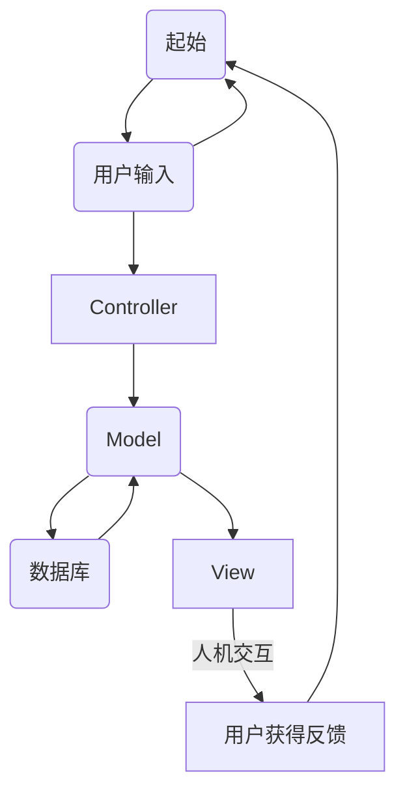
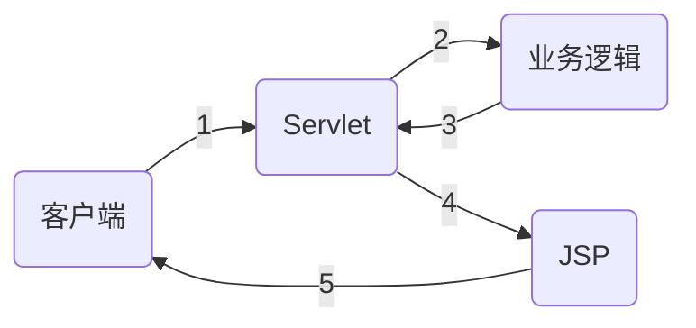
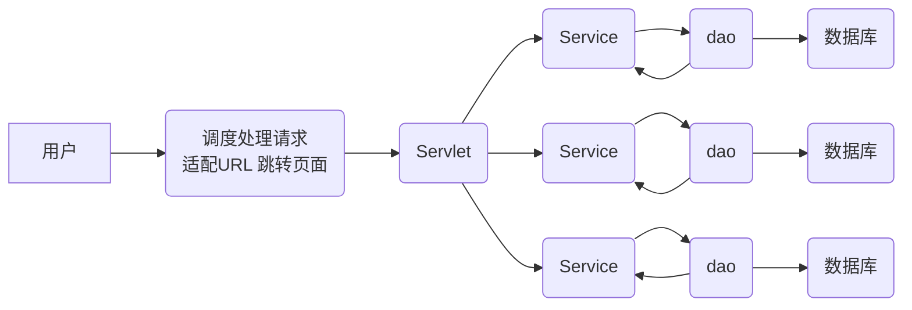
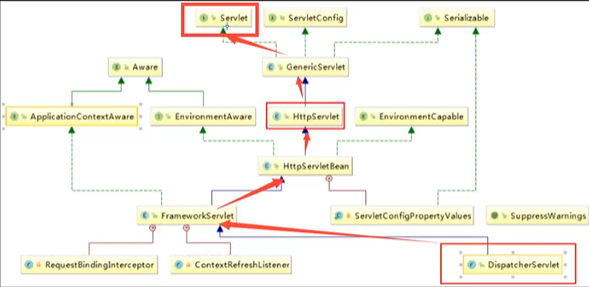
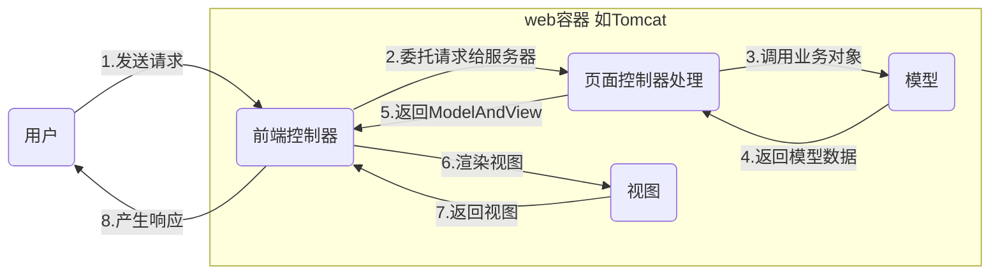

# SpringMVC

ssm: mybatis+Spring+SpringMVC MVC三层架构


JavaSE ，JavaWeb  基础

SSM框架


## 什么是MVC

### 简介

MVC：模型(dao,service) 、视图(jsp)、控制器(servlet) 

- MVC 是模型(Model)、视图(View)、控制器(Controller)的简写，是一种软件设计规范
- 是将业务逻辑、数据、显示分离的方法来组织代码
- MVC主要作用是降低了视图与业务逻辑间的双向耦合
- MVC不是一种设计模式，MVC是一种架构模式，不同的MVC存在差异

**Model**：数据模型，提供要展示的数据，因此包含数据和行为，可以认为是领域模型或javaBean组件(包含数据和行为),但是现在一般都分离开来，Value Object(数据Dao)和服务层(行为Service)，也就是模型提供了模型数据查询和模型数据的状态更新等功能，包括数据和业务

**View**：负责进行模型的展示，一般就是我们见到的用户界面

**Controller**：接收用户请求，委托给模型进行处理，处理完后把返回的模型数据返回给视图，由视图负责展示，控制器做了调度员的工作

最典型的MVC就是JSP+servlet+javabean的模式




pojo

vo

dto

都是实体类，不过是进行了一些字段的拓展或删减

JSP本质就是一个Servlet

### Model1时代

- 在web早期的开发种，通常采用的都是Model1
- 在Model1时代，主要分为两层，视图层和模型层


Model1优点：架构简单，比较适合小型项目开发

Model1缺点：JSP职责不单一，职责过重，不便于维护

### Model2时代

Model2把一个项目分为模型、视图、控制器



1. 用户发请求
2. Servlet接收请求数据，并调用对应的业务逻辑方法
3. 业务处理完毕，返回更新后的数据给servlet
4. servlet转向到JSP，由JSP来渲染页面
5. 响应给前端更新后的页面

职责分析

Controller 控制器

1. 取得表单数据
2. 调用业务逻辑
3. 转向指定页面

Model 模型

1. 业务逻辑
2. 保存数据的状态

View 视图

1. 显示页面

## 初识MVC

Spring MVC是Spring Framework的一部分，是基于Java实现MVC的轻量级Web框架

为什么要学习SpringMVC

### SpringMVC特点

- 轻量级、简单易学
- 高效、基于请求响应的MVC框架
- 与Spring兼容性好
- 约定优于配置
- 功能强大，RESTful，数据验证，格式化，本地化，主题等
- 简洁灵活

Spring的web框架围绕DispatcherServlet[调度Servlvlet]设计



中心控制器

​	Spring的web框架围绕DispacherServlet设计，DispacherServlet的作用是将请求分发到不同的处理器，从Spring2.5开始，使用Java5或者以上版本可以采用基于注解的Controller声明方式

​	SpringMVC框架和其他MVC框架一样，**以请求为驱动，围绕一个中心Servlet分派请求及提供其他功能，DispacherServlet是一个实际的Servlet(他继承自HttpServlet基类)**



### SpringMVC原理



### HelloSpringMVC

1. 新建maven web项目

2. resources下新建spring配置文件

   ```xml
   <?xml version="1.0" encoding="UTF-8"?>
   <beans xmlns="http://www.springframework.org/schema/beans"
          xmlns:xsi="http://www.w3.org/2001/XMLSchema-instance"
          xsi:schemaLocation="http://www.springframework.org/schema/beans
          http://www.springframework.org/schema/beans/spring-beans.xsd">
   
       <bean class="org.springframework.web.servlet.handler.BeanNameUrlHandlerMapping"/>
       <bean class="org.springframework.web.servlet.mvc.SimpleControllerHandlerAdapter"/>
       <!--视图解析器:DispatcherServlet给他的ModelAndView-->
       <bean id="InternalResourceViewResolver" class="org.springframework.web.servlet.view.InternalResourceViewResolver" >
           <!--前缀-->
           <property name="prefix" value="/WEB-INF/jsp/"/>
           <!--后缀-->
           <property name="suffix" value=".jsp"/>
       </bean>
   
       <!--Handler-->
       <bean id="/hello" class="com.flywinter.controller.HelloController"/>
   </beans>
   ```

3. 新建webapp/WEB-INF/jsp/hello.jsp

   ```jsp
   <%--
     Created by IntelliJ IDEA.
     User: 14757
     Date: 2021/7/28
     Time: 13:22
     To change this template use File | Settings | File Templates.
   --%>
   <%@ page contentType="text/html;charset=UTF-8" language="java" %>
   <html>
   <head>
       <title>Title</title>
   </head>
   <body>
   ${msg}
   </body>
   </html>
   ```

4. web.xml文件内容为

   ```xml
   <?xml version="1.0" encoding="UTF-8"?>
   <web-app xmlns="http://xmlns.jcp.org/xml/ns/javaee"
            xmlns:xsi="http://www.w3.org/2001/XMLSchema-instance"
            xsi:schemaLocation="http://xmlns.jcp.org/xml/ns/javaee http://xmlns.jcp.org/xml/ns/javaee/web-app_4_0.xsd"
            version="4.0">
   
   
       <!--1.注册DispatcherServlet-->
       <servlet>
           <servlet-name>springmvc</servlet-name>
           <servlet-class>org.springframework.web.servlet.DispatcherServlet</servlet-class>
           <!--关联一个springmvc的配置文件:【servlet-name】-servlet.xml-->
           <init-param>
               <param-name>contextConfigLocation</param-name>
               <param-value>classpath:springmvc-servlet.xml</param-value>
           </init-param>
           <!--启动级别-1-->
           <load-on-startup>1</load-on-startup>
       </servlet>
   
   
       <!--/ 匹配所有的请求；（不包括.jsp）-->
       <!--/* 匹配所有的请求；（包括.jsp）-->
       <servlet-mapping>
           <servlet-name>springmvc</servlet-name>
           <url-pattern>/</url-pattern>
       </servlet-mapping>
   
   
   </web-app>
   ```

5. 编写控制器

   ```xml
   //注意：这里我们先导入Controller接口
   public class HelloController implements Controller {
   
   
       @Override
       public ModelAndView handleRequest(HttpServletRequest request, HttpServletResponse response) throws Exception {
           //ModelAndView 模型和视图
           ModelAndView mv = new ModelAndView();
   
   
           //封装对象，放在ModelAndView中。Model
           mv.addObject("msg", "HelloSpringMVC!");
           //封装要跳转的视图，放在ModelAndView中
           mv.setViewName("hello"); //: /WEB-INF/jsp/hello.jsp
           return mv;
       }
   }
   ```

6. 访问http://localhost:8080/hello

简要分析执行流程

1. DispatcherServlet表示前置控制器，是整个SpringMVC的控制中心，用户发出请求，DispatcherServlet接收请求并拦截请求
   - 假如我们请求的url为http://localhost:8080/SpringMVC/hello
   - 如上url拆分为三部分
   - http://localhost:8080服务器域名
   - SpringMVC部署再服务器上的web站点
   - hello表示控制器
   - 如上urlbioassay为请求位于服务器http://localhost:8080的SpringMVC站点的hello控制器
2. HandlerMapping为处理器映射，DispatcherServlet调用HandlerMapping，HandlerMapping根据请求url查找Handler
3. HandlerExecution表示具体的Handler，其主要作用是根据url查找控制器，如上url被查找控制器为hello
4. HandlerExecution将解析后的信息传递给DispatcherServlet，如解析控制器映射等
5. HandlerAdapter表示处理器适配器，其按照特定的规则去执行Handler
6. Handler让具体的Controller执行
7. Controller将具体的执行信息返回给HandlerAdapter，如ModelAndView
8. HandlerAdapter将视图逻辑名或模型传递给DispatcherServlet
9. DispatcherServlet调用视图解析器(ViewResolver)来解析HandlerAdapter传递的逻辑视图名
10. 视图解析器将解析的逻辑视图名传给DispatcherServlet


