# Docker

## 1.Docker概述

### Docker为什么出现

一款产品通常至少有两套环境，开发和生产环境，需要针对不同的环境进行不同的配置

同样的代码，一台电脑上可以运行，另一台电脑就无法运行了，

版本更新后，可能导致程序不可用

发布一个项目的时候，发布jar包以及运行的相关环境

传统情况下：开发只负责编写项目，运维负责环境

现在：开发打包部署上线，使用一套流程完成

java --- jar(环境) ---打包项目带上环境(镜像) --- Docker仓库 商店 --- 下载发布的镜像，直接运行即可

Docker的思想就来源于集装箱

JRE -- 多个应用(端口冲突) -- 原来都是交叉的

隔离：Docker核心思想 打包装箱 每个箱子是相互隔离的

### Docker的历史

2010年，公司dotCloud

做一些paas的云计算服务，linux有关的容器技术

他们将自己的容器化技术命名为Docker

Docker刚刚诞生的时候没有引起行业注意

于是开源

2013年，将docker开源，逐渐活跃

2014年4月9日 Docker1.0发布


Docker为什么这么火？十分的轻巧

在容器技术出现之前，都是使用虚拟机技术

虚拟机也是属于虚拟化技术，Docker容器技术也是一种虚拟化技术

```bash
vm  linux,centos原生镜像(一个电脑) 隔离需要开启多个虚拟机
docker 隔离，镜像(最核心的镜像4m+需要用的环境) 十分的小巧，运行镜像就可以了
```

> Docker

Docker是基于go语言开发的开源项目

Docker文档地址 https://docs.docker.com/

仓库地址 https://hub.docker.com/

官网 https://www.docker.com/

### Docker能干什么

> 之前的虚拟机技术

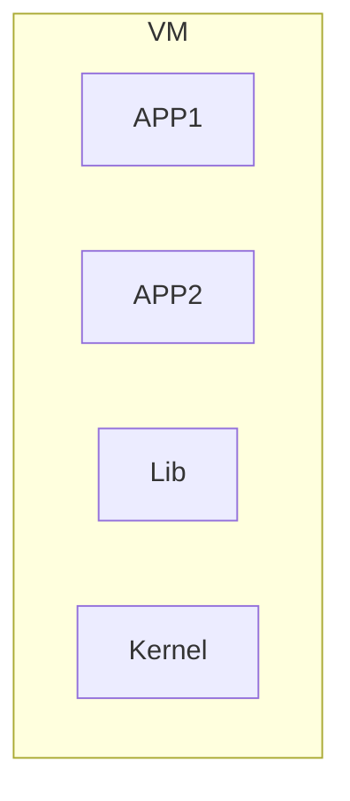

缺点

1. 资源占用非常多
2. 冗余步骤多
3. 启动很慢

> 容器化技术

容器化技术不是模拟的一个完整的系统

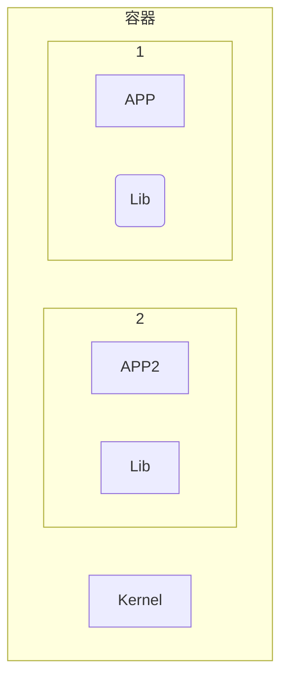

比较docker和虚拟机技术的不同

- 传统虚拟机 虚拟出一套硬件，运行一个完整的操作系统，然后在这个系统上安装和运行软件
- 容器内的应用直接运行在宿主机的内容，容器是没有自己的内核的，也没有虚拟的硬件，所以轻便
- 每个容器是相互隔离的，每个容器内都有一个属于自己的问搭建系统，互不影响

> DevOps(开发、运维)

**应用更快速的交付和部署**

Docker：打包镜像发布测试，一键运行

**更便捷的升级和扩缩容**

使用了了Docker，我们部署应用就和搭积木一样

**更简单的系统运维**

容器化后，开发和测试环境是高度一致的

**更高效的计算资源利用**

Docker是内核级别的虚拟化，可以在一个物理机上运行很多的实例

## 2. Docker下载安装

### Docker的基本组成

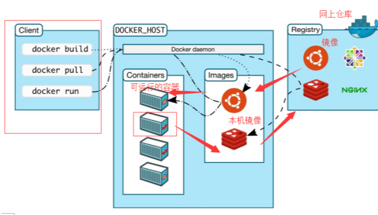

镜像 image

docker镜像就好比是一个模板，可以通过这个模板来创建容器服务，tomcat镜像== =>run= ==>tomcat1容器(提供服务器)通过这个镜像可以创建多个容器，最终服务或项目就是运行在容器里的

容器 container

docker利用容器技术，独立运行一个或者一组应用，通过镜像创建

启动，停止，删除，基本命令

容器可以理解为一个简易的linux系统

仓库 repository

仓库就是存放镜像的地方

仓库分为共有仓库和私有仓库

Docker hub 默认是国外的

> linux相关环境查看


> [root@VM-0-17-centos ~]# cat /etc/os-release
> NAME="CentOS Linux"
> VERSION="7 (Core)"
> ID="centos"
> ID_LIKE="rhel fedora"
> VERSION_ID="7"
> PRETTY_NAME="CentOS Linux 7 (Core)"
> ANSI_COLOR="0;31"
> CPE_NAME="cpe:/o:centos:centos:7"
> HOME_URL="https://www.centos.org/"
> BUG_REPORT_URL="https://bugs.centos.org/"
>
> CENTOS_MANTISBT_PROJECT="CentOS-7"
> CENTOS_MANTISBT_PROJECT_VERSION="7"
> REDHAT_SUPPORT_PRODUCT="centos"
> REDHAT_SUPPORT_PRODUCT_VERSION="7"
>
> # 系统内核3.0以上
>
> [root@VM-0-17-centos ~]# uname -r
> 3.10.0-1160.11.1.el7.x86_64

### Windows

[docker官方网址](https://www.docker.com/)

### 遇到的问题

1. #### 基于WSL2 的 Docker Desktop 启动时 Failed to set version to docker-desktop: exit code: -1的解决方法

   ```bash
   # 管理员执行命令
   $ netsh winsock reset  
   ```

   然后启动docket desktop

2. 修改docker的镜像存储位置

   1. ```bash
      C:\Users\用户名\AppData\Local\Docker\wsl\data\ext4.vhdx
      ```

      WSL2模式下docker-desktop-data vm磁盘映像通常位于这个位置，可以迁移到其他位置并保留现有的数据

   2. 关闭Docker desktop

      命令行输入

      ```bash
      $ wsl --list -v
      ```

      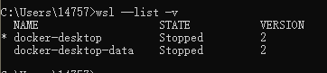

      可以看到相关docker程序都已经停止，如果还没有停止，可以通过任务管理器直接结束所有和docker相关的进程

   3. 将docker-desktop-data导出到文件中(备份image及相关文件)

      ```bash
      wsl --export docker-desktop-data "E:\\docker-desktop-data.tar"
      ```

   4. 从wsl取消注册docker-desktop-data

      ```bash
      # C:\Users\用户名\AppData\Local\Docker\wsl\data\ext4.vhdx文件将会被删除
      $ wsl --unregister docker-desktop-data
      ```

   5. 将导出的docker-desktop-data再导入回wsl,并设置自定义保存镜像及相关文件挂载目录的位置，比如E:\\docker\\wsl

      ```bash
      $ wsl --import docker-desktop-data "E:\\docker\\wsl" "E:\\docker-desktop-data.tar" --version 2
      ```

   6. 验证是否有效

      查看C:\Users\用户名\AppData\Local\Docker\wsl和E:\\docker\\wsl文件夹大小，然后下载新的镜像，再次查看大小比较

### Linux

```bash
# 包更新到最新
yum update
# 安装所需要的软件包，yum-util提供yum-config-manager功能，灵感两个是devicemapper驱动依赖的
yum install -y yum-utils device-mapper-persistent-data lvm2
# 设置yum源为阿里云
yum-config-manager --add-repo http://mirrors.aliyun.com/docker-ce/linux/centos/docker-ce.repo
# 安装docker
yum install docker-ce -y
# 安装docker前先卸载
sudo yum remove docker \
                  docker-client \
                  docker-client-latest \
                  docker-common \
                  docker-latest \
                  docker-latest-logrotate \
                  docker-logrotate \
                  docker-selinux \
                  docker-engine-selinux \
                  docker-engine
# 卸载docker
 sudo yum remove docker-ce docker-ce-cli containerd.io
 # 删除资源
 sudo rm -rf /var/lib/docker
 sudo rm -rf /var/lib/containerd
 # 阿里云加速
 mkdir -p /etc/docker
 tee /etc/docker/daemon.json <<-'EOF'
 {
 	"registry-mirrors":["https://xxxx.mirror.aliyuncs.com"]
 }
 EOF
 systemctl daemon-reload
 systemctl restart docker
```

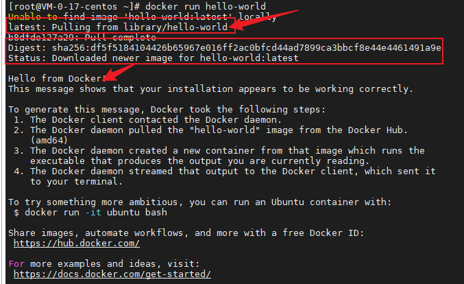

### 底层原理

Docker是怎么工作的

Docker是一个Client-Server结构的系统，Docker的守护进程运行在主机上，通过Socket从客户端访问

DockerServer接收到Docker-client的指令，就会执行这个命令

Docker为什么比VM快

docker有着比虚拟机更少的抽象层

docker是利用的宿主机的内核,VM需要的是Guest OS

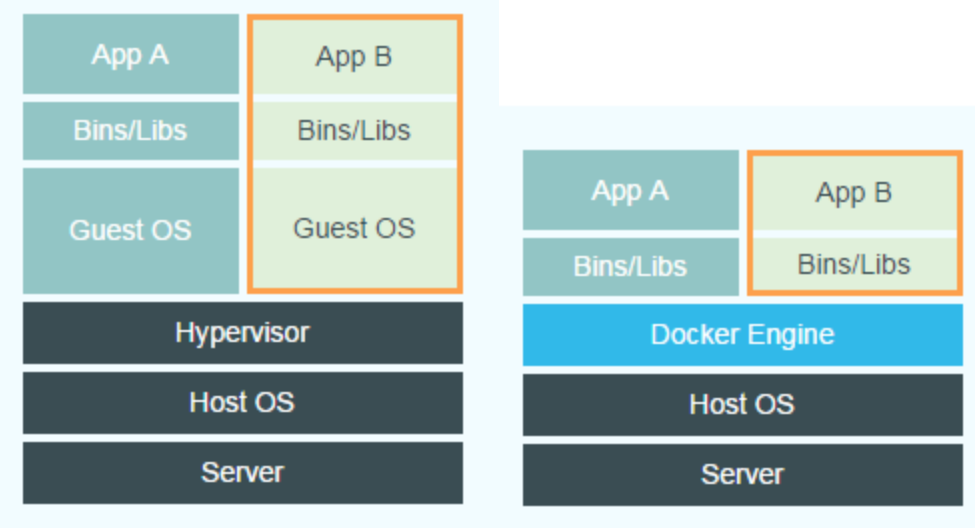

所以新建一个容器的时候，docker不需要像虚拟机一样重新加载一个操作系统内核


> 
>
> 扩充
>
> ## 
>
> ```bash
> # docker pull centos
> # docker images 
> # docker ps -a 查看所有容器
> # docker start b750bbbcfd88 启动一个停止的容器 
> 停止的容器可以通过 docker restart 重启：
> 
> $ docker restart <容器 ID>
> # docker run -itd --name ubuntu-test ubuntu /bin/bash 后台运行
> # docker stop <容器 ID>
> docker exec -it 243c32535da7 /bin/bash
> 进入容器
> 在使用 -d 参数时，容器启动后会进入后台。此时想要进入容器，可以通过以下指令进入：
> 
> docker attach
> 
> docker exec：推荐大家使用 docker exec 命令，因为此退出容器终端，不会导致容器的停止。
>  docker rm -f 1e560fca3906 删除容器
>   docker rmi hello-world 删除镜像
> ```
>
> ```
> docker run -it ubuntu /bin/bash
> ```
>
> - **-i**: 交互式操作。
> - **-t**: 终端。
> - **ubuntu**: ubuntu 镜像。
> - **/bin/bash**：放在镜像名后的是命令，这里我们希望有个交互式 Shell，因此用的是 /bin/bash。
>
> 要退出终端，直接输入 **exit**:
>
> docker the input device is not a TTY. If you are using mintty, try prefixing the command with 'winp 解决方法
> 执行命令报错
> docker exec -it 8ea8a375e686 /bin/bash
> the input device is not a TTY.  If you are using mintty, try prefixing the command with 'winpty'
> 解决方案
> 前面加 winpt  /bin/bash 改为 bash
>  winpty docker exec -it 8ea8a375e686 bash
>
> 
>
> ```
> yum install passwd
> 
> ```
>
> 查看docker容器IP**可以使用docker inspect命令**，再配合grep来过滤IP地址即可，例如“docker inspect 容器ID | grep IPAddress”。

## 3. Docker常用命令

### 帮助命令

```bash
docker version  	# docker版本信息
docker info  		# docker系统信息，包含镜像和容器的数据
docker 命令 --help   # 帮助命令
```

### 镜像命令

**docker images**查看所有本地主机上的镜像

```bash
[root@VM-0-17-centos ~]# docker images
REPOSITORY    TAG          IMAGE ID       CREATED        SIZE
rabbitmq      management   737d67e8db84   4 days ago     253MB

# 解释
REPOSITORY 镜像的仓库名
TAG 	   镜像的标签
IMAGE ID   镜像的ID
CREATED	   镜像的创建日期
SIZE	   镜像的大小
# 可选项
Usage:  docker images [OPTIONS] [REPOSITORY[:TAG]]

List images

Options:
  -a, --all             列出所有镜像
      --digests         Show digests
  -f, --filter filter   Filter output based on conditions provided
      --format string   Pretty-print images using a Go template
      --no-trunc        Don't truncate output
  -q, --quiet           只显示id

```

**docker search** 搜索镜像

```bash
[root@VM-0-17-centos ~]# docker search mysql
NAME                              DESCRIPTION                                     STARS     OFFICIAL   AUTOMATED
mysql                             MySQL is a widely used, open-source relation…   11231     [OK]
mariadb                           MariaDB Server is a high performing open sou…   4268      [OK]

# 可选项
Usage:  docker search [OPTIONS] TERM

Search the Docker Hub for images

Options:
  -f, --filter filter   Filter output based on conditions provided
      --format string   Pretty-print search using a Go template
      --limit int       Max number of search results (default 25)
      --no-trunc        Don't truncate output
--filter=STARS=5000   STARS大于3000的 
```

**docker pull**下载镜像

```bash
docker pull [OPTIONS] NAME[:TAG|@DIGEST]

[root@VM-0-17-centos ~]# docker pull mysql
Using default tag: latest  #如果不写tag，默认是latest
latest: Pulling from library/mysql 
33847f680f63: Pull complete # 分层下载 docker image核心 联合文件系统
5cb67864e624: Pull complete
1a2b594783f5: Pull complete
b30e406dd925: Pull complete
48901e306e4c: Pull complete
603d2b7147fd: Pull complete
802aa684c1c4: Pull complete
715d3c143a06: Pull complete
6978e1b7a511: Pull complete
f0d78b0ac1be: Pull complete
35a94d251ed1: Pull complete
36f75719b1a9: Pull complete
Digest: sha256:8b928a5117cf5c2238c7a09cd28c2e801ac98f91c3f8203a8938ae51f14700fd
Status: Downloaded newer image for mysql:latest
docker.io/library/mysql:latest  # 真实地址
# 等价于
docker pull mysql
docker pull docker.io/library/mysql:latest

# 指定版本下载
[root@VM-0-17-centos ~]# docker pull mysql:5.7
5.7: Pulling from library/mysql
33847f680f63: Already exists
5cb67864e624: Already exists
1a2b594783f5: Already exists
b30e406dd925: Already exists
48901e306e4c: Already exists
603d2b7147fd: Already exists
802aa684c1c4: Already exists
5b5a19178915: Pull complete
f9ce7411c6e4: Pull complete
f51f6977d9b2: Pull complete
aeb6b16ce012: Pull complete
Digest: sha256:be70d18aedc37927293e7947c8de41ae6490ecd4c79df1db40d1b5b5af7d9596
Status: Downloaded newer image for mysql:5.7
docker.io/library/mysql:5.7


Options:
  -a, --all-tags                Download all tagged images in the repository
      --disable-content-trust   Skip image verification (default true)
      --platform string         Set platform if server is multi-platform capable
  -q, --quiet                   Suppress verbose output

```

**docker rmi**删除镜像

```bash
[root@VM-0-17-centos ~]# docker rmi -f 镜像id  # 删除指定的镜像
[root@VM-0-17-centos ~]# docker rmi -f 镜像id 镜像id2 # 删除多个指定的镜像
docker rmi -f $(docker images -aq) # 递归删除所有镜像  # 删除全部的镜像
```

### 容器命令

我们有了镜像才可以创建容器

```bash
docker pull centos
```

新建容器并启动

```bash
dokcer run [可选参数] image
# 参数说明
--name="name"  容器名字，区分容器
-d			   后台方式运行
-it 		   使用交互方式运行，进入容器查看内容
-p			   指定容器的端口 -p8080:8080
	-p ip:主机端口:容器端口
	-p 主机端口:容器端口
	-p 容器端口
	容器端口
-p			   随机指定端口
```

启动并进入容器

```bash
[root@VM-0-17-centos ~]# docker run -it centos /bin/bash
[root@e4121d2ea584 /]# ls  # 查看容器内的centos 很多命令都是不完善的
bin  dev  etc  home  lib  lib64  lost+found  media  mnt  opt  proc  root  run  sbin  srv  sys  tmp  usr  var
[root@e4121d2ea584 /]# exit  #退出容器
exit
[root@VM-0-17-centos ~]# ls
download  software

```

列出所有运行的容器

```bash
# docker ps 命令
	# 列出当前正在运行的容器
-a  # 列出所有的容器
-n=? # 显示最近运行的指定个数的容器
-q  # 只显示容器的编号
[root@VM-0-17-centos ~]# docker ps  
CONTAINER ID   IMAGE     COMMAND   CREATED   STATUS    PORTS     NAMES
[root@VM-0-17-centos ~]# docker ps -a
CONTAINER ID   IMAGE         COMMAND       CREATED             STATUS                          PORTS     NAMES
e4121d2ea584   centos        "/bin/bash"   2 minutes ago       Exited (0) About a minute ago             sharp_swirles
3daddcddcf11   hello-world   "/hello"      About an hour ago   Exited (0) About an hour ago              zealous_bell
[root@VM-0-17-centos ~]#
```

退出容器

```bash
exit #直接退出容器
ctrl +p+q  #容器不停止退出
```

删除容器

```bash
docker rm 容器id 	# 删除指定的容器，不能删除正在运行的容器  强制删除 rm -f
docker rm -f $(docker ps -aq) #删除所有的容器
docker ps -a -q|xargs docker rm #删除所有的容器
```

启动和停止容器的操作

```bash
docker start 容器id   # 启动容器
docker restart 容器id # 重启容器
docker stop 容器id	# 停止当前正在运行的容器
docker kill 容器id	#强制停止当前正在运行的容器
```

### 常用其他命令

后台启动容器

```bash
# 命令 docker run -d 镜像名
[root@VM-0-17-centos ~]# docker run -d centos
# 问题 docker ps 发现centos停止了
# docker 容器使用后台运行，就必须要有一个前台进程，docker发现没有应用，就会自动停止
# 发现没有对外提供服务就会自动停止
```

查看日志

```bash
docker logs -f -t --tail 10 容器id
# 自己写一段shell脚本
[root@VM-0-17-centos ~]# docker run -d centos /bin/sh -c "while true;do echo name;sleep 1; done"

[root@VM-0-17-centos ~]# docker ps
CONTAINER ID   IMAGE     COMMAND                  CREATED          STATUS          PORTS     NAMES
033fc79579f8   centos    "/bin/sh -c 'while t…"   25 seconds ago   Up 24 seconds             compassionate_hugle
# 显示日志
-tf 			 	# 显示日志
--tail numbers 		#要显示的日志条数
[root@VM-0-17-centos ~]# docker logs -tf --tail 10 033fc79579f8
```

查看容器中的进程信息

```bash
# 命令 docker top 容器id
docker top 033fc79579f8
UID                 PID                 PPID                C                   STIME               TTY
root                1650                1632                0                   23:45               ?
root                2783                1650                0                   23:50               ?    
```

查看镜像的元数据

```bash
# docker inspect 容器id
[root@VM-0-17-centos ~]# docker inspect 033fc79579f8
[
    {
        "Id": "033fc79579f8c606693da0080ce536b9a3feb09e77d271e7b026568ba259c21f",
        "Created": "2021-08-07T15:45:15.924809245Z",
        "Path": "/bin/sh",
        "Args": [
            "-c",
            "while true;do echo name;sleep 1; done"
        ],
        "State": {
            "Status": "running",
            "Running": true,
            "Paused": false,
            "Restarting": false,
            "OOMKilled": false,
            "Dead": false,
            "Pid": 1650,
            "ExitCode": 0,
            "Error": "",
            "StartedAt": "2021-08-07T15:45:16.26354868Z",
            "FinishedAt": "0001-01-01T00:00:00Z"
        },
        "Image": "sha256:300e315adb2f96afe5f0b2780b87f28ae95231fe3bdd1e16b9ba606307728f55",
        "ResolvConfPath": "/var/lib/docker/containers/033fc79579f8c606693da0080ce536b9a3feb09e77d271e7b026568ba259c21f/resolv.conf",
        "HostnamePath": "/var/lib/docker/containers/033fc79579f8c606693da0080ce536b9a3feb09e77d271e7b026568ba259c21f/hostname",
        "HostsPath": "/var/lib/docker/containers/033fc79579f8c606693da0080ce536b9a3feb09e77d271e7b026568ba259c21f/hosts",
        "LogPath": "/var/lib/docker/containers/033fc79579f8c606693da0080ce536b9a3feb09e77d271e7b026568ba259c21f/033fc79579f8c606693da0080ce536b9a3feb09e77d271e7b026568ba259c21f-json.log",
        "Name": "/compassionate_hugle",
        "RestartCount": 0,
        "Driver": "overlay2",
        "Platform": "linux",
        "MountLabel": "",
        "ProcessLabel": "",
        "AppArmorProfile": "",
        "ExecIDs": null,
        "HostConfig": {
            "Binds": null,
            "ContainerIDFile": "",
            "LogConfig": {
                "Type": "json-file",
                "Config": {}
            },
            "NetworkMode": "default",
            "PortBindings": {},
            "RestartPolicy": {
                "Name": "no",
                "MaximumRetryCount": 0
            },
            "AutoRemove": false,
            "VolumeDriver": "",
            "VolumesFrom": null,
            "CapAdd": null,
            "CapDrop": null,
            "CgroupnsMode": "host",
            "Dns": [],
            "DnsOptions": [],
            "DnsSearch": [],
            "ExtraHosts": null,
            "GroupAdd": null,
            "IpcMode": "private",
            "Cgroup": "",
            "Links": null,
            "OomScoreAdj": 0,
            "PidMode": "",
            "Privileged": false,
            "PublishAllPorts": false,
            "ReadonlyRootfs": false,
            "SecurityOpt": null,
            "UTSMode": "",
            "UsernsMode": "",
            "ShmSize": 67108864,
            "Runtime": "runc",
            "ConsoleSize": [
                0,
                0
            ],
            "Isolation": "",
            "CpuShares": 0,
            "Memory": 0,
            "NanoCpus": 0,
            "CgroupParent": "",
            "BlkioWeight": 0,
            "BlkioWeightDevice": [],
            "BlkioDeviceReadBps": null,
            "BlkioDeviceWriteBps": null,
            "BlkioDeviceReadIOps": null,
            "BlkioDeviceWriteIOps": null,
            "CpuPeriod": 0,
            "CpuQuota": 0,
            "CpuRealtimePeriod": 0,
            "CpuRealtimeRuntime": 0,
            "CpusetCpus": "",
            "CpusetMems": "",
            "Devices": [],
            "DeviceCgroupRules": null,
            "DeviceRequests": null,
            "KernelMemory": 0,
            "KernelMemoryTCP": 0,
            "MemoryReservation": 0,
            "MemorySwap": 0,
            "MemorySwappiness": null,
            "OomKillDisable": false,
            "PidsLimit": null,
            "Ulimits": null,
            "CpuCount": 0,
            "CpuPercent": 0,
            "IOMaximumIOps": 0,
            "IOMaximumBandwidth": 0,
            "MaskedPaths": [
                "/proc/asound",
                "/proc/acpi",
                "/proc/kcore",
                "/proc/keys",
                "/proc/latency_stats",
                "/proc/timer_list",
                "/proc/timer_stats",
                "/proc/sched_debug",
                "/proc/scsi",
                "/sys/firmware"
            ],
            "ReadonlyPaths": [
                "/proc/bus",
                "/proc/fs",
                "/proc/irq",
                "/proc/sys",
                "/proc/sysrq-trigger"
            ]
        },
        "GraphDriver": {
            "Data": {
                "LowerDir": "/var/lib/docker/overlay2/26cf6292480f1c21dbf0c2eed2d4336b7c9df7df6eb1c6d45de77a5bc775a4bf-init/diff:/var/lib/docker/overlay2/272e009190f4b212fc6062d2c1cef84c75a2ee2389e77ae6f4a01247e7217736/diff",
                "MergedDir": "/var/lib/docker/overlay2/26cf6292480f1c21dbf0c2eed2d4336b7c9df7df6eb1c6d45de77a5bc775a4bf/merged",
                "UpperDir": "/var/lib/docker/overlay2/26cf6292480f1c21dbf0c2eed2d4336b7c9df7df6eb1c6d45de77a5bc775a4bf/diff",
                "WorkDir": "/var/lib/docker/overlay2/26cf6292480f1c21dbf0c2eed2d4336b7c9df7df6eb1c6d45de77a5bc775a4bf/work"
            },
            "Name": "overlay2"
        },
        "Mounts": [],
        "Config": {
            "Hostname": "033fc79579f8",
            "Domainname": "",
            "User": "",
            "AttachStdin": false,
            "AttachStdout": false,
            "AttachStderr": false,
            "Tty": false,
            "OpenStdin": false,
            "StdinOnce": false,
            "Env": [
                "PATH=/usr/local/sbin:/usr/local/bin:/usr/sbin:/usr/bin:/sbin:/bin"
            ],
            "Cmd": [
                "/bin/sh",
                "-c",
                "while true;do echo name;sleep 1; done"
            ],
            "Image": "centos",
            "Volumes": null,
            "WorkingDir": "",
            "Entrypoint": null,
            "OnBuild": null,
            "Labels": {
                "org.label-schema.build-date": "20201204",
                "org.label-schema.license": "GPLv2",
                "org.label-schema.name": "CentOS Base Image",
                "org.label-schema.schema-version": "1.0",
                "org.label-schema.vendor": "CentOS"
            }
        },
        "NetworkSettings": {
            "Bridge": "",
            "SandboxID": "e3c83227513cd5ae4db42c0d2e3015f7cbc7c9be90f1fde97c2b6e1a12807040",
            "HairpinMode": false,
            "LinkLocalIPv6Address": "",
            "LinkLocalIPv6PrefixLen": 0,
            "Ports": {},
            "SandboxKey": "/var/run/docker/netns/e3c83227513c",
            "SecondaryIPAddresses": null,
            "SecondaryIPv6Addresses": null,
            "EndpointID": "1a09b4f0688aef1f03ec0076101b5e9fe34dcae319dbda6cdc43b38b7baa3b2d",
            "Gateway": "172.18.0.1",
            "GlobalIPv6Address": "",
            "GlobalIPv6PrefixLen": 0,
            "IPAddress": "172.18.0.2",
            "IPPrefixLen": 16,
            "IPv6Gateway": "",
            "MacAddress": "02:42:ac:12:00:02",
            "Networks": {
                "bridge": {
                    "IPAMConfig": null,
                    "Links": null,
                    "Aliases": null,
                    "NetworkID": "ba2a061ba7fb71fce0376ff06756a531d34904ba82ef6ee90e64222e7e832fad",
                    "EndpointID": "1a09b4f0688aef1f03ec0076101b5e9fe34dcae319dbda6cdc43b38b7baa3b2d",
                    "Gateway": "172.18.0.1",
                    "IPAddress": "172.18.0.2",
                    "IPPrefixLen": 16,
                    "IPv6Gateway": "",
                    "GlobalIPv6Address": "",
                    "GlobalIPv6PrefixLen": 0,
                    "MacAddress": "02:42:ac:12:00:02",
                    "DriverOpts": null
                }
            }
        }
    }
]

```

进入当前正在运行的容器

```bash
# 命令
# 方式一
docker exec -it 容器id bashShell

[root@VM-0-17-centos ~]# docker exec -it 033fc79579f8 /bin/bash
[root@033fc79579f8 /]# ls
bin  dev  etc  home  lib  lib64  lost+found  media  mnt  opt  proc  root  run  sbin  srv  sys  tmp  usr  var
[root@033fc79579f8 /]# read escape sequence

# 方式二
docker attach 容器id
正在执行的当前代码
# docker exec  # 进入容器后开启一个新的终端
# docker attach  # 进入容器正在执行的终端
```

从容器内拷贝文件到主机上

```bash
# docker cp 容器id:容器内路径 主机路径
# 拷贝是一个手动过程， 以后可以使用 -v卷的技术，可以实现自动同步
```

小结

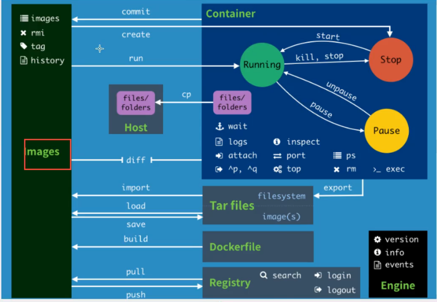

## 4. 练习

### 部署nginx

```bash
# 搜索镜像
# 下载镜像
# 运行测试
[root@VM-0-17-centos ~]# docker pull nginx

Using default tag: latest
latest: Pulling from library/nginx
33847f680f63: Already exists
dbb907d5159d: Pull complete
8a268f30c42a: Pull complete
b10cf527a02d: Pull complete
c90b090c213b: Pull complete
1f41b2f2bf94: Pull complete
Digest: sha256:8f335768880da6baf72b70c701002b45f4932acae8d574dedfddaf967fc3ac90
Status: Downloaded newer image for nginx:latest
docker.io/library/nginx:latest
[root@VM-0-17-centos ~]# docker images
REPOSITORY    TAG          IMAGE ID       CREATED        SIZE
rabbitmq      management   737d67e8db84   4 days ago     253MB
nginx         latest       08b152afcfae   2 weeks ago    133MB
mysql         latest       c60d96bd2b77   2 weeks ago    514MB
hello-world   latest       d1165f221234   5 months ago   13.3kB
centos        latest       300e315adb2f   8 months ago   209MB

# -d 后台运行
# --name 给容器命名
# -p 主机端口:容器内部端口  
[root@VM-0-17-centos ~]# docker run -d --name nginx -p 3344:80 nginx
63f723760191126a96a0c28eaac39483660e8c9bd99abe7a7c2825fb525a0693
[root@VM-0-17-centos ~]# docker ps
CONTAINER ID   IMAGE     COMMAND                  CREATED          STATUS          PORTS                                   NAMES
63f723760191   nginx     "/docker-entrypoint.…"   55 seconds ago   Up 54 seconds   0.0.0.0:3344->80/tcp, :::3344->80/tcp   nginx
[root@VM-0-17-centos ~]# curl localhost:3344
<!DOCTYPE html>
<html>
<head>
<title>Welcome to nginx!</title>
<style>
    body {
        width: 35em;
        margin: 0 auto;
        font-family: Tahoma, Verdana, Arial, sans-serif;
    }
</style>
</head>
<body>
<h1>Welcome to nginx!</h1>
<p>If you see this page, the nginx web server is successfully installed and
working. Further configuration is required.</p>

<p>For online documentation and support please refer to
<a href="http://nginx.org/">nginx.org</a>.<br/>
Commercial support is available at
<a href="http://nginx.com/">nginx.com</a>.</p>

<p><em>Thank you for using nginx.</em></p>
</body>
</html>
# 进入容器
[root@VM-0-17-centos ~]# docker exec -it nginx /bin/bash
root@63f723760191:/# whereis nginx
nginx: /usr/sbin/nginx /usr/lib/nginx /etc/nginx /usr/share/nginx

```

端口暴露

### docker安装tomcat

```bash
# 官方的使用
$ docker run -it --rm tomcat:9.0
# 之前的启动都是后台，停止了容器后容器还是可以查到，这里的命令一般用来测试，用完后就删除容器
# 启动tomcat
docker run -d -p 3355:8080 --name tomcat9 tomcat:9.0
# 测试访问 发现可以访问
# 进入容器
 docker exec -it tomcat9  /bin/bash
# 发现少了相关linux命令，webapp下文件缺少
# 原因 默认最小镜像
root@6184902069b9:/usr/local/tomcat# ls
BUILDING.txt  CONTRIBUTING.md  LICENSE  NOTICE  README.md  RELEASE-NOTES  RUNNING.txt  bin  conf  lib  logs  native-jni-lib  temp  webapps  webapps.dist  work
root@6184902069b9:/usr/local/tomcat# cp -r webapps.dist/* webapps
root@6184902069b9:/usr/local/tomcat#
# 把webapps.dist下的文件拷贝到webapps下
```

### 部署es+kibana

```bash
# es暴露的端口很多
# es十分耗内存
# es的数据一般需要放置到安全目录 挂载
# --name elasticsearch 网络配置
$ docker network create somenetwork
$ docker run -d --name elasticsearch --net somenetwork -p 9200:9200 -p 9300:9300 -e "discovery.type=single-node" elasticsearch:7.14.0

# es十分耗内存
# docker status 查看cpu状态
# 查看是否成功
This is not an HTTP port[root@VM-0-17-centos ~]# curl localhost:9200
{
  "name" : "c9e37cd8f623",
  "cluster_name" : "docker-cluster",
  "cluster_uuid" : "4_AOIu2FThKItXZgO_dosQ",
  "version" : {
    "number" : "7.14.0",
    "build_flavor" : "default",
    "build_type" : "docker",
    "build_hash" : "dd5a0a2acaa2045ff9624f3729fc8a6f40835aa1",
    "build_date" : "2021-07-29T20:49:32.864135063Z",
    "build_snapshot" : false,
    "lucene_version" : "8.9.0",
    "minimum_wire_compatibility_version" : "6.8.0",
    "minimum_index_compatibility_version" : "6.0.0-beta1"
  },
  "tagline" : "You Know, for Search"
}

# 退出
# 增加内存限制
```

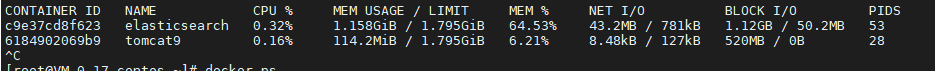

```bash
# 增加内存限制
$ docker run -d --name elasticsearch --net somenetwork -p 9200:9200 -p 9300:9300 -e "discovery.type=single-node" -e ES_JAVA_OPTS="-Xms64m -Xmx512m" elasticsearch:7.14.0

```

查看效果

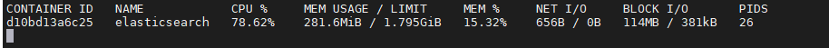

### 可视化

Docker的图形化界面管理工具

- portainer 先用这个

  ```bash
  docker run -d -p 8088:9000 \
  --restart=always -v /var/run/docker.sock:/var/run/docker.sock --privileged=true portainer/portainer
  
  # 通过外网访问8088端口
  ```

  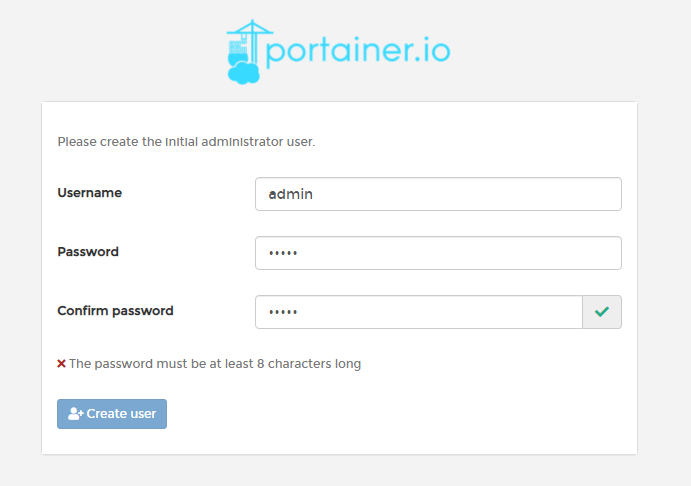

  选择本地的

  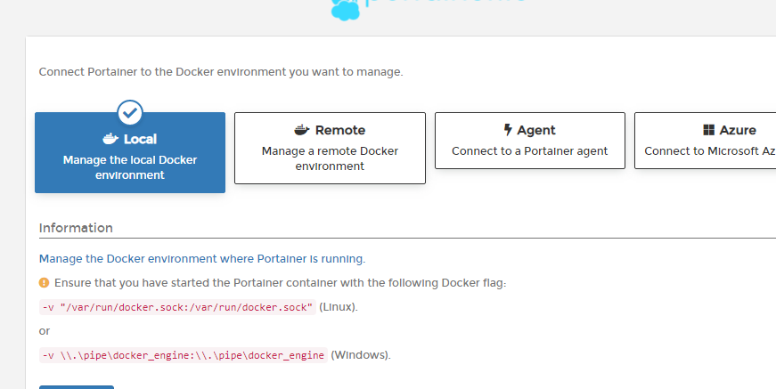

  相关信息

  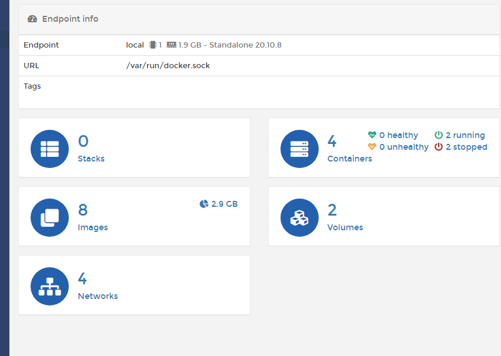

  

- Rancher

## 5. Docker镜像

镜像是一种轻量级，可执行的独立软件包，用来大巴软件运行环境和基于运行环境开发的软件，它包含运行某个软件所需的所有内容，包括代码、运行时库、环境变量和配置文件 

如何得到镜像

- 从远程仓库下载
- 拷贝
- 自己制作

### Docker镜像加载原理

> UnionFS 联合文件系统

UnionFS联合文件系统是一种分层、轻量级并且高性能的文件系统，支持对文件系统的修改作为一次提交来进行一层层的叠加，同时可以将不同的目录挂载到同一个虚拟文件系统下，Union文件系统是Docker镜像的基础，镜像可以通过分层来进行继承，基于基础镜像可以制作各种具体用途的应用镜像

特点：一次同时加载多个文件系统，但从外面看来，只能看到一个文件系统，联合加载会把各层文件系统叠加起来，这样最终的文件系统会包含所有底层的文件和目录

> Docker镜像加载原理

bootfs主要包含bootloader和kernel，bootloader主要是引导加载kernel，Linux刚启动时会加载bootfs文件系统，这一层和典型的Linux/Unix系统是一样的，包含boot加载器和内核，当boot加载完成后整个内核就在内存中了，此时内存的使用权已经由bootfs转交给内核，此时系统卸载bootfs

rootfs包含的就是典型Linux系统中的/dev,/proc,/bin,/etc等标准目录和文件，相当于各种不同操作系统的发行版，不然ubuntu，centos等


对于一个精简的os，rootfs可以很小，只需要包含最基本的命令，工具和程序库就可以了，因为底层直接使用Host的kernel，自己只需要提供rootfs就可以了


### 分层理解

所有docker都起始于一个基础镜像，每次修改时就会加一个镜像层，上层覆盖下层，最后合为一层

> 特点

Docker镜像都是只读的，当容器启动时，一个新的可写层被加到镜像的顶部

这一层就是我们通常所说的容器层，容器之下的都叫镜像层

如何提交一个自己的镜像

### Commit镜像

```bash
docker commit 提交容器成为一个新的副本
# 命令和git类似
docker commit -m="提交的信息" -a="作者" 容器id 目标镜像名:[TAG]
# 查看镜像
docker images

```

## 6. 容器数据卷

### 什么是容器数据卷

docker理念

将应用和环境打包成一个镜像

如果数据都在容器中，我们将容器删除，数据就会丢失，需要数据可持久化

容器之间可以有一个数据共享的技术

Docker容器中产生的数据，同步到本地

这就是卷技术  目录的挂载，将容器内的目录挂载到主机上

容器件也是可以数据共享的

### 使用数据卷

双向数据同步，实际上用的是同一个硬盘物理地址

将宿主机内的一部分空间共享给容器一起使用

只要容器存在修改文件就会自动同步

容器删除并不会删除文件

> 方式一：使用命令挂载 -v

```bash
docker run -it -v 主机目录:容器内目录 镜像名  /bin/bash
```

Mounts 挂载

source 容器内地址

destination docker 主机内的地址

#### MySql数据持久化

```bash

-d 后台运行
-p 端口映射
-v 卷挂载
-e 环境配置
--name 容器名
[root@VM-0-17-centos ~]# docker run -d -p 3310:3306 -v /root/mysql/conf:/etc/mysql/conf.d -v /root/mysql/data:/var/lib/mysql -e MYSQL_ROOT_PASSWORD=123456 --name mysql mysql
# 这里注意，data里面的文件是容器创建完成后生成的，所以会同步，而conf.d里面的文件是容器一开始就有的，因此不存在文件
```

### 具名和匿名挂载

```bash
# 匿名挂载
-v 容器内路径
docker run -d -P --name nginx1 -v /etc/nginx  nginx

# 查看本地所有volume镜像
docker volume ls
# 具名挂载
docker run -d -P --name nginx1 -v jvming:/etc/nginx  nginx

```

/var/lib/docker/volumes/xxxx/data

通过具名挂载可以方便找到我们的一个卷

```bash
# 如何确定是具名挂载还是匿名挂载
-v 容器内路径  # 匿名挂载
-v 卷名:容器内路径 #具名挂载
-v 宿主机路径:容器内路径 #指定路径挂载
```

拓展

```bash
# 通过 -v 容器内路径:ro rw改变读写权限
ro readonly 只读  只能从外部改变，容器内无法操作
rw readwrite  可读可写
# 一旦这个设置了容器权限，容器对我们挂载出来的内容就有限定了
docker run -d -P --name nginx2 -v jvming-nginx:/etc/nginx:ro nginx
docker run -d -P --name nginx2 -v jvming-nginx:/etc/nginx:rw nginx
```

### 初识DockerFile

Dockerfile就是用来构建docker镜像的构建文件，命令脚本

通过这个脚本可以生成镜像，一个个命令，每个命令都是一层

> 方式二

```dockerfile
# 创建一个dockerfile文件，名字随意，建议DockerFile

FROM centos
VOLUME ["/volume01","/volume02"] # 匿名挂载
CMD echo "---end----"
CMD echo /bin/bash
```


```bash
docker build -f /root/dockerfile1 -t dockertest/centos:1.0
```


```bash
docker run -it --name docker02 --volumes-from docker01 镜像id
```


多个mysql实现共享

```bash
docker run -d -p 3310:3306 -v /root/mysql/conf:/etc/mysql/conf.d -v /root/mysql/data:/var/lib/mysql -e MYSQL_ROOT_PASSWORD=123456 --name mysql mysql

docker run -d -p 3310:3306 -e MYSQL_ROOT_PASSWORD=123456 --name mysql1 --volumes-from mysql mysql
```

结论

容器之间配置信息的传递，数据卷的容器声明周期一直持续到没有容器使用为止

诞生一旦持久化到了本地，本地的数据不会删除


### 数据卷容器


## 7. DockerFile

### DockerFile简介

dockerfile是用来构建docker镜像的文件  命令参数脚本

构建步骤

1. 编写dockerfile文件
2. docker build构建成为一个镜像
3. docker run 运行镜像
4. docker push发布镜像  (Dockerhub、阿里云镜像仓库)

### DockerFile构建过程

基础知识：

1. 每个保留关键字 约定大写
2. 从上往下执行
3. #表示注释
4. 每一个指令都会创建提交一个新的镜像层并提交


dockerfile是面向开发的，以后要发布项目，做镜像，就要编写dockerfile文件


### DockerFile指令

```bash
FROM  		#基础镜像，一切从这里构建
MAINTAINER	#镜像是谁写的 姓名+邮箱 推荐用LABEL
RUN			# 镜像构建时需要运行的命令
ADD			#步骤 tomcat镜像，这个tomcat压缩包，添加内容
WORKDIR		# 镜像的工作目录
VOLUME		# 挂载的目录
EXPOSE		# 暴露端口配置
CMD			# 指定这个容器启动的时候要运行的命令 只有最后一个会生效，可被替代
ENTRYPOINT	# 指定这个容器启动的时候要运行的命令 可以追加命令
ONBUILD		# 当构建一个被继承DockerFile这个时候就会运行ONBUILD的指令，触发指令
COPY		# 类似ADD，将我们的文件拷贝到镜像中
ENV			# 构建的时候设置环境变量
```

### 实战测试

Docker Hub中99%都是从这个基础镜像开始的，FROM scratch，然后配置需要的软件和配置

> 创建自己的centos

```dockerfile
# 1.编写Dockerfile文件
vim mydockerfile-centos
FROM centos
MAINTAINER fall<1475795322@qq.com>

ENV MYPATH /usr/local
WORKDIR $MYPATH

RUN yum -y install vim
RUN yum -y install net-tools

EXPOSE 80

CMD echo $MYPATH
CMD echo "-----end----"
CMD /bin/bash

# 2、通过这个文件构建镜像
# 命令 docker build -f 文件路径 -t 镜像名:[tag] .
docker build -f mydockerfile-centos -t mycentos:0.1 .

```


```bash
# 查看构建历史
docker history 镜像ID
```


### Tomcat镜像

1、准备镜像文件

 准备tomcat 和 jdk到当前目录，编写好README

2、编写dockerfile

```dockerfile
FROM centos #
MAINTAINER fall<1475795322@qq.com>
COPY README /usr/local/README #复制文件
ADD jdk-8u231-linux-x64.tar.gz /usr/local/ #复制解压
ADD apache-tomcat-9.0.35.tar.gz /usr/local/ #复制解压
RUN yum -y install vim
ENV MYPATH /usr/local #设置环境变量
WORKDIR $MYPATH #设置工作目录
ENV JAVA_HOME /usr/local/jdk1.8.0_231 #设置环境变量
ENV CATALINA_HOME /usr/local/apache-tomcat-9.0.35 #设置环境变量
ENV PATH $PATH:$JAVA_HOME/bin:$CATALINA_HOME/lib #设置环境变量 分隔符是：
EXPOSE 8080 #设置暴露的端口
CMD /usr/local/apache-tomcat-9.0.35/bin/startup.sh && tail -F /usr/local/apache-tomcat-9.0.35/logs/catalina.out # 设置默认命令

```

3、构建镜像

```bash
# 因为dockerfile命名使用默认命名 因此不用使用-f 指定文件
$ docker build -t mytomcat:0.1 .
```

4、run镜像

```bash
$ docker run -d -p 8080:8080 --name tomcat01 -v /home/kuangshen/build/tomcat/test:/usr/local/apache-tomcat-9.0.35/webapps/test -v /home/kuangshen/build/tomcat/tomcatlogs/:/usr/local/apache-tomcat-9.0.35/logs mytomcat:0.1
```

### 发布自己的镜像

> Dockerhub

1. 注册

2. 登录

   ```bash
   docker login -u 
   ```

   

3. 上传

   ```bash
   docker push 用户名/镜像名:版本
   #修改tag
   docker tag 镜像id 用户名/镜像名:版本
   ```

### Docker小结

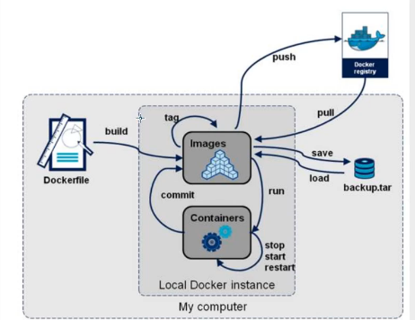

## 8.Docker网络


Docker compose

Docker swarm

CI/CD


