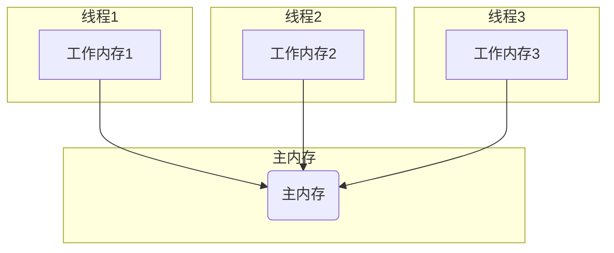

## Java

Java SE

Java集合

Java常用类

hadoop

zookeeper

JVM

spring

springMVC

springboot

springcloud alibaba

mysql

nginx

MQ

redis

Netty

JUD多线程

IIC

MPU6050

AK8963


深度学习pytorch

kotlin

Android

c

四轴飞行器


linux


数据结构与算法

设计模式


go

python


devops

eleSearch

Shell

lua

unreal5

maven

gradle

git

软件工程

Vue

webpack

js

html

css

H5

node.js


网路攻击与防范


10.17

一周汇总

- Java的JUC并发编程，看了20多集，剩下的三十多集争取在三天内看完。
- https://www.bilibili.com/video/BV1Kw411Z7dF?p=21&spm_id_from=pageDriver
- STM32，使用软件IIC读取MPU9250以及BMP280进行了初步了解，并记录了相关笔记，在四轴项目文件夹下，对于IIC的基本读取已经大致掌握，对于MPU6050的原始数据读取基本了解，MPU9250内置的磁力计会读取基本数据，但对于后续的数据处理依然有问题，下一周争取使用,Matlab读取串口数据，并进行6轴融合，之后再对磁力计和BMP280进行详细的研究
- 对于数据的处理，可以使用中断读取，sys滴答时钟或者TIM定时器，IIC读取数据的一般流程就是先初始化传感器，然后对相应寄存器写数据，然后读取，不同的传感器流程不一样，比如磁力计每次读取数据后都要设置单次读取，然后初始化等等
- 重启四轴项目！
- 对于硬件方面，首先要找到对应的说明书，datasheet，虽然都是英文，但是上面一般是最全的，如果只是读取基本数据，相应的配置一般都很简单，主要是数据处理这一块
- BMP280似乎可以直接使用官方的API移植进行调用？实际上就是先读取偏差值，然后读取实际测量值，然后调用公式，进行数据融合就能得出气压以及温度，不过目前为止依旧是有问题，公式是官方给的一般没错，有可能是量程选择的问题，注意平时地面的气压就是一个大气压，根据这个一下子就能知道融合后的数据对不对，根据CPP文件对照下
- 磁力计融合后的数值似乎过大了，好像要用椭球拟合？
- 卡尔曼滤波以及一阶二阶滤波，采样周期也会影响准确，要有一个准确的采样周期


10.18

- 网络时如何连接的，前两章
- JUC继续

10.19

-  完成JUC
- 开始大数据Hadoop

10.23

- Hadoop入门完成
- https://www.bilibili.com/video/BV1Qp4y1n7EN?p=39&spm_id_from=pageDriver


10.24

一周汇总

网上课程学习

- 完成尚硅谷大数据Hadoop 3.x（全新升级/部署+源码+实战）P1-P38
  - https://www.bilibili.com/video/BV1Qp4y1n7EN?p=39&spm_id_from=pageDriver
- 结束【JUC并发编程】尚硅谷2021年最新JUC并发编程
  - https://www.bilibili.com/video/BV1wy4y1L7D2?from=search&seid=2585903625642401631&spm_id_from=333.337.0.0

书籍阅读

- 结束阅读《网络是怎样连接的》

博客阅读

- Java各种锁的理解 https://zhuanlan.zhihu.com/p/71156910

博客撰写

- https://zhuanlan.zhihu.com/p/425218466

构建之法最少前六章

JUC补充

Hadoop  HDFS篇

网络是怎样连接的，笔记整理

10.31

一周汇总

网上课程学习

- 完成尚硅谷大数据完成尚硅谷大数据Hadoop 3.x（全新升级/部署+源码+实战）P39-P67

书籍阅读

- 完成《构建之法》前十三章阅读


结束《构建之法》

完成Mapreduce前半部分

准备专业课考试，开始六级刷题


Java中volatile和synchronized的简单理解

在Java并发编程中，常用的关键字有两个，一个是synchronized，另一个就是volatile。

|          | synchronized                       | volatile             |
| -------- | ---------------------------------- | -------------------- |
| 作用范围 | 修饰方法、代码块                   | 修饰变量             |
| 功能     | 保证共享变量的可见性和操作的原子性 | 保证共享变量的可见性 |

Java中每个对象都可以作为锁，在使用synchronized时

- 对于普通方法，锁是当前实例对象
- 对于静态方法，锁是当前类的Class对象
- 对于同步方法块，锁时synchronized括号里面配置的对象

当一个线程想要访问加了synchronized的方法或者同步方法块时，必须先得到锁，才能对其进行操作，否则就会阻塞，等待其他线程释放锁后，尝试获取锁。

```java
class Bank {
    int total = 0;
     synchronized void incr() {
        total += 1;
        System.out.println(total);
    }
}
public class Consumer {
    public static void main(String[] args) {
        Bank bank = new Bank();
        for (int i = 0; i < 100; i++) {
            new Thread(bank::incr).start();
        }
    }
}
```

上面代码中有一个银行资源类，以及一个客户场景类。

客户场景类通过创建100个客户，模拟100个客户向同一个账户存钱。

如果incr方法不加synchronized，那么最后total的运行结果一定小于100。

什么原因呢？

如果不加锁，那么多个线程同时访问一个资源，一种可能的情况如下：

T1时刻，A获取total=0，0 + 1

T2时刻，B获取total=0，0 + 1

T3时刻，A线程实现赋值操作，total = 1

T4时刻，B线程实现赋值操作，total = 1

这样就导致了，虽然预想的结果是账户结果增加2元，但实际上只增加1元。

而加了synchronzied关键字后，情况就变成了下面这种情况：

T1时刻，A获取total=0，0 + 1

T2时刻，A线程实现赋值操作，total = 1

T3时刻，B获取total=1，1 + 1

T4时刻，B线程实现赋值操作，total = 2

这样的执行流程才是我们所期望的流程，两个客户往一个银行账户存钱，最后账户总金额增加了2元。

synchronized在这个过程中主要做了两件事：

1. 变量的可见性
2. 操作的原子性

变量的可见性与线程操作变量的方式有关：

1. 所有的变量都存储在主内存中，每个线程同时也有自己独立的工作内存，工作内存里面的内容是对主内存内容的拷贝
2. 工作内存之间并不共享
3. 如果线程想要对变量进行操作，需要先将变量同步到自己的工作内存中进行修改，修改完后再同步到主内存中




至于操作的原子性，就是指一个或多个操作，要么全部都会执行，并且在执行的过程中不会被打断，要么不执行。

以上面的代码为例，如果只保证原子性而不保证可见性，那么就可能导致下面的情况发生：

T1时刻，A获取total=0，total = 0+1， total = 1

T2时刻，B获取total=0，total = 0+1， total = 1

T1时刻，线程A虽然获取并修改了值，但是并没有及时同步，导致T2时刻线程B获取的total值仍然为0，这样虽然有两个客户存钱，实际上账户总额还是只增加了1.

同理，如果只保证可见性而不保证原子性，那么就导致了以下情况的发生：

T1时刻，A获取total = 0，

T2时刻，B获取total = 0，

T3时刻，A执行操作total=0+1=1

T4时刻，B执行操作total=0+1=1

T5时刻，C获取total=1

虽然保证了可见性(只要线程把值修改了就会立即同步到主内存中)，但是由于没有保证原子性，线程A获取值并进行修改，但在把值同步到主内存之前，线程B又从主内存获取了值，这样实际上线程A和B都是对0进行了+1操作，最终的值自然还是1，这也就是为什么volatile关键字无法实现并发操作的原因，因为volatile关键字只能保证共享变量能被准确和一致的被更新。

通常对一个变量的完成操作包括获取变量值，修改变量值，同步修改后的值。

volatile可以保证变量被修改后，值立即被同步到主内存中，但是变量获取值和变量值被修改并不是原子操作，其他线程完全可以在变量值被修改之前先获取变量的值，这样就导致上面出现的情况。

这样就可以得出volatile适用条件

1. 写入变量时不依赖变量的当前值
2. 变量访问不需要额外加锁
3. 变量更新时，其他线程需要马上得到最新的值

DCL(Double Check Lock)是volatile另一种常见的应用场景，它体现了volatile的另一个作用，防止指令重排序。

常见的懒汉式单例模式如下所示

```java
class Singleton{
    private static  Singleton instance;
    private Singleton(){
    }
    public static synchronized Singleton getSingleton() {
        if (instance == null) {
            instance = new Singleton();
        }
        return instance;
    }
}
```

这里实现了按需加载，不使用时不会占据内存，但是由此导致的问题就是无论是否已经产生实例，多线程调用时，都会被锁阻塞，耗时。

因此，采用DCL进行改进，改进后的代码如下所示：

```java
class Singleton{
    private static Singleton instance;
    private Singleton(){
    }
    public Singleton getSingleton() {
        if (instance == null) {
            synchronized (Singleton.class){
                if (instance == null) {
                    instance = new Singleton();
                }
            }
        }
        return instance;
    }
}
```

虽然这样确实可以防止多线程调用阻塞的问题出现，但是由于new操作并不是原子性的操作，实际上new操作分为下面三个步骤：

1. 分配内存空间
2. 初始化Singleton实例
3. 赋值instance实例引用

这三条指令的执行顺序并不确定(注意synchronied这里锁住的是类而不是实例化的对象)，所以可能出现一个线程第一次调用getSingleton方法，在new对象这一步时，先赋值instance引用，但是还没有初始化Singleton实例，另一个线程此时再调用方法时instance不为null，但是instance还没有初始化，返回一个没有初始化的对象引用，导致问题的出现。

这时候就需要加上volatile关键字，防止指令的重排序，所有的写操作都在读操作之前，确保指令是按照1 2 3 的顺序执行

最终正确的DCL代码

```java
class Singleton{
    private static volatile Singleton instance;
    private Singleton(){
    }
    public Singleton getSingleton() {
        if (instance == null) {
            synchronized (Singleton.class){
                if (instance == null) {
                    instance = new Singleton();
                }
            }
        }
        return instance;
    }
}
```

22

## 11.7

一周汇总

网上课程学习

- 完成尚硅谷大数据Hadoop 3.x P68-P78

书籍阅读

- 完成《构建之法》阅读

博客撰写

- [从一个简单的记账APP到软件工程 - 知乎 (zhihu.com)](https://zhuanlan.zhihu.com/p/429394158)


下周计划，结束MapReduce

计算机网络 前两章

继续六级复习，准备专业课考试

#### 1.从零开始的软件开发

如果让你开发一个记账APP，你会在APP中添加哪些功能呢？

既然是记账，那么自然有收入和支出，这两个应该算是记账APP最基本的功能了。除了这些之外呢，应该还有记录的分类，既然有了分类，那是不是还要有分类统计显示的功能？有的记账软件好像还有账单搜索的功能...

经过一两天，甚至可能是几个小时的准备，这时候你脑海里可能就已经有了一个记账软件的雏形了，然后你便想用Android加以实现，作为一个对刚入门Java的小白，你自然想用Java开发，于是你你一边学习，一边开发APP，随着了解东西越多，你的想法也越多，比如一开始，你只是想简单的把收入和支出数据展示出来就好了，但是你发现这样看起来不直观，所以你打算把每一天的记录汇总，然后进行展示，这时候你就去思考如何将数据进行分割汇总，最后终于找到了解决方法，然后重构了之前的代码，就这样，在一步步的修修补补下，一个初始的demo终于完成了。

然后你自己开始试用，这时候，一些BUG便暴露出来了，比如空指针异常，比如数据分割出现的错误...当然，由于整个软件都是一个人开发的，所以一些简单的错误很容易进行定位，即使有些错误无法解决，也可以通过删减进行解决。

最后，经过自己一段时间的修修补补后，你终于可以放心的把APP分享给周围的人使用了，然而对方刚打开APP，程序便闪退了。最后发现是数据处理过程中，由于数组越界导致的异常，由于自己使用的时候，每次都是覆盖安装，没有清空数据，所以便没有发现这些错误。

还好软件比较简单，所以虽然BUG很多，但是也容易解决，于是在周围的人体验一段时间觉得没有什么大问题后，你开始将这个软件上传到应用商店，结果在审核部分，程序就报了几百个警告，除此之外，你还发现由于图片使用的是绝对大小而不是相对大小，导致在某些手机上的显示非常奇怪。但是当你到了这一步的时候，已经没有太多的精力去修改了，所以只是修复了几个比较严重的警告后，便草草结束了流程。

几个月后，你突然想给APP添加一个新的功能，但是当你打开源码后，发现自己以前写的代码非常杂乱，而且变量的命名，如果不是添加下日志，你根本不知道它存在的意义是什么。

#### 2. 上述流程的总结

到这里，相信有过类似经历的人应该都会有很多感触。很多时候，我们第一次正式开发一个完整软件的时候，我们并不会考虑很多东西，很多功能，乃至界面的实现，往往都是凭借自己的第一感觉，或者是同类比较成熟的产品，而且由于在开发过程中接触的知识增多，我们经常会有使用新技术重构代码冲动，而且这种冲动往往会变成现实，导致一个功能模块的代码反复被重写。

这就使得整个软件的开发时间非常长，如果以学习为目的，这样自然影响不大，因为即使没有开发完，但在开发的过程中，通过代码的不断迭代，你也会学习到很多东西。

但这并不是一个好的开发习惯，而且现实工作中，软件的开发都是有时效，以及协作的要求的，所以软件必须要在规定的时间内开发完毕，而且由于项目的复杂性，一个软件往往由一个团队进行开发，这就要求你写的代码要符合一定的规范，这样别人在调用的时候才能迅速的了解这段代码的含义。

#### 3. 读完《构建之法》后的反思

实际上，正规的软件开发团队，都有自己的一套软件开发流程。也许我们只是敲代码的程序员，只需要根据要求实现相应的功能。但是如果我们想要更进一步，对整个软件开发有个更清晰的理解，那么就必须对软件工程有所了解。就像后端程序员，如果一点都不了解前端，那么和前端的交互就会出现很大的问题。

一个软件的开发，至少要包含三个阶段——前期调研，中期开发，后期发布。对于比较简单的软件，中期开发可能是占用时间最少的一部分了。但是在个人开发的时候，我们可能就只有开发这一部分。实际上，这浪费了很多的时间。比如一个简单的界面布局，如果没有事先画出相应的UI，那么在开发过程中，可能会经过多次变更，而这些变更可能并没有牵扯到更深层次的问题，可能只是在开发的过程中看起来不太合理。

所以如果要正式的开发一个软件，那就按照标准的软件开发流程进行开发。前期进行相关的调研以及统计，绘制流程图，编写相关的文档，制定相关的代码规范，规定代码提交的流程，这些都是为了中期开发，以及后期维护做准备；中期进行具体代码的编写，确保每个模块都有对应的测试，并且及时更新对应的测试文档，如果想要使用新技术，首先判断引入技术后对整个应用程序有什么样的影响，毕竟很多时候，用不用新技术，对整个应用来说并没有太大的影响，比如编写一个简单的静态页面，基本的HTML+CSS就可以解决，完全没有必要直接引入前端的框架；后期进行测试版本乃至正式版本的发布时，及时修正上报的BUG，如果开发过程中，对应的测试以及文档都非常完善，那么就很容易定位到错误，并进行修改。

整个开发过程中，最重要的应该就是文档部分了，可能很多人为了能加快开发速度，懒得写文档。但是如果没有清晰的文档，开发过程中，各种需求可能就会被曲解；而且在完成某些模块需要进行测试的时候，测试人员也无法进行全面的测试，毕竟没有对应的文档指导，对测试人员而言，参数就是匿名的；如果后期需要对软件进行升级，那么相当于要重新阅读一遍源码，重新进行相关的规划，但是如果有比较详细的开发文档，完全可以省略这一步，而且开发过程中，人员可能会不断变动，你也不可能指望每次交接都通过口头交流。

当然，现在软件开发最流行模式是devops模式，并由此诞生了很多软件服务于这一模式，例如Jenkins，还有一些生成测试文档的第三方库，比如swagger，当然，我个人感觉这只是让让整个软件开发的流程更加简单些，让测试更加方便些，省去一些复杂的环境配置，就像spring boot和spring，前者只是为了让后者集成其他模块时更加方便，并没有改变spring的开发思想。

至于开发流程中的各个角色，各司其职是非常重要的，同时各个角色之间也应该做好沟通，遇到问题时及时请求团队其他成员帮助，不要为了规避风险草草了事，这样无疑是把个人的风险转嫁到了整个团队，最终导致整个项目的崩盘。

#### 4. 结对编程和TDD

在结对编程模式下，一对程序员肩并肩、平等地、互补地进行开发工作。他们并排坐在一台电脑前，面对同一个显示器，使用同一个键盘、同一个鼠标进行工作。他们一起分析、一起设计、一起写测试用例、一起编码、一起做单元测试、一起做集成测试、一起写文档。

实际上，在没有接触到thoughtworks之前，我一直觉得编程是一个人的事情。如果两个人同时编写相同的代码，那岂不是要乱套了？但是仔细思考过后，在某些情形下，这确实是一个比较好的编程方式。因为很多时候，由于个人编程习惯的原因，我们经常会犯些非常低级的错误，但是我们自己是很难察觉到的，这时候另一个人就可以及时指出。此外，我们编程的时候经常会遇到些无法解决的问题，这时候便可以相互补充，节省时间。

至于TDD(Test Driven Development)，首先编写对应的测试用例，然后再进行相关功能的开发，通过测试驱动开发，确实是一种比较有效的开发方式。因为测试用例已经考虑了所有的情况，这样开发的时候就有的放矢，同时也确保了每个对应的模块都有相关的测试类，有利于后期的测试。

## 11.14

一周汇总

网上课程学习

- 完成尚硅谷大数据Hadoop 3.x P79-P124

书籍阅读

- 完成《计算机网络》前两章阅读

博客撰写

下周计划，结束YARN

计算机网络 第三章

继续六级复习，准备专业课考试


缺氧 游戏体验

在手游迅速发展的今天，很多人对端游实际上已经没有什么概念了，不过一些优秀的端游，还是能够"破圈"，进入大众的视野，虽然对于路人而言，并没有意义，然而由于粉丝的描述，也使得路人产生一种“这游戏似乎很厉害的样子”。

一方面，端游的"衰落"，有其必然性，毕竟在快节奏的生活中，很多人玩游戏仅仅只是为了消磨一下时光，自然不可能为了玩游戏，专门到电脑旁，认真地玩完一局游戏。而手游，恰好就没有这样的缺点，只要随身携带了手机，你可以随时随地在任何地方玩；另一方面，其实端游也并没有真正的衰落，总是有那么一批人关注这一块，这点从steam的火热就可以看出，而且现阶段的端游，也已经不仅仅是开发发售游戏这么简单了，某些时候，游戏甚至只是一个引子，由此带来的各种衍生产品，反倒成了主流。

缺氧(Oxygen Not Included)就是由Klei团队开发的一款模拟经营单机游戏。

这样的简介似乎有点简单，不过《饥荒》，相信很多对游戏略有了解的人都知道，它也是Klei开发的游戏，而《缺氧》，和饥荒的美术风格类似，不过玩法上面由生存改成了模拟经营。

在缺氧里面，你需要管理复制人，通过控制复制人建立和维护一个地下基地。

当然，严格意义上来讲，缺氧并没有结局，最多是复制人全部死亡后不再打印新的复制人。

作为一款模拟经营类的游戏，缺氧自然也有模拟经营的一些特点，比如对获取到的资源进行合理的安排，用来维持基地的运行。

很多模拟经营类游戏玩到最后都有一个通病，比如各种重复的操作，导致后期游戏的乏味。

而缺氧在一定程度上避免了这个。

首先，缺氧里面，很多物质之间都是可以互相转化的，比如水转化为木料，木料转化为可燃液体，液体发电后产生水，在这种机制的作用下，你实际上可以建立一个完全自循环的系统；其次，里面有种类繁多的材料以及建筑等，这在一定程度上，也增加了游戏的可玩性。

也正是因为这两点，使得缺氧显得有些复杂，导致缺氧对于新手而言并不友好，如果你对这个游戏没有一点了解的话，几十个周期过后，你的复制人可能就由于饥饿而死光。或者因为高压力，导致复制人无法按照你的命令执行相应操作。

不过正是因为这种可以自由搭配，有着广泛探索性的玩法，才增加了游戏的寿命。

有的人会说，要玩缺氧，要掌握很多物理，电路，甚至化学的知识。确实，缺氧里面涉及到一些逻辑电路，物质分解，物质形态转化的东西，但是实际上，这些东西只是游戏的机制罢了，和现实生活中的各种知识并没有很大的关联，比如氢气发电只消耗氢气。

如果你仅仅只是学会了这些逻辑，那也只能在游戏中应用罢了，缺氧玩的好，不代表你数理化学的好，缺氧玩的差，也不代表你数理化学的差，毕竟只是一个游戏罢了。

像缺氧、饥荒这类游戏，它们的起点都不高，任何人玩这两个游戏，多开几次存档，熟悉了游戏后，在里面就能长时间的生存下去。但是它的终点却遥不可及，如何高效的采集，如何合理的利用自动化，如何实现永久的自循环等等，这都需要花很多的时间去研究。恰恰是这个探索的思路，对于玩家来说，才是最重要的。

## 11.21

一周汇总

网上课程学习

- 完成尚硅谷大数据Hadoop 3.x P125-P142

书籍阅读

- 完成《计算机网络》三四章阅读

下周计划

完成计算机网络第五章阅读

开始学习算法和数据结构

## 11.28

一周汇总

书籍阅读

- 完成《计算机网络》5-9章阅读

下周计划

开始学习算法和数据结构

## 12.05

一周汇总

书籍阅读

- 完成Spring源码深度解析1-2章

