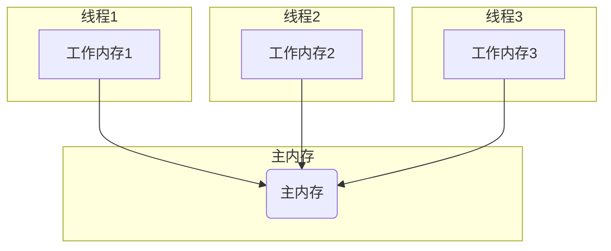

## Java

Java SE

Java集合

Java常用类

hadoop

zookeeper

JVM

spring

springMVC

springboot

springcloud alibaba

mysql

nginx

MQ

redis

Netty

JUD多线程

IIC

MPU6050

AK8963


深度学习pytorch

kotlin

Android

c

四轴飞行器


linux


数据结构与算法

设计模式


go

python


devops

eleSearch

Shell

lua

unreal5

maven

gradle

git

软件工程

Vue

webpack

js

html

css

H5

node.js


网路攻击与防范


10.17

一周汇总

- Java的JUC并发编程，看了20多集，剩下的三十多集争取在三天内看完。
- https://www.bilibili.com/video/BV1Kw411Z7dF?p=21&spm_id_from=pageDriver
- STM32，使用软件IIC读取MPU9250以及BMP280进行了初步了解，并记录了相关笔记，在四轴项目文件夹下，对于IIC的基本读取已经大致掌握，对于MPU6050的原始数据读取基本了解，MPU9250内置的磁力计会读取基本数据，但对于后续的数据处理依然有问题，下一周争取使用,Matlab读取串口数据，并进行6轴融合，之后再对磁力计和BMP280进行详细的研究
- 对于数据的处理，可以使用中断读取，sys滴答时钟或者TIM定时器，IIC读取数据的一般流程就是先初始化传感器，然后对相应寄存器写数据，然后读取，不同的传感器流程不一样，比如磁力计每次读取数据后都要设置单次读取，然后初始化等等
- 重启四轴项目！
- 对于硬件方面，首先要找到对应的说明书，datasheet，虽然都是英文，但是上面一般是最全的，如果只是读取基本数据，相应的配置一般都很简单，主要是数据处理这一块
- BMP280似乎可以直接使用官方的API移植进行调用？实际上就是先读取偏差值，然后读取实际测量值，然后调用公式，进行数据融合就能得出气压以及温度，不过目前为止依旧是有问题，公式是官方给的一般没错，有可能是量程选择的问题，注意平时地面的气压就是一个大气压，根据这个一下子就能知道融合后的数据对不对，根据CPP文件对照下
- 磁力计融合后的数值似乎过大了，好像要用椭球拟合？
- 卡尔曼滤波以及一阶二阶滤波，采样周期也会影响准确，要有一个准确的采样周期


10.18

- 网络时如何连接的，前两章
- JUC继续

10.19

-  完成JUC
- 开始大数据Hadoop

10.23

- Hadoop入门完成
- https://www.bilibili.com/video/BV1Qp4y1n7EN?p=39&spm_id_from=pageDriver


10.24

一周汇总

网上课程学习

- 完成尚硅谷大数据Hadoop 3.x（全新升级/部署+源码+实战）P1-P38
  - https://www.bilibili.com/video/BV1Qp4y1n7EN?p=39&spm_id_from=pageDriver
- 结束【JUC并发编程】尚硅谷2021年最新JUC并发编程
  - https://www.bilibili.com/video/BV1wy4y1L7D2?from=search&seid=2585903625642401631&spm_id_from=333.337.0.0

书籍阅读

- 结束阅读《网络是怎样连接的》

博客阅读

- Java各种锁的理解 https://zhuanlan.zhihu.com/p/71156910

博客撰写

- https://zhuanlan.zhihu.com/p/425218466

构建之法最少前六章

JUC补充

Hadoop  HDFS篇

网络是怎样连接的，笔记整理


Java中volatile和synchronized的简单理解

在Java并发编程中，常用的关键字有两个，一个是synchronized，另一个就是volatile。

|          | synchronized                       | volatile             |
| -------- | ---------------------------------- | -------------------- |
| 作用范围 | 修饰方法、代码块                   | 修饰变量             |
| 功能     | 保证共享变量的可见性和操作的原子性 | 保证共享变量的可见性 |

Java中每个对象都可以作为锁，在使用synchronized时

- 对于普通方法，锁是当前实例对象
- 对于静态方法，锁是当前类的Class对象
- 对于同步方法块，锁时synchronized括号里面配置的对象

当一个线程想要访问加了synchronized的方法或者同步方法块时，必须先得到锁，才能对其进行操作，否则就会阻塞，等待其他线程释放锁后，尝试获取锁。

```java
class Bank {
    int total = 0;
     synchronized void incr() {
        total += 1;
        System.out.println(total);
    }
}
public class Consumer {
    public static void main(String[] args) {
        Bank bank = new Bank();
        for (int i = 0; i < 100; i++) {
            new Thread(bank::incr).start();
        }
    }
}
```

上面代码中有一个银行资源类，以及一个客户场景类。

客户场景类通过创建100个客户，模拟100个客户向同一个账户存钱。

如果incr方法不加synchronized，那么最后total的运行结果一定小于100。

什么原因呢？

如果不加锁，那么多个线程同时访问一个资源，一种可能的情况如下：

T1时刻，A获取total=0，0 + 1

T2时刻，B获取total=0，0 + 1

T3时刻，A线程实现赋值操作，total = 1

T4时刻，B线程实现赋值操作，total = 1

这样就导致了，虽然预想的结果是账户结果增加2元，但实际上只增加1元。

而加了synchronzied关键字后，情况就变成了下面这种情况：

T1时刻，A获取total=0，0 + 1

T2时刻，A线程实现赋值操作，total = 1

T3时刻，B获取total=1，1 + 1

T4时刻，B线程实现赋值操作，total = 2

这样的执行流程才是我们所期望的流程，两个客户往一个银行账户存钱，最后账户总金额增加了2元。

synchronized在这个过程中主要做了两件事：

1. 变量的可见性
2. 操作的原子性

变量的可见性与线程操作变量的方式有关：

1. 所有的变量都存储在主内存中，每个线程同时也有自己独立的工作内存，工作内存里面的内容是对主内存内容的拷贝
2. 工作内存之间并不共享
3. 如果线程想要对变量进行操作，需要先将变量同步到自己的工作内存中进行修改，修改完后再同步到主内存中




至于操作的原子性，就是指一个或多个操作，要么全部都会执行，并且在执行的过程中不会被打断，要么不执行。

以上面的代码为例，如果只保证原子性而不保证可见性，那么就可能导致下面的情况发生：

T1时刻，A获取total=0，total = 0+1， total = 1

T2时刻，B获取total=0，total = 0+1， total = 1

T1时刻，线程A虽然获取并修改了值，但是并没有及时同步，导致T2时刻线程B获取的total值仍然为0，这样虽然有两个客户存钱，实际上账户总额还是只增加了1.

同理，如果只保证可见性而不保证原子性，那么就导致了以下情况的发生：

T1时刻，A获取total = 0，

T2时刻，B获取total = 0，

T3时刻，A执行操作total=0+1=1

T4时刻，B执行操作total=0+1=1

T5时刻，C获取total=1

虽然保证了可见性(只要线程把值修改了就会立即同步到主内存中)，但是由于没有保证原子性，线程A获取值并进行修改，但在把值同步到主内存之前，线程B又从主内存获取了值，这样实际上线程A和B都是对0进行了+1操作，最终的值自然还是1，这也就是为什么volatile关键字无法实现并发操作的原因，因为volatile关键字只能保证共享变量能被准确和一致的被更新。

通常对一个变量的完成操作包括获取变量值，修改变量值，同步修改后的值。

volatile可以保证变量被修改后，值立即被同步到主内存中，但是变量获取值和变量值被修改并不是原子操作，其他线程完全可以在变量值被修改之前先获取变量的值，这样就导致上面出现的情况。

这样就可以得出volatile适用条件

1. 写入变量时不依赖变量的当前值
2. 变量访问不需要额外加锁
3. 变量更新时，其他线程需要马上得到最新的值

DCL(Double Check Lock)是volatile另一种常见的应用场景，它体现了volatile的另一个作用，防止指令重排序。

常见的懒汉式单例模式如下所示

```java
class Singleton{
    private static  Singleton instance;
    private Singleton(){
    }
    public static synchronized Singleton getSingleton() {
        if (instance == null) {
            instance = new Singleton();
        }
        return instance;
    }
}
```

这里实现了按需加载，不使用时不会占据内存，但是由此导致的问题就是无论是否已经产生实例，多线程调用时，都会被锁阻塞，耗时。

因此，采用DCL进行改进，改进后的代码如下所示：

```java
class Singleton{
    private static Singleton instance;
    private Singleton(){
    }
    public Singleton getSingleton() {
        if (instance == null) {
            synchronized (Singleton.class){
                if (instance == null) {
                    instance = new Singleton();
                }
            }
        }
        return instance;
    }
}
```

虽然这样确实可以防止多线程调用阻塞的问题出现，但是由于new操作并不是原子性的操作，实际上new操作分为下面三个步骤：

1. 分配内存空间
2. 初始化Singleton实例
3. 赋值instance实例引用

这三条指令的执行顺序并不确定(注意synchronied这里锁住的是类而不是实例化的对象)，所以可能出现一个线程第一次调用getSingleton方法，在new对象这一步时，先赋值instance引用，但是还没有初始化Singleton实例，另一个线程此时再调用方法时instance不为null，但是instance还没有初始化，返回一个没有初始化的对象引用，导致问题的出现。

这时候就需要加上volatile关键字，防止指令的重排序，所有的写操作都在读操作之前，确保指令是按照1 2 3 的顺序执行

最终正确的DCL代码

```java
class Singleton{
    private static volatile Singleton instance;
    private Singleton(){
    }
    public Singleton getSingleton() {
        if (instance == null) {
            synchronized (Singleton.class){
                if (instance == null) {
                    instance = new Singleton();
                }
            }
        }
        return instance;
    }
}
```

22
