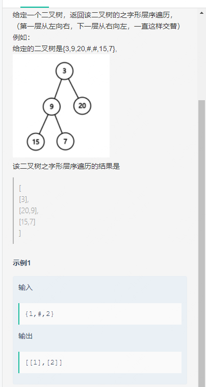
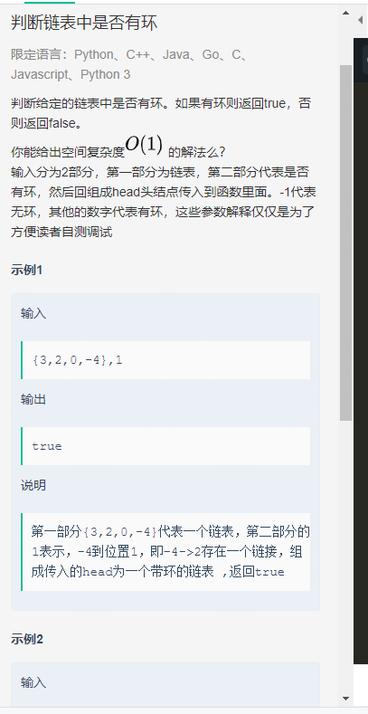
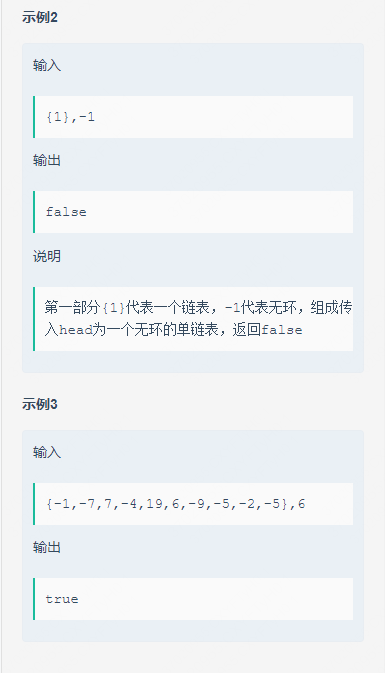
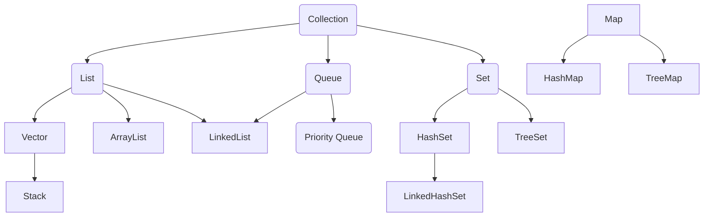
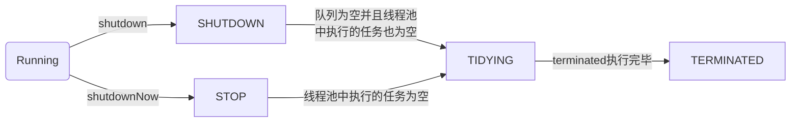
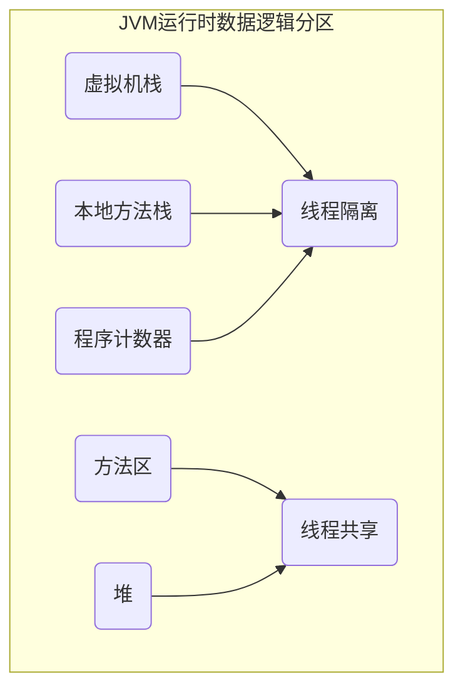
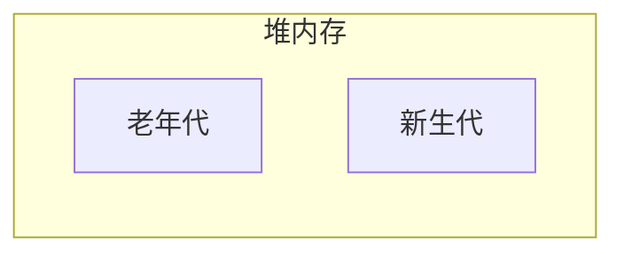

**题目：**二叉树的之字形层序遍历

描述：给定一个二叉树，返回该二叉树的之字形层序遍历，（第一层从左向右，下一层从右向左，一直这样交替）
例如：给定的二叉树是{3,9,20,#,#,15,7},


该二叉树之字形层序遍历的结果是[ [3], [20,9], [15,7] ]

**示例1****：**输入：{1,#,2}，返回值：[[1],[2]]

**解法一：**

**思路分析：**因为是要将二叉树进行之字形层序遍历，所以我们采用双栈进行，排序规则为第一层通过正序输出，第二层逆序输出，第三层正序输出，通过依次类推，实现之字形排序，使用栈的性质（先进后出），先进入栈的数据最后再出栈，为了能够实现逆序遍历，将二叉树的第二层结点保存在栈1中，重新设置栈2存储下一层结点，使用stackout表示存储当前层结点的栈。stackIn表示存储下一层节点的栈，从左往右遍历(正向遍历)时，需要存储当前节点的左节点stackIn中；从右往左遍历(反向遍历)时，需要存储当前节点的右节点stackIn中

**实例分析：**以二叉树{3,9,20,#,#,15,7}为例，将根节点3存入stack1中，首先遍历的方向为从左往右遍历，其中stack1为stackout，stack2为stackin，当遍历完成后，stack1为空，stack2中存储着第二层的结点，遍历时需要不断pop出stackout中的结点，添加到arraylist中，从而可以得到第一层的顺序遍历。

| 树： |      | —>   | 3    | 将3存入stack1中 |      |      |
| ---- | ---- | ---- | ---- | --------------- | ---- | ---- |
|      | 9    |      | 20   | stack2          |      |      |
| 15   |      | 7    |      |                 |      |      |


当遍历完第一层后，将方向反转，变为从右往左遍历，此时stack2为stackout，stack1为stackin，遍历完成后stack2为空，stack1中存储着第三层的结点，还是需要不断的pop出stackout中的结点，添加到arraylist中，得到第二层的逆序遍历。


| 树： |      |      | 3    |          |      |        |
| ---- | ---- | ---- | ---- | -------- | ---- | ------ |
|      | 9    |      | 20   | <—stack2 |      |        |
| 15   |      | 7    |      |          |      | stack3 |


依次类推，返回最终值[ [3], [20,9], [15,7] ]。

**Java代码为：**


```java
import java.util.*;
 
/*
 * public class TreeNode {
 *   int val = 0;
 *   TreeNode left = null;
 *   TreeNode right = null;
 * }
 */
 
public class Solution {
    /**
     *
     * @param root TreeNode类
     * @return int整型ArrayList<arraylist><>>
     */
    public ArrayList zigzagLevelOrder (TreeNode root) {
        // write code here
        ArrayList cache = new ArrayList<>();
        if(root == null)
            return cache;
        Deque stack1 = new LinkedList<>();//设置双栈
        Deque stack2 = new LinkedList<>();
        stack1.push(root);//将根节点压入栈1
        boolean isfound = true;//设置方向
        
        while(stack1.isEmpty() == false || stack2.isEmpty() == false){//当前栈是否还有元素
            DequestackOut = stack1.isEmpty() ? stack2 : stack1;
            DequestackIn = stack1.isEmpty() ? stack1 : stack2;
            //stackout存储当前层，stackin存储下一层
            cache.add(new ArrayList<>());
            //遍历当前层的结点
            while(stackOut.isEmpty() == false){
                //栈顶出栈
                TreeNode cur = stackOut.pop();
                //添加到Arraylist里边
                cache.get(cache.size() - 1).add(cur.val);
                if (isfound) {
                    //如果方向是从左往右，则先遍历当前节点的左节点
                    pushNode(stackIn, cur.left);
                    pushNode(stackIn, cur.right);
                }
                else {
                    //如果方向是从右往左，则先遍历当前节点的右节点
                    pushNode(stackIn, cur.right);
                    pushNode(stackIn, cur.left);
                }
            }
            isfound = !isfound;//改变方向
        }
        return cache;
    }
    
    private void pushNode(Dequestack, TreeNode node) {//将结点存入栈中
        if (node != null) {
            stack.push(node);
        }
    }
}</arraylist>
```


遍历树中的每一个元素，时间复杂度为O(N)，空间复杂度为O(N)。


**解法二：**

**思路分析：**首先创建队列，将结点加入到队列当中，利用先进先出原则，依次弹出栈。将每次弹出结点的值保存到链表当中，如果是奇数层的话，就采用尾插，如果为偶数层的话，执行头插，如果弹出的结点中有左右子树，则将左右子结点加入到当前队列当中，在每一层遍历完成后都要将这一层的结点加入到链表当中。


| 树：                              |      |      | 3（头插） |          |      |          |
| --------------------------------- | ---- | ---- | --------- | -------- | ---- | -------- |
|                                   | 9    |      | 20        | （尾插） |      |          |
| 15                                |      | 7    |           |          |      | （头插） |
| 返回最终值[ [3], [20,9], [15,7] ] |      |      |           |          |      |          |


**具体Java代码为：**


[复制代码](https://blog.nowcoder.net/n/a8f943bbf9f4402d886d96b03d867995#)

```java
import java.util.*;
 
/*
 * public class TreeNode {
 *   int val = 0;
 *   TreeNode left = null;
 *   TreeNode right = null;
 * }
 */
public class Solution {
    /**
     *
     * @param root TreeNode类
     * @return int整型ArrayList<arraylist><>>
     */
    public ArrayList zigzagLevelOrder (TreeNode root) {
        ArrayList res = new ArrayList<>();
        Queueque = new LinkedList<>();//创建队列
        if(root != null){
            que.add(root);
        }
        while(!que.isEmpty()){
            ArrayListtmp = new ArrayList<>();//存储每一层节点
            for(int i = que.size();i > 0;i--){//遍历当前层的节点
                TreeNode node = que.poll();//弹出队列中的节点
                if((res.size() + 1) % 2 != 0){
                    tmp.add(node.val);//奇数尾插
                }
                else{
                    tmp.add(0,node.val);//偶数层头插
                }
                if(node.left!=null){//如果左子节点不为空，则将其加入到队列中
                    que.add(node.left);
                }
                if(node.right!=null){//如果右子节点不为空，则将其加入到队列中
                    que.add(node.right);
                }
            }
            res.add(tmp);//将这一层的节点加入到res中
        }
        return res;
    }
}</arraylist>
```


其时间复杂度为O(N)，设置链表对象和队列用与存储数字，所以其空间复杂度为O(N)。


https://blog.nowcoder.net/n/a8f943bbf9f4402d886d96b03d867995






# 描述

判断给定的链表中是否有环。如果有环则返回true，否则返回false。
你能给出空间复杂度的解法么？
输入分为2部分，第一部分为链表，第二部分代表是否有环，然后回组成head头结点传入到函数里面。-1代表无环，其他的数字代表有环，这些参数解释仅仅是为了方便读者自测调试

示例1：

```
输入：{``3``,``2``,``0``,-``4``},``1``返回值：``true` `说明：``第一部分{``3``,``2``,``0``,-``4``}代表一个链表，第二部分的``1``表示，-``4``到位置``1``，即-``4``->``2``存在一个链接，组成传入的head为一个带环的链表 ,返回``true
```

示例2:

```
输入：{``1``},-``1``返回值：``false` `说明：``第一部分{``1``}代表一个链表，-``1``代表无环，组成传入head为一个无环的单链表，返回``false
```

示例:

```
输入：{-``1``,-``7``,``7``,-``4``,``19``,``6``,-``9``,-``5``,-``2``,-``5``},``6``返回值：``true
```

# 思路


如上图就是一个环形链表，他是有一个闭环的，他有一个特性：**那就是如果顺着链表一直往前走，永远也走不到头。**
这个特性一会证明链表是否有环的时候会用到。
咱们想想这么一个场景：在操场跑圈的时候，一个跑的快的人如果跑的时间够长最后会超过跑的慢的人。为啥那，因为操场是一个环形，没有尽头。所以如果一个链表如果是环形的，那么咱们可以找两个“运动员”去链表上跑一跑，也就是**快慢指针**，不就可以了。

[复制代码](https://blog.nowcoder.net/n/8e514a2de0c040b2a26403ee8ae5dfd8#)

```java
public boolean hasCycle(ListNode head) {
        if (head == null) {
            return false;
        }
        // 慢指针
        ListNode slow = head;
        // 快指针
        ListNode fast = head.next;
        // 如果fast == null 或 fast.next == null，说明有终点，就不是环形
        while (fast != null && fast.next != null) {
            // 当快慢指针相遇，说明快的追上了慢的，链表有环！！！
            if (slow == fast) {
                return true;
            }
            // 慢指针移动
            slow = slow.next;
            // 快指针移动
            fast = fast.next.next;
        }
        return false;
    }
```

时间复杂度：O(n),n 为链表长度
空间复杂度：O(1)

https://blog.nowcoder.net/n/8e514a2de0c040b2a26403ee8ae5dfd8

单例

重载和重写（各种奇奇怪怪问题）

http和https

vue生命周期

activity生命周期

jetpack组件

进程和线程

死锁

集合

stringbuilder和stringBuffer

# 面试题

以下面试题均来源于网络，用作学习使用，并非原创

## Java基础

### 1. JDK和JRE有什么区别

- JDK：Java Development Kit的简称，java开发工具包，提供了Java的开发环境和运行环境
- JRE：Java Runtime Environment的简称，Java运行环境，为Java的运行提供了所需环境

具体来说，JDK其实包含了JRE，同时还包含了编译Java源代码的编译器javac，还包含了很多Java程序调试和分析的工具，简单来说，如果你需要运行Java程序，只需要装JRE就可以了，如果需要编写Java程序，那么则需要安装JDK

### 2. ==和equals的区别是什么

#### ==

对于基本类型和引用类型，==的作用效果是不一样的

- 基本类型：比较的是值是否相等
- 引用类型：比较的是引用是否相同，即首地址

```java
String x = "string";
String y = "string";
String z = new String("string");
System.out.println(x==y); //true
System.out.println(x==z); //false
System.out.println(x.equals(y)); //true
System.out.println(x.equals(z)); //true
```

因为x和y指向的是同一个引用，所以==为true，而new String()方法重写开辟了内存空间，所以  == 为false，equal比较的一直是值，所以都为true

### equals

equals本质上就是==， 只不过String和Integer等重写了equals方法，把它变成了值比较

```java
class Person{
    private String name;

    public Person(String name) {
        this.name = name;
    }

    public String getName() {
        return name;
    }

    public void setName(String name) {
        this.name = name;
    }
}
=============
        Person jack = new Person("Jack");
        Person jack2 = new Person("Jack");
        System.out.println(jack.equals(jack2));  //fasle
        System.out.println(jack == jack2); //false
```

进入源码查看

```java
public boolean equals(Object obj) {
    return (this == obj);
}
```

可以看到本质上equals就是==，比较的就是引用，即首地址，而两个new的对象，首地址自然不同，自然不可能相等

如果是两个相同值的String对象

```java
String s1 = new String("s1");
String s2 = new String("s1");
System.out.println(s1.equals(s2));//true
```

```java
public boolean equals(Object anObject) {
    if (this == anObject) {
        return true;
    }
    if (anObject instanceof String) {
        String aString = (String)anObject;
        if (coder() == aString.coder()) {
            return isLatin1() ? StringLatin1.equals(value, aString.value)
                              : StringUTF16.equals(value, aString.value);
        }
    }
    return false;
}
```

进入源码后可以发现，实际上是比较的值，因此只要值相等，那么就返回true

总结：

- ==对于基本类型是值比较，对于引用类型是引用比较
- equals默认情况下是引用比较，但是Sring，Integer等重新定义了equals，变成了值比较，一般情况下用equals比较值是否相等

### 3. 两个对象的hashCode()相同，则equals()也一定为true，对吗？

不对

- 两个对象equals为true，hashcode一定相等
- 两个对象hashCode相同，equals不一定为true
- 两个对象hashCdoe不相等，equals不一定为false

```java
String s1 = "通话";
String s2 = "重地";
System.out.println(String.format("s1:%d | s2 %d",s1.hashCode(),s2.hashCode())); //s1:1179395 | s2 1179395
System.out.println(s1.equals(s2)); //false
```

因为在散列表中，hashCode()相等即两个键值对的哈希值相等，但是哈希值相等，并不一定能得出键值对相等

### 4. final在Java中有什么作用

- final修饰的类叫最终类，该类不能被继承
- final修饰的方法不能被重写
- final修饰的变量叫常量，常量必须初始化，初始化后值就不能被修改

### 5. Java中的Math.round(-1.5)等于多少

等于-1，向右取整

### 6. String属于基础的数据类型吗

String不属于基础的数据类型，基础类型有8种：

byte、boolean、short、int、long、char、float、double

String属于对象

### 7. Java中操作字符串都有哪些类，他们之间有什么区别？

操作字符串的类有：String、StringBuffer、StringBuilder

String和StringBuffer、StringBuilder的区别在于String声明的是不可变对象，每次操作都会生成新的String对象，然后将指针指向新的String对象

而StringBuffer、StringBuilder可以在原有对象的基础上操作，所以如果需要经常改变字符串内容的情况下最好不要使用String

StringBuffer和StringBuilder最大的区别在于，StringBuffer是线程安全的，StringBuilder是非线程安全的，但是StringBuilder的性能高于StringBuffer，所以单线程情况下推荐使用StringBuilder，多线程情况下推荐使用StringBuffer

### 8. String str = "i" 与String str=new String("i")一样吗？

不一样没因为内存分配的方式不一样，String str = "i"的方式，Java虚拟机会将其分配到常量池中，而String str = new String("i")则会被分配到堆内存中

### 9. 如何将字符串反转

使用StringBuilder或者StringBuffer的reverse()方法

```java
StringBuffer stringBuffer = new StringBuffer();
stringBuffer.append("123456");
System.out.println(stringBuffer.reverse()); //654321
StringBuilder stringBuilder = new StringBuilder();
stringBuilder.append("123456");
System.out.println(stringBuilder.reverse());//654321
```

### 10. String类的常用方法都有哪些

- indexOf()：返回指定字符的索引
- charAt()：返回指定索引处的字符
- replace()：字符串替换
- trim()：去除字符串两端空格
- split()：分割字符串，返回一个分割后的字符串数组
- getBytes()：返回字符串的byte类型数组
- length()：返回字符串的长度
- toLowerCase()：将字符串转换为小写字母
- toUpperCase()：将字符串转换为大写字母
- substring()：截取字符串
- equals()：字符串比较

### 11. 抽象类必须有抽象方法吗？

不需要，抽象类不一定非要有抽象方法

```java
abstract class Cat{
    public static void fly(){
        System.out.printf("fly");
    }
}
```

### 12. 普通类和抽象类有哪些区别

- 普通类不能包含抽象方法，抽象类可以包含抽象方法
- 抽象类不能直接实例化、普通类可以直接实例化

### 13. 抽象类能使用final修饰吗？

不能，定义抽象类就是为了让其他类继承的，如果定义为final该类就不能被继承，这样彼此就会产生矛盾，所以final不能修饰抽象类，编译器也会提示报错信息

### 14. 接口和抽象类有什么区别

- 实现：抽象类的子类使用extends来继承，接口必须使用implements来实现接口
- 构造函数：抽象类可以有构造函数，接口不能有
- main方法：抽象类可以有main方法，并且我们能运行它，接口不能有main方法
- 实现数量：类可以实现很多个接口，但是只能继承一个抽象类
- 访问修饰符：接口中的方法默认使用public修饰，抽象类中的方法可以是任意访问修饰符

### 15. Java中IO流分为几种

按功能来分：输入流(input)，输出流(Output)

按类型来分：字节流和字符流

字节流和字符流的区别是：字节流按8位传输以字节为单位输入输出数据，字符流按16位传输以字符为单位输入输出数据

### 16. BIO、NIO、AIO有什么区别

- BIO：Block IO同步阻塞式IO，就是我们平时使用的传统IO，它的特点是模式简单、使用方便，并发处理能力低
- NIO：New IO 同步非阻塞IO，是传统IO的升级，客户端和服务器端通过Channel(通道)通讯，实现了多路复用
- AIO：Asynchronous IO是NIO的升级，也叫NIO2，实现了异步非阻塞IO，异步IO的操作基于事件和回调机制

### 17. Files的常用方法都有哪些

- Files.exists()：检测文件路径是否存在
- Files.createFile()：创建文件
- Files.createDirectory()：创建文件夹
- Files.delete()：删除一个文件或目录
- Files.copy()：复制文件
- Files.move()：移动文件
- Files.size()：查看文件大小，单位为byte
- Files.write()：写入文件


## 容器

### 18. Java容器有哪些

常用容器的目录



### 19. Collection和Collections有什么区别

- java.util.Collection是一个集合接口(集合类的一个顶级接口)。它提供了对集合对象进行基本操作的通用接口方法，Collection接口在Java类库中有很多具体的实现，Collection接口的意义是为各种具体的集合提供了最大化的统一操作方式，其直接继承接口有List和Set
- Collections则是集合类的一个工具类/帮助类，其中提供了一系列静态方法，用于对集合中的原生进行排序、搜索以及线程安全等各种操作

### 20. List、Set、Map之间的区别是什么

| 比较       | List                                                  | Set                                                    | Map                                                          |
| ---------- | ----------------------------------------------------- | ------------------------------------------------------ | ------------------------------------------------------------ |
| 继承接口   | Collection                                            | Collection                                             |                                                              |
| 常见实现类 | AbstractList(常用子类有ArrayList、LinkedList、Vector) | AbstractSet(常用子类有HashSet、TreeSet、LinkedHashSet) | HashMap、HashTable                                           |
| 常见方法   | add()、remove()、clear()、get()、contains()、size()   | add()、remove()、clear()、contains()、size()           | put()、get()、remove()、clear()、containsKey()、containsValue()、keySet()、values()、size() |
| 元素       | 可重复                                                | 不可重复，用equals()判断                               | 不可重复                                                     |
| 顺序       | 有序                                                  | 无序(实际上由Hashcode决定)                             |                                                              |
| 线程安全   | Vector线程安全                                        |                                                        | HashTable线程安全                                            |

### 21. HashMap和HashTable有什么区别

- hashMap去掉了HashTable的contains方法，但是加上了containsValue()和containsKey()方法
- hashTable是同步的，HashMap是非同步的，效率上比hashTable要高
- hashMap允许空键值，而hashTable不允许

### 22. 如何决定使用HashMap还是TreeMap

对于在Map中插入、删除和定位元素这类操作，HashMap是最好的选择，如果需要对一个有序的key集合进行遍历，TreeMap更好，基于collection的大小，向HashMap中添加元素会更快，将map换成TreeMap更快进行有序key的遍历

### 23. HashMap的实现原理

HashMap概述：HashMap是基于哈希表的Map接口的分同步实现，此实现提供所有可选的映射操作，并允许使用null值和null键，此类不保证映射的顺序，特别是它不保证该顺序恒久不变

HashMap的数据结构：在Java编程语言中，最基本呢的结构就两种，一种是数组，另一种是模拟指针(引用)，所有的数据结构都可以用这两个基本结构来构造，HashMap也不例外，HashMap实际上是一个链表散列的数据结构，即数组和链表的结合体

当我们往hashMap中put元素时，首先根据key的hashcode重新计算hash值，根据hash值得到这个元素在数组中的为止(下标),如果该数组在该位置上已经存放了其他元素，那么在这个位置上的元素将以链表的形式存放，新加入的放在链头，最先加入的放在链尾，如果数组中该位置没有多余的元素就直接将该元素放到数组的该位置上

### 24. HashSet的实现原理

- HashSet底层由HashMap实现
- HashSet的值存放于HashMap的key上
- HashMap的value统一为PRESENT

### 25.ArrayList和LinkedList的区别是什么

最明显的区别是ArrayList的底层数据结构是数组，支持随机访问，而LinkedList的底层数据结构是双向循环链表，不支持随机访问，使用下标访问一个元素，ArrayList的时间复杂度是O(1)，而LinkedList是O(n)

### 26. 如何实现数组和List之间的转换

- List转换为数组，调用ArrayList的toArray方法
- 数组转换为List，调用Arrays.asList方法

### 27. ArrayList和Vector的区别是什么

- Vector是同步的，而ArrayList不是。如果需要在迭代的时候对列表进行改变，应该使用CopyOnWrriteArrayList
- ArrayList比Vector快，它因为有同步，不会过载
- ArrayList更加通用，因为可以使用Collections工具类轻易地获取同步列表和只读列表
- Vector线程安全，ArrayList线程不安全
- ArrayList在底层数组不够用时在原来的基础上扩展0.5倍，Vector扩展1倍

### 28. Array和ArrayList有何区别

- Array可以容纳基本类型和对象，而ArrayList只能容纳对象
- Array是指定大小的，而ArrayList大小是可变的
- Array没有提供ArrayList那么多功能，比如addAll，removeAll和iterator等

### 29. 在Queue中poll()和remove()有什么区别

poll()和remove()都是从队列中取出一个元素，但是poll()在获取元素失败的时候会返回空，remove()会抛出异常

### 30.哪些集合类是线程安全的

- vector 比arrayList多了个同步化机制(线程安全)，因为效率较低，现在已经不建议被使用。在web应用中，尤其是前台页面，往往效率(页面响应速度)是优先考虑的
- stack 堆栈类，先进后出
- hashtable 比hashmap多了线程安全
- enumeration：枚举，相当于迭代器

### 31. 迭代器Iterator是什么

迭代器是一种设计模式，它是一个对象，它可以遍历并选择序列中的对象，而开发人员不需要了解该序列的底层结构，迭代器通常被称为轻量级对象，因为它创建的代价小

### 32. Iterator怎么使用，有什么特点

Java中Iterator功能比较简单，并且只能单向移动

1. 使用方法Iterator()要求容器返回一个Itreator，第一次调用Iterator的next()方法时，他返回序列的第一个元素。Iterator()方法是java.lang.Iterable接口，被Collection继承
2. 使用next()获得序列的下一个元素
3. 使用hasNext()检查序列中是否还有元素
4. 使用remove()讲迭代器新返回的元素删除

Iterator是Java迭代器最简单的实现，为List设计的ListIterator具有更多的功能，它可以从两个方向遍历List，也可以从List中插入和删除元素

### 33. Iterator和ListIterator有什么区别

- Iterator可以遍历Set和List集合，但是ListIterator只能用来遍历List
- Iterator对集合只能向前遍历，ListIterator可以向前也可以向后遍历
- ListIterator实现了Iterator接口，并包含其他的功能，比如增加元素，替换元素，获取前一个和后一个元素的索引，等等

## 多线程

### 34. 并行和并发有什么区别

- 并行是指两个或者多个事件在同一时刻发生，而并发是指两个或多个事件在同一事件间隔发生
- 并行是指在不同实体上的多个事件，并发是在同一个实体上的多个事件
- 在一台处理器上同时处理多个任务，在多台处理器上同时处理多个任务

所以并发编程的目标是充分的利用处理器的每一核，以达到最高的处理性能

### 35. 线程和进程的区别

进程是程序运行和资源分配的基本单位，一个程序至少有一个进程，一个进程至少有一个线程，进程在执行过程中拥有独立的内存单元，而多个线程共享内存资源，减少切换次数，从而效率更高。线程是进程的一个实体，是cpu调度和分配的基本单位，是比程序更小的能独立运行的基本单位，同一进程中的多个线程之间可以并发执行

### 36. 守护线程是什么

守护线程 即daemon thread 是个服务线程，准确地来说就是服务其他的线程

### 37. 创建线程有几种方式

1. 继承Thread类创建线程类
   - 定义Thread类的子类，并重写该类的run方法，该run方法的方法体就代表了线程要完成的任务，因此把run()方法称为执行体
   - 创建Thread子类的实例，即创建了线程对象
   - 调用线程对象的start()方法来启动该线程
2. 通过Runnable接口创建线程类
   - 定义runnable接口的实现类，并重写该接口的run方法，该run方法的方法体同样是该线程的线程执行体
   - 创建Runnable实现类的实例，并依此实例作为Thread的target来创建Thread对象，该Thread对象才是真正的线程对象
   - 调用线程对象的start方法来启动该线程
3. 通过Callable和Future创建线程
   - 创建Callable接口的实现类，并实现call()方法，该call()方法将作为线程执行体，并且有返回值
   - 创建Callable实现类的实例，使用FutureTask类来包装Callable对象，该FutureTask对象封装了该Callable对象的call方法的返回值
   - 使用FutureTask对象作为Thread对象的target创建并启动新线程
   - 调用FutureTask对象的get方法来获取子线程执行结束后的返回值

### 38. 说一下runnable和callable有什么区别

- Runnable接口中的run方法返回值为void，它做的事情只是纯粹地去执行run方法中的代码而已
- Callable接口中的call方法是有返回值的，是一个泛型，和FutureTask，Future配合可以用来获取异步执行的结果

### 39. 线程有哪些状态

线程通常有5种状态：创建、就绪、运行、阻塞和死亡

- 创建状态：在生成线程对象，并没有调用该对象的start方法，这时线程处于创建状态
- 就绪状态：当调用了线程对象的start方法后，该线程就进入了就绪状态，但是次数线程调度程序还没有把该线程设置为当前线程，次数处于就绪状态，在线程运行之后，从等待或者睡眠中回来之后，也会处于就绪状态
- 运行状态：线程调度程序将处于就绪状态的线程设置为当前线程，此时线程就进入了运行状态，开始运行run函数当中的代码
- 阻塞状态：线程正在运行的时候，被暂停，通常是为了等待某个事件的发生(比如说某项资源就绪)之后再继续运行，sleep,suspend,wait等方法都可以导致线程阻塞
- 死亡状态：如果一个线程的run方法执行结束或者调用stop方法后，该线程就会死亡，对于已经死亡的线程，无法再使用start方法令其进入准备就绪

### 40. sleep和wait有什么区别

- sleep方法是线程类Thread的静态方法，让调用线程进入睡眠状态，让出执行机会给其他线程，等到休眠事件结束后，线程进入就绪状态和其他线程以前竞争cpu的执行事件，因为sleep是static静态方法，他不能改变对象的机锁，当一个synchronized块中调用了sleep方法，线程虽然进入休眠，但是对象的锁没有被释放，其他线程依旧无法访问这个对象
- wait是Object类的方法，当一个线程执行到wait方法时，他就进入到一个和该对象相关的等待池，同时释放对象的机锁，使得其他线程能够访问，可以通过notify，notifyAll方法来唤醒等待的线程

### 41. notify()和notifyAll()有什么区别

- 如果线程调用类对象的wait()方法，那么线程就会处于该对象的等待池中，等待池中的线程不会去竞争该对象的锁
- 当有线程调用了对象的notifyAll()方法(唤醒所有wait线程)或者notify()方法(只随机唤醒一个线程)，被唤醒的线程会去竞争该对象锁，也就是说，调用了notify后只有一个线程会由等待池进入锁池，而notifyAll会将该对象等待池内所有的线程移动到锁池中，等待锁竞争
- 优先级高的线程竞争到对象锁的概率大，假如某线程没有竞争到改对象锁，它还会留在锁池中，只有线程再次调用wait方法，他才会重新回到等待池中，而竞争到对象锁的线程则继续往下执行，直到执行完了synchronized代码块，他会释放掉该对象锁，这时锁池中的线程会继续竞争该对象锁

### 42. 线程的run和start方法有什么区别

每个线程都是通过某个特定的Thread对象所对应的方法run来完成其操作的，方法run称为线程体，通过调用Thread类的start方法来启动一个线程

start方法来启动一个线程，真正实现了多线程运行，这时无需等待run方法体代码执行完毕，可以直接执行下面的代码；这时线程处于就绪状态，并没有运行，然后通过此Thread类调用方法run来完成其运行状态，这里方法run称为线程体，它包含了要执行的这个线程的内容，run方法运行结束，此线程终止，然后CPU再调度其他线程

run方法是在本线程里的，只是线程里的一个函数，而不是多线程的，如果直接调用run，其实就相当于是调用了一个普通函数而已，直接必须等run方法执行完后才会执行下面的代码，执行路径还是一条，所以多线程执行时要使用start方法而不是run方法

### 43. 创建线程池有哪几种方式

1. newFixedThreadPool(int nThreads)

   创建一个固定长度的线程池，每当提交一个任务就创建一个线程，直到达到线程池的最大数量，此时线程规模将不再发生编号，当线程发生没有预料到的错误而结束时，线程池会补充一个新的线程

2. newCachedThreadPool()

   创建一个可缓存的线程池，如果线程池的规模超过了处理需求，将会自动回收空线程，而当需求增加时，则可以自动添加新线程，线程池的规模不存在任何限制

3. newSingleThreadExecutor()

   这是一个单线程的Executor，他创建单个工作线程来执行任务，如果这个线程异常结束，会创建一个新的来替代它，他的特点是能够确保任务在队列中的顺序串行执行

4. newScheduledThreadPool(int corePoolSize)

   创建了一个固定长度的线程池，而且以延迟或定时的方式来执行任务，类似于Timer

### 44. 线程池都有哪些状态

线程池有5种状态 Running、ShutDown、Stop、Tidying、Terminated



### 45. 线程池中submit和execute方法有什么区别

- 接收的参数不一样
- submit有返回值，而execute没有
- submit方便Exception处理

### 46. 在java程序中如何保证多线程的运行安全

线程安全在三个方面体现

- 原子性：提供互斥访问，同一时刻只能有一个线程对数据进行操作(atomic,synchronized)
- 可见性：一个线程对主内存的修改可以及时地被其他线程看到(synchronized,volatile)
- 有序性：一个线程观察其他线程中的指令执行顺序，由于指令重排序，该观察结果一般杂乱无序(happens-before原则)

### 47. 多线程锁的升级原理是什么

在java中，锁共有4种状态，级别从低到高依次为：无状态锁、偏向锁、轻量级锁和重量级锁状态，这几个状态会随着竞争状况逐渐升级，锁可以升级但不可以被降级


### 48. 什么是死锁

死锁是指两个或者两个以上的进程在执行过程中，由于竞争资源或者由于彼此通信而造成的一种阻塞的现象，若无外力作用，他们都将无法执行下去，此时称系统处于死锁状态或者系统产生了死锁，这些永远在相互等待的进程称为死锁进程

### 49. 怎么防止死锁

死锁的四个必要条件

- 互斥条件：进程对所分配到的资源不允许其他进程访问，若其他进程访问该资源，只能等待，直至含有该资源的进程使用完后释放该资源
- 请求和保持条件：进程获得一定的资源之后，又对其他资源发出请求，但是该资源可能被其他进程占有，此时请求阻塞，但又对自己获得的资源保持不放
- 不可剥夺条件：是指进程已获得的资源，在未完成使用之前，不可被剥夺，只能在使用完后自己释放
- 环路等待条件：指进程发生死锁后，若干进程之间形成一种头尾相接的循环等待资源关系

只要系统发生死锁，这些条件必然成立，只要其中一个条件不满足，就不会发生死锁

### 50. ThreadLocal是什么，有哪些使用场景

线程局部变量是指局限于线程内部的变量，属于线程自身所有，不在多个线程间共享，Java提供ThreadLocal类来支持线程局部变量，是一种实现线程安全的方式，但是在管理环境下如web服务器，使用线程局部变量的时候要特别小心，在这种情况下，工作线程的生命周期比任何应用变量的声明周期都要长，任何线程局部变量一旦在工作完成后没有释放，Java应用就存在内存泄漏的风险

### 51. synchronized底层实现原理

synchronized可以保证方法或代码块在运行时，同一时刻只有一个方法可以进入到临界区，同时它还可以保证共享变量的内存可见性

Java中每一个对象都可以作为锁，这时synchronized实现同步的基础

- 普通同步方法，锁是当前实例对象
- 静态同步方法，锁是当前类的class对象
- 同步方法块，锁是括号里面的对象

### 52. synchronized和volatile的区别是什么

- volatile本质是在告诉jvm当前变量在寄存器(工作内存)中的值是不确定的，去要从主存中读取；synchronized则是锁定当前变量，只有当前线程可以访问该变量，其他线程被阻塞住
- volatile仅能使用在变量级别；synchronized可以使用在变量、方法、和类级别
- volatile仅能实现变量的修改可见性，不能保证原子性，而synchronized则可以保证变量的修改可见性和原子性
- volatile不会造成线程的阻塞；synchronized可能造成线程阻塞
- volatile标记的变量不会被编译器优化，synchronized标记的变量可以被编译器优化

### 53. synchronized和Lock有什么区别

- synchronized是Java内置关键字，在jvm层，Lock是个Java类
- synchronized无法判断是否获取锁的状态，Lock可以判断是否获取到锁
- synchronized会自动释放锁(a线程执行完同步代码会释放锁；b线程释放过程中发生异常会释放锁)，Lock需要在finally中手动释放锁，unlock，否则冗余造成线程死锁
- 用synchronized关键字的两个线程1和线程2，如果当前线程1获得锁，线程2等待，如果线程1阻塞，线程2会一直等待下去，而Lock锁就不一定会等待下去，如果尝试获取不到锁，线程可以不用一直等待就结束了
- synchronized的锁可重入，不可中断、非公平，而Lock锁可重入、可判断、可公平(两者皆可)
- Lock锁适合大量同步的代码同步问题，synchronized锁适合代码少量的同步问题

### 54. synchronized和ReentrantLock区别是什么

synchronized是和if、else、for、while一样的关键字，ReentrantLock是类，这是二者的本质区别，既然ReentrantLock是类，那么它就提供了比synchronized更多灵活的特定，可以被继承、可以有方法、可以有各种各样的类变量，ReentrantLock比synchronized的扩展性体现在以下几点：

- ReentrantLock可以对获取锁的等待时间进行设置，这样就避免了死锁
- ReentrantLock可以获取各种锁的信息
- ReentrantLock可以灵活的实现多路通知

另外，二者的锁机制也不一样的：ReentrantLock底层调用的是unsafe的park方法加锁，synchronized操作的是对象头中的markword

### 55. 说一下atomic的原理

Atomic包中的类基本的特性就是在多线程环境下，当有多个线程同时对单个(包括基本类型及引用类型)变量进行操作时，具有排他性，即当多个线程同时对改变量的值进行更新时，仅有一个线程能成功，而未成功的线程可以像自旋锁一样，继续尝试，一直等待成功

Atomic系列的类中的核心方法都会调用unsafe类中的几个本地方法，我们需要先知道一个东西就是Unsafe类:全名为sun.misc.Unsafe，这个类包含了大量的对c代码的操作，包括很多直接内存分配以及原子操作的调用，而它之所以标记为非安全的，是告诉你这个里面大量的方法调用都会存在安全隐患，需要小心使用，否则就会产生严重的后果，例如在使用unsafe分配内存的时候，如果自己指定某些区域可能会导致一些类似C++一样的指针越界到其他进程的问题

## 反射

### 56. 什么是反射

反射主要是指程序可以访问、检测和修改它本身状态或行为的一种能力

Java反射：

在Java运行时环境中，对于任意一个类，能否直到这个类有哪些属性和方法，对于任意一个对象，能否调用它的任意一个方法

Java反射机制主要提供了以下功能：

- 在运行时判断任意一个对象所属的类
- 在运行时构造任意一个类的对象
- 在运行时判断任意一个类所具有的成员变量和方法
- 在运行时调用任意一个对象的方法

### 57. 什么是Java序列化，什么情况下需要序列化？

简单说就是为了保存在内存中的各种对象的状态(也就是实例变量，不是方法)，并且可以包保存的对象状态再读出来，虽然你可以用自己的各种各样的方法来保存object states，但是Java提供了一种更好的保存对象状态的机制，那就是序列化

什么情况下需要序列化：

- 当你想把内存中的对象状态保存到一个文件中或者数据库中的时候
- 当你想用套接字在网络上传送对象的时候
- 当你想通过RMI传输对象的时候

### 58. 动态代理是什么，有哪些应用

动态代理：

当想要给实现了某个接口的类中的方法，加一些额外的处理，比如说加日志，加事务等，可以给这个类创建一个代理，顾名思义就是创建一个新的类，这个类不仅包含原来类的方法和属性，而且还在原来的基础上添加了额外处理的新类。这个代理类并不是定义好的，是动态生成的，具有解耦的意义，灵活，扩展性强

动态代理的应用

- Spring的AOP
- 加事务
- 加权限
- 加日志
- ...

### 59. 怎么实现动态代理

首先必须定义一个接口，还要有一个InvocationHandler(将实现接口的类的对象传递给它)处理类，再有一个工具类Proxy(习惯将其称为代理类，因为调用它的newInstance()可以产生代理对象，其实他只是一个产生代理对象的工具类)。利用到InvocationHandler，拼接代理类源码，将其编译生成代理类的二进制码，利用加载器加载，并将其实例化产生代理对象，然后返回

## 对象拷贝

### 60. 为什么要使用克隆

想对一个对象进行处理，邮箱保留原有的数据进行接下来的操作，就需要克隆了，Java语言中克隆针对的是类的实例

### 61. 如何实现对象克隆

1. 实现Cloneable接口并重写Object类中的clone()方法
2. 实现Serializable接口，通过对象的序列化和反序列化实现克隆，可以实现真正的深度克隆


注意：基于序列化和反序列化实现的克隆不仅仅是深度克隆，更重要的是通过泛型限定，可以检查出需要克隆的对象释是否支持序列化，这项检查是编译器完成的，不是运行时抛出异常，这种是方案明显优于使用Object类的clone方法克隆对象，让问题在编译的时候暴露出来总是好过把问题留到运行时

### 62.深拷贝和浅拷贝的区别是什么

- 浅拷贝只是复制了对象的引用地址，两个对象指向同一个内存地址，所以修改其中任意的值，另一个值都会随之变化，这就是浅拷贝
- 深拷贝是将对象及值复制过来，两个对象修改其中任意的值另一个值不会改变，这就是深拷贝

## JavaWeb

### 63. jsp和servlet有什么区别

1. jsp经编译后就变成了Servlet，JSP本质就是servlet，JVM只能识别Java的类，不能识别jsp的代码，web容器将JSP的代码编译成JVM能识别的Java类
2. jsp更擅长表现于页面显示，servlet更擅长于逻辑控制
3. servlet中没有内置对象，JSP中的内置对象都是必须通过HttpServletRequest对象，HttpServletResponse对象以及HttpServlet对象得到
4. JSP是Servlet的一种简化，使用JSP只需要完成程序员需要输出到客户端的内容，JSP中的Java脚本如何镶嵌到一个类中，由jsp容器完成，而Servlet则是个完整的Java类，这个类的Service方法用于生成对客户端的响应

### 64. jsp有哪些内置对象，作用分别是什么

JSP有9个内置对象

- request：封装客户端的请求，其中包含来自GET或POST请求的参数
- response：封装服务器对客户端的响应
- pageContext：通过该对象可以获取其他对象
- session：封装用户会话的对象
- application：封装服务器运行环境的对象
- out：输出服务器响应的输出流对象
- config：Web应用的配置对象
- page：JSP页面本身，相当于Java中的this
- exception：封装页面抛出异常的对象

### 65. jsp的四种作用域

- page代表与一个页面相关的对象和属性
- request代表与web客户机发出的一个请求相关的对象和属性，一个请求可能跨越多个页面，设计多个web组件，需要在页面显示的临时数据可以置于此作用域
- session代表与某个用户与服务器建立的一次会话相关的对象和属性，跟某个用户相关的数据应该放在用户自己的session中
- application代表与整个web应用程序相关的对象和属性，它实质上是跨越整个Web应用程序，包括多个页面、请求和会话的 一个全局作用域

### 66. session和cookie有什么区别

- 由于HTTP协议是无状态协议，所以服务器需要记录用户的状态时，就需要用某种机制来识别具体的用户，这个机制就是session。典型的场景比如购物车，当你点击下单按钮时，由于HTTP协议无状态，所以并不知道时哪个用户操作的，所以服务端要为特定的用户创建了特定的session，用于标识这个用户，并且跟踪用户，这样才知道购物车里面有几本书，这个Session是保存在服务端的，有一个唯一标识。在服务端保存session的方式有很多，内存、数据库、文件都有。集群的时候也要考虑session的转移，在大型的网站，一般会有专门的session服务器集群，用来保存用户会话，这个时候session的信息都是放在内存的，使用一些缓存服务比如memcached之类的来放session
- 服务端如何识别特定的用户？这个时候cookie就登场了，每次HTTP请求的时候，客户端都会发送相应的Cookie信息到服务端，实际上大多数应用都是用cookie来实现session跟踪的，第一次 创建session的时候，服务端会在HTTP协议中告诉客户端，需要在cookie里面记录一个sessionID，以后每次请求都会把这个会话ID发送到服务端，服务端就知道客户端是谁了，如果浏览器禁用了cookie怎么办，一般这种情况下，会使用一种叫URL重写的计数来进行会话追踪，即每次HTTP交互，URL后面都会被附加上一个诸如sid=xxxx这样的参数，服务端据此来识别用户
- Cookie其实还可以用在一些方便用户的场景下，设想每次登录过一个网站，下次登录的时候不想再输入账号了怎么办，这个信息可以写到Cookie里面，访问网站的时候，网站页面的脚本可以读取这个信息，就自动把用户名给填了，能够方便一下用户，这也是cookie名称的由来，给用户一些甜头，所以，总结一下：session时在服务端保存的一个数据结构，用来跟踪用户的状态，这个数据可以保存在集群、数据库，文件中，Cookie是客户端保存用户信息的一种机制，用来记录用户的一些信息，也是实现session的一种方式

### 67. session的工作原理

其实session是一个存在服务器上的类似于一个散列表格的文件，里面存有我们需要的信息，在我们需要用的时候可以从里面取出来，类似于一个大号的map，里面键存储的是用户的sessionid，用户向服务器发送请求的时候也会带上这个sessionid，这就就可以从中取出对应的值了

### 68. 如果客户端禁止cookie能实现session吗

Cookie与session，一般认为是两个独立的东西，session采用的是服务器端保持状态的方案，而cookie采用的是客户端保持状态的方案，但是为什么禁用cookie就不能得到session呢？这时因为session是用sessionId来确定当前对话对应的服务器session，而sessionID是通过cookie来传递的，禁用cookie相当于失去了sessionID，也就得不到session了

假定用户关闭cookie情况下使用session，实现途径有以下几种

1. 设置php.ini配置文件中的sesson.user_trans_sid=1,或者编译时打开了-enable-trans-sid选项，让PHP自动跨页传递sessionID
2. 手动通过URL传值，隐藏表单传递sessionID
3. 用文件、数据库等形式保存sessionID，在跨页过程中手动调用

### 69. spring mvc和struts的区别是什么

- 拦截机制不同

  struts2是类级别的拦截，每次请求就会创建一个Action，和Spring整合时struts2的actionBean注入作用域时原型模式prototype，然后通过setter，getter把request数据注入到属性，structs2中，一个action对应一个request，response上下文，在接收参数时，可以通过属性接收，这说明属性参数是让多个方法共享的，structs2中action的一个方法可以对应一个url，而其类属性却被所有方法共享，这也就无法用注解或者其他方式标识其所属方法了，只能设计为多例

  SpringMVC是方法级别的拦截，一个方法对应一个request上下文，所以方法直接基本上是独立的，独享request，response数据，而每个方法同时又和一个url对应，参数的传递是直接注入到方法中的，是方法所独有的，处理结果通过ModeMap返回给框架，在Spirng整合式，SpringMVC的ControllerBean默认单例模式Singleton，所以默认对所有的请求，只会创建一个Controller，又因为没有贡献的属性，所以是线程安全的，如果要改变默认的作用域，需要添加@Scope注解修改

  Struts2有自己的拦截Interceptor机制，SpringMVC用的是独立的AOP方式，这样导致Struts2的配置文件量还是比SpringMVC大

- 底层框架的不同

  Struts2使用Filter(StrutsPrepareAndExecuteFilter)实现，SpringMVC(DispatcherServlet)则采用Servlet实例实现，Filter在容器启动之后即初始化，服务停止以后销毁，晚于Servlet，Servlet是在调用时初始化，先于Filter调用，服务停止后销毁

- 性能方面

  Struts2是类级别的拦截，每次请求对应实例一个新的Action，就需要加载所有属性值注入

  SpringMVC实现了零配置，由于SpringMVC基于方法的拦截，有加载一次单例模式bean注入，所以SpringMVC开发效率和性能优于struts2

- 配置方面

  SpirngMVC和Spring是无缝的，项目管理和安全上也比Struts2高

### 70. 如何避免sql注入

1. 使用PreparedStatement(简单有效)
2. 使用正则表达式过滤传入的参数
3. 字符串过滤
4. JSP中调用该函数检测是否包含非法字符
5. JSP页面判断代码

### 71. 什么是XSS攻击，如何避免

XSS攻击又称CSS，全称Cross Site Script(跨站脚本攻击)，其原理是攻击者向有XSS漏洞的网站中输入恶意的HTML代码，当用户浏览该网站时，这段HTML代码会自动执行，从而达到攻击的目的，XSS攻击类似于SQL注入攻击，SQL注入攻击以SQL语句为用户输入，从而达到查询、修改、删除数据的目的，而在XSS攻击中，通过插入恶意脚本，实现对用户浏览器的控制，获取用户的一些信息，XSS是Web程序中常见的漏洞，XSS属于被动式且用于客户端的攻击方式

XSS防范的总体思路是：对输入(和URL参数)进行过滤，对输出进行编码

### 72. 什么是CSRF攻击，如何避免

CSRF(Cross-site request forgery)也被称为one-click attach或者session riding，中文全称叫跨站请求伪造，一般来说，攻击者通过伪造用户的浏览器请求，向访问一个用户自己曾经认证访问过的网站发送出去，使目标网站接收并误以为是用户的真实操作而去执行命令，常用于盗取账号、转账、发送虚假消息等，攻击者利用网站对请求的验证漏洞而实现这样的攻击行为，网站能够确认请求来源于用户的浏览器，却不能验证请求是否源于用户的真实意愿下的操作行为

如何避免

1. 验证HTTP Referer字段

   > HTTP头中的Referer字段记录了该HTTP请求的来源地址，在通常情况下，访问一个安全受限的页面的请求来自于同一个网站，而如果黑客要对其实施CSRF攻击，他一般只能在他自己的网站构造请求，因此，可以通过验证Referer值来防御CSRF攻击

2. 使用验证码

   > 关键操作页面加上验证码，后台收到请求后通过判断验证码可以防范SCRF，但这种方法对用户不太友好

3. 再请求地址中添加token验证

   > CSRF攻击之所以能够成功，是因为黑客可以完全伪造用户的请求，该请求中所有的用户验证信息都是存在cookie中，因此黑客可以在不知道这些验证信息的情况下直接利用用户自己的cookie来通过安全验证，要低于CSRF，关键在于在请求中放入黑客所不能伪造的信息，并且该信息不存在于cookie中，可以在HTTP请求中以参数的形式假如一个随机产生的tokken，并在服务器端建立一个拦截器来验证这个token，如果请求中没有token或者token内容不正确，则认为可能是CSRF攻击而拒绝该请求，这种方法比检测Referer要安全一些，token可以在用户登陆后产生并存放于session中，然后再每次请求时把token从session中拿出，与请求中的token进行比对，但这种方法的难点在于如何将token以参数的形式加入请求，对于GET请求，token将附在请求地址之后URL 就变成 [http://url](https://link.zhihu.com/?target=http%3A//url)?csrftoken=tokenvalue。
   > 而对于 POST 请求来说，要在 form 的最后加上 <input type="hidden" name="csrftoken" value="tokenvalue"/>，这样就把token以参数的形式加入请求了。

4. 在HTTP头中自定义属性并验证

   > 这种方法也是使用token进行验证，和上一种方法不同的是，这里并不是把token以参数的形式置于HTTP请求之中，而是把它放到HTTP头中自定义的属性里，通过XMLHttpRequest这个类，可以一次性给所有该类请求中加入csrftoken这个HTTP头属性，并把token值放入其中，这样解决了上种方法在请求中加入token的不便，同时，通过XMLHttpRequesr请求的地址不会被记录到浏览器的地址栏，也不用担心token会透过Referer泄漏到其他网站

## 异常

### 73. throw和throws的区别

throw是用来声明一个方法可能抛出的所有异常信息，throws是将异常声明但是不处理，而是将异常往上传，谁调用我就交给谁处理，而throw则是指抛出的一个具体的异常类型

### 74. final、finally、finalize有什么区别

- final可以修饰类、变量、方法，修饰类表示该类不能被继承、修饰方法表示该方法不能被重写、修饰变量表示该变量是一个常量不能被重新赋值
- finally一般作用在try-catch代码块中，在处理异常的时候，通常我们将一定要执行的代码放到finally代码块中，表示不管是否出现异常，该代码块都一定会执行，一般用来存放一些关闭资源的代码
- finalize是一个方法，属于Object类的一个方法，而Object类是所有类的父类，该方法一般由垃圾回收器调用，当我们调用System的gc()方法的时候，由垃圾回收器调用finalize()，回收垃圾

### 75. try-catch-finally中哪个部分可以被省略

catch可以省略

更为严格的说法是，try只适合处理运行时异常，try+catch时候处理运行时异常+普通异常

也就是说，如果只用try取处理普通异常却不加catch，编译是通不过的，因为编译器硬性规定，普通一场如果选择捕获，则必须用catch显示声明以便进一步处理，而运行时异常在编译时没有如此规定，所以catch可以省略，加上catch也可以

理论上，编译器认为所有的代码都有潜在的问题，所以即使所有代码加上try，代码在运行期间也不过是在正常运行的基础上加一层皮，但是一旦对一段代码加上try，就等于显示的承诺编译器，对这段代码可能抛出的异常进行捕获而非向上抛出处理。如果是普通异常，编译器要求必须用catch捕获以便进一步处理，如果运行时异常，捕获然后丢弃并且+finally扫尾处理，或者加上catch以便进行进一步处理

至于加上finally，则是不管有没有捕获异常，都要进行扫尾处理

### 76. try-catch-finally如果catch中return了，finally还会执行吗

会执行，会在return前执行

### 77. 常见异常类有哪些

- NullPointerException：当应用程序试图访问空对象时，则抛出该异常。
- SQLException：提供关于数据库访问错误或其他错误信息的异常。
- IndexOutOfBoundsException：指示某排序索引（例如对数组、字符串或向量的排序）超出范围时抛出。
- NumberFormatException：当应用程序试图将字符串转换成一种数值类型，但该字符串不能转换为适当格式时，抛出该异常。
- FileNotFoundException：当试图打开指定路径名表示的文件失败时，抛出此异常。
- IOException：当发生某种I/O异常时，抛出此异常。此类是失败或中断的I/O操作生成的异常的通用类。
- ClassCastException：当试图将对象强制转换为不是实例的子类时，抛出该异常。
- ArrayStoreException：试图将错误类型的对象存储到一个对象数组时抛出的异常。
- IllegalArgumentException：抛出的异常表明向方法传递了一个不合法或不正确的参数。
- ArithmeticException：当出现异常的运算条件时，抛出此异常。例如，一个整数“除以零”时，抛出此类的一个实例。
- NegativeArraySizeException：如果应用程序试图创建大小为负的数组，则抛出该异常。
- NoSuchMethodException：无法找到某一特定方法时，抛出该异常。
- SecurityException：由安全管理器抛出的异常，指示存在安全侵犯。
- UnsupportedOperationException：当不支持请求的操作时，抛出该异常。
- RuntimeExceptionRuntimeException：是那些可能在Java虚拟机正常运行期间抛出的异常的超类。

## 网络

### 78. http响应码301和302代表的是什么，有什么区别

301，302都是HTTP状态的编码，都代表某个URL发生了转移

区别：

- 301 redirect：301代表永久性转移
- 302 redirect：代表暂时性转移

### 79. forward和redirect区别

Forward和Redirect代表了两种请求的转发方式：直接转发和间接转发

直接转发，客户端和浏览器只发出一次请求，Servlet、HTML、JSP或其他信息资源，由第二个信息资源响应该请求，在请求对象request种，保存的对象对于每个信息资源是共享的

间接转发方式 实际上是两次HTTP请求，服务端在响应第一次请求的时候，让浏览器再向另外一个URL发出请求，从而达到转发目的

eg

直接转发就相当于：“A找B借钱，B说没有，B去找C借，借到借不到都会把消息传递给A”；

间接转发就相当于："A找B借钱，B说没有，让A去找C借"

### 80. 简述TCP和UDP的区别

- TCP面向连接，UDP是无连接的，即发送数据之前不需要建立连接
- TCP提供可靠的服务，也就是说，通过TCP连接传送的数据，无差错，不丢失，不重复，且按序到达，UDP尽最大努力交付，即不保证可靠交付
- TCP通过校验和，重传控制，序号标识，滑动窗口、确认应答实现可靠传输，如丢包时的重发控制，还可以对次序乱掉的分包进行顺序控制
- UDP具有较好的实时性，工作效率比TCP高，适用于对告诉传输和实时性有较高的通信或广播通信
- 每一条TCP连接只能是点到点的；UDP支持一对一，一对多，多对一和多对多的交互通信
- TCP对系统资源要求较多，UDP对系统资源要求较少


# Spring

## 1. Spring IOC 的理解、原理与实现

spring IOC主要包含两层含义，一是控制反转，二是容器

控制反转：

理论思想，原来的对象是由使用者来进行控制，有了spring之后，可以把整个对象交给spring来帮我们进行管理

DI：依赖注入把对应的属性值注入到具体的对象中，@Autowired，populateBean完成属性值的注入

容器：存储对象，使用map结构来存储，在spring中一般存在三级缓存，singletonObjects存放完整的bean对象，整个bean的生命周期，从创建到使用到销毁的过程都是由容器来管理的(bean的生命周期)

1. 一般聊ICO容器的时候都会涉及到容器的创建过程(beanFactory,DefaultListableBeanFactory),向bean工厂中设置一些参数(BeanPostProcessor,Aware接口的子类)等属性
2. 加载解析bean对象，准备要创建的bean对象的定义对象beanDefinition(xml或者注解的解析过程)
3. beanFactoryPostProcesssor的处理，此处是扩展点，PlaceHolderConfigurSupport，ConfigurationClassPostProcessor
4. BeanPostProcessor的注册功能，方便后续对bean对象完成具体的扩展功能
5. 通过反射的方式将BeanDefinition对象实例化成具体的bean对象
6. bean对象的初始化过程(填充属性，调用aware子类的方法，调用BeanPostProcessor前置处理方法，调用init-method方法，调用BeanPostProcessor的后置处理方法)
7. 生成完整的bean对象，通过getBean方法可以直接获取
8. 销毁过程

这就是我对Spring IOC的整体理解，包含了一些详细的处理过程

具体的细节我记不太清了，但是spring中的bean都是通过反射的方式生成的，同时其中包含了很多的扩展点，比如最常用的对BeanFactory的扩展，对bean 的扩展(对占位符的处理)，除此之外，IOC中最核心的也就是填充具体bean的属性，bean的生命周期

## 2. Spring IOC底层实现

对IOC的理解和了解的实现过程

反射，工厂，设计模式，关键的几个方法

createBeanFactory，

getBean，doGetBean，createBean，doCreateBean，createBeanInstance(getDeclare dConstructor,newInstance),populateBean,initializingBean

1. 先通过createBeanFactory创建出一个Bean工厂(DefaultListableBeanFactory)
2. 开始循环创建对象，因为容器中的bean默认都是单例的，所以优先通过getBean，doGetBean从容器中查找，找不到的话
3. 通过createBean，doCreateBean方法，以反射的方式创建对象，一般情况下使用的是无参的构造方法getDeclaredConstructor,newInstance

## 3.Java三特性

1. 封装

   封装指的是属性私有化，根据需要提供setter和getter方法来访问属性，即隐藏具体性和实现细节，仅对外开放接口，控制程序中属性的访问级别

   封装到达目的是增强安全性和简化编程，使用者不必在意具体实现细节，而只是通过外部接口即可访问类成员

2. 继承

   继承是指将多个相同的属性和方法提取出来，新建一个父类，Java中一个类只能继承一个父类，且只能继承方位权限非private的属性和方法，子类可以重写父类中的方法，命名与父类中同名的属性

   继承可以很好的提升代码的复用性，简化了人们对事务的认识和描述，能清晰体现相关类间的层次关系

3. 多态

   多态最核心的一句话就是：将子类对象放入父类引用中，从而实现多种状态

   多态可以分为两种：设计时多态和运行时多态

   设计时多态：即重载，是指Java允许方法名相同而参数不同，返回值也可以相同也可以不相同

   运行时多态：即重写，指Java根据调用该方法的类型决定调用哪个方法

   多态的目的在于增加代码的灵活度

## 4. Java修饰符

Java中，可以使用访问控制符来保护对类、遍历、方法和构造方法的访问。Java支持四种不同的访问权限

1. public 对所有的类可见，使用对象：类，接口，变量，方法

   被public修饰的成员，可以再任何一个类中被调用，不管同包或不同包，是权限最大的一个修饰符

2. protected对同一包内的类和所有子类可见，使用对象：变量，方法，不能修饰外部类

   被protected修饰的成员，能在定义它们的类中，同包的类中被调用，如果有不同包的类要调用，那么这个类必须是定义它们的类的子类

3. default 缺省，什么都不写，在同一包内可见，不使用任何修饰符，适用对象：类、接口、变量、方法

   默认权限即同包权限，同包权限的元素只能定义他们的类中，以及同包的类中被调用

4. private在同一类中可见，使用对象：变量、方法、不能修饰外部类

   被private修饰的成员，只能在定义它们的类中使用，在其它类中不能调用

5. 非访问修饰符

   - static修饰符 表示全局或静态，用来修饰成员变量和成员方法，也可以形成静态static代码块，但是Java语言中没有全局变量的概念

     当成员被静态修饰后，就多了一个调用方式，出了可以被对象调用外，还可以直接被类名调用

     存在于方法区，共享区，数据区，非堆内存，栈内存的一个存储区，static块仅在该类被加载时执行一次

     特点：随着类的加载而加载，也就是说静态会随着类的消失而消失，说明它的生命周期最长，优先于对象的存在，静态先存在，对象后存在，被所有对象共享，可以直接被类名调用

     static变量

     static方法

     static代码块

     静态导包

   - final修饰符 final可以用来修饰类、方法和变量(包括成员变量和局部变量)

     好处：提高了性能，JVM和Java应用都会缓存final变量，final可以安全的在多线程环境下进行贡献，不需要额外的同步开销，JVM会对其进行优化

     final修饰类，表示类不能被继承，final类中所有成员方法都会被隐式的指定为final方法

     final修饰方法表示该方法不能被覆盖，类中所有的private方法都隐式指定为final

   - abstract 可以修饰方法 类

     修饰的类叫抽闲了，不能被实例化

     修饰的方法叫抽象方法，没有方法体

   - native

     原生态方法，方法对应的实现不是在当前文件，而是在用其他语言，如C和C++实现的文件中

## 5. JVM内存分区




- 方法区

  保存已经被虚拟机加载的类源信息，类的版本，字段，方法，接口，父类，static，final，字符串常量等

- 虚拟机栈

  用于线程运行方法的区域，线程私有，每一个线程创建后都会申请一个单独的栈空间，每一个方法的调用都会对应一个栈帧

- 本地方法栈 

  本地方法栈是虚拟机调用native方法时使用的

- 程序计数器 

  行号指示器，记录某个线程当前执行指令的位置

- 堆 

  存放创建的对象数据，很多优化都是针对这里

## 6. 堆内存



> 大部分对象属于朝生夕死的状态，这部分对象随着方法的调用而创建，方法的结束而死亡，只有少部分对象会长久的留在JVM内存中，所以根据这样的特性JVM把内存分为了新生代和老年代两个区，一般新创建的对象会放到新生代中，只有经过一定次数的GC后还没有被回收的对象，我们认为这部分对象在未来也会长时间存在，所以会把这部分的对象转移到老年代的区域中


